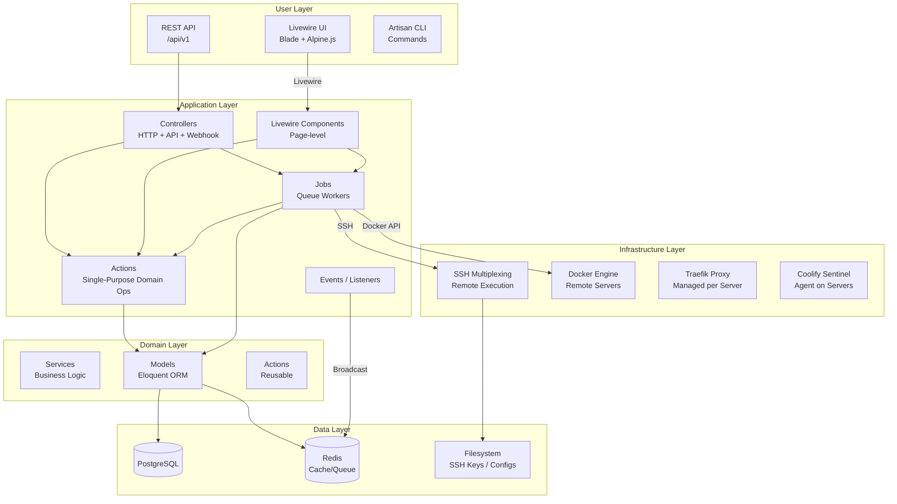
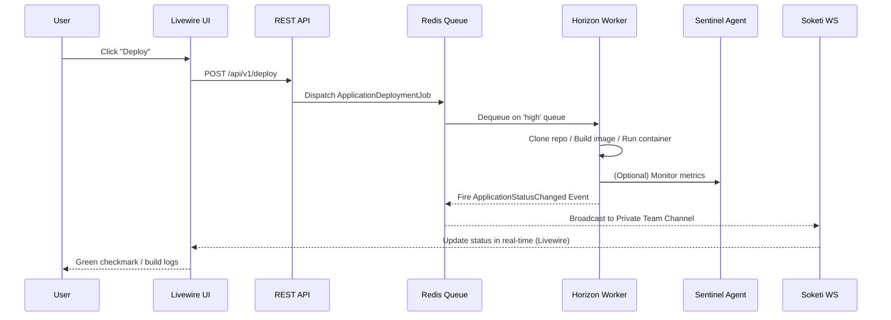

# Coolify 架构分析

> 分析版本：v1.0 ｜ 分析日期：2026-05-09

## 1. 项目概览

| 项目 | 官网 | GitHub | 编程语言 | Star 数 | 许可证 | 核心维护者 |
|------|------|--------|----------|---------|--------|------------|
| Coolify | https://coolify.io | https://github.com/coollabsio/coolify | PHP 8.4 / Laravel 12 | ~35k | 开源 | coollabsio |

**项目简介**: Coolify 是一个开源的、可自托管的 PaaS（Platform as a Service）平台，是 Heroku / Netlify / Vercel 的替代品。使用 PHP 8.4 / Laravel 12 构建，前端采用 Livewire 3 + Tailwind CSS v4 + Alpine.js，数据库使用 PostgreSQL 15，队列与实时通信依赖 Redis + Soketi（WebSocket 自托管方案）。

## 2. 技术栈

| 类别 | 技术选型 |
|------|----------|
| 后端语言 | PHP 8.4 |
| 框架 | Laravel 12 |
| 前端 | Livewire 3 + Alpine.js |
| 样式 | Tailwind CSS v4 |
| 数据库 | PostgreSQL 15 + Redis 7.x |
| WebSocket | Soketi（自托管） |
| 反向代理 | Traefik / Caddy（双选项） |
| 认证 | Laravel Fortify + Sanctum |
| 队列 | Redis + Laravel Horizon |
| 测试 | Pest PHP 4 |
| CI/CD | GitHub Actions |
| 构建系统 | Nixpacks / Dockerfile / Docker Compose / Docker Image |
| 包管理 | Composer + npm |

## 3. 整体架构

### 架构分层

**User Layer**: 用户交互入口，包括 Livewire 前端 UI、REST API 和 Artisan CLI。
**Application Layer**: 处理请求的核心层，包含控制器、Livewire 组件、领域动作（Actions）、队列任务和事件监听器。
**Domain Layer**: 业务逻辑和领域模型，包括 Eloquent 模型、服务和可复用的 Actions。
**Infrastructure Layer**: 远程服务器管理，通过 SSH 多路复用执行 Docker 命令、管理代理和 Sentinel 探针。
**Data Layer**: 持久化存储，PostgreSQL 为主数据库，Redis 用于缓存/队列，文件系统存储 SSH 密钥和配置。

### 模块职责

| 模块 | 职责 | 关键文件/目录 |
|------|------|---------------|
| Actions | 单用途领域操作，可作为对象/控制器/Job/Listener 调用 | `app/Actions/` |
| Livewire | 所有面向用户的 UI 页面组件 | `app/Livewire/` |
| Jobs | 队列任务（部署、备份、清理、服务器管理等） | `app/Jobs/` |
| Models | Eloquent 数据模型，核心领域实体 | `app/Models/` |
| Services | 复杂业务逻辑（配置生成、Docker 镜像解析、容器状态聚合等） | `app/Services/` |
| Helpers | SSH 复用、SSL 助手以及大量全局函数 | `app/Helpers/` + `bootstrap/helpers/` |
| Http/Controllers | API 控制器 + Webhook 处理器 | `app/Http/Controllers/` |
| Enums | PHP 强类型枚举 | `app/Enums/` |
| Events | 领域事件（状态变更、代理变更等） | `app/Events/` |
| Notifications | 多渠道通知 | `app/Notifications/` |

## 4. 核心模块详解

### 4.1 领域模型架构

核心实体关系：Team → Project → Environment → Application / StandaloneDatabase / Service。关键模型：**Server**（~55KB，管理 SSH 连接、Docker、代理、Sentinel 探针）、**Application**（~98KB，管理构建包、Git 仓库源、环境变量、预览部署）、**Service**（~75KB，预制服务栈）。

### 4.2 Actions 设计模式（领域动作）

使用 `lorisleiva/laravel-actions` 包，Action 类实现了 **Command 模式**，可多态使用：作为普通对象、Job、Controller 或 Listener。四种调用方式：`StartDatabase::run()` 同步调用、`StartDatabase::dispatch()` 异步 Job、绑定路由作为控制器、`$this->listen()` 事件响应。

### 4.3 部署流水线（核心流程）

部署是 Coolify 最复杂的流程，实现在 `ApplicationDeploymentJob`（~4400 行）中。流水线步骤：
1. 验证服务器和私钥
2. 生成 docker-compose.yml
3. 解析 SSH 多路复用连接
4. 克隆代码仓库（可配置独立 Build Server）
5. 构建 Docker 镜像（Nixpacks/Dockerfile）
6. 推送镜像到 Registry（可选）
7. 在目标服务器拉取并运行容器
8. 健康检查
9. 配置 Traefik Labels
10. 清理旧容器

**关键特性**：构建/部署分离、多服务器部署、PR 预览部署、SSH 多路复用连接池、滚动更新。

### 4.4 SSH 远程执行系统

`SshMultiplexingHelper` 管理 SSH 连接池，支持 `ControlMaster=auto` 长连接复用、连接年龄追踪和自动刷新、健康检查。`ExecuteRemoteCommand` Trait 被所有需要远程执行命令的 Job 使用。

### 4.5 代理（Proxy）管理

每台服务器有一个代理实例（Traefik 或 Caddy），Coolify 自动管理其配置。Docker 容器的 Labels（标签）驱动代理配置——利用 Docker 原生标签机制将域名、路由、SSL 证书注入容器的 Traefik/Caddy 元数据。

## 5. 关键设计决策

| 决策 | 选择 | 替代方案 | 理由 |
|------|------|----------|------|
| 后端语言 | PHP 8.4 + Laravel 12 | Node.js / Go | 利用 Laravel 成熟生态，开发效率高；PHP 8.4 JIT 性能足够，通过队列弥补高并发不足 |
| 远程管理方式 | SSH 多路复用 | 在每个服务器安装 Agent Daemon | 零侵入，服务器仅需标准 SSH 和 Docker，无需额外部署进程 |
| 默认构建包 | Nixpacks | Dockerfile | 用户无需写 Dockerfile，自动检测应用类型，降低使用门槛 |
| 前端框架 | Livewire + Alpine.js | React / Vue | 全栈 PHP 开发者无需写 JS，渐进式增强，天然与后端状态同步 |
| 反向代理 | Traefik 和 Caddy 双支持 | 仅选择一种 | 用户有选择权；Caddy 自动 HTTPS 更友好，Traefik 功能更丰富 |
| 构建/部署分离 | 可选独立 Build Server | 统一服务器 | 部署服务器无需构建工具链；构建不影响运行中应用；可独立扩展 |
| 实时通信 | Soketi（自托管 WebSocket） | Pusher 等外部服务 | 避免依赖外部服务，完全自托管 |

## 6. 数据流 / 请求流

## 7. 设计模式

| 模式名称 | 使用位置 | 目的 |
|----------|----------|------|
| Command 模式（Actions） | `app/Actions/` | 将领域操作封装为 Action 类，支持同步、异步、HTTP、事件四种入口 |
| Observer 模式（事件系统） | `app/Events/`, `app/Listeners/` | 监听状态变化，触发广播、通知、日志记录 |
| Strategy 模式（构建包） | `ApplicationDeploymentJob`, `BuildPackTypes` | 根据构建包类型分发到不同构建策略 |
| Repository 模式 | `ConfigurationRepository` | 统一配置源，将多模型的配置聚合成标准格式 |
| 多租户（Multi-Tenancy） | Team 模型，Policy 层 | 通过 Team 实现资源隔离，Policy 拦截跨团队访问 |

## 8. 工程实践

### 测试策略

使用 **Pest PHP 4** 测试框架。Feature Tests ~120+（部署流、API CRUD、认证、权限隔离、Webhook），Unit Tests ~100+（SSH 命令转义、Docker 镜像解析、环境变量处理），Browser Tests (Dusk) ~5+（登录、注册、Dashboard），Architecture Tests（安全约束）。测试亮点：安全测试优先、跨团队隔离测试、SSH 连接测试、TDD 实践。

### 发布流程

Docker 多阶段构建（开发/生产环境），S6 Overlay 进程管理（db-migration、horizon、scheduler-worker 等），一键安装脚本。

### 版本管理

代码版本管理：Git（GitHub），依赖管理：Composer + npm，数据库迁移：Laravel Migrations，静态分析：PHPStan，代码风格：Laravel Pint。

## 9. 总结与评价

### 亮点

1. **零侵入性设计**：不需要在目标服务器上安装特定 Agent，仅依赖标准 SSH + Docker
2. **多策略构建系统**：Nixpacks/Dockerfile/Docker Compose/Docker Image 四套构建策略
3. **强大的隔离性**：Team → Project → Environment 三层资源隔离，Policy 全覆盖
4. **可扩展的资源层次**：Application、Standalone Database、Service（多容器栈）三种资源类型
5. **企业级工程化**：全面测试覆盖、代码质量工具链、多通道通知

### 可改进之处

1. **`ApplicationDeploymentJob` 超长（~4400 行）**：职责过重，建议拆分为多个子 Job/Action
2. **`Server` 模型（~55KB）/ `Application` 模型（~98KB）**：Eloquent 模型承载了过多业务逻辑
3. **全局函数泛滥**：`bootstrap/helpers/` 中 18 个文件包含数百个全局函数
4. **SSH 命令拼接安全风险**：虽然采取了严格的 escapeshellarg，但仍是攻击面
5. **缺乏 API 版本化策略**：所有 API 在 `v1` 前缀下，未考虑向后兼容策略

## 参考

- 项目源代码：`coollabsio/coolify`
- 官方文档：https://coolify.io/docs
- 使用的关键包：`lorisleiva/laravel-actions`, `spatie/laravel-activitylog`, `livewire/livewire`, `pestphp/pest`, `laravel/horizon`, `soketi/soketi`
