# Coolify 架构深度分析报告

## 项目概览

**Coolify** 是一个开源的、可自托管的 PaaS（Platform as a Service）平台，是 Heroku / Netlify / Vercel 的替代品。使用 PHP 8.4 / Laravel 12 构建，前端采用 Livewire 3 + Tailwind CSS v4 + Alpine.js，数据库使用 PostgreSQL 15，队列与实时通信依赖 Redis + Soketi（WebSocket 自托管方案）。

---

## 一、项目整体架构与模块划分

### 架构总览

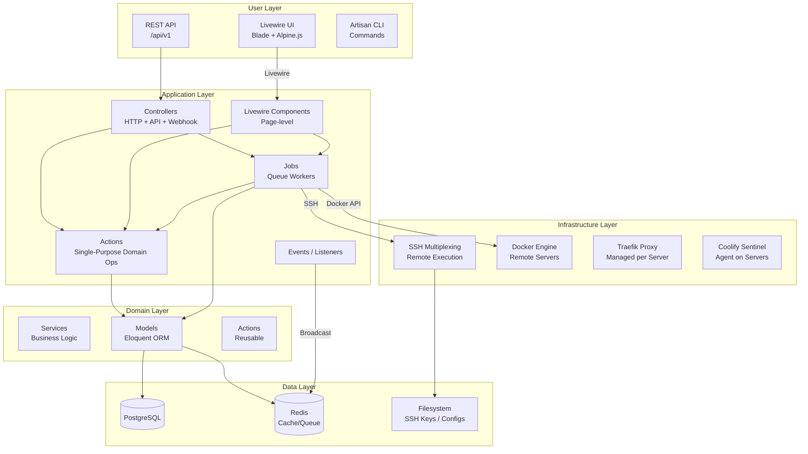

### 模块划分

| 模块 | 位置 | 职责 |
|------|------|------|
| **Actions** | `app/Actions/` | 单用途领域操作，可当作对象/控制器/Job/Listener 调用 |
| **Livewire** | `app/Livewire/` | 所有面向用户的 UI 页面组件 |
| **Jobs** | `app/Jobs/` | 队列任务（部署、备份、清理、服务器管理等） |
| **Models** | `app/Models/` | Eloquent 数据模型，核心领域实体 |
| **Services** | `app/Services/` | 复杂业务逻辑（配置生成、Docker 镜像解析、容器状态聚合等） |
| **Helpers** | `app/Helpers/` + `bootstrap/helpers/` | SSH 复用、SSL 助手以及大量全局函数 |
| **Http/Controllers** | `app/Http/Controllers/` | API 控制器 + Webhook 处理器 |
| **Console/Commands** | `app/Console/Commands/` | Artisan CLI 命令（初始化、迁移、清理等） |
| **Enums** | `app/Enums/` | PHP 强类型枚举 |
| **Events** | `app/Events/` | 领域事件（状态变更、代理变更等） |
| **Notifications** | `app/Notifications/` | 多渠道通知（邮件、Discord、Telegram、Slack、Pushover、Webhook） |

---

## 二、核心模块设计与实现

### 2.1 领域模型架构

Coolify 的领域模型围绕一个层次化组织结构展开：

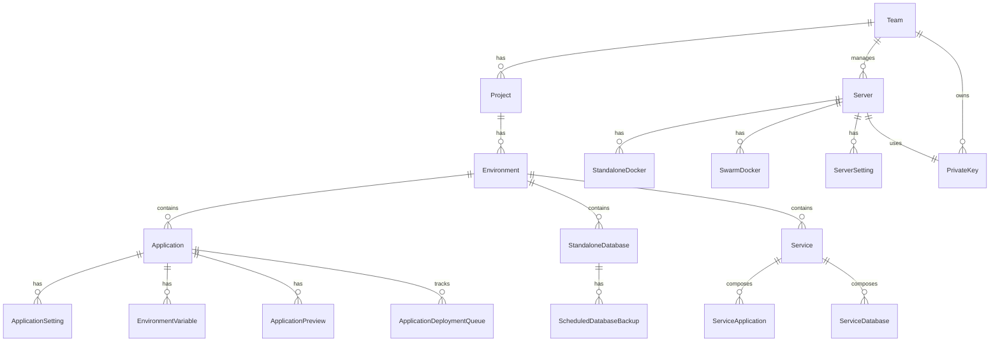

**关键模型**：
- **Server**（~55KB）：最核心、最复杂的模型。管理 SSH 连接、Docker、代理（Traefik/Caddy）、Sentinel 探针、健康检查等。
- **Application**（~98KB）：第二大模型。管理构建包（Nixpacks/Dockerfile/Docker Compose/Docker Image）、Git 仓库源、环境变量、预览部署、健康检查等。
- **Service**（~75KB）：预制服务栈（从 `service-templates.json` 读取），如 WordPress + MySQL、N8N 等。
- **BaseModel**：基类提供自动 CUID2 UUID 生成，所有模型继承它。

### 2.2 Actions 设计模式（领域动作）

使用 `lorisleiva/laravel-actions` 包，Action 类实现了 **Command 模式**，可多态使用：

```php
class StartDatabase extends AbstractAction
{
    use AsAction;  // ← 关键 trait

    // 1. 作为普通对象调用
    public function handle(Server $server, ...) { ... }

    // 2. 作为 Job 分发
    public function asJob(Server $server, ...) { ... }

    // 3. 作为 Controller 用
    public function asController(...) { ... }
}
```

**四种调用方式**：
- `StartDatabase::run($server, $db)` — 同步对象调用
- `StartDatabase::dispatch($server, $db)` — 异步 Job 分发
- 绑定到路由作为控制器 — HTTP 入口
- `$this->listen()` — 作为 Listener 响应事件

这个模式显著减少了重复代码：一个 Action 类同时是 Service + Job + Controller + Listener。

### 2.3 部署流水线（核心流程）

部署是 Coolify 最复杂的流程，实现在 `ApplicationDeploymentJob`（~4400 行）中，是整个系统的核心：

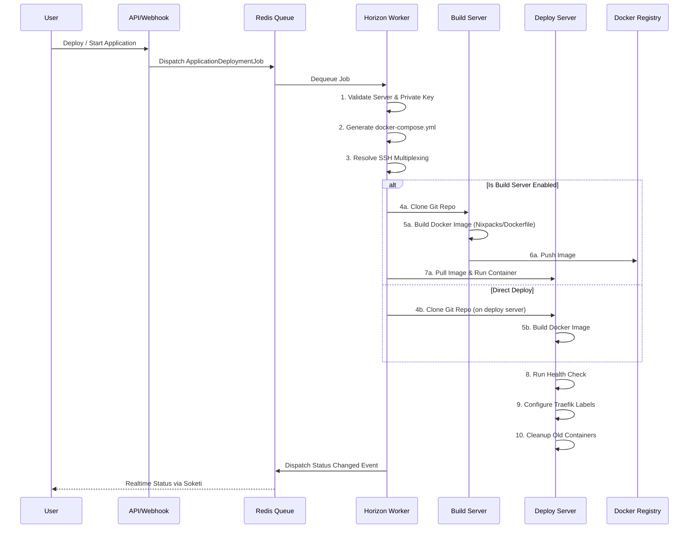

**部署流水线关键特性**：
- **构建/部署分离**：可配置独立的 Build Server，构建后推送到 Registry，部署服务器拉取运行
- **多服务器部署**：同一应用可在多个服务器上部署
- **预览部署**：Pull Request 触发独立预览环境
- **SSH 多路复用**：`SshMultiplexingHelper` 管理 SSH 连接池，避免频繁建立新连接
- **滚动更新**：先启动新容器，健康检查通过后再停止旧容器

### 2.4 SSH 远程执行系统

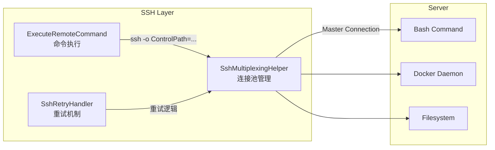

**SSH 多路复用**（`SshMultiplexingHelper`）：
- 建立一个长连接控制通道（`ControlMaster=auto`），后续命令复用该通道
- 连接年龄追踪和自动刷新机制
- 健康检查可选
- Mux 连接文件存储在 `storage/app/ssh/mux/` 中

**`ExecuteRemoteCommand` Trait**：
- 所有需要在远程服务器上执行命令的 Job 都 use 这个 trait
- 支持命令序列批量执行
- 敏感信息自动脱敏（REDACTED）
- 支持 `ignore_errors` 和 `append` 模式

### 2.5 代理（Proxy）管理

每台服务器有一个代理实例（Traefik 或 Caddy），Coolify 自动管理其配置：

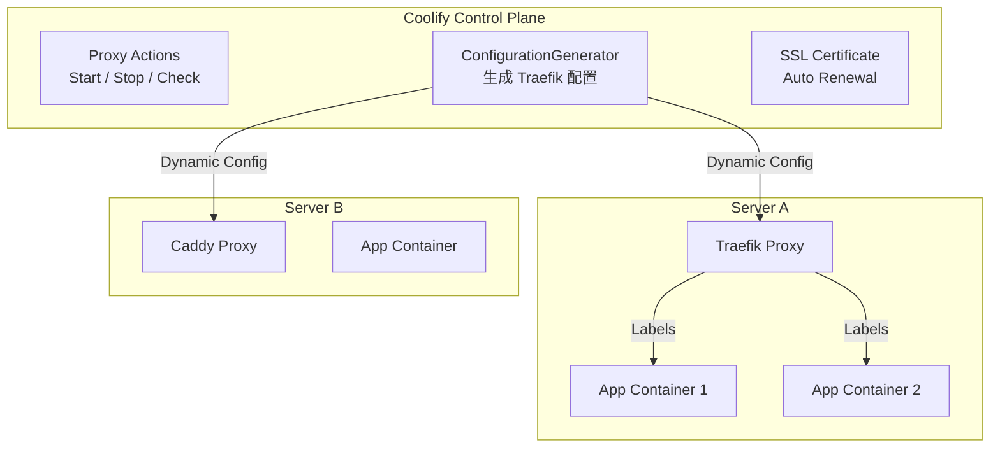

Docker 容器的 Labels（标签）驱动代理配置——Coolify 利用 Docker 原生标签机制将域名、路由、SSL 证书注入容器的 Traefik/Caddy 元数据。

---

## 三、使用的关键设计模式

### 3.1 Command Pattern（Actions）

`lorisleiva/laravel-actions` 实现了 **Command Bus** 模式，领域操作封装为 `Action` 类，同时支持同步、异步、HTTP、事件四种入口。

### 3.2 Observer Pattern（事件系统）

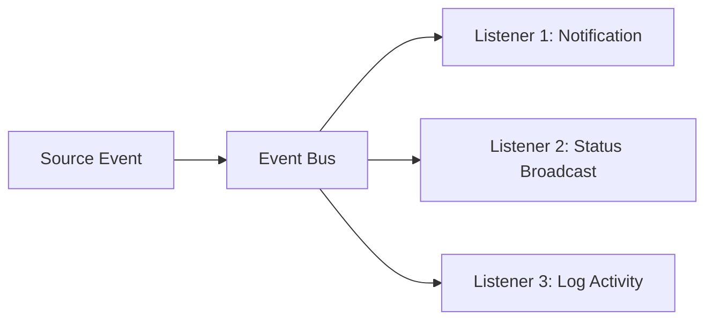

使用 Laravel 原生事件和 `spatie/laravel-activitylog`：
- `ApplicationStatusChanged` → 广播到 WebSocket + 记录操作日志
- `ServerReachabilityChanged` → 发送可达/不可达通知
- `ProxyStatusChanged` → 更新代理状态 UI

### 3.3 Strategy Pattern（构建包）

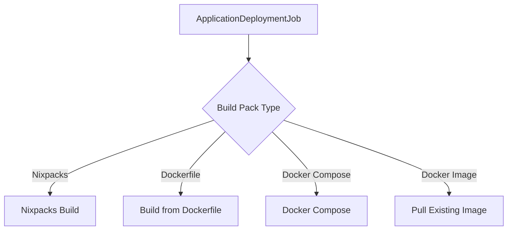

`BuildPackTypes` 枚举通过 `match` 分发到不同的构建策略。

### 3.4 Repository Pattern （`ConfigurationRepository`）

`ConfigurationRepository` 作为统一配置源，将多模型（Server、Application、Service）的配置聚合成标准格式。

### 3.5 Template Method（BaseModel）

`BaseModel::boot()` 中的 `static::creating()` 回调强制所有模型在创建前自动生成 CUID2 UUID。

### 3.6 Multi-Tenancy via Teams

通过 Team 模型实现多租户：
- 所有资源作用域到 `currentTeam()`
- 角色层级：`MEMBER(1) < ADMIN(2) < OWNER(3)`
- Policy 层拦截跨团队访问
- 通知、密钥、存储等资源继承 Team 隔离

---

## 四、重要设计决策及权衡

### 4.1 为什么使用 PHP + Laravel 而不是 Node.js/Go？

**决策**：使用 PHP 8.4 + Laravel 12。

**权衡**：
- **优势**：利用 Laravel 成熟的生态（队列、事件、ORM、认证、实时广播），开发效率极高；PHP 8.4 有 JIT 和联合类型，性能足够
- **代价**：对于 SSH 远程执行和高并发场景，PHP 的局限性需要通过队列（Horizon）和进程管理（S6 Overlay）来弥补

### 4.2 SSH 多路复用 vs HTTP Agent

**决策**：使用 SSH 控制台命令直接管理远程服务器，而不是在每个服务器上安装 Agent Daemon。

**权衡**：
- **优势**：零侵入——服务器只需要标准的 SSH 和 Docker；不需要额外部署 Agent 进程
- **代价**：对 SSH 连接稳定性要求高；复杂的 SSH multiplexing layer；需要处理连接中断、超时、重试问题

### 4.3 构建包策略：Nixpacks 为核心

**决策**：默认使用 Nixpacks 自动检测应用类型，回退为 Dockerfile。

**权衡**：
- **优势**：用户不需要写 Dockerfile，Nixpacks 自动检测（Node.js、Python、Go、Rust 等），降低使用门槛
- **代价**：Nixpacks 生态不如 Dockerfile 成熟；构建过程不可控；遇到特殊依赖时调试困难

### 4.4 前端：Livewire（无 JavaScript 框架）

**决策**：使用 Laravel Livewire 3 + Alpine.js 构建前端，而不是 React/Vue。

**权衡**：
- **优势**：全栈 PHP 开发者不需要写 JS 前端；渐进式增强（Progressive Enhancement）；天然与后端状态同步
- **代价**：复杂交互场景下性能不如 SPA；每个组件更新需要发送请求；对于高实时性 UI 有延迟

### 4.5 代理管理：Traefik / Caddy 双支持

**决策**：同时支持 Traefik 和 Caddy 两种反向代理。

**权衡**：
- **优势**：用户有选择权；Caddy 的自动 HTTPS（ZeroSSL/LetsEncrypt）对用户更友好；Traefik 功能更丰富
- **代价**：两套代码维护成本；配置生成逻辑需要抽象层；动态配置的格式完全不同

### 4.6 构建/部署分离

**决策**：可选使用独立的 Build Server 进行构建。

**权衡**：
- **优势**：部署服务器可以不安装构建工具链；镜像构建不影响运行中应用；构建环境可独立扩展
- **代价**：需要额外的 Docker Registry（如 ghcr.io）；增加网络传输延迟和镜像推送的复杂度

---

## 五、数据流 / 请求处理流程

### 5.1 常规 API 请求流程

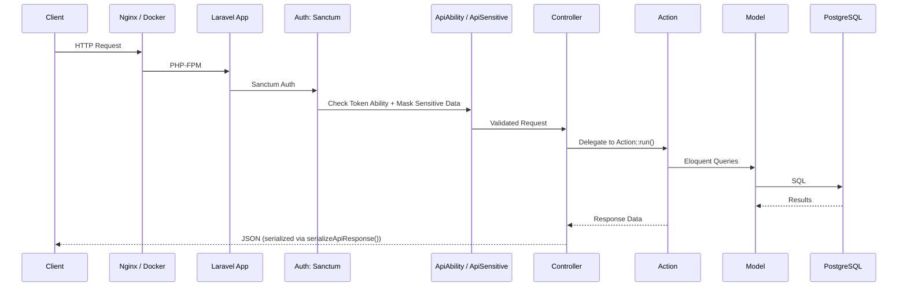

### 5.2 部署请求处理流程

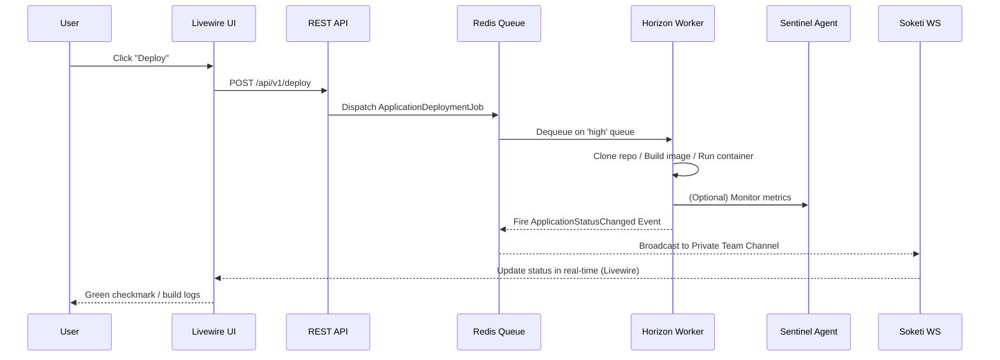

### 5.3 事件驱动数据流

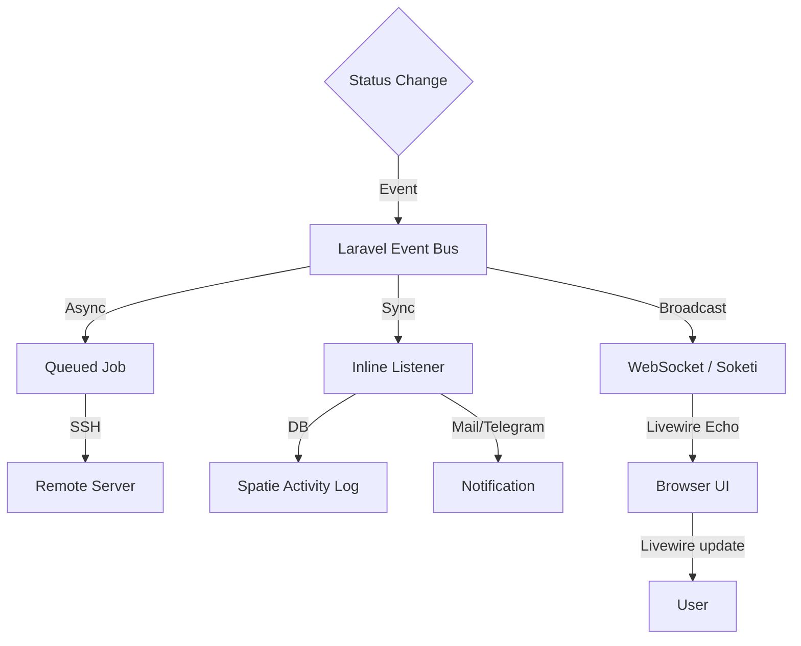

### 5.4 通知系统多通道数据流

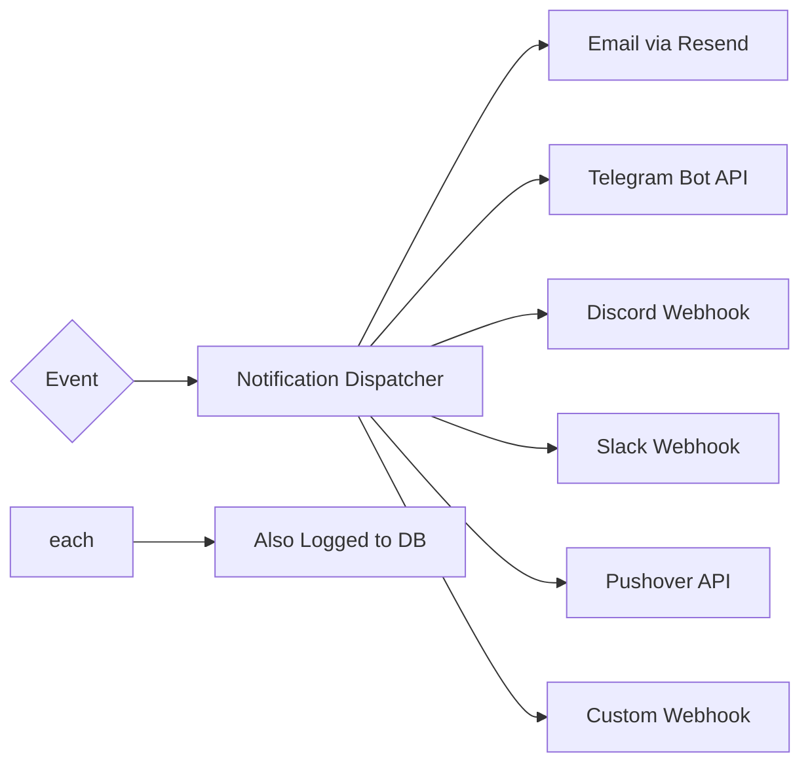

---

## 六、工程化实践

### 6.1 测试体系

Coolify 采用了全面的测试策略，使用 **Pest PHP 4** 作为测试框架：

| 测试类型 | 数量分布 | 示例 |
|----------|----------|------|
| **Feature Tests** | ~120+ 个 | 部署流、API CRUD、认证、权限隔离、Webhook |
| **Unit Tests** | ~100+ 个 | SSH 命令转义、Docker 镜像解析、环境变量处理 |
| **Browser Tests (Dusk)** | ~5+ 个 | 登录、注册、项目增删、Dashboard |
| **Architecture Tests** | Pest 架构断言 | 安全约束（PRNG、不可信输入） |

**测试亮点**：
- **安全测试优先**：大量针对命令注入（Command Injection）、路径遍历（Path Traversal）、XSS、IDOR 的测试
- **跨团队隔离测试**：`CrossTeamIdorServerProjectTest`、`TeamScopedResourceProofsTest`
- **SSH 连接测试**：`SshRetryMechanismTest`、`SshMultiplexingDisableTest`
- **TDD 实践**：CLAUDE.md 明确指出"bug 修复先写失败测试再修 bug"

### 6.2 CI/CD（GitHub Actions）

配置位于 `.github/` 目录，主要工作流包括：
- 自动运行 Pest 测试套件
- Dusk 浏览器测试
- PHPStan 静态分析
- Pint（Laravel 预设）代码风格检查
- Rector 升级重构检查

### 6.3 代码质量工具链

| 工具 | 用途 |
|------|------|
| **Laravel Pint** | 代码格式化（Laravel 预设） |
| **PHPStan** | 静态分析 |
| **Rector** | 升级重构 |
| **Ray** | 调试可视化 |
| **Laravel Horizon** | 队列监控（Dashboard） |
| **Laravel Telescope** | 开发调试面板 |
| **Sentry** | 生产错误追踪 |
| **Laravel Nightwatch** | 性能监控 |

### 6.4 部署与运维

**Docker 多阶段构建**：
- `docker/development/Dockerfile`：开发环境，包含 Horizon、调试工具
- `docker/production/Dockerfile`：生产环境，精简镜像、S6 Overlay 进程管理

**进程管理（S6 Overlay）**：
- `db-migration` — 数据库迁移任务
- `init-seeder` — 初始化数据填充
- `init-script` — 自定义初始化脚本
- `horizon` — 队列 Worker 守护进程
- `scheduler-worker` — Laravel Scheduler
- `nightwatch-agent` — 性能监控

**一键安装**：
```bash
curl -fsSL https://cdn.coollabs.io/coolify/install.sh | bash
```

### 6.5 实时通信

- **Soketi**（自托管 WebSocket 服务器）：避免依赖 Pusher 等外部服务
- **Livewire Echo**：浏览器端通过 `laravel-echo` + Soketi 订阅私有频道
- **实时终端**：通过 Soketi 的 XTerm.js 实现 WebSSH（`terminal-server.js`）

### 6.6 Sentinel（自研 Agent）

Coolify Sentinel 是一个轻量级探针，部署在每个管理的服务器上：
- 实时推送服务器指标（CPU、内存、磁盘）
- 通过加密 Token 认证（对称加密 `decrypt()`）
- 数据推送至 Sentinel API（`/api/v1/sentinel/push`）

---

## 七、架构总览图

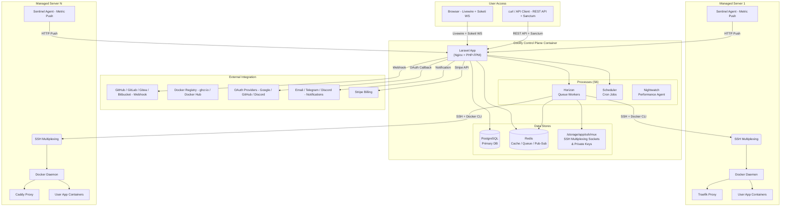

---

## 八、总结与评估

### 架构优势

1. **零侵入性设计**：不需要在目标服务器上安装特定 Agent，仅依赖标准 SSH + Docker
2. **多策略构建系统**：Nixpacks/Dockerfile/Docker Compose/Docker Image 四套构建策略
3. **强大的隔离性**：Team → Project → Environment 三层资源隔离，Policy 全覆盖
4. **可扩展的资源层次**：Application、Standalone Database、Service（多容器栈）三种资源类型
5. **企业级工程化**：全面测试覆盖、代码质量工具链、多通道通知

### 架构风险与改进空间

1. **`ApplicationDeploymentJob` 超长（~4400 行）**：职责过重，建议拆分为多个子 Job/Action
2. **`Server` 模型（~55KB）/ `Application` 模型（~98KB）**：Eloquent 模型承载了过多业务逻辑（违反单一职责）
3. **全局函数泛滥**：`bootstrap/helpers/` 中 18 个文件包含数百个全局函数，函数式组织缺乏类型约束
4. **SSH 命令拼接安全风险**：虽然采取了严格的 escapeshellarg 和验证模式，但 SSH 命令拼接仍是攻击面
5. **缺乏 API 版本化策略**：所有 API 在 `v1` 前缀下，未考虑向后兼容策略

### 技术栈总结

| 层级 | 技术选型 | 版本 |
|------|----------|------|
| 后端语言 | PHP | ^8.4 |
| 框架 | Laravel | ^12.49 |
| 前端 | Livewire + Alpine.js | 3.x |
| 样式 | Tailwind CSS | v4 |
| 数据库 | PostgreSQL + Redis | 15.x / 7.x |
| WebSocket | Soketi（自托管） | - |
| 反向代理 | Traefik / Caddy | 双选项 |
| 认证 | Laravel Fortify + Sanctum | - |
| 队列 | Redis + Laravel Horizon | 5.x |
| 测试 | Pest PHP | ^4.3 |
| CI | GitHub Actions | - |
| 包管理 | Composer + npm | - |

---

> **分析结论**：Coolify 是一个设计成熟的 PaaS 平台，虽然存在一些 Laravel 生态下常见的"胖模型 + 全局函数"问题，但其模块化程度、安全性考量和工程化实践在同级别开源项目中属于顶尖水平。架构核心以 SSH 多路复用和 Docker API 为基础，配合 Traefik/Caddy 的容器标签驱动代理配置，实现了零侵入的服务器管理能力。
