# Dokploy 架构深度分析

> **项目**: Dokploy — Open Source Alternative to Vercel, Heroku and Netlify
> **分析时间**: 2026-05-09
> **源码路径**: `/tmp/analysis-sources/dokploy`

---

## 1. 项目概览

**Dokploy** 是一个**开源的、可自托管的 PaaS 平台**，是 Heroku / Vercel / Netlify 的替代方案。它允许用户在自有的 VPS 上一键部署应用、管理数据库、配置域名/SSL、自动备份，并通过 Docker Swarm 实现多节点集群。

| 维度 | 内容 |
|------|------|
| **定位** | 自托管 PaaS，面向希望掌控基础设施的开发者和团队 |
| **许可证** | 核心 AGPL-3.0 + 部分企业功能专有许可 |
| **技术栈** | TypeScript (全栈)、Next.js (Pages Router)、tRPC、Drizzle ORM、PostgreSQL、Redis、Docker Swarm、Traefik |
| **包管理** | pnpm monorepo（`pnpm-workspace.yaml`） |

### 1.1 项目仓储结构

```
dokploy/
├── apps/
│   ├── dokploy/          ← 主应用 (Next.js UI + tRPC API + 部署引擎)
│   ├── schedules/        ← 定时任务调度器 (独立部署)
│   └── monitoring/       ← 监控服务 (Go 编写，独立部署)
├── packages/
│   └── server/           ← 核心服务层、数据库 ORM、构建器、工具
├── Dockerfile            ← 主应用镜像
├── Dockerfile.cloud      ← 云版镜像
├── Dockerfile.server     ← Remote Server agent 镜像
├── Dockerfile.schedule   ← 调度器镜像
├── Dockerfile.monitoring ← 监控服务镜像
└── openapi.json          ← OpenAPI 规范 (自动生成)
```

---

## 2. 整体架构与模块划分

### 2.1 分层架构总览

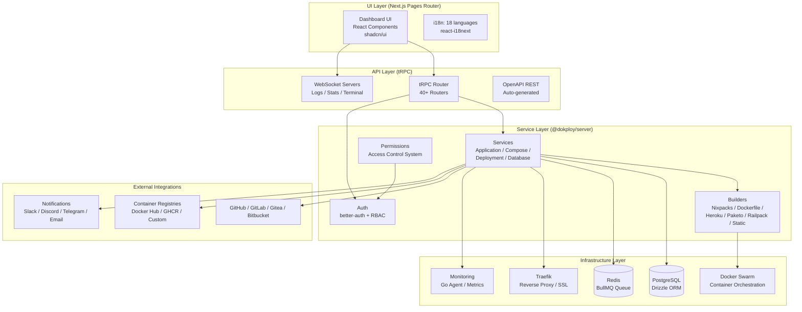

### 2.2 四个独立部署的服务

Dokploy 将系统拆分为 **4 个独立容器**，各自有独立的 Dockerfile：

| 容器 | 镜像名 | 职责 |
|------|--------|------|
| **dokploy** | `dokploy/dokploy` | 主应用（Next.js + tRPC + 部署 Worker） |
| **dokploy-schedule** | `dokploy/schedule` | Cron 调度器（执行定时部署/任务） |
| **dokploy-monitoring** | `dokploy/monitoring` | 实时监控代理（Go 编写） |
| **dokploy-traefik** | `traefik:v3.6.x` | 反向代理和 SSL 终结 |

**关键设计决策**：将调度器和监控器分离为独立进程，避免阻塞主应用的性能和可用性。

---

## 3. 核心模块设计与实现

### 3.1 数据模型（Drizzle ORM + PostgreSQL）

`packages/server/src/db/schema/` 包含约 30 个表定义。核心实体关系：

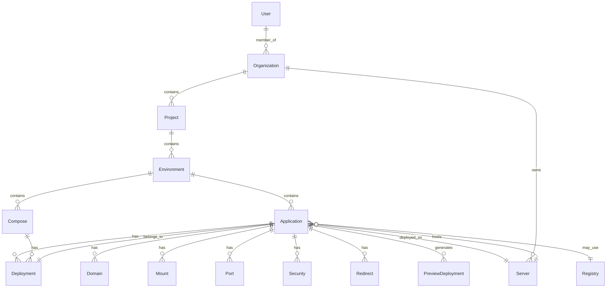

**设计亮点**：
- 使用 `nanoid` 为主键生成，避免顺序 ID 暴露
- 使用 PostgreSQL 的 `pgEnum` 定义状态枚举（如 `sourceType`, `buildType`, `applicationStatus`）
- 使用 `drizzle-zod` 的 `createInsertSchema` 自动推导验证规则
- 使用 `relations` 定义跨表关联，支持嵌套查询

### 3.2 API 层（tRPC）

API 层在 `apps/dokploy/server/api/routers/` 中有 **40+ 个 tRPC router**，通过 `createTRPCRouter` 注册。

**架构模式**：

```typescript
// 每个 router 示例
export const applicationRouter = createTRPCRouter({
  create: protectedProcedure
    .input(apiCreateApplication)
    .mutation(async ({ input, ctx }) => { ... }),
  
  deploy: protectedProcedure
    .input(apiDeployApplication)
    .mutation(async ({ input, ctx }) => { ... }),
  
  byId: protectedProcedure
    .input(apiFindOneApplication)
    .query(async ({ input, ctx }) => { ... }),
});
```

**中间件链**：
1. `protectedProcedure` → 验证登录态（better-auth session）
2. `withPermission` → 检查资源访问权限（RBAC）
3. `audit` → 记录审计日志

**设计决策**：选择 tRPC 而非传统 REST，带来了端到端类型安全和自动的 OpenAPI 生成（通过 `@dokploy/trpc-openapi`）。

### 3.3 认证与授权系统

**认证（AuthN）**：使用 **Better-Auth**（现代 TypeScript 认证库）：
- 支持多种社交登录（GitHub、Google）
- 支持多因素认证（2FA）
- 支持 API Key 认证（通过 `@better-auth/api-key` 插件）
- 支持 SSO（企业版功能）

**授权（AuthZ）**：自定义 RBAC 系统

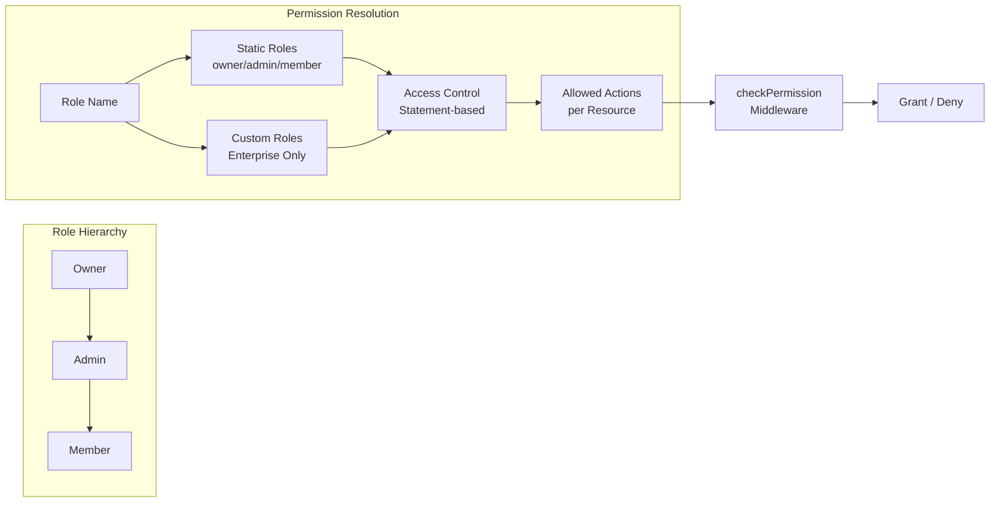

权限系统的核心在 `packages/server/src/lib/access-control.ts`，使用声明式的 `statements` 对象定义每个资源的允许操作：

```typescript
const statements = {
  application: ["create", "delete", "transfer", "deploy", ...],
  server: ["create", "delete", "edit"],
  // ...
} as const;
```

**设计亮点**：企业版支持自定义角色，权限存储为 `{resource: string[]}` JSON，通过 `ac.newRole()` 动态合并。

### 3.4 部署引擎（核心价值）

部署引擎是 Dokploy 的核心能力，分为三个主要阶段：

#### 阶段 1：源码获取（Source Providers）

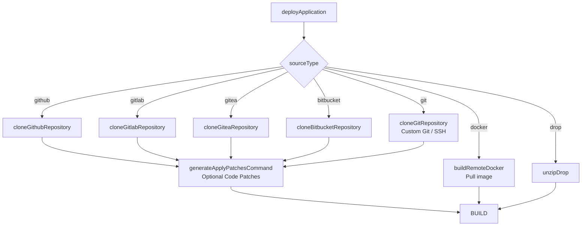

代码通过 `execAsync`（本地）或 `execAsyncRemote`（远程）在 Shell 中执行 Git 克隆命令。

**Git Provider 使用策略模式**：`packages/server/src/utils/providers/` 下有 `github.ts`、`gitlab.ts`、`gitea.ts`、`bitbucket.ts`、`git.ts`、`docker.ts`、`raw.ts`，每个返回一个 Shell 脚本字符串。

#### 阶段 2：构建（Builders）

**Builder 策略模式**：`packages/server/src/utils/builders/` 定义了 7 种构建方式：

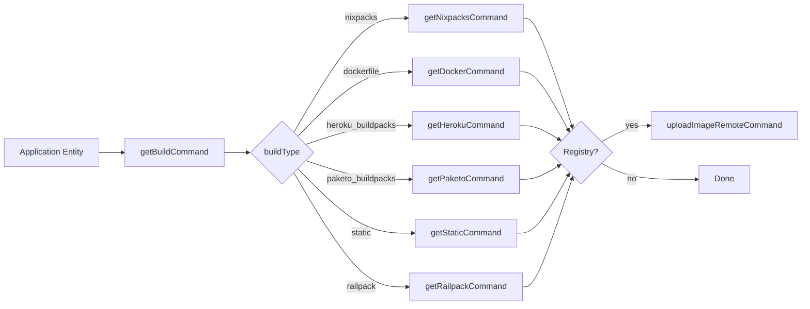

每个 Builder 函数接受 `ApplicationNested` 对象，返回一段将要 **在 shell 中执行的 Bash 脚本字符串**。这是一个有趣的设计选择 —— 用字符串拼接代替 Docker SDK 调用，使得构建过程完全透明且易于调试。

**Nixpacks 示例**（最常用的构建器）：
```bash
nixpacks build /path/to/code --name app-name --env KEY=VALUE
# 如果配置了 publishDirectory：
docker create --name container-id app-name
docker cp container-id:/app/publishDir/. /path/to/code/publishDir
```

#### 阶段 3：容器编排（Mechanize）

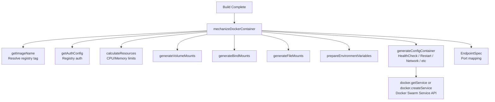

关键设计决策：**使用 Docker Swarm Service 而非普通容器**。这意味着：
- 天然支持滚动更新（`UpdateConfig`）
- 天然支持多副本（`Mode.Replicated`）
- 支持健康检查、重启策略
- 集群内服务发现

如果服务已存在则 `update`（触发 `ForceUpdate`），否则 `createService`。

### 3.5 任务队列系统（BullMQ + Redis）

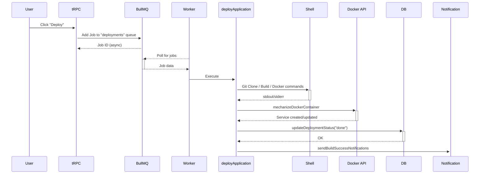

**Worker 实现**：`apps/dokploy/server/queues/deployments-queue.ts`

```typescript
const deploymentWorker = new Worker("deployments", async (job) => {
  if (job.data.applicationType === "application") {
    if (job.data.type === "redeploy") {
      await rebuildApplication(job.data);
    } else {
      await deployApplication(job.data);
    }
  } else if (job.data.applicationType === "compose") {
    // ...
  }
}, { connection: redisConfig });
```

**设计决策**：Worker 设置 `autorun: false`，由主服务器在初始化完成后手动调用 `deploymentWorker.run()`。当 `IS_CLOUD=true` 时使用 NO-OP worker，避免不需要 Redis 的部署模式。

### 3.6 Traefik 反向代理

Traefik 的配置完全通过文件动态管理：

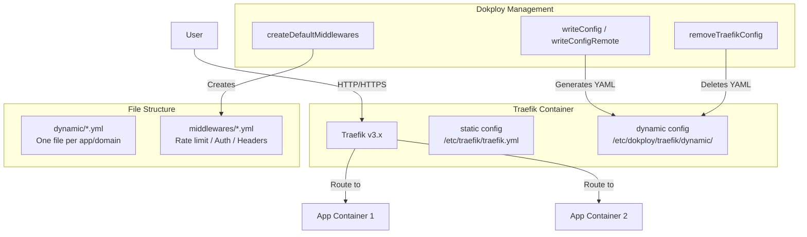

**设计亮点**：
- 使用 Docker socket 挂载实现容器发现
- 支持 letsencrypt 自动 SSL 证书
- 支持自定义证书解析器（企业版）
- 支持 HTTP/3（QUIC）

### 3.7 WebSocket 实时通信

Dokploy 有 6 个独立的 WebSocket 服务器：

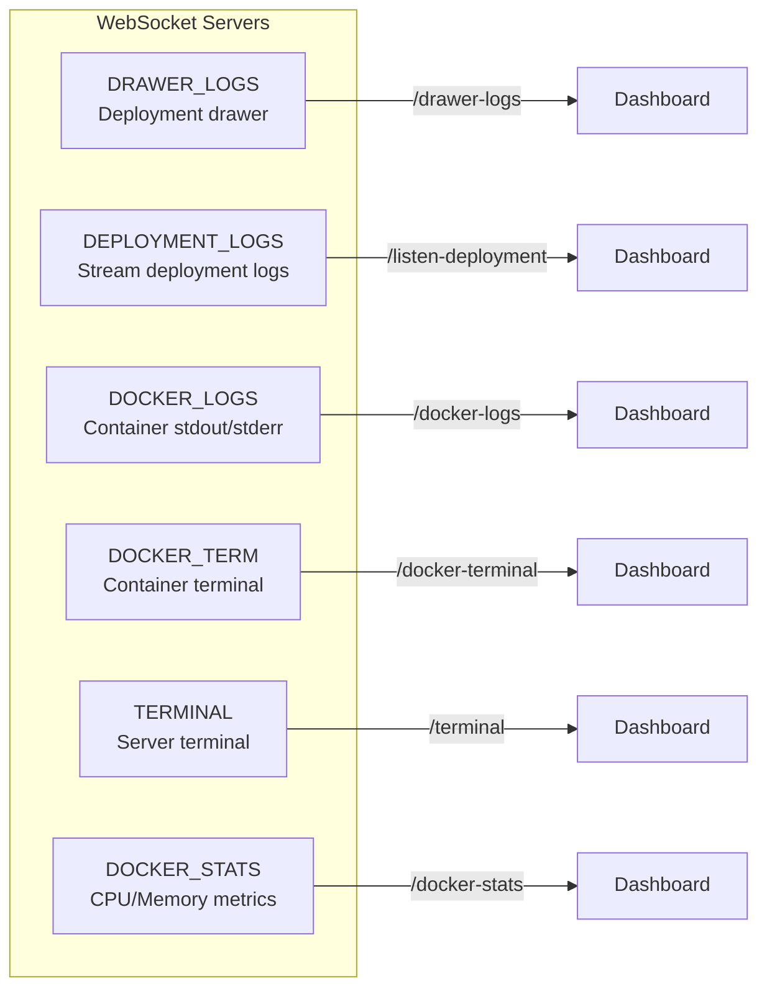

所有 WS 服务器在 `apps/dokploy/server/wss/` 中实现，使用原生 `ws` 库。每个 WS 处理程序通过 `readValidDirectory` 函数确保路径安全性，防止目录遍历攻击。

### 3.8 多服务器/集群支持

Dokploy 支持通过 **SSH** 连接远程 Docker 主机：

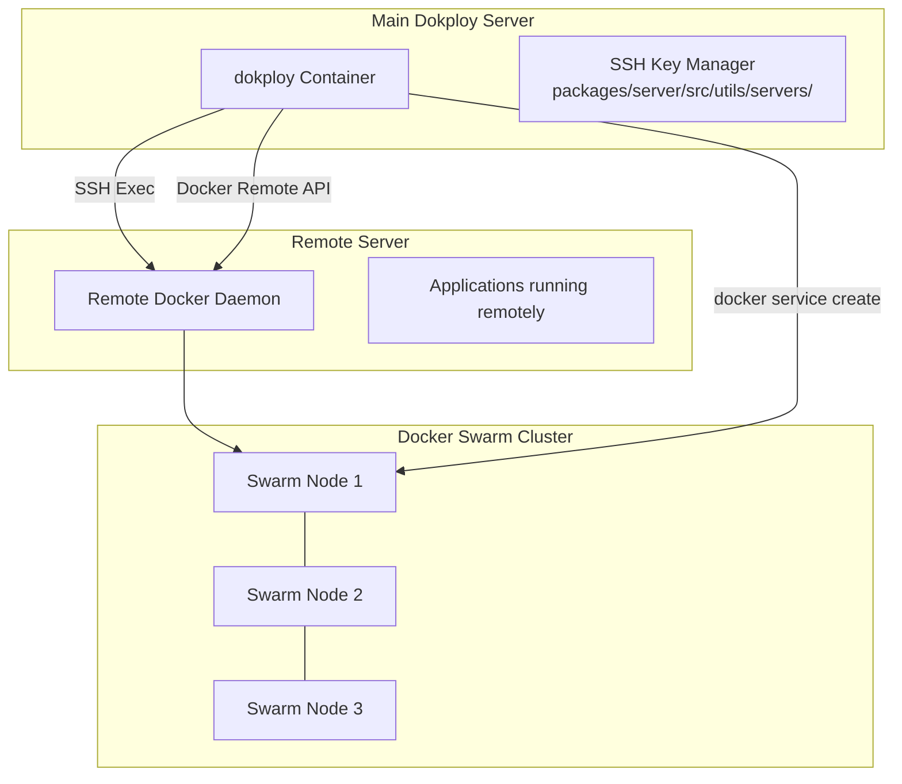

**远程执行**：`execAsyncRemote` 通过 SSH 在远程服务器执行命令，`getRemoteDocker` 建立远程 Docker 客户端连接。

**构建服务器分离**：应用可以指定 `buildServerId`，在专门的构建服务器上构建后推送镜像到 registry，再由目标服务器拉取运行。

### 3.9 数据库管理

Dokploy 内置了对 6 种数据库的管理：

| 数据库 | 组件目录 | 核心操作 |
|--------|----------|----------|
| PostgreSQL | `components/dashboard/postgres/` | 创建、备份、重建 |
| MySQL | `components/dashboard/mysql/` | 创建、备份、重建 |
| MariaDB | `components/dashboard/mariadb/` | 创建、备份、重建 |
| MongoDB | `components/dashboard/mongo/` | 创建、备份、重建 |
| Redis | `components/dashboard/redis/` | 创建、备份 |
| libSQL | `components/dashboard/libsql/` | 创建、备份 |

数据库以 Docker 容器方式运行，备份通过 `packages/server/src/utils/backups/` 中的具体实现完成，支持 S3、S3 Compatible 和本地文件系统目标。

### 3.10 Docker Compose 支持

Dokploy 对 Docker Compose 提供一等公民支持，有两种模式：

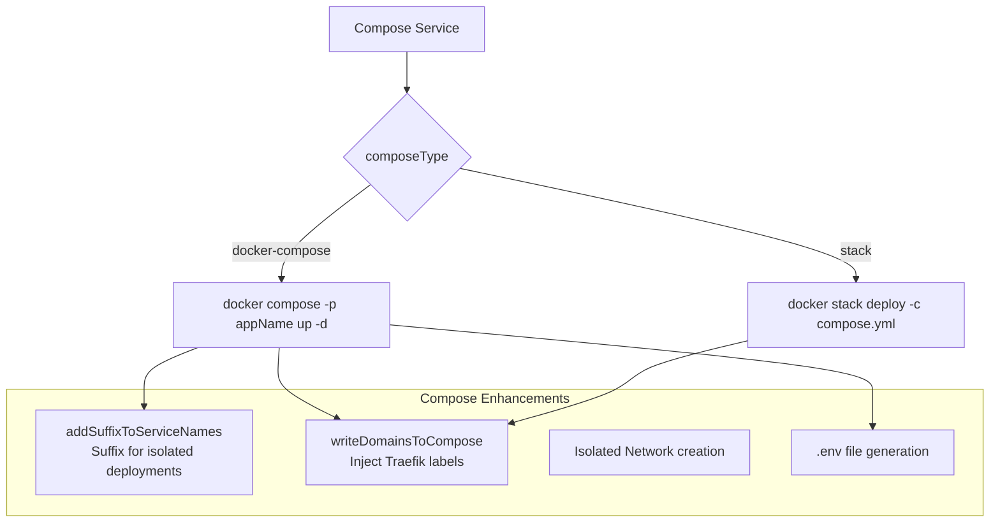

**设计亮点**：支持 `randomize` 功能为服务名加后缀，使同一 compose 文件可以在同一集群中多次部署而不冲突。通过 `writeDomainsToCompose` 将用户配置的域名注入 compose 文件的 Traefik labels。

---

## 4. 关键设计模式

### 4.1 策略模式（Builders & Providers）

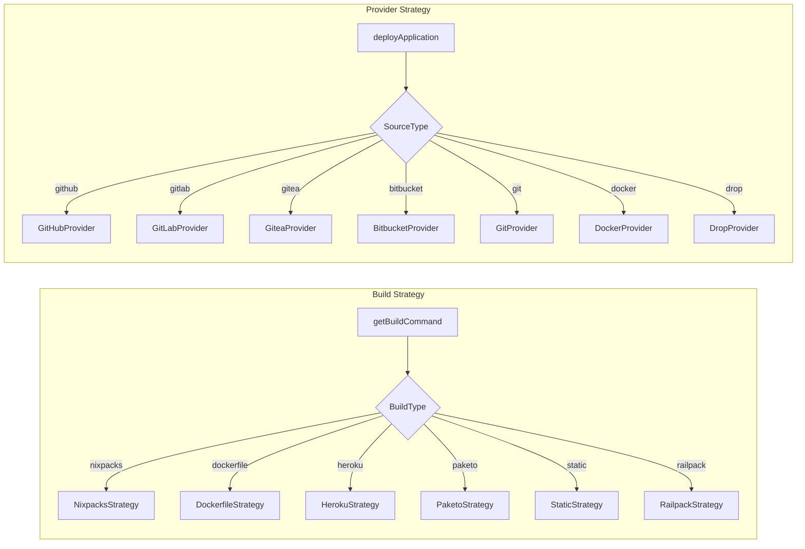

虽然未使用经典的接口 + 类实现，但每个 builder/provider 函数遵循相同的签名（接受 entity 返回 shell command 字符串），是**函数式策略模式**的典型应用。

### 4.2 队列/工作者模式（BullMQ）

异步处理部署任务，实现了：
- 任务持久化（通过 Redis）
- 自动重试
- 并发控制
- 取消操作（通过 `cancelDeployment`）
- 状态跟踪

### 4.3 服务层模式

`packages/server/src/services/` 下的每个服务（`application.ts`、`deployment.ts`、`compose.ts` 等）封装了对特定实体的所有数据库操作和业务逻辑，上层的 tRPC router 只负责输入验证和调用服务。

### 4.4 仓库模式（Drizzle ORM）

Drizzle ORM 提供了类型安全的查询构建器，加上 `relations` 定义和 `findFirst`/`findMany` 的 `with` 选项，实现了灵活的数据获取模式：

```typescript
const application = await db.query.applications.findFirst({
  where: eq(applications.applicationId, id),
  with: {
    mounts: true,
    domains: true,
    environment: { with: { project: true } },
    // ...
  }
});
```

### 4.5 中间件模式

tRPC 中间件链实现了横切关注点的分离：

```
request → session validation → permission check → audit logging → route handler
```

### 4.6 Shell 脚本拼接模式

**一个有趣但有效的设计选择**：部署过程中的所有操作（git clone、构建、docker 操作）不是通过编程语言的 SDK 调用，而是拼接为 **Bash 脚本字符串**，通过 `execAsync` 或 `execAsyncRemote` 执行。

例如 git clone + build 命令拼接：

```typescript
let command = "set -e;";
command += await cloneGithubRepository(applicationEntity);
command += await getBuildCommand(application);
const commandWithLog = `(${command}) >> ${deployment.logPath} 2>&1`;
await execAsync(commandWithLog);
```

**优势**：透明、易调试、日志自动捕获、远程执行兼容（通过 SSH）。
**代价**：对注入攻击更敏感，需小心处理特殊字符。

---

## 5. 重要设计决策与权衡

### 5.1 Docker Swarm vs Kubernetes

**决策**：选择 Docker Swarm 而非 Kubernetes
**理由**：
- **单机友好**：Swarm 在单节点上开箱即用，Dokploy 大部分部署在单台 VPS
- **API 简洁**：Docker SDK（dockerode）的 API 比 K8s client-go 简洁得多
- **资源占用**：Swarm 几乎零额外资源开销
- **足够的能力**：滚动更新、服务发现、负载均衡、多节点集群，Swarm 都能满足
- **生态匹配**：Docker Compose 可直接用于 `stack deploy`

**代价**：缺乏 K8s 的一些高级功能（自动扩缩容、自定义 CRD、服务网格）。

### 5.2 tRPC vs REST/GraphQL

**决策**：选择 tRPC
**理由**：
- 端到端类型安全（前后端共享类型）
- 自动推导 API 签名，无需手动维护接口文档
- 和 Next.js 无缝集成
- 通过 `trpc-openapi` 自动生成 OpenAPI 规范（1.3MB 的 `openapi.json`）

### 5.3 Shell 命令拼接 vs Docker SDK 直接调用

**决策**：混合使用，构建阶段用 Shell 命令，容器编排用 Docker SDK
**理由**：
- Shell 命令易调试、日志捕获自然
- Docker SDK 用于 Service API 调用（`createService`/`update`）
- 远程服务器通过 SSH 执行 Shell 命令，而非远程 Docker API

### 5.4 单库 vs 微服务

**决策**：单库（monorepo），但有独立进程
**理由**：
- 共享类型和工具函数
- 统一构建与发布
- 但关键功能（监控、调度）作为独立容器部署，实现一定程度解耦

### 5.5 Better-Auth vs NextAuth.js

**决策**：选择 Better-Auth（较新的库）
**理由**：
- 原生支持 organization 多租户
- 支持 API Key、2FA、SSO
- Drizzle 适配器开箱即用
- 比 NextAuth.js 更灵活的插件系统

---

## 6. 数据流 / 请求处理流程

### 6.1 完整部署流程

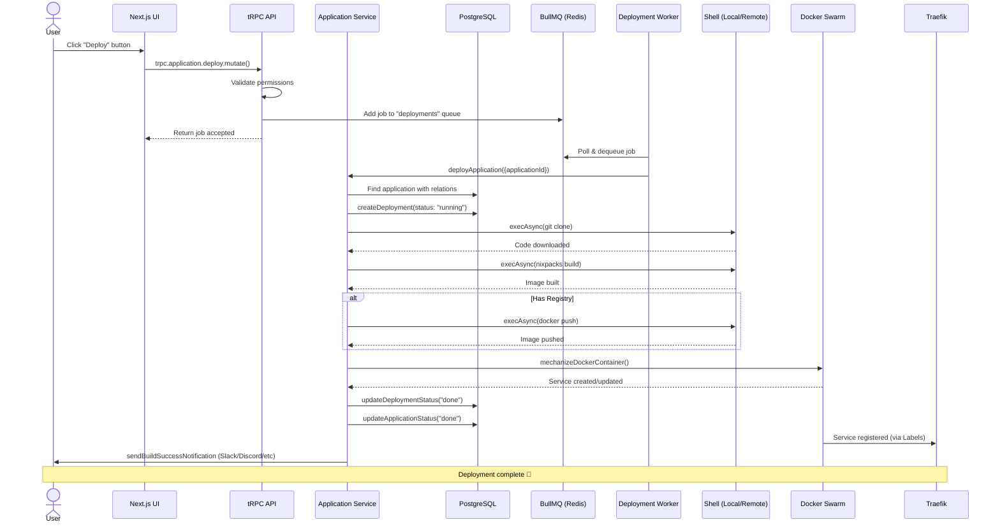

### 6.2 WebSocket 日志流

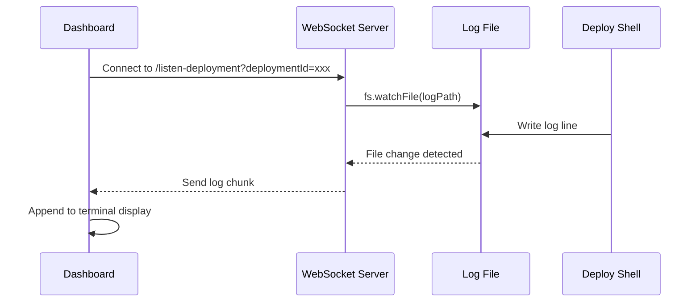

---

## 7. 工程化实践

### 7.1 代码质量工具链

| 工具 | 用途 |
|------|------|
| **Biome** | Linting + Formatting（替代 ESLint + Prettier） |
| **TypeScript** | 严格模式类型检查 |
| **Lint-staged** | Pre-commit 自动格式化和 lint 修复 |
| **tsx** | 开发模式下的 TypeScript 直接执行 |

### 7.2 测试架构

使用 **Vitest** 作为测试运行器（`pool: "forks"`）：

```
__test__/
├── compose/          ← Docker Compose 解析和注入测试
│   ├── config/       ← Compose 配置测试
│   ├── domain/       ← 域名注入 labels 测试
│   ├── network/      ← 网络配置测试
│   ├── secrets/      ← Secrets 配置测试
│   ├── service/      ← 服务名修改测试
│   └── volume/       ← 挂载卷配置测试
├── deploy/           ← 部署命令生成测试
├── permissions/      ← RBAC 权限测试
├── traefik/          ← Traefik 配置生成测试
├── wss/              ← WebSocket 工具测试
├── env/              ← 环境变量处理测试
├── server/           ← 容器编排测试
├── templates/        ← 模板处理测试
├── utils/            ← 工具函数测试
├── drop/             ← 文件上传处理测试
├── cluster/          ← 集群上传测试
├── requests/         ← 请求处理测试
└── setup.ts          ← DB mock（防止 CI 中连接真实 PostgreSQL）
```

**测试策略**：DB 完全 mock，不依赖基础设施。主要测试：
1. **命令生成正确性**（Shell 命令字符串校验）
2. **Compose 文件操作**（服务名修改、label 注入）
3. **权限逻辑**（RBAC 规则验证）
4. **Traefik 配置**（YAML 生成校验）

### 7.3 CI/CD 流水线

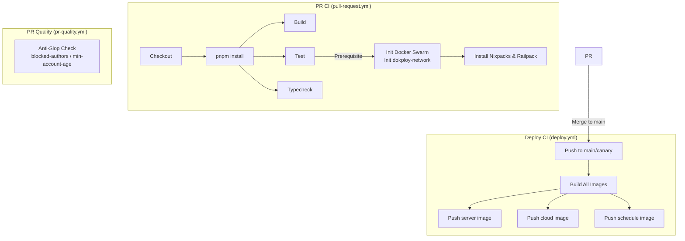

**亮点**：
- PR CI 中通过 `docker swarm init` 和 `docker network create` 初始化测试环境
- 使用 `anti-slop` Action 防止 AI 生成的低质量 PR
- 多阶段 Docker 构建，`pnpm deploy` 仅复制生产依赖
- 自动同步 OpenAPI 文档

### 7.4 数据库迁移

使用 Drizzle Kit 管理数据库迁移：

```
apps/dokploy/drizzle/
├── meta/         ← 迁移元数据
└── *.sql         ← 迁移 SQL 文件
```

启动时自动执行迁移：`migration.ts`

---

## 8. 总结评价

### 优势

1. **高度自包含**：一个安装命令即可部署完整的 PaaS 平台
2. **技术栈一致性**：全栈 TypeScript，从 DB 到 UI 类型共享
3. **多构建器支持**：Nixpacks / Dockerfile / Heroku / Paketo / Railpack / Static，覆盖几乎所有应用类型
4. **多数据库支持**：内置 6 种数据库管理
5. **多服务器集群**：天然支持 Docker Swarm 多节点
6. **实时体验**：WebSocket 提供日志、终端、监控的实时流
7. **可审计**：RBAC + 审计日志 + API Keys
8. **国际化**：支持 18 种语言

### 潜在改进空间

1. **测试覆盖**：当前测试集中在工具函数和命令生成，缺少端到端测试和集成测试
2. **错误处理**：Shell 命令的错误处理依赖于 `set -e`，在复杂流水线中错误定位可能困难
3. **监控粒度**：监控服务是独立的 Go 应用，但功能相对基础（CPU/内存/磁盘/网络）
4. **身份与租户隔离**：多租户支持在萌芽阶段，企业版功能（SSO、自定义角色、审计日志）有专有许可限制
5. **没有 K8s 支持**：对需要高级编排功能的团队是重大缺失

### 整体评分

| 维度 | 评分 | 说明 |
|------|------|------|
| 架构清晰度 | ★★★★☆ | 分层清晰，模块边界明确 |
| 代码质量 | ★★★★☆ | TypeScript 严格模式，一致性良好 |
| 测试覆盖 | ★★★☆☆ | 单元测试覆盖核心逻辑，缺少集成测试 |
| 文档 | ★★★☆☆ | 有 GUIDE 和 API 规范，但架构文档不足 |
| 可扩展性 | ★★★★☆ | 策略模式和注册机制良好 |
| 运维便利性 | ★★★★★ | 一键安装，自包含部署 |

---

*本文档由 Craft Agent 于 2026-05-09 自动生成*
