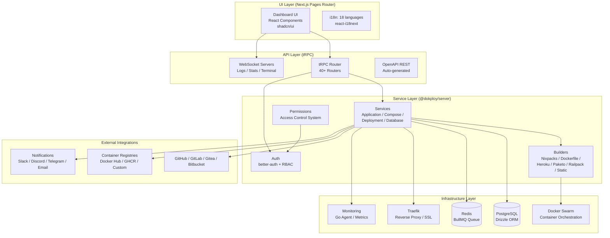
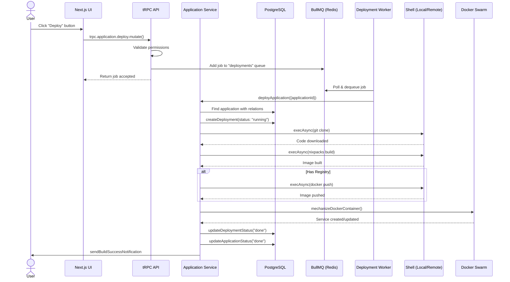

# Dokploy 架构分析

> 分析版本：v1.0 ｜ 分析日期：2026-05-09

## 1. 项目概览

| 项目 | 信息 |
|------|------|
| 官网 | — |
| GitHub | [dokploy/dokploy](https://github.com/dokploy/dokploy) |
| 编程语言 | TypeScript (全栈) |
| Star 数 | ~15k |
| 许可证 | AGPL-3.0 |
| 核心维护者 | 社区维护 |

**项目简介**

Dokploy 是一个开源的、可自托管的 PaaS 平台，是 Heroku / Vercel / Netlify 的替代方案。它允许用户在自有的 VPS 上一键部署应用、管理数据库、配置域名/SSL、自动备份，并通过 Docker Swarm 实现多节点集群。

## 2. 技术栈

| 类别 | 技术选型 |
|------|----------|
| 编程语言 | TypeScript (全栈) |
| 前端框架 | Next.js (Pages Router) |
| API 框架 | tRPC |
| ORM | Drizzle ORM |
| 数据库 | PostgreSQL |
| 缓存/队列 | Redis (BullMQ) |
| 容器编排 | Docker Swarm |
| 反向代理 | Traefik |
| 包管理 | pnpm (monorepo) |
| 测试框架 | Vitest |
| CI/CD | GitHub Actions (pull-request.yml / deploy.yml) |
| 认证库 | Better-Auth |

## 3. 整体架构

### 架构分层

- **UI Layer**: Next.js Pages Router + shadcn/ui + react-i18next (18 种语言)
- **API Layer**: tRPC 路由（40+） + WebSocket 服务器（日志、终端、统计）+ OpenAPI REST 自动生成
- **Service Layer (@dokploy/server)**: 应用/Compose/部署/数据库服务、构建器（6 种）、认证（better-auth + RBAC）、权限系统
- **Infrastructure Layer**: PostgreSQL (Drizzle ORM)、Redis (BullMQ)、Docker Swarm、Traefik、监控代理（Go）
- **External Integrations**: Git 提供商、容器镜像仓库、通知渠道

### 模块职责

| 模块 | 职责 | 关键文件/目录 |
|------|------|---------------|
| dokploy (主应用) | Next.js UI + tRPC API + 部署 Worker | `apps/dokploy/` |
| dokploy-schedule | Cron 调度器（定时部署/任务） | `apps/schedules/` |
| dokploy-monitoring | 实时监控代理（Go） | `apps/monitoring/` |
| @dokploy/server | 核心服务层、DB ORM、构建器、工具 | `packages/server/` |

## 4. 核心模块详解

### 4.1 数据模型（Drizzle ORM + PostgreSQL）

核心实体关系：Organization → Project → Environment → Application / Compose。设计亮点：使用 `nanoid` 主键、`pgEnum` 定义状态枚举、`drizzle-zod` 自动推导验证规则、`relations` 定义跨表关联。

### 4.2 API 层（tRPC）

40+ 个 tRPC router，通过 `createTRPCRouter` 注册。中间件链：`protectedProcedure` → `withPermission` → `audit`。

### 4.3 认证与授权系统

认证使用 Better-Auth（支持社交登录、2FA、API Key、SSO）。授权为自定义 RBAC 系统，角色层级 Owner → Admin → Member，使用声明式 `statements` 定义每个资源的允许操作。

### 4.4 部署引擎（核心价值）

**阶段 1：源码获取** — 策略模式，支持 GitHub/GitLab/Gitea/Bitbucket/Custom Git/Docker/Drop 等 7 种来源。

**阶段 2：构建** — 6 种构建方式：Nixpacks、Dockerfile、Heroku Buildpacks、Paketo Buildpacks、Static、Railpack。每个 Builder 函数返回 Bash 脚本字符串。

**阶段 3：容器编排（Mechanize）** — `mechanizeDockerContainer()` 负责：解析镜像名和 Registry 认证、计算 CPU/内存限制、生成卷挂载和环境变量、创建 Docker Swarm Service。

### 4.5 任务队列系统（BullMQ + Redis）

Worker 实现位于 `apps/dokploy/server/queues/deployments-queue.ts`，支持并发控制、自动重试、取消操作。

### 4.6 Traefik 反向代理

Traefik 配置通过文件动态管理：`writeConfig` / `writeConfigRemote` 生成动态 YAML 配置文件（每个应用/域名一个文件），`removeTraefikConfig` 清理。

### 4.7 WebSocket 实时通信

6 个独立 WebSocket 服务器：DRAWER_LOGS, DEPLOYMENT_LOGS, DOCKER_LOGS, DOCKER_TERM, TERMINAL, DOCKER_STATS。

### 4.8 多服务器/集群支持

通过 SSH 连接远程 Docker 主机，支持 Docker Swarm 多节点集群。

### 4.9 数据库管理

内置 6 种数据库：PostgreSQL, MySQL, MariaDB, MongoDB, Redis, libSQL。以 Docker 容器运行，备份支持 S3、S3 Compatible、本地文件系统。

### 4.10 Docker Compose 支持

两种模式：`docker-compose`（`docker compose -p appName up -d`）和 `stack`（`docker stack deploy -c compose.yml`）。

## 5. 关键设计决策

| 决策 | 选择 | 替代方案 | 理由 |
|------|------|----------|------|
| 容器编排 | Docker Swarm | Kubernetes | 单机友好、API 简洁、资源占用低、生态匹配 |
| API 协议 | tRPC | REST / GraphQL | 端到端类型安全、自动推导 API 签名、与 Next.js 集成 |
| 构建与部署操作 | Shell 命令拼接 + Docker SDK | 纯 Docker SDK | Shell 易调试、日志捕获自然；远程 SSH 兼容 |
| 服务拆分 | 单库（monorepo）+ 独立进程 | 微服务 | 共享类型和工具、统一构建；关键功能独立容器 |
| 认证库 | Better-Auth | NextAuth.js | 原生 organization 多租户、API Key、2FA、SSO、Drizzle 适配器 |

## 6. 数据流 / 请求流

## 7. 设计模式

| 模式名称 | 使用位置 | 目的 |
|----------|----------|------|
| 策略模式（函数式） | Builders 和 Providers | 根据构建类型/源码类型动态选择构建或克隆命令 |
| 队列/工作者模式 | BullMQ + Deployment Worker | 异步处理部署任务、任务持久化、并发控制、重试、取消 |
| 服务层模式 | `packages/server/src/services/` | 封装业务逻辑，上层 tRPC 只负责输入验证 |
| 仓库模式 | Drizzle ORM | 类型安全的查询构建器 |
| 中间件模式 | tRPC 中间件链（session → permission → audit） | 横切关注点分离 |
| Shell 脚本拼接模式 | 构建和部署阶段 | 透明、易调试、日志捕获自然、远程 SSH 兼容 |

## 8. 工程实践

### 测试策略

使用 **Vitest**（`pool: "forks"`），数据库完全 mock，不依赖基础设施。测试涵盖：命令生成正确性、Compose 文件操作、权限逻辑（RBAC 规则验证）、Traefik 配置（YAML 生成校验）。

测试目录：`__test__/compose/`、`deploy/`、`permissions/`、`traefik/`、`wss/`、`env/`、`server/`、`templates/`、`utils/`、`drop/`、`cluster/`、`requests/`。

### 发布流程

PR CI（`pull-request.yml`）：安装依赖 → 构建 → 测试 → 类型检查 → 初始化 Docker Swarm → 安装 Nixpacks & Railpack。PR 质量检查（`pr-quality.yml`）：Anti-Slop 检查。Deploy CI（`deploy.yml`）：推送 main/canary 后构建并推送所有镜像。

### 版本管理

pnpm monorepo，多阶段 Docker 构建，`pnpm deploy` 仅复制生产依赖。数据库迁移通过 Drizzle Kit 管理，启动时自动执行（`migration.ts`）。

## 9. 总结与评价

### 亮点

1. **高度自包含**：一个安装命令即可部署完整的 PaaS 平台
2. **技术栈一致性**：全栈 TypeScript，从 DB 到 UI 类型共享
3. **多构建器支持**：6 种构建方式覆盖几乎所有应用类型
4. **多数据库支持**：内置 6 种数据库管理
5. **多服务器集群**：天然支持 Docker Swarm 多节点
6. **实时体验**：WebSocket 提供日志、终端、监控的实时流
7. **国际化**：支持 18 种语言

### 可改进之处

1. **测试覆盖**：当前测试集中在工具函数和命令生成，缺少端到端测试和集成测试
2. **错误处理**：Shell 命令的错误处理依赖于 `set -e`，在复杂流水线中错误定位可能困难
3. **监控粒度**：监控功能相对基础（CPU/内存/磁盘/网络）
4. **没有 K8s 支持**：对需要高级编排功能的团队是重大缺失

## 参考

无
