# Gitea 开源项目架构深度分析报告

## 0. 项目概览

| 维度 | 详情 |
|------|------|
| **项目名称** | Gitea — Git with a cup of tea |
| **代码库** | `code.gitea.io/gitea` |
| **语言** | Go 1.26 + Vue.js (Vite + Tailwind CSS) |
| **许可证** | MIT |
| **代码规模** | ~2,901 个 `.go` 文件，约 **462,042 行 Go 代码**，1,426 个目录 |
| **数据库** | MySQL / PostgreSQL / MSSQL / SQLite (通过 XORM) |
| **Web 框架** | go-chi/chi (路由) + 自研中间件栈 |
| **构建系统** | GNU Make + pnpm (前端) |
| **最低 Git 版本** | 2.6.0 |
| **起源** | Gogs 项目 (2014) → Gitea 社区 fork (2016) |

---

## 1. 整体架构与模块划分

### 1.1 分层架构概览

Gitea 采用标准的 **多层架构** (Layered Architecture)，从底层到上层分为：

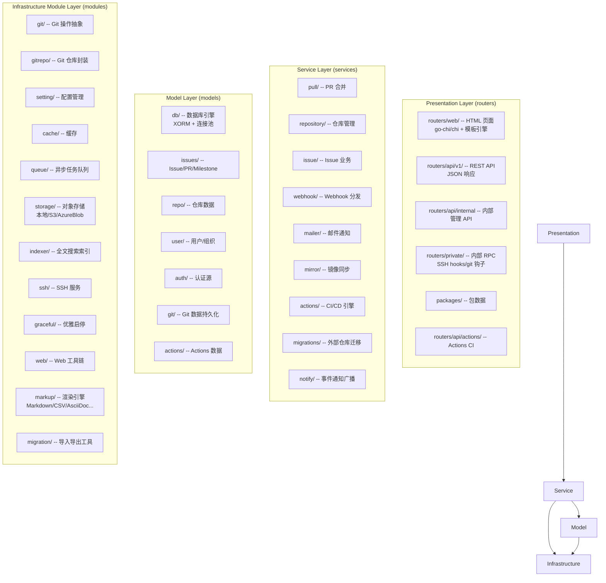

### 1.2 顶层包职责

| 顶层包 | 职责 | 文件数 |
|--------|------|--------|
| `cmd/` | CLI 入口和子命令 (`web`, `admin`, `dump`, `migrate`, `serv` 等) | ~50 |
| `models/` | 数据模型与数据库访问层 (ORM) | ~23 个子包 |
| `modules/` | 基础设施模块 (无业务逻辑) | ~72 个子包 |
| `routers/` | HTTP 路由 + 处理器 (Controller/MVC) | ~15 个子包 |
| `services/` | 核心业务逻辑 (Service 层) | ~42 个子包 |
| `tests/` | 集成测试 + E2E 测试 | |
| `web_src/` | 前端源码 (Vue 3 + Tailwind) | |
| `templates/` | Go HTML 模板 | |
| `build/` | 构建打包脚本 | |
| `docker/` | Docker 镜像构建 | |

---

## 2. 核心模块的设计与实现

### 2.1 配置管理系统 (`modules/setting/`)

Gitea 拥有一个极其强大的配置体系：

- **72 个文件**，每个功能领域一个文件 (`database.go`, `cache.go`, `git.go`, `actions.go`, `mailer.go`...)
- 基于 **INI 配置文件** (类似 Git 风格) + **环境变量覆盖**
- `ConfigProvider` 接口抽象，支持运行时只读保护 (`DisableSaving()`)
- 所有配置通过包级全局变量暴露 (`setting.AppURL`, `setting.SSH.*`)

**关键设计模式**：配置聚合器 (Configuration Aggregator) — 所有子模块在 `init()` 或 `LoadSettings()` 时注入自己的配置段。

### 2.2 Git 操作抽象层 (`modules/git/`)

这是 Gitea 最核心的技术基础设施：

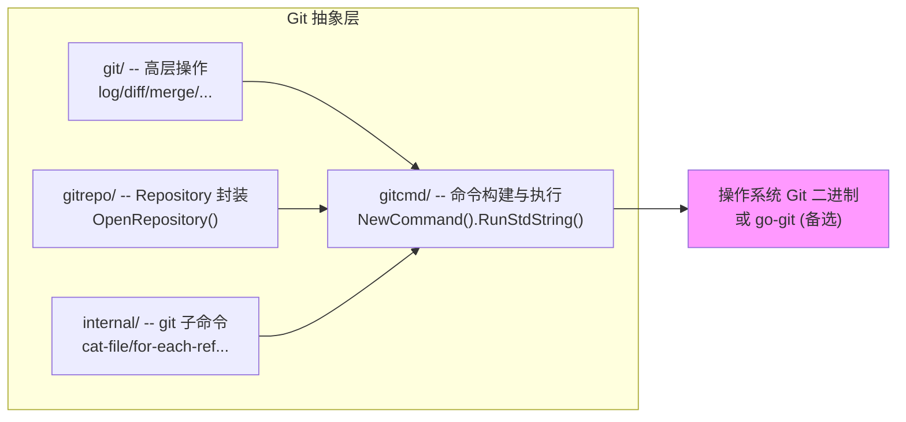

**关键设计点：**
- **双后端支持**：默认使用系统 Git 二进制，也可通过 `gogit` build tag 切换为纯 Go 的 go-git 实现
- 通过 `gitcmd.NewCommand()` 构建安全 Git 命令（防止注入）
- `catfile_batch.go` — 大幅提升大仓库的文件读取性能（批量管道模式）
- `Features` 结构体做版本检测，条件启用新特性（如 SHA-256 仓库支持需 Git >= 2.42）
- `objectformat` 支持 `sha1`/`sha256` 双格式

### 2.3 认证与授权体系

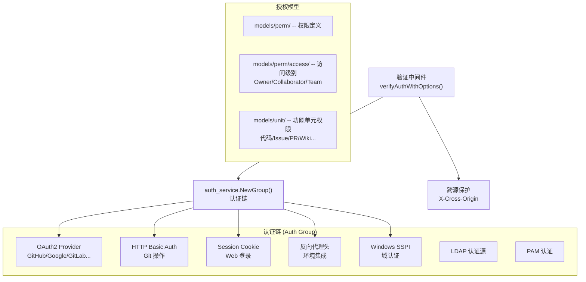

**关键设计**：
- **认证组 (Auth Group)** 模式 — `auth_service.NewGroup()` 将多个认证方式组成链，顺序执行直到某一种成功
- 支持 **OAuth 2.0 + PKCE** 协议（自建 OAuth 服务器），并提供注册扩展机制
- 认证源支持 LDAP、PAM、SMTP、OAuth2 等多种外部源
- 授权粒度到 **功能单元级别** (`unit.Type`)，仓库可独立设置 Issue/PR/Wiki/Packages 等权限

### 2.4 通知与事件系统 (`services/notify/`)

这是 Gitea 最具设计亮点的部分之一：

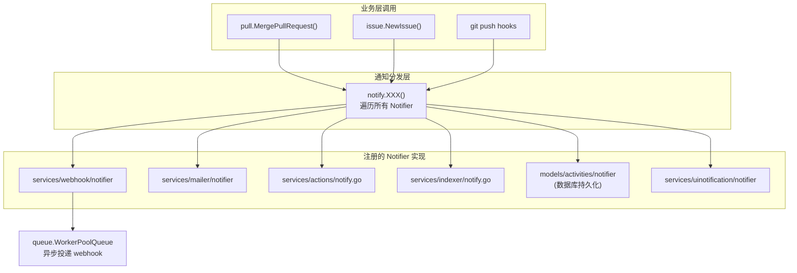

**关键设计模式**：**观察者模式 (Observer Pattern)** — `Notifier` 接口定义了约 40+ 事件方法，各子系统通过 `RegisterNotifier()` 注册自身。当业务事件发生时，`notify.XXX()` 遍历所有注册的 Notifier 并广播事件。

这种模式带来了极佳的**可扩展性**：要添加新的通知渠道（如 Telegram Bot、Slack），只需实现 `Notifier` 接口并调用 `RegisterNotifier()`。

### 2.5 异步队列系统 (`modules/queue/`)

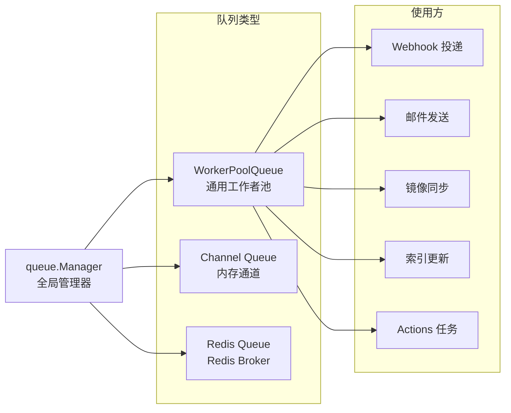

**关键设计**：
- 基于泛型 (`Queue[T]`) 的类型安全队列
- 支持持久化（LevelDB/Redis）和内存两种后端
- `Manager` 管理所有队列的生命周期，提供 `FlushAll()` 用于测试
- 支持动态调整工作者数量 (`SetWorkerMaxNumber()`)
- 与 `graceful` 模块集成，在优雅关闭时确保队列排空

### 2.6 优雅启停系统 (`modules/graceful/`)

这是一个精心设计的状态机：

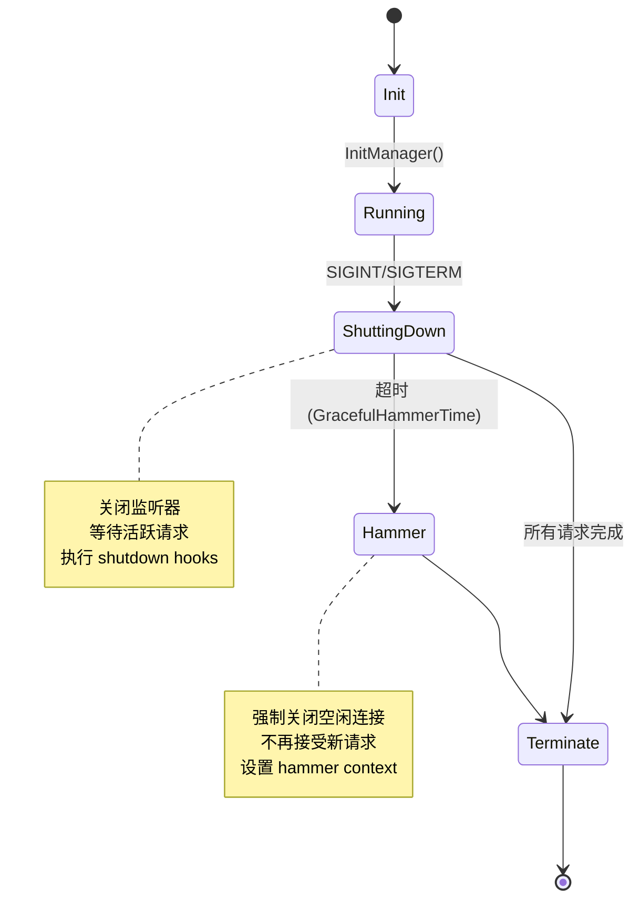

**状态生命周期**：`ShutdownContext` (可正常处理) → `HammerContext` (强制超时) → `TerminateContext` (最终清理)

每个阶段都有对应的 `RunAtShutdown` / `RunAtTerminate` 钩子，所有长时间运行的 goroutine 都应 watch 这些 context。

### 2.7 Pull Request 工作流 (`services/pull/`)

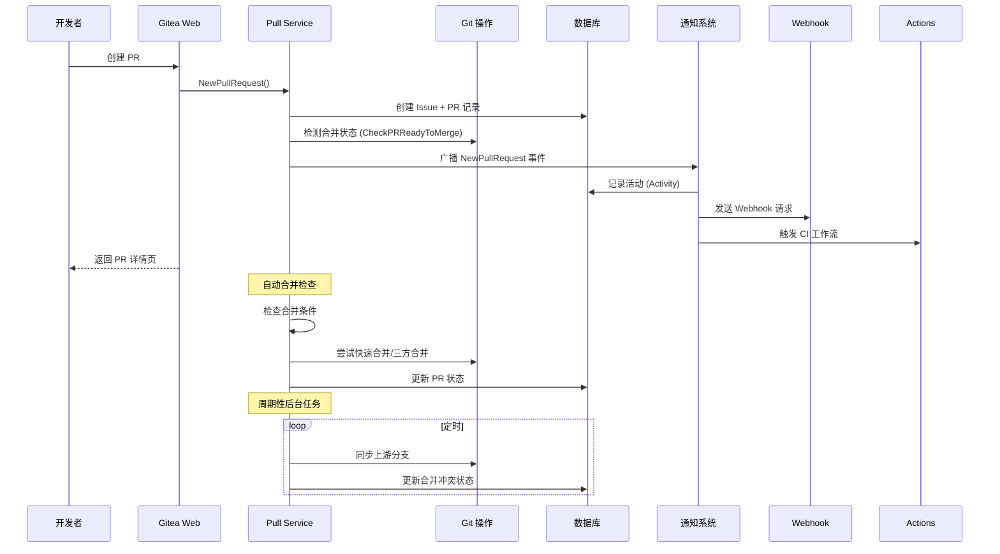

**核心合并策略**：
1. **Fast-forward only** — 仅快进
2. **Merge commit** — 标准三方合并
3. **Squash merge** — 压缩合并
4. **Rebase merge** — 变基合并
5. **Rebase + merge** — 变基后快进

支持 **AGit Flow** (无需 fork 仓库的 PR 流程) 和 **自动合并** (`automerge` 服务)。

### 2.8 Actions CI/CD 系统

Gitea Actions 是与 GitHub Actions **兼容**的 CI/CD 系统：

```mermaid
graph TB
    subgraph "Gitea 服务器端"
        ActionsRouter["routers/api/actions/"]
        ActionsService["services/actions/"]
        ActionsModel["models/actions/"]
    end

    subgraph "Runner (独立进程)"
        Runner["gitea/runner<br/>(Go 守护进程)"]
        Docker["Docker 容器"]
        Runner --> Docker
    end

    ActionsRouter <-->|gRPC (connectrpc)| Runner
    ActionsModel --> ActionsService
    ActionsService --> Notify["通知系统<br/>Job 状态变化"]
```

**关键设计**：
- 使用 **connectrpc** (gRPC 兼容) 作为 Runner 通信协议
- 工作流定义兼容 GitHub Actions YAML 格式
- **Task 执行器** (`modules/actions/`) 处理流水线编排
- 支持 Artifact 上传/下载 API (v0/v4)

### 2.9 包管理系统 (`routers/api/packages/`)

Gitea 内置了多协议包仓库：

| 协议 | 路由前缀 | 用途 |
|------|----------|------|
| Composer | `/api/packages/composer` | PHP 包 |
| Conan | `/api/packages/conan` | C/C++ 包 |
| Container | `/v2` | OCI/Docker 镜像 |
| Go Modules | `/api/packages/go` | Go 模块 |
| Maven | `/api/packages/maven` | Java 包 |
| npm | `/api/packages/npm` | JavaScript 包 |
| PyPI | `/api/packages/pypi` | Python 包 |
| RubyGems | `/api/packages/rubygems` | Ruby 包 |
| NuGet | `/api/packages/nuget` | .NET 包 |

**容器注册表**的 `/v2` 端点必须部署在站点根路径（OCI 规范要求），这是 Gitea 路由设计的精妙之处。

---

## 3. 关键设计模式

| 模式 | 应用位置 | 描述 |
|------|---------|------|
| **分层架构** | 全局 | `routers` → `services` → `models` → `modules` |
| **观察者模式** | `services/notify/` | `Notifier` 接口 + `RegisterNotifier` 注册 |
| **策略模式** | `modules/git/` | git 二进制 / go-git 双后端切换 |
| **工厂方法** | `cmd/` | `cli.Command` 工厂创建子命令 |
| **状态机** | `modules/graceful/` | Init→Running→ShuttingDown→Hammer→Terminate |
| **工作者池** | `modules/queue/` | 泛型 Worker Pool Queue |
| **中间件链** | `routers/web/` | Chi Middleware + Auth Group 链 |
| **组合模式** | `modules/web/` | `Router.Mount()` 嵌套子路由 |
| **适配器模式** | `modules/storage/` | 本地 / S3 / Azure Blob / MinIO 统一接口 |
| **数据映射器** | `models/db/` | XORM → DB Model 映射 |
| **服务定位器** | `modules/setting/` | 全局配置 Provider |
| **模块化 Monorepo** | 项目结构 | `models/` / `modules/` / `services/` 分层 |
| **依赖注入 (手动)** | `routers/init.go` | `mustInit()` 顺序初始化所有子系统 |

---

## 4. 重要设计决策及权衡

### 4.1 双 Git 后端 (系统 Git vs go-git)

**决策**：默认使用操作系统 Git 二进制，提供 `gogit` build tag 切换为纯 Go 实现。

**理由**：
- 系统 Git 经过广泛测试，性能和兼容性最佳
- go-git 提供跨平台一致性，但部分高级功能不支持（如 SHA-256 仓库）
- 构建标签 (build tags) 是 Go 生态的标准做法，用户可自行编译选择

**权衡**：增加维护复杂度（两个后端需分别测试），但提升了部署灵活性。

### 4.2 XORM vs GORM

**决策**：使用 **XORM** 而不是更流行的 GORM。

**理由**：
- 历史原因：Gitea 源自 Gogs，Gogs 早期选择了 XORM
- XORM 对复杂查询更友好（SQL Builder 模式）
- 团队积累了大量的 XORM 实践和工具函数

**权衡**：XORM 社区比 GORM 小，但稳定性经过千万级部署验证。

### 4.3 go-chi/chi vs Gin/标准库

**决策**：使用 **go-chi/chi** 作为 HTTP 路由器。

**理由**：
- 兼容 `net/http` 标准接口（`http.Handler`）
- 中间件链极其灵活
- 零外部依赖（是标准库的增强，不是框架）
- Gitea 在 chi 之上构建了 `modules/web.Router`，增加了路由组、验证等能力

**权衡**：自研路由封装增加学习成本，但提供了更精确的控制。

### 4.4 模块内聚策略

- **`models/`** 只包含数据持久化和简单验证 — **无业务逻辑**
- **`services/`** 包含所有业务逻辑 — 不直接依赖 HTTP 上下文
- **`modules/`** 通用基础设施 — **完全无业务依赖**
- **`routers/`** 薄控制器层 — 只做请求解析/响应的编排

这种严格的分层确保了**可测试性**和**可替换性**。

### 4.5 前端技术栈的变迁

Gitea 经历了前端技术的逐步演进：
- 最初：纯 Go 模板 (`.tmpl`) + jQuery
- 中期：Fomantic UI (Semantic UI fork) + Vue 2 组件
- 当前：**Tailwind CSS** + **Vue 3** + Vite，逐步替换旧模板

这是一个渐进式重构的经典案例，没有"大爆炸"式重写。

---

## 5. 数据流 / 请求处理流程

### 5.1 Web 请求完整生命周期

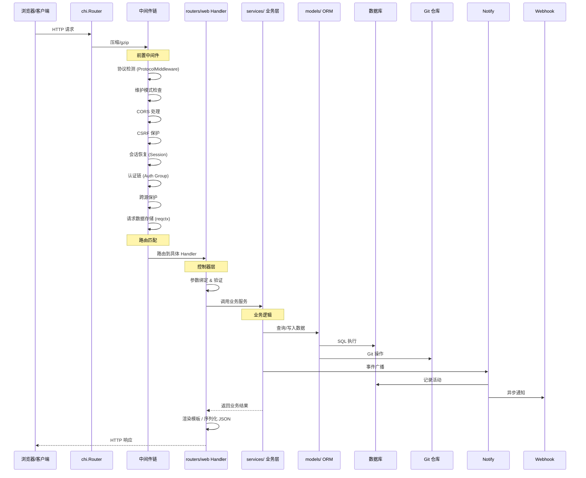

### 5.2 SSH 操作流程

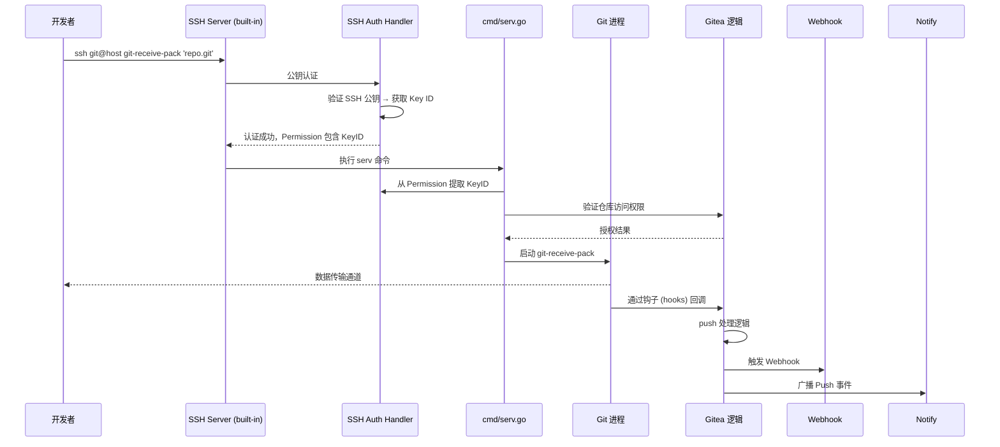

**关键安全设计**：
- SSH `PublicKeyHandler` 只设置 Permission 扩展字段，`sessionHandler` 从连接对象读取已验证的 KeyID
- 防止"双钥匙攻击"（提供两个公钥，一个正确一个错误的情况）

### 5.3 Webhook 投递流程

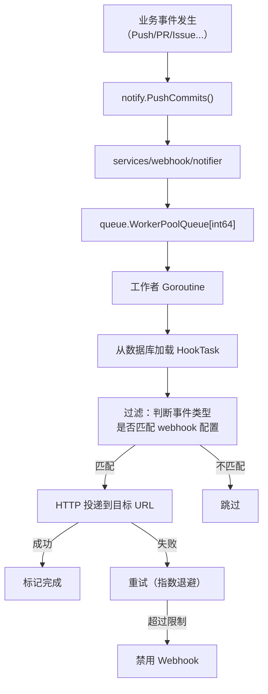

**关键特性**：
- 支持多种 Webhook 类型（Gitea、Slack、Discord、Telegram、Feishu 等）
- 通过 `RegisterWebhookRequester()` 扩展自定义格式化器
- 投递使用独立队列，不阻塞业务请求
- 指数退避重试 + 自动禁用失效 Webhook

---

## 6. 工程化实践

### 6.1 测试体系

Gitea 拥有非常完善的测试分层：

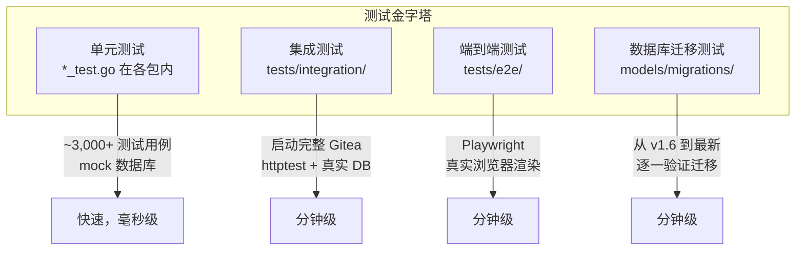

**关键实践**：

- **数据库 Fixtures**：`models/fixtures/` + `models/unittest/` — 测试用 YAML 数据文件
- **集成测试**：`tests/integration/` 启动完整的 `httptest.Server`，使用真实数据库（但不要求单独安装——默认 SQLite）
- **队列 Flush**：`queue.GetManager().FlushAll()` — 同步处理所有异步队列，让测试可预测
- **并行测试安全**：每个集成测试用例命名唯一以防冲突
- **End-to-End 测试**：基于 Playwright + Chromium，测试真实 UI 交互

### 6.2 CI/CD 系统

Gitea 使用 **GitHub Actions** 做 CI，同时是自身 Gitea Actions 产品的"第一个用户"：

| CI 工作流 | 触发条件 | 测试内容 |
|-----------|---------|---------|
| `pull-db-tests.yml` | PR | SQLite + PostgreSQL 后端，含 LDAP 服务和 MinIO 对象存储 |
| `pull-e2e-tests.yml` | PR | Playwright 端到端测试 |
| `pull-docker-dryrun.yml` | PR | Docker 构建验证 |
| `release-tag-version.yml` | Tag 推送 | 发布构建 + 多平台二进制 |
| `release-nightly.yml` | 每日定时 | 开发版构建 |
| `cron-renovate.yml` | 每周 | 依赖更新 |

**数据库测试矩阵**：CI 启动 PostgreSQL 容器 + OpenLDAP + MinIO 作为服务容器，测试完整的多后端兼容性。

### 6.3 代码质量工具

| 工具 | 用途 |
|------|------|
| `golangci-lint` | Go 代码静态分析 |
| `actionlint` | GitHub Actions 工作流语法检查 |
| `misspell` | 拼写检查 |
| `editorconfig-checker` | EditorConfig 合规检查 |
| `eslint` / `stylelint` | 前端代码检查 |
| `markdownlint` | 文档格式检查 |
| `spectral` | API 规范 (OpenAPI) linting |
| `yamllint` | YAML 格式检查 |
| `renovate` | 自动依赖更新 |

### 6.4 构建系统

```makefile
# 关键构建目标
make backend        # 编译后端 (Go)
make frontend       # 编译前端 (Vite + Tailwind)
make build          # 前后端全部构建
make test           # 运行单元测试
make test-integration  # 运行集成测试
make test-e2e       # 运行 E2E 测试
make docker         # Docker 镜像构建
```

**编译标签 (Build Tags)**：
- `sqlite_mattn` — SQLite 支持（需 CGO）
- `pam` — PAM 认证支持（需 CGO）
- `gogit` — 使用 go-git 替代系统 Git
- `bindata` — 将静态资源嵌入二进制
- `oss` — 阿里云 OSS 存储支持

---

## 7. 架构总览总结

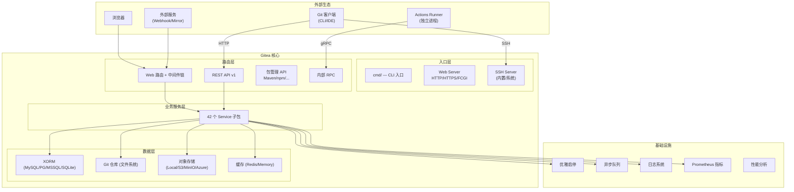

Gitea 的架构展现了一个**成熟、经过大规模生产验证的开源项目**应有的面貌：清晰的分层、合理的抽象、完善的测试和工程实践。它在**功能完整性和代码简洁性之间找到了优秀的平衡点**，这使其成为自托管 Git 服务领域的事实标准。
