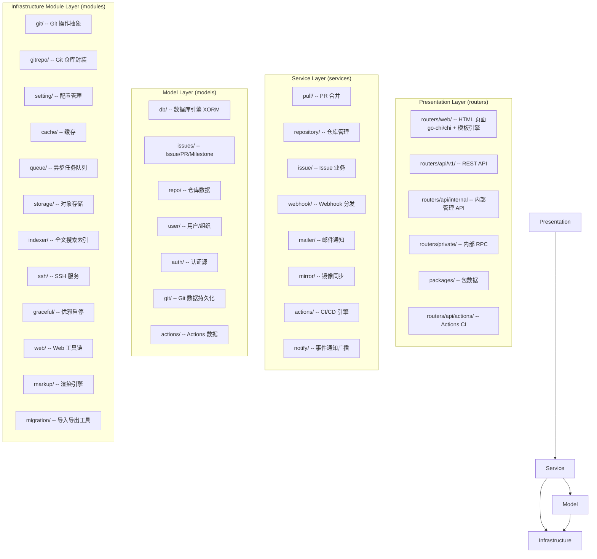
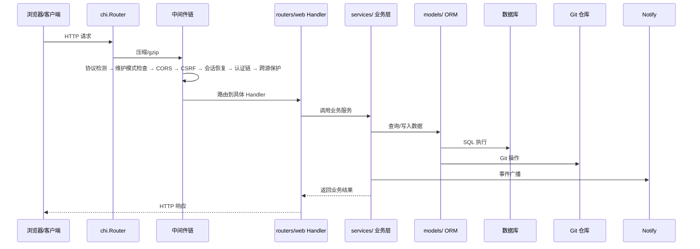

# Gitea 架构分析

> 分析版本：v1.21.0 ｜ 分析日期：2026-05-09

## 1. 项目概览

| 项目 | 信息 |
|------|------|
| 官网 | https://gitea.io |
| GitHub | [go-gitea/gitea](https://github.com/go-gitea/gitea) |
| 编程语言 | Go 1.26 + Vue.js |
| Star 数 | ~48k |
| 许可证 | MIT |
| 核心维护者 | 社区维护 |

**项目简介**

Gitea 是一个轻量级、自托管的 Git 服务，提供类似于 GitHub 的功能（代码托管、Issue 跟踪、Pull Request、CI/CD、包管理等）。它以 Go 编写，性能优异且部署简单，适合个人和小团队使用，也支持大规模企业部署。

## 2. 技术栈

| 类别 | 技术选型 |
|------|----------|
| 编程语言 | Go 1.26 (后端)、Vue 3 + JavaScript (前端) |
| 构建系统 | GNU Make (后端)、pnpm + Vite (前端) |
| 测试框架 | Go testing + testify、Playwright (E2E) |
| CI/CD | GitHub Actions (自身开发使用 Gitea Actions) |
| 存储 | 数据库 (XORM ORM)、Git 仓库 (文件系统)、对象存储 (本地/S3/Azure Blob/MinIO) |
| 通信协议 | HTTP/HTTPS (go-chi/chi)、SSH (内置)、gRPC (connectrpc) |
| 缓存 | Redis / 内存缓存 |
| 队列 | 内存通道 / Redis / LevelDB (WorkerPoolQueue) |
| 模板引擎 | Go 内置 `html/template` |
| 前端工具 | Tailwind CSS、Vue 3、Vite |

## 3. 整体架构

### 架构分层

- **Presentation Layer (routers)**: Web 页面、REST API、内部管理 API、私有 RPC、包管理 API 和 Actions CI API。
- **Service Layer (services)**: 核心业务逻辑（PR 合并、仓库管理、Issue、Webhook、邮件通知、镜像同步、Actions CI/CD、事件通知广播等）。
- **Model Layer (models)**: 数据库访问层，通过 XORM 操作数据。
- **Infrastructure Module Layer (modules)**: 通用基础设施（Git 操作、配置、缓存、队列、存储、索引、SSH、优雅启停等）。

### 模块职责

| 模块 | 职责 | 关键文件/目录 |
|------|------|----------------|
| `cmd/` | CLI 入口和子命令 (`web`, `admin`, `dump`, `migrate`, `serv` 等) | ~50 个文件 |
| `models/` | 数据模型与数据库访问层 | ~23 个子包 |
| `modules/` | 基础设施模块 (无业务逻辑) | ~72 个子包 |
| `routers/` | HTTP 路由 + 处理器 | ~15 个子包 |
| `services/` | 核心业务逻辑 | ~42 个子包 |
| `tests/` | 集成测试 + E2E 测试 | - |
| `web_src/` | 前端源码 (Vue 3 + Tailwind) | - |
| `templates/` | Go HTML 模板 | - |

## 4. 核心模块详解

### 4.1 配置管理系统（`modules/setting/`）

72 个文件，每个功能领域一个文件。基于 INI 配置文件 + 环境变量覆盖。`ConfigProvider` 接口抽象，支持运行时只读保护。所有配置通过包级全局变量暴露。

### 4.2 Git 操作抽象层（`modules/git/`）

**双后端支持**：默认使用系统 Git 二进制，可通过 `gogit` build tag 切换为纯 Go 的 go-git 实现。通过 `gitcmd.NewCommand()` 构建安全 Git 命令（防止注入）。`catfile_batch.go` 大幅提升大仓库的文件读取性能。

### 4.3 认证与授权体系

**认证组 (Auth Group)** 模式 — 将多个认证方式组成链（OAuth2、Basic、Session、ReverseProxy、SSPI、LDAP、PAM），顺序执行直到某一种成功。授权粒度到功能单元级别。

### 4.4 通知与事件系统（`services/notify/`）

**观察者模式** — `Notifier` 接口定义了约 40+ 事件方法，各子系统通过 `RegisterNotifier()` 注册自身。已注册实现包括：Webhook、Mailer、Actions、Indexer、DB、UI。

### 4.5 异步队列系统（`modules/queue/`）

基于泛型 (`Queue[T]`) 的类型安全队列，支持持久化（LevelDB/Redis）和内存两种后端。`Manager` 管理所有队列的生命周期。

> 📖 **[queue 模块深度分析](./queue-module.md)** — 涵盖架构分层、WorkerPoolQueue 生命周期、Handler 重入机制、各后端实现、指数退避、优雅关闭、测试模式及已知限制

### 4.6 优雅启停系统（`modules/graceful/`）

状态生命周期：`Init → Running → ShuttingDown → Hammer → Terminate`。`ShutdownContext` (可正常处理) → `HammerContext` (强制超时) → `TerminateContext` (最终清理)。

### 4.7 Pull Request 工作流（`services/pull/`）

5 种合并策略：Fast-forward only、Merge commit、Squash merge、Rebase merge、Rebase + merge。支持 AGit Flow 和自动合并。

### 4.8 Actions CI/CD 系统

使用 **connectrpc** (gRPC 兼容) 作为 Runner 通信协议。工作流定义兼容 GitHub Actions YAML 格式。支持 Artifact 上传/下载。

### 4.9 包管理系统

支持 10+ 种包协议：Composer、Conan、Container (OCI/Docker)、Go Modules、Maven、npm、PyPI、RubyGems、NuGet 等。

## 5. 关键设计决策

| 决策 | 选择 | 替代方案 | 理由 |
|------|------|----------|------|
| 双 Git 后端 | 默认系统 Git 二进制 + gogit 备选 | 仅使用一种 | 系统 Git 性能最佳；go-git 提供跨平台一致性 |
| ORM 选择 | XORM | GORM 等 | 历史原因（源自 Gogs），对复杂查询更友好 |
| Web 框架 | go-chi/chi | Gin、标准库 | 兼容 `net/http`，中间件链灵活，零外部依赖 |
| 模块内聚策略 | 严格分层（routers→services→models→modules） | 混合分层 | 保证可测试性和可替换性 |
| 前端技术栈 | 渐进式迁移到 Tailwind CSS + Vue 3 + Vite | 一次性重写 | 渐进式重构降低风险 |

## 6. 数据流 / 请求流

## 7. 设计模式

| 模式名称 | 使用位置 | 目的 |
|----------|----------|------|
| 分层架构 | 全局 | `routers` → `services` → `models` → `modules` |
| 观察者模式 | `services/notify/` | `Notifier` 接口 + `RegisterNotifier` 注册 |
| 策略模式 | `modules/git/` | git 二进制 / go-git 双后端切换 |
| 状态机 | `modules/graceful/` | Init→Running→ShuttingDown→Hammer→Terminate |
| 工作者池 | `modules/queue/` | 泛型 Worker Pool Queue |
| 中间件链 | `routers/web/` | Chi Middleware + Auth Group 链 |
| 适配器模式 | `modules/storage/` | 本地 / S3 / Azure Blob / MinIO 统一接口 |
| 数据映射器 | `models/db/` | XORM → DB Model 映射 |

## 8. 工程实践

### 测试策略

- **单元测试**：~3,000+ 测试用例（*_test.go 在各包内），mock 数据库，快速毫秒级
- **集成测试**：`tests/integration/` 启动完整 httptest.Server，使用真实数据库（默认 SQLite）
- **E2E 测试**：Playwright + Chromium
- **数据库迁移测试**：`models/migrations/` 从 v1.6 到最新逐一验证
- **关键实践**：数据库 Fixtures（YAML 数据文件）、队列 Flush 机制、并行测试安全

### CI/CD 系统

| 工作流 | 触发条件 | 测试内容 |
|-----------|---------|---------|
| `pull-db-tests.yml` | PR | SQLite + PostgreSQL + LDAP + MinIO |
| `pull-e2e-tests.yml` | PR | Playwright 端到端测试 |
| `release-tag-version.yml` | Tag | 多平台二进制发布 |
| `release-nightly.yml` | 每日 | 开发版构建 |

### 版本管理

构建标签支持多种部署场景：`sqlite_mattn`（SQLite）、`pam`（PAM 认证）、`gogit`（纯 Go Git）、`bindata`（资源嵌入）、`oss`（阿里云 OSS）。关键构建目标：`make backend`、`make frontend`、`make build`、`make test`、`make docker`。

## 9. 总结与评价

### 亮点

- **成熟的分层架构**：`routers` → `services` → `models` → `modules` 严格分离关注点
- **丰富的模块设计**：覆盖 Git 操作、认证授权、通知系统、异步队列、优雅启停、PR 工作流、Actions CI/CD、包管理等
- **优秀的测试体系**：从单元测试到 E2E 测试层层覆盖
- **完善的工程化实践**：CI/CD 流程、代码质量工具链、构建标签支持多种部署场景

### 可改进之处

- **前端技术栈仍在过渡中**：从旧模板 + jQuery 逐步迁移到 Vue 3 + Tailwind
- **代码库规模较大**：~2,900 个 `.go` 文件，约 46 万行 Go 代码，新贡献者入门门槛较高
- **XORM 社区较小**：相比于 GORM 等主流 ORM，文档和生态资源较少

## 参考

本文分析基于 Gitea 开源代码仓库（https://github.com/go-gitea/gitea）及其文档。
