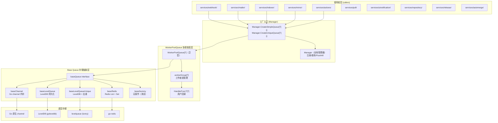
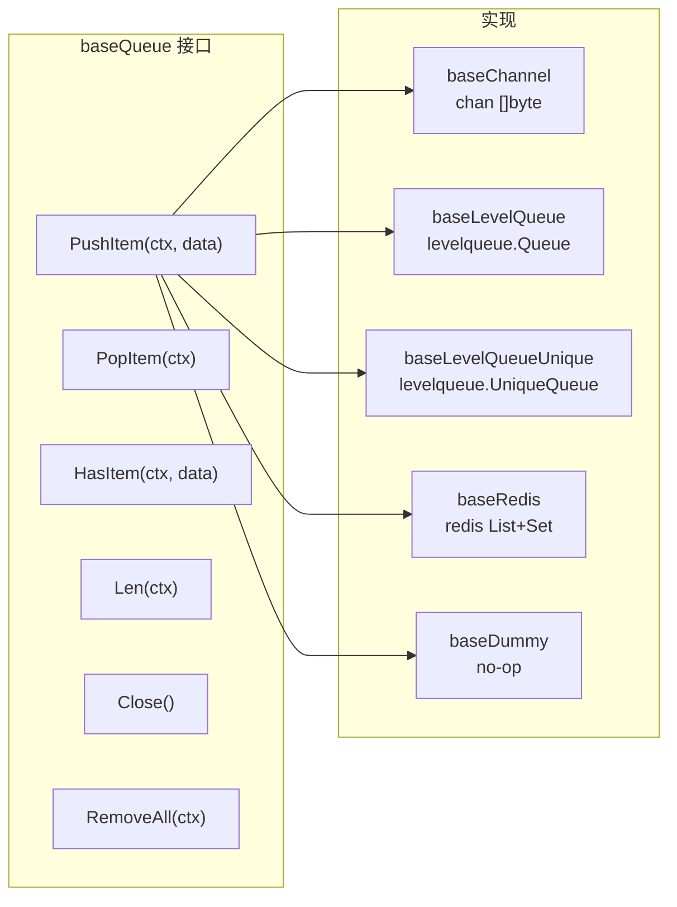
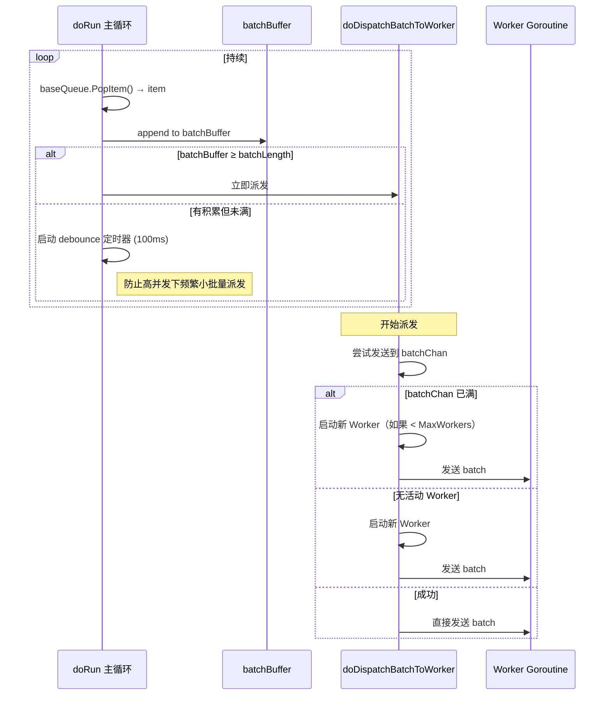
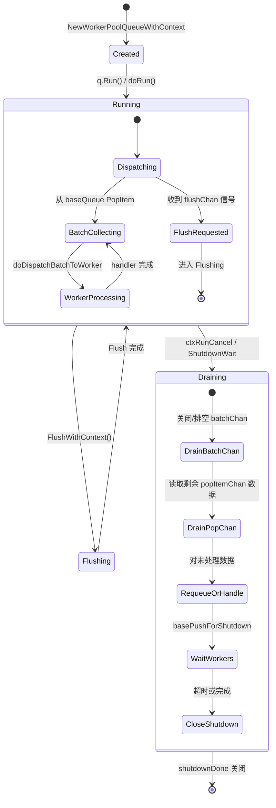
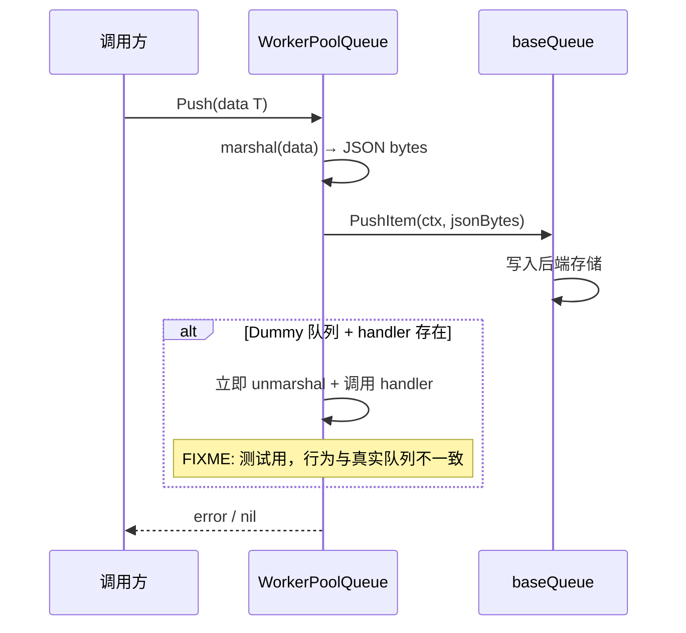
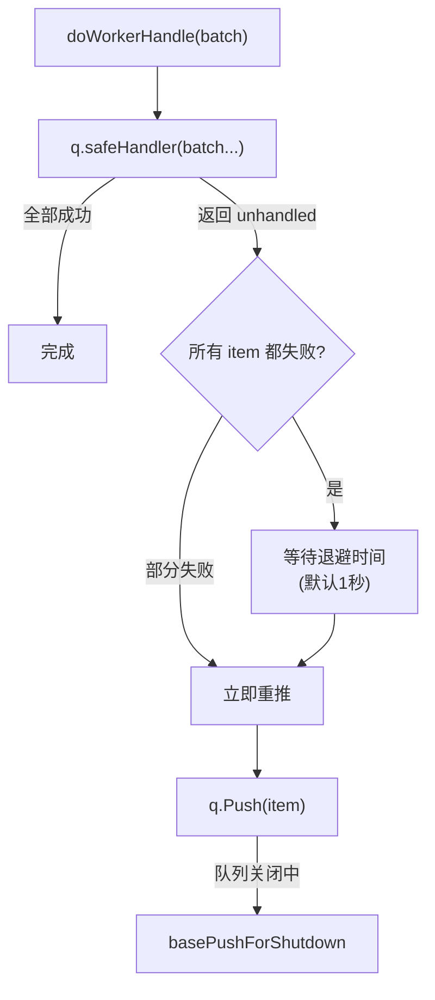
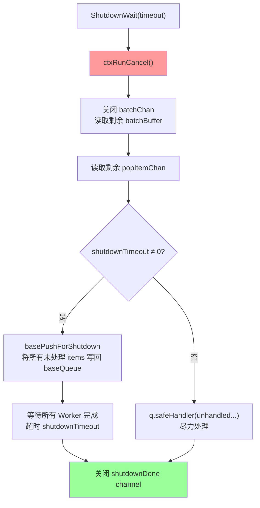
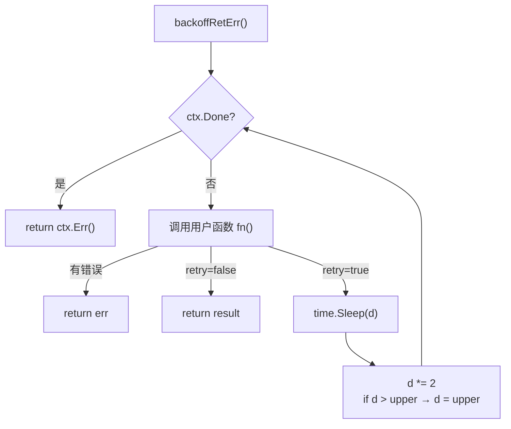
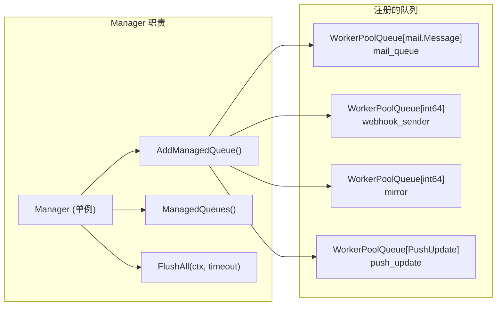
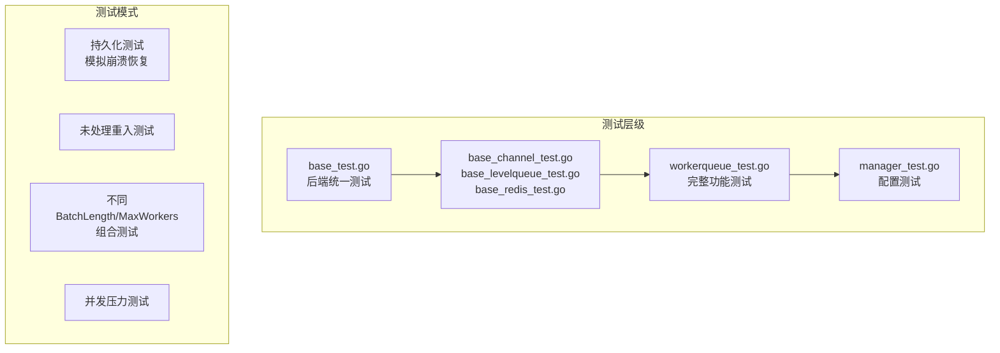

# Gitea queue 模块深度分析

> 分析日期：2026-05-09 | 基于 `modules/queue/` 源码 v1.21.0+

## 0. 概述

Gitea 的 `modules/queue/` 包是一个**通用化、类型安全、可插拔存储后端的异步任务队列系统**。它是 Gitea 所有后台异步处理（Webhook 投递、邮件发送、索引更新、镜像同步、Actions 调度等）的核心基础设施。

| 维度 | 详情 |
|------|------|
| **包路径** | `code.gitea.io/gitea/modules/queue` |
| **文件数** | 22 个文件（含 5 个测试文件） |
| **核心接口** | `baseQueue`, `HandlerFuncT[T]`, `ManagedWorkerPoolQueue` |
| **核心结构** | `WorkerPoolQueue[T]`（泛型工作者池） |
| **存储后端** | Channel（内存）/ LevelDB（本地持久化）/ Redis（集群） / Dummy（测试） |
| **运行模式** | Simple（简单） / Unique（去重） |
| **配置驱动** | INI 配置 → `setting.QueueSettings` |

---

## 1. 整体架构

### 1.1 分层设计



### 1.2 包内文件职责

| 文件 | 职责 |
|------|------|
| `queue.go` | 包文档（godoc）、类型别名 `HandlerFuncT[T]`、错误定义 `ErrAlreadyInQueue` |
| `base.go` | `baseQueue` 接口定义、`popItemByChan()` 辅助函数 |
| `workerqueue.go` | `WorkerPoolQueue[T]` 核心实现：创建、Push、Run、Shutdown |
| `workergroup.go` | 工作者管理、批量化分发、Flush、安全处理、退避重入 |
| `manager.go` | `Manager` 全局管理器、工厂函数 `CreateSimpleQueue`/`CreateUniqueQueue` |
| `config.go` | `BaseConfig` 配置结构、`toBaseConfig()` 转换 |
| `backoff.go` | 指数退避通用工具 `backoffRetErr`/`backoffErr` |
| `base_channel.go` | 内存 Channel 后端实现 |
| `base_dummy.go` | Dummy 后端（无操作，用于测试/无 handler 场景） |
| `base_levelqueue.go` | LevelDB 简单队列后端 |
| `base_levelqueue_unique.go` | LevelDB 去重队列后端 |
| `base_levelqueue_common.go` | LevelDB 通用实现（共享 PushItem/PopItem） |
| `base_redis.go` | Redis 后端实现（List + Set 去重） |
| `workerqueue_test.go` | WorkerPoolQueue 综合测试（持久化、去重、未处理重入） |
| `manager_test.go` | 管理器测试（配置继承、队列查询） |
| `base_test.go` | 所有 BaseQueue 实现的统一测试套件 |
| `base_channel_test.go` | Channel 专项测试 |
| `base_levelqueue_test.go` | LevelDB 专项测试 |
| `base_redis_test.go` | Redis 专项测试 |
| `testhelper.go` | `testRecorder` — 异步测试的状态记录工具 |
| `lqinternal/` | LevelDB 内部工具包 |

---

## 2. 核心设计

### 2.1 类型安全设计 — Go 泛型

`WorkerPoolQueue[T any]` 是 Go 1.18+ 泛型的典范应用。整个队列系统是**类型参数化**的：

```go
// 创建字符串类型队列
mailQueue = queue.CreateSimpleQueue[*sender_service.Message](
    ctx, "mail", handler,
)

// 创建 int64 类型队列
hookQueue = queue.CreateUniqueQueue[int64](
    ctx, "webhook_sender", handler,
)
```

这意味着：
- **编译时类型检查** — 不可能将错误类型推入队列
- **无类型断言开销** — handler 直接操作具体类型
- **代码生成零成本** — Go 泛型在编译时单态化

### 2.2 双层抽象 — Base Queue 策略模式



**关键设计点**：

- **`baseQueue` 接口** 是存储后端的**统一契约**，所有存储差异被隔离在这个接口之后
- `WorkerPoolQueue` **只依赖接口**，不关心具体存储实现
- 后端类型通过配置字符串 `"channel"` / `"level"` / `"redis"` / `"dummy"` 选择
- 在后端发生未处理错误（如 Redis 连接断开）时，仅影响该队列，不会级联

### 2.3 去重队列 (Unique Queue)

去重队列在 Simple 队列基础上增加了 **`HasItem` 能力**：

| 后端 | 去重实现 |
|------|---------|
| Channel | `container.Set[string]` + `sync.Mutex` |
| LevelDB | `levelqueue.UniqueQueue`（独立 "set" 键空间） |
| Redis | Redis `Set` 数据结构（`SAdd` / `SIsMember`） |

**设计权衡**：
- 文档明确说明 `Has` 检查**不是 100% 可靠**（缺乏事务支持）
- Redis 场景中：`Set` 和 `List` 的写入不是原子操作，可能出现"set 成功但 list 失败"的窗口
- 设计哲学：**允许极少量的重复，优于丢失任务**

### 2.4 批量处理 (Batch)

```go
q.batchLength = queueSetting.BatchLength  // 默认值 20
```

核心设计：

```
数据流：
  PopItem(单条) → batchBuffer(累积) → batchChan(批量分发) → worker(批量处理)
                                  ↑
                           debounce 100ms 或 达到 batchLength
```

**优势**：
- 减少 handler 调用次数（例如：一次处理 20 个 Webhook 的日志批量写入）
- 降低锁竞争（单次调用处理多个任务）
- 批量和单条使用同一 handler 签名 `HandlerFuncT[T]`——handler 始终接收 `...T` 变参

**批量化架构**：



---

## 3. WorkerPoolQueue 完整生命周期

### 3.1 状态机



### 3.2 主循环 (doRun)

`doRun()` 是 WorkerPoolQueue 的核心事件循环，使用单个 goroutine 运行（**单消费者模型**），它的 select 围绕 5 个通道：

```go
for {
    select {
    case flush := <-q.flushChan:     // 1. Flush 请求
        q.doDispatchBatchToWorker(wg, skipFlushChan)
        q.doFlush(wg, flush)
    case <-q.ctxRun.Done():          // 2. 关闭信号
        return
    case data := <-wg.popItemChan:   // 3. 从 baseQueue 取出新 item
        // 累积到 batchBuffer
    case <-batchDispatchC:           // 4. debounce 定时触发
        // 派发累积的 batch
    case err := <-wg.popItemErr:     // 5. baseQueue 错误
    }
}
```

**设计原则**：**单点串行化** — 所有状态变更（Push/Pop/Flush/Shutdown）由 doRun 一个 goroutine 协调，避免了复杂的锁竞争。

### 3.3 Push 路径



Push 可以有一定时间的阻塞（`pushBlockTime = 5s`），超过则返回 `context.DeadlineExceeded`。

### 3.4 Handler 重入机制

当 handler 返回未处理 items 时，这些 items 会被**重新推入队列**：



**关键考量**：
- 当所有 items 都被退回时，表示 handler 遇到**系统性故障**（如索引器不可用）
- 这时不是立即重试，而是等待退避时间（`unhandledItemRequeueDuration`，默认 1 秒），防止"死循环轰炸"
- 在 Flush 模式下，不会重推未处理 items（因为 Flush 是测试用，重推会被视为丢失）

### 3.5 优雅关闭路径



**设计权衡**：
- `shutdownTimeout` 为 0 时跳过重推 — 用于测试场景或快速关闭
- 默认超时 2 秒（`shutdownDefaultTimeout`）
- 未处理 items 写入 baseQueue 时使用独立 context（不受 ctxRunCancel 影响）
- **"至少一次"语义** — 即使进程崩溃，重启后 items 从 baseQueue 恢复

---

## 4. 存储后端实现详析

### 4.1 Channel 队列 (`baseChannel`)

```go
type baseChannel struct {
    c        chan []byte
    set      container.Set[string]
    mu       sync.Mutex
    isUnique bool
}
```

| 特性 | 说明 |
|------|------|
| **容量** | 构造时指定（`cfg.Length`） |
| **去重** | 额外的 `Set[string]` + Mutex，Push 时检查、Pop 时删除 |
| **适用场景** | 单进程、测试、对持久性无要求的任务 |
| **限制** | 进程重启后队列丢失；最大长度固定 |

### 4.2 LevelDB 队列 (`baseLevelQueue` / `baseLevelQueueUnique`)

```
数据目录: {AppDataPath}/queues/{name}/
数据库文件: *.ldb (goleveldb)
键空间:
  简单队列: {QueueFullName} → levelqueue.Queue
  去重队列: {QueueFullName} → levelqueue.Queue
            {SetFullName}   → levelqueue.UniqueQueue 的去重 Set
```

| 特性 | 说明 |
|------|------|
| **持久化** | 写入磁盘，进程重启后恢复 |
| **原子 CAS** | LevelDB 支持原子读写 |
| **去重可靠** | UniqueQueue 使用独立键空间记录已存在 items |
| **适用场景** | 单实例部署、生产环境默认选择 |
| **共享连接** | 通过 `nosql.GetManager().GetLevelDB(conn)` 复用连接 |
| **RemoveAll** | 删除键空间 + 重建新队列（原子指针交换） |

### 4.3 Redis 队列 (`baseRedis`)

```
数据结构:
  List: {QueueFullName} → Redis List (用作 FIFO)
  Set:  {SetFullName}   → Redis Set (去重)
操作:
  入队: RPUSH list + SADD set
  出队: LPOP list + SREM set
```

| 特性 | 说明 |
|------|------|
| **可集群** | 多 Gitea 实例共享同一队列 |
| **持久化** | 依赖 Redis RDB/AOF |
| **去重** | `SADD` 返回值判断是否为新增 |
| **适用场景** | 高可用部署、多副本 Gitea |
| **连接** | 启动时最大重试 10 次（每次 1 秒） |
| **线程安全** | 使用本地 `sync.Mutex` 保护 List + Set 一致性 |

**Redis Push 退避逻辑**：
```go
// 伪代码
PushItem(ctx, data):
    backoff:
        if LLEN(queue) >= cfg.Length → retry=true (队列满，等待)
        if isUnique && SADD(set, data) == 0 → return ErrAlreadyInQueue
        RPUSH(queue, data) → return nil
```

### 4.4 Dummy 队列 (`baseDummy`)

```go
type baseDummy struct{}
func (q *baseDummy) PushItem(ctx context.Context, data []byte) error { return nil }
func (q *baseDummy) PopItem(ctx context.Context) ([]byte, error)     { return nil, nil }
```

| 特性 | 说明 |
|------|------|
| **用途** | 测试、无 handler 场景（如功能禁用时） |
| **行为** | Push 静默丢弃、Pop 永远返回 nil |
| **特殊处理** | 如果 handler 存在，Push 会同步调用 handler |

> ⚠️ **注意**：代码中有一个 `FIXME` 注释指出 Dummy 队列在测试中可能导致"伪通过"——因为它是同步执行的，与真实队列的异步行为不同。

---

## 5. 配置系统

### 5.1 配置结构

```go
type QueueSettings struct {
    Type    string // "dummy" | "channel" | "level" | "redis"
    Datadir string // LevelDB 数据目录 (相对 AppDataPath)
    ConnStr string // Redis 连接串 / LevelDB 连接串
    Length  int    // 最大队列长度（默认 100000）
    
    QueueName, SetName string // 存储键名后缀
    BatchLength int // 批次大小（默认 20）
    MaxWorkers  int // 最大工作者数（默认 max(1, min(NumCPU/2, 10))）
}
```

### 5.2 配置继承

```ini
[queue]
TYPE = channel          ; 全局默认
DATADIR = queues/dir1
LENGTH = 100
BATCH_LENGTH = 20

[queue.mirror]          ; 覆盖特定队列
TYPE = level
LENGTH = 102
BATCH_LENGTH = 22
```

每个队列名对应 `[queue.{name}]` 段，未设置的字段从 `[queue]` 继承。

### 5.3 配置到队列的映射

```
QueueFullName = managedName + QueueName       // 例如: "mail_queue"
SetFullName   = managedName + QueueName + SetName  // 例如: "mail_queue_unique"
```

---

## 6. 指数退避 (backoff)

通用退避工具，被所有 baseQueue 实现使用：

```go
func backoffErr(ctx, begin=50ms, upper=2s, end, fn) error
func backoffRetErr[T](ctx, begin=50ms, upper=2s, end, fn) (T, error)
```



**使用场景**：
- Channel Push 队列满时重试
- LevelDB Push 队列满时重试
- Redis Push/Pop 在 Redis 返回临时错误时重试
- 退避时间在 `50ms ~ 2s` 之间，最大等待 `pushBlockTime (5s)`

---

## 7. 全局管理器 (Manager)



**`FlushAll` 的设计取舍**：
- **仅用于测试**（文档明确声明）
- 逐一遍历所有注册队列调用 `FlushWithContext`
- 不适用于集群环境（只能清空当前实例的队列）

---

## 8. 工程化与测试

### 8.1 测试架构



**关键测试工具**：

1. **`testRecorder`** — 异步测试状态记录器
   ```go
   testRecorder.Record("push:%v", i)     // 记录事件
   testRecorder.Records()                // 获取有序事件列表
   testRecorder.Reset()                  // 重置
   ```

2. **`runWorkerPoolQueue(q)`** — 辅助函数
   ```go
   stop := runWorkerPoolQueue(q)
   // ... 测试逻辑 ...
   stop()  // ShutdownWait(1s)
   ```

3. **`mockBackoffDuration(d)`** — 将退避时间固定为 d（加速测试）

### 8.2 测试场景示例

**未处理重入测试** (`TestWorkerPoolQueueUnhandled`)：
```go
// handler 让奇数 item 通过，偶数 item 返回"未处理"
handler := func(items ...int) (unhandled []int) {
    for _, item := range items {
        if item%2 == 0 && m[item] == 0 {
            unhandled = append(unhandled, item)  // 偶数第一次返回未处理
        }
        m[item]++
    }
    return unhandled
}
// 验证：每个奇数处理 1 次，每个偶数处理 2 次
```

**持久化测试** (`testWorkerPoolQueuePersistence`)：
```go
// 1. 创建队列 → 推入任务 → 处理到"task-20"时关闭
// 2. 用同一配置重建队列 → 验证剩余任务被恢复
// 3. 验证所有 100 个任务都被处理，无重复、无丢失
```

### 8.3 已知限制与 FIXME

代码中有多处 `FIXME`/`TODO` 注释反映了设计上的权衡：

1. **Dummy 队列同步行为** (`FIXME` in `workerqueue.go`)
   ```
   the "immediate" queue is only for testing, but it really causes problems
   because its behavior is different from a real queue.
   ```
   
2. **Worker 竞争条件** (`TODO` in `workergroup.go`)
   ```
   the logic could be improved in the future, to avoid a data-race 
   between "doStartNewWorker" and "workerNum"
   ```

3. **handler 无 context** (`FIXME` in `workerqueue.go`)
   ```
   there is no ctx support in the handler, so process manager is unable 
   to restore the labels
   ```

4. **sleep 阻塞 Worker** (`TODO` in `workergroup.go`)
   ```
   ideally it shouldn't "sleep" here (blocks the worker, then blocks flush)
   ```

---

## 9. 真实使用场景一览

| 队列名 | 类型 | 用途 |
|--------|------|------|
| `issue_indexer` | Unique | Issue 全文搜索索引更新 |
| `code_indexer` | Unique | 代码搜索索引更新 |
| `repo_stats_update` | Unique | 仓库统计信息更新 |
| `task` | Simple | 后台任务调度 |
| `actions_ready_job` | Unique | Actions 工作就绪 Job 调度 |
| `mail` | Simple | 异步邮件发送 |
| `mirror` | Unique | 镜像仓库同步 |
| `webhook_sender` | Unique | Webhook HTTP 投递 |
| `branch_sync` | Unique | 分支同步操作 |
| `push_update` | Simple | Push 事件后处理 |
| `repo-archive` | Unique | 仓库归档生成 |
| `pr_patch_checker` | Unique | PR Patch 检测 |
| `tag_sync` | Unique | Tag 同步 |
| `pr_auto_merge` | Unique | PR 自动合并 |
| `notification-service` | Simple | 用户 UI 通知 |
| `repo_license_updater` | Unique | 仓库许可证检测更新 |

每个队列默认配置为 **LevelDB 后端**（单实例持久化），集群场景通过配置切换到 **Redis**。

---

## 10. 设计的优势与不足

### 优势

1. **类型安全** — Go 泛型让 queue 模块能在编译时捕获类型错误
2. **存储可插拔** — `baseQueue` 接口让后端切换对上层透明
3. **优雅关闭** — 三阶段关闭（drain → requeue → terminate）保证"至少一次处理"
4. **批量高效** — debounce + batch 机制减少 handler 调用频率
5. **错误隔离** — 单个队列的 panic 通过 `recover` 隔离，不影响主进程
6. **测试完备** — 统一的 base_test + 持久化测试 + 并发测试
7. **配置驱动** — 队列参数通过 INI 配置，无需重新编译

### 不足 / 改进空间

1. **handler 无 context** — 当前 handler 没有 context 参数，无法感知取消或设置超时
2. **Worker 启动竞态** — 文档承认 workerNum 和 doStartNewWorker 之间存在竞态条件
3. **Flush 仅限测试** — `FlushAll` 不可用于生产集群，缺乏分布式清空支持
4. **部分 sleep 阻塞** — 全失败时的 `time.Sleep` 会阻塞整个 worker，影响 flush
5. **Dummy 行为混淆** — Dummy 队列的同步行为可能导致测试"假通过"
6. **JSON 编解码开销** — item 的 marshal/unmarshal 使用 `encoding/json`，在大流量场景可能成为瓶颈
7. **按类型隔离** — 每个 `WorkerPoolQueue[T]` 只处理一种类型，交叉类型任务需要额外编排

---

## 11. 总结

Gitea 的 `modules/queue/` 是一个设计精良的通用异步队列库，其核心价值在于：

> **"正确优于极致性能，可测试性优先于简化实现"**

- 采用了**策略模式**（可插拔后端）+ **工厂模式**（Manager 创建）+ **泛型**（类型安全）的组合
- `doRun` 单 goroutine 事件循环配合 worker pool 多点消费的设计，在简单性和并发性之间取得了平衡
- 完善的优雅关闭机制确保了生产环境的可靠性
- 清晰的文档（`queue.go` 的 godoc）和完备的测试使维护成本降低

它是 Gitea 这样的单体应用中处理"后台异步任务"的标杆实现。
