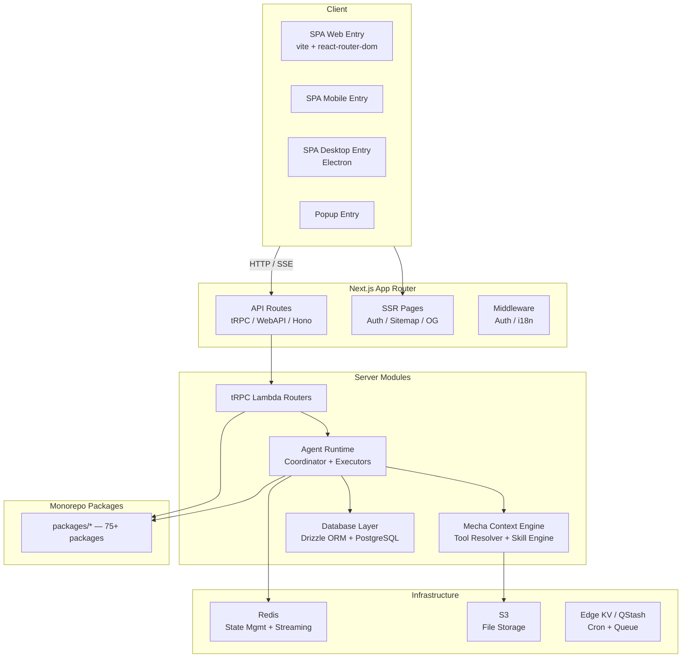
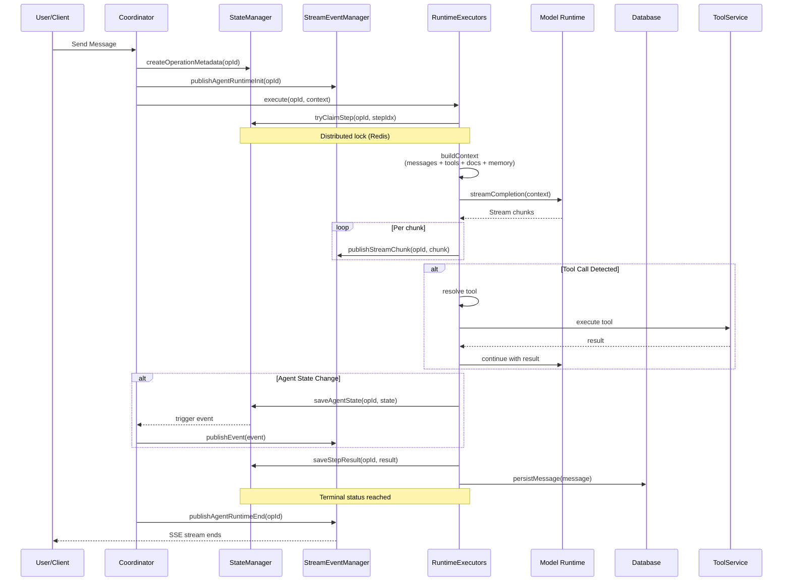
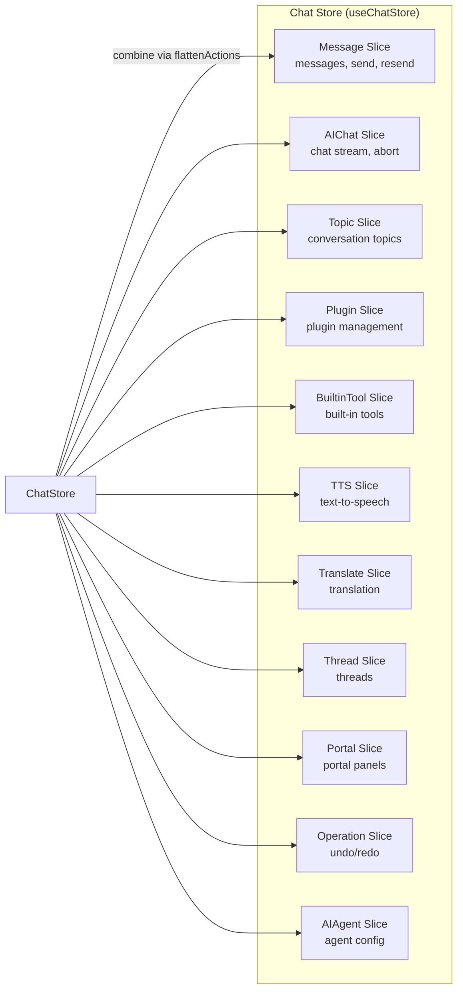
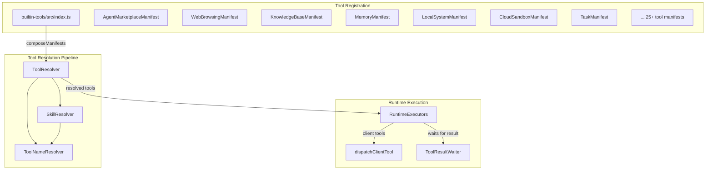
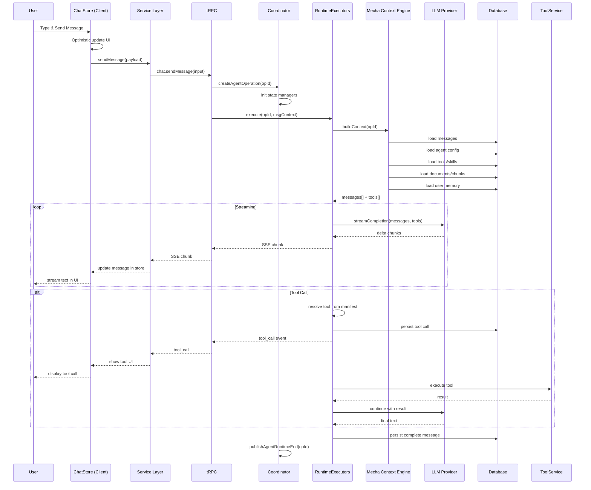
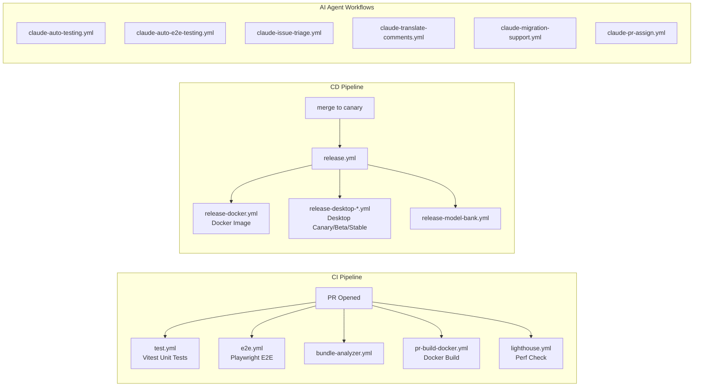

# 🏗️ LobeChat 架构深度分析

> **项目**: LobeHub / LobeChat v2.1.56
> **定位**: 开源、全面的 AI Agent 框架，支持语音合成、多模态及可扩展的 Function Call 插件系统
> **技术栈**: Next.js 16 + React 19 + TypeScript · pnpm monorepo · zustand · tRPC · Drizzle ORM · PostgreSQL

---

## 一、项目整体架构与模块划分

### 1.1 顶层架构概览

LobeChat 采用 **Hybrid SPA + SSR** 双渲染架构——核心 UI 是运行在 Vite 上的 SPA（支持 Web/Mobile/Desktop/Popup 四种入口），但通过 Next.js 的 App Router 提供 SSR 页面（认证、Sitemap、OG）和全量 API 后端。



### 1.2 目录结构核心里程碑

```
lobehub/
├── src/                          # 主应用源码
│   ├── app/(backend)/            # Next.js 后端路由
│   │   ├── api/                  # Web API 路由
│   │   ├── trpc/                 # tRPC HTTP 处理器
│   │   ├── webapi/               # 其他 HTTP API
│   │   └── oidc/                 # OIDC 认证
│   ├── routes/                   # SPA 页面组件
│   │   ├── (main)/               # 桌面端页面
│   │   ├── (mobile)/             # 移动端页面
│   │   ├── (desktop)/            # 桌面专属页面
│   │   ├── (popup)/              # 弹窗页面
│   │   ├── onboarding/           # 引导页面
│   │   └── share/                # 分享页面
│   ├── spa/                      # SPA 入口 + 路由配置
│   ├── features/                 # 业务组件（按领域组织）
│   ├── store/                    # Zustand 状态管理
│   ├── services/                 # 客户端服务层
│   ├── server/                   # 服务端模块
│   │   ├── modules/              # 核心服务端模块
│   │   │   ├── AgentRuntime/     # Agent 运行时
│   │   │   ├── Mecha/            # Context Engineering
│   │   │   └── ...
│   │   ├── routers/lambda/       # tRPC 服务端路由
│   │   └── services/             # 服务端业务服务
│   ├── components/               # 基础 UI 组件
│   ├── hooks/                    # 共享 React Hooks
│   ├── libs/                     # 基础设施库
│   └── config/                   # 应用配置
│
├── packages/                     # 75+ monorepo 共享包
│   ├── agent-runtime/            # 通用 Agent 运行时抽象
│   ├── agent-gateway-client/     # Agent Gateway 客户端
│   ├── database/                 # Drizzle ORM schema + repositories
│   ├── builtin-tools/            # 内置工具注册中心
│   ├── builtin-tool-*/           # 各内置工具实现
│   ├── model-runtime/            # LLM 模型运行时抽象
│   ├── context-engine/           # 上下文工程 + Tool Resolver
│   ├── conversation-flow/        # 对话流 DSL 解析器
│   ├── prompts/                  # Prompt 模板
│   └── ...
│
├── apps/                         # 独立应用
│   ├── desktop/                  # Electron 桌面应用
│   ├── cli/                      # CLI 工具
│   └── device-gateway/           # 设备网关
│
├── tests/                        # 测试基础设施
├── e2e/                          # Cucumber + Playwright E2E
├── docker-compose/               # Docker 编排配置
└── scripts/                      # 工程化脚本
```

---

## 二、核心模块的设计与实现

### 2.1 Agent 运行时系统（核心引擎）

这是 LobeChat 最核心的模块，位于 `src/server/modules/AgentRuntime/`。它实现了 **Operation-based Agent 执行模型**——每次用户请求或 Agent 操作都创建一个独立的 `operationId`，包含完整的生命周期管理。



**关键接口抽象**：

| 接口 | 职责 | 实现 |
|------|------|------|
| `IAgentStateManager` | Agent 状态持久化、分布式锁、操作元数据 | Redis / InMemory |
| `IStreamEventManager` | SSE 事件发布与订阅 | Redis PubSub / InMemory |

**策略模式实现**：`createAgentStateManager()` 和 `createStreamEventManager()` 根据 Redis 可用性自动选择 Redis 实现或 InMemory 回退，零配置本地开发与生产高可用无缝切换。

### 2.2 状态管理层（Zustand Slice 模式）

所有全局状态管理采用 **Zustand + Slice 模式**，这是 LobeChat 最鲜明的前端架构特征。



**Store 组装模式**（`src/store/chat/store.ts`）：

```typescript
const createStore = (...params) => ({
  ...initialState,
  ...flattenActions([
    chatMessage(...params),
    chatAiChat(...params),
    new ChatTopicActionImpl(...params),
    new ChatTranslateActionImpl(...params),
    chatToolSlice(...params),
    chatPlugin(...params),
    new ChatPortalActionImpl(...params),
    new OperationActionsImpl(...params),
    chatAiAgent(...params),
    // ... 共 11 个 Slice
  ]),
});
```

**每个 Slice 的标准结构**：
- **Action 层** — 纯函数逻辑，调用 Service 层
- **Selector 层** — 高效的状态派生
- **InitialState** — 类型安全的初始状态

该模式的优势：**按领域拆分职责**，每个 Slice 可独立测试。项目实现了 **40/40 个 Action 文件 100% 测试覆盖率**。

### 2.3 Mecha：上下文工程引擎

Mecha 是 LobeChat 的 **Agent 上下文构建引擎**，负责在每次 LLM 调用前组装完整的上下文。

```
src/server/modules/Mecha/
├── ContextEngineering/     # 上下文构建
│   └── ...                 # 消息历史 + 工具定义 + 文档注入 + 记忆注入
├── AgentToolsEngine/       # 工具引擎
│   └── ...                 # 工具解析、验证、执行
└── index.ts
```

关键职责：
- 从数据库加载消息历史
- 解析并注入 Agent 配置的工具清单（Tool Manifest）
- 注入关联文档（RAG chunks）
- 注入用户记忆（User Memory）
- 构建最终发送给 LLM 的 messages 数组

### 2.4 内置工具系统（Plugin System）

这是一个 **Manifest-based 工具注册架构**：



**工具分类**：
- **Always-on 工具**：Activator、Skills、SkillStore、WebBrowsing、KnowledgeBase、Memory 等
- **按需工具**：Calculator、Cron、CloudSandbox、Task 等
- **外部集成**：Feishu、LINE、QQ、WeChat 等 Chat Adapter

### 2.5 数据库层

使用 **Drizzle ORM + PostgreSQL**，代码优先的 schema 定义。

```
packages/database/src/
├── schemas/         # Drizzle schema 定义
├── models/          # 业务模型（45+ model 文件）
├── repositories/    # Repository 模式封装
├── migrations/      # SQL 迁移文件
├── core/            # 数据库连接管理
└── server/          # 服务端数据库配置
```

---

## 三、使用的关键设计模式

| 模式 | 应用位置 | 说明 |
|------|---------|------|
| **策略模式** | `IAgentStateManager` / `IStreamEventManager` | 根据环境自动选择 Redis 或 InMemory 实现 |
| **中介者模式** | `AgentRuntimeCoordinator` | 协调 StateManager 与 StreamEventManager 之间的交互，状态变化自动触发事件 |
| **Slice 模式** | `src/store/*` | Zustand 状态按领域拆分为独立 Slice，通过 `flattenActions` 组合 |
| **命令模式** | `OperationAction` (undo/redo) | 跟踪用户操作历史，支持撤销和重做 |
| **Repository 模式** | `packages/database/src/repositories/` | 数据访问抽象层，隐藏 Drizzle ORM 细节 |
| **Factory 模式** | `factory.ts` (AgentRuntime) | `createAgentStateManager()` / `createStreamEventManager()` 工厂方法 |
| **观察者模式** | IStreamEventManager → SSE | 状态事件通过 Redis PubSub 发布，SSE 端点订阅 |
| **Plugin/Manifest 模式** | 内置工具系统 | 每个工具以 Manifest 定义，统一注册和解析 |
| **MVC 变体** | SPA 架构: Route(Controller) → Feature(View) → Store(Model) | 清晰的关注点分离 |
| **依赖注入** | `AgentRuntimeCoordinator` 构造函数 | 外部可传入自定义 stateManager/streamEventManager |

---

## 四、重要设计决策及权衡

### 4.1 Hybrid SPA + SSR 架构

**决策**：核心 UI 使用 Vite SPA（react-router-dom），同时 Next.js 提供 SSR 页面和后端 API。

**权衡**：
- ✅ **优势**：SPA 提供极致的客户端交互体验；SSR 提供 SEO、OG 图片、认证页面
- ⚠️ **代价**：两套路由系统（Next.js App Router + React Router）维护复杂度提高；需要同步两个 Desktop Router 配置（有专门的同步测试保护）
- 🔧 **解决**：通过 `_dangerous_local_dev_proxy` 让本地 SPA HMR 连接生产后端

### 4.2 Operation-based Agent 执行模型

**决策**：每次 Agent 调用创建独立 `operationId`，通过 Redis 管理状态和流事件。

**权衡**：
- ✅ **优势**：天然支持分布式部署、断线重连、多步 Agent 操作
- ✅ **优势**：通过 `tryClaimStep` 实现分布式锁，防止重复执行
- ⚠️ **代价**：增加了状态管理基础设施复杂度

### 4.3 双构建路径 (Next.js + Vite)

**决策**：SPA 通过 Vite 构建，同时 Next.js 也构建一份完整的应用。

```
build:spa (vite)  ──>  public/_spa/
build:next        ──>  .next/
```

- SPA 构建产物复制到 `public/_spa/`，Next.js 可静态托管
- Docker 镜像同时包含 SPA 和 Next.js 产物
- 对 Vercel 部署则只使用 Next.js 构建

### 4.4 pnpm Monorepo 组织

**决策**：75+ 工作空间包，明确的命名空间 `@lobechat/*`。

**关键包角色**：

| 包 | 职责 |
|------|------|
| `agent-runtime` | 通用 Agent 执行抽象（独立于 LobeChat 本身） |
| `context-engine` | Tool/Skill 解析、上下文注入 |
| `model-runtime` | LLM 模型调用抽象 |
| `database` | 全量数据库 schema + repositories |
| `builtin-tools` | 工具注册中心 |
| `conversation-flow` | 对话流 DSL 解析 |
| `chat-adapter-*` | 外部 IM 平台适配器 |

### 4.5 Mecha 上下文引擎分层

**决策**：将上下文构建从 RuntimeExecutors 中抽离为独立的 Mecha 模块。

这是一个重要的后期重构决策，将 **工具解析**、**技能管理**、**文档注入** 从 Agent 执行流程中解耦，使 Agent Runtime 只关注"执行"，Mecha 只关注"上下文准备"。

---

## 五、数据流 / 请求处理流程

### 5.1 消息发送完整链路



### 5.2 服务端模块数据流

```
Client (Zustand Store)
    │
    ├── ► SWR (数据获取/缓存)
    │       └── ► Client Service Layer (src/services/)
    │               ├── ► tRPC Client
    │               └── ► HTTP Fetch (webapi)
    │
    ├── ► tRPC Router (src/server/routers/lambda/)
    │       ├── ► Database Models
    │       ├── ► Server Services
    │       └── ► AgentRuntime Module
    │
    └── ► SSE Stream (Chat Completion)
            └── ► Redis PubSub
                    └── ► AgentRuntime Executor
```

### 5.3 SPA 客户端架构

```
SPA Entry (entry.web.tsx)
    └── Router (react-router-dom)
            ├── routes/(main)/_layout.tsx
            │   ├── LayoutProvider
            │   │   └── Conversation
            │   │       ├── ChatInput
            │   │       ├── ChatList
            │   │       │   └── ChatItem (per message)
            │   │       │       ├── Markdown render
            │   │       │       └── ToolCall UI
            │   │       └── FollowUp
            │   ├── SessionList
            │   ├── TopicList
            │   └── AgentSetting
            │
            └── Provider Chain
                ├── ConversationProvider (Feature-level context)
                ├── StoreUpdater (Sync route → store)
                └── Antd ConfigProvider
```

---

## 六、工程化实践

### 6.1 测试体系

| 层级 | 工具 | 覆盖内容 |
|------|------|---------|
| **单测** | Vitest + testing-library | Store Actions（40 文件 100%）、Services、Utils（~80% 总覆盖率） |
| **E2E** | Cucumber + Playwright | 关键用户流程（位于 `e2e/` 目录） |
| **集成** | 服务端模块测试 | AgentRuntime、数据库 Repositories |
| **视觉** | Lighthouse CI | 性能基线监控 |

**Store 测试策略**（来自 `test-coverage.md`）：
- 每个 Slice Action 文件独立测试
- 只 spy 直接依赖，不跨层 Mock
- `act()` 包装状态更新
- SWR Hooks 全局 Mock 返回同步数据
- **94 个测试文件，1263 个测试用例全部通过**

### 6.2 CI/CD 流水线

**GitHub Actions** 共 30+ 个工作流文件：



**关键 CI/CD 决策**：
- `canary` 为开发分支（云生产），`main` 为发布分支（定期 cherry-pick）
- Docker 镜像同时构建 SPA + Next.js 产物
- Desktop 应用有三个发布通道：Canary / Beta / Stable
- **Claude Agent 深度参与**：自动测试、Issue 分类、PR 分配、翻译、迁移支持

### 6.3 代码质量

| 工具 | 用途 |
|------|------|
| ESLint + flat config | 统一代码规范 |
| Prettier | 格式化 |
| stylelint | CSS-in-JS 规范 |
| commitlint + gitmoji | 提交规范 |
| husky + lint-staged | 提交前检查 |
| knip | Dead code 检测 |
| Renovate | 自动依赖更新 |
| Semantic Release | 自动版本发布 |

### 6.4 构建与部署矩阵

| 部署方式 | 构建命令 | 产物 |
|---------|---------|------|
| Vercel | `pnpm build:vercel` | Next.js + SPA |
| Docker | `pnpm build:docker` | SPA + Next.js + Mobile |
| SPA Only | `pnpm build:spa` | Static SPA |
| Desktop | `pnpm desktop:build:all` | Electron App |
| CLI | 独立构建 | CLI 工具 |

---

## 七、总结与评价

### 架构强项

1. **Agent 运行时抽象极佳**：`IAgentStateManager` / `IStreamEventManager` 接口设计清晰，策略模式让本地开发和生产环境无缝切换
2. **状态管理成熟度极高**：Zustand Slice 模式在大型 SPA 中表现优异，40 个 Action 文件 100% 测试覆盖
3. **可扩展性**：Manifest-based 工具系统让第三方工具集成变得简单
4. **多平台支持**：同一套代码同时覆盖 Web SPA、Mobile、Electron Desktop、Popup 四种入口
5. **工程化完备**：30+ CI 工作流、E2E 测试、性能监控、AI 辅助开发

### 复杂度代价

1. **双构建路径**：Vite SPA + Next.js SSR 增加了构建和维护复杂度
2. **75+ 包的管理成本**：虽然模块化好，但跨包重构和发布协调有一定开销
3. **状态层多重订阅**：Zustand + SWR + tRPC 三层数据获取/缓存策略增加了心智模型负担

### 适用场景

LobeChat 的架构非常适合 **需要自我进化的 AI Agent 平台**——强大的工具系统、完善的上下文工程、灵活的多模型支持。它是一个"给 AI 用的 AI 框架"，Agent 自身可以通过内置工具修改配置、管理技能、甚至自我迭代。
