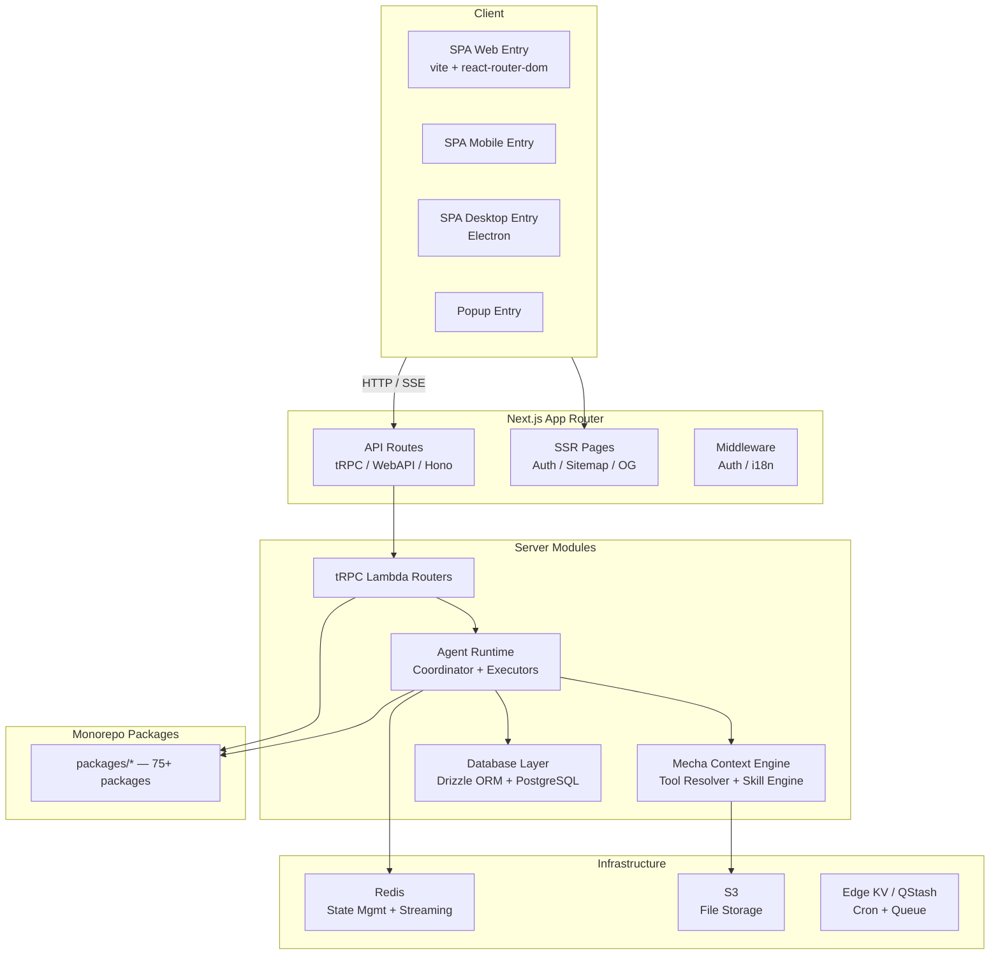
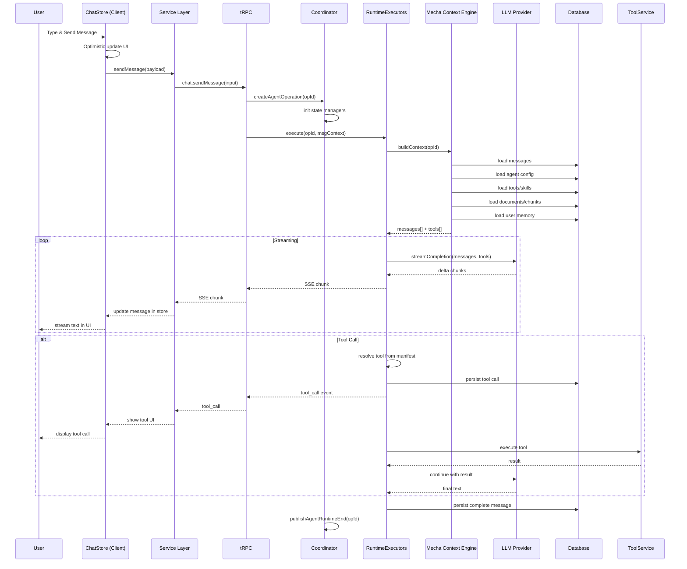

# LobeChat 架构分析

> 分析版本：v2.1.56 ｜ 分析日期：2026-05-09

## 1. 项目概览

| 项目 | 信息 |
|------|------|
| 官网 | https://lobehub.com |
| GitHub | [lobehub/lobehub](https://github.com/lobehub/lobehub) |
| 编程语言 | TypeScript |
| Star 数 | 76k+ |
| 许可证 | Apache-2.0 |
| 核心维护者 | 社区维护 |

**项目简介**

LobeChat 是一个开源、全面的 AI Agent 框架，支持语音合成、多模态及可扩展的 Function Call 插件系统。它采用 Next.js 16 + React 19 + TypeScript，基于 pnpm monorepo 组织，使用 zustand 状态管理、tRPC 通信、Drizzle ORM 和 PostgreSQL 数据库。

## 2. 技术栈

| 类别 | 技术选型 |
|------|----------|
| 编程语言 | TypeScript |
| 前端框架 | React 19, Next.js 16 (App Router) |
| 构建系统 | Vite (SPA), Next.js build, pnpm |
| 状态管理 | zustand (Slice 模式) |
| 通信协议 | HTTP, SSE, tRPC |
| 数据库 | PostgreSQL (Drizzle ORM) |
| 缓存/状态 | Redis |
| 文件存储 | S3 |
| 任务队列 | QStash |
| 边缘 KV | Edge KV |
| 测试框架 | Vitest (单元), Playwright (E2E), Cucumber (BDD) |
| CI/CD | GitHub Actions (30+ 工作流) |
| 代码质量 | ESLint, Prettier, stylelint, commitlint, husky, knip, Renovate, Semantic Release |
| 桌面应用 | Electron |
| CLI | 独立 CLI 工具 |

## 3. 整体架构



### 架构分层

- **Client 层**: 四种入口（Web SPA、Mobile、Desktop Electron、Popup），使用 react-router-dom 进行客户端路由。
- **Next.js App Router 层**: 提供 SSR 页面（认证、Sitemap、OG）以及全量 API 后端（tRPC、WebAPI、Hono），并包含中间件（Auth、i18n）。
- **服务端模块层**: 核心 Agent 运行时、Mecha 上下文引擎、tRPC 路由、数据库层。
- **基础设施层**: Redis（状态管理、流式传输）、S3（文件存储）、Edge KV / QStash（定时任务、队列）。
- **Monorepo 包层**: 75+ 共享包，如 agent-runtime、context-engine、model-runtime、database 等。

### 模块职责

| 模块 | 职责 | 关键文件/目录 |
|------|------|---------------|
| 客户端 SPA 入口 | 提供四种入口（Web/Mobile/Desktop/Popup） | `src/spa/`, `src/routes/` |
| Next.js 后端路由 | API 处理、SSR 页面、中间件 | `src/app/(backend)/` |
| Agent Runtime | 核心 Agent 执行引擎，Operation-based 模型 | `src/server/modules/AgentRuntime/` |
| Mecha 上下文引擎 | 构建 LLM 调用上下文（消息、工具、文档、记忆） | `src/server/modules/Mecha/` |
| tRPC Lambda Routers | 服务端 RPC 路由 | `src/server/routers/lambda/` |
| 数据库层 | Drizzle ORM schema、repositories | `packages/database/` |
| 内置工具系统 | Manifest-based 工具注册与解析 | `packages/builtin-tools/` |
| 模型运行时 | LLM 模型调用抽象 | `packages/model-runtime/` |
| 对话流 | DSL 解析 | `packages/conversation-flow/` |
| Zustand 状态管理 | 全局应用状态，Slice 模式 | `src/store/` |
| 客户端服务层 | 封装 tRPC 和 HTTP 调用 | `src/services/` |
| 桌面应用 | Electron 桌面包装 | `apps/desktop/` |
| CLI 工具 | 命令行接口 | `apps/cli/` |

## 4. 核心模块详解

### 4.1 Agent 运行时系统

Agent 运行时位于 `src/server/modules/AgentRuntime/`，实现了 **Operation-based Agent 执行模型**。每次用户请求或 Agent 操作均创建一个独立的 `operationId`，包含完整的生命周期管理。

**关键接口抽象**：

| 接口 | 职责 | 实现 |
|------|------|------|
| `IAgentStateManager` | Agent 状态持久化、分布式锁、操作元数据 | Redis / InMemory |
| `IStreamEventManager` | SSE 事件发布与订阅 | Redis PubSub / InMemory |

策略模式实现：`createAgentStateManager()` 和 `createStreamEventManager()` 根据 Redis 可用性自动选择 Redis 实现或 InMemory 回退，零配置本地开发与生产高可用无缝切换。

### 4.2 状态管理层（Zustand Slice 模式）

所有全局状态管理采用 **Zustand + Slice 模式**。共 11 个 Slice，涵盖 Message、AIChat、Topic、Plugin、BuiltinTool、TTS、Translate、Thread、Portal、Operation、AIAgent。每个 Slice 的标准结构：Action 层（纯函数逻辑）、Selector 层（高效状态派生）、InitialState（类型安全初始状态）。项目实现了 **40/40 个 Action 文件 100% 测试覆盖率**。

### 4.3 Mecha：上下文工程引擎

Mecha 是 LobeChat 的 **Agent 上下文构建引擎**，负责在每次 LLM 调用前组装完整的上下文。关键职责：
- 从数据库加载消息历史
- 解析并注入 Agent 配置的工具清单（Tool Manifest）
- 注入关联文档（RAG chunks）
- 注入用户记忆（User Memory）
- 构建最终发送给 LLM 的 messages 数组

### 4.4 内置工具系统（Plugin System）

Manifest-based 工具注册架构。**工具分类**：
- **Always-on 工具**：Activator、Skills、SkillStore、WebBrowsing、KnowledgeBase、Memory 等
- **按需工具**：Calculator、Cron、CloudSandbox、Task 等
- **外部集成**：Feishu、LINE、QQ、WeChat 等 Chat Adapter

### 4.5 数据库层

使用 **Drizzle ORM + PostgreSQL**，代码优先的 schema 定义。目录结构：
```
packages/database/src/
├── schemas/         # Drizzle schema 定义
├── models/          # 业务模型（45+ model 文件）
├── repositories/    # Repository 模式封装
├── migrations/      # SQL 迁移文件
├── core/            # 数据库连接管理
└── server/          # 服务端数据库配置
```

## 5. 关键设计决策

| 决策 | 选择 | 替代方案 | 理由 |
|------|------|----------|------|
| 渲染架构 | Hybrid SPA + SSR | 纯 SSR 或纯 SPA | SPA 提供极致客户端交互；SSR 提供 SEO、OG 图片、认证页面。代价是两套路由系统需同步，有专门测试保护。 |
| Agent 执行模型 | Operation-based（独立 operationId） | 同步请求-响应模型 | 天然支持分布式部署、断线重连、多步操作；通过 `tryClaimStep` 分布式锁防止重复执行。代价是增加状态管理复杂度。 |
| 构建路径 | 双构建（Vite SPA + Next.js） | 统一构建 | SPA 产物静态托管，Next.js 产物用于 SSR 和 API；Docker 镜像同时包含两者。 |
| Monorepo 组织 | pnpm workspace（75+ 包） | 单仓库或更少包 | 模块化清晰，但跨包重构和发布协调成本较高。 |
| 上下文构建 | 独立 Mecha 模块 | 集成在 RuntimeExecutors 中 | 将工具解析、技能管理、文档注入从 Agent 执行流程解耦，使 Runtime 只关注执行，Mecha 只关注上下文准备。 |

## 6. 数据流 / 请求流

### 消息发送完整链路



## 7. 设计模式

| 模式名称 | 使用位置 | 目的 |
|----------|----------|------|
| 策略模式 | IAgentStateManager / IStreamEventManager | 根据环境自动选择 Redis 或 InMemory 实现 |
| 中介者模式 | AgentRuntimeCoordinator | 协调 StateManager 与 StreamEventManager 之间的交互 |
| Slice 模式 | `src/store/*` | Zustand 状态按领域拆分为独立 Slice，通过 `flattenActions` 组合 |
| 命令模式 | OperationAction (undo/redo) | 跟踪用户操作历史，支持撤销和重做 |
| Repository 模式 | `packages/database/src/repositories/` | 数据访问抽象层，隐藏 Drizzle ORM 细节 |
| Factory 模式 | `factory.ts` (AgentRuntime) | 工厂方法创建 stateManager/streamEventManager |
| 观察者模式 | IStreamEventManager → SSE | 状态事件通过 Redis PubSub 发布，SSE 端点订阅 |
| Plugin/Manifest 模式 | 内置工具系统 | 每个工具以 Manifest 定义，统一注册和解析 |
| 依赖注入 | AgentRuntimeCoordinator 构造函数 | 外部可传入自定义 stateManager/streamEventManager |

## 8. 工程实践

### 测试策略

| 层级 | 工具 | 覆盖内容 |
|------|------|---------|
| 单测 | Vitest + testing-library | Store Actions（40 文件 100%）、Services、Utils（~80% 总覆盖率） |
| E2E | Cucumber + Playwright | 关键用户流程（位于 `e2e/` 目录） |
| 集成 | 服务端模块测试 | AgentRuntime、数据库 Repositories |
| 视觉 | Lighthouse CI | 性能基线监控 |

Store 测试策略：每个 Slice Action 文件独立测试；只 spy 直接依赖，不跨层 Mock；**94 个测试文件，1263 个测试用例全部通过**。

### 发布流程

GitHub Actions 共 30+ 个工作流文件。`canary` 为开发分支（云生产），`main` 为发布分支（定期 cherry-pick）。Docker 镜像同时构建 SPA + Next.js 产物。Desktop 应用有三个发布通道：Canary / Beta / Stable。**Claude Agent 深度参与**：自动测试、Issue 分类、PR 分配、翻译、迁移支持。

### 版本管理

使用 Semantic Release 自动版本发布。提交规范：commitlint + gitmoji。Renovate 自动依赖更新。支持 5 种部署方式（Vercel、Docker、SPA Only、Desktop、CLI）。

## 9. 总结与评价

### 亮点

1. **Agent 运行时抽象极佳**：`IAgentStateManager` / `IStreamEventManager` 接口设计清晰，策略模式让本地开发和生产环境无缝切换。
2. **状态管理成熟度极高**：Zustand Slice 模式在大型 SPA 中表现优异，40 个 Action 文件 100% 测试覆盖。
3. **可扩展性**：Manifest-based 工具系统让第三方工具集成变得简单。
4. **多平台支持**：同一套代码同时覆盖 Web SPA、Mobile、Electron Desktop、Popup 四种入口。
5. **工程化完备**：30+ CI 工作流、E2E 测试、性能监控、AI 辅助开发。

### 可改进之处

1. **双构建路径**：Vite SPA + Next.js SSR 增加了构建和维护复杂度。
2. **75+ 包的管理成本**：虽然模块化好，但跨包重构和发布协调有一定开销。
3. **状态层多重订阅**：Zustand + SWR + tRPC 三层数据获取/缓存策略增加了心智模型负担。

## 参考

- 原始分析文档：README.md（项目架构深度分析）
- 项目仓库：LobeHub / LobeChat
