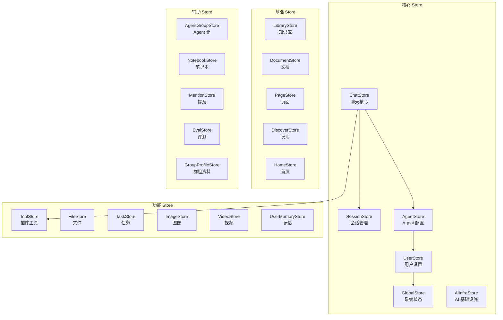
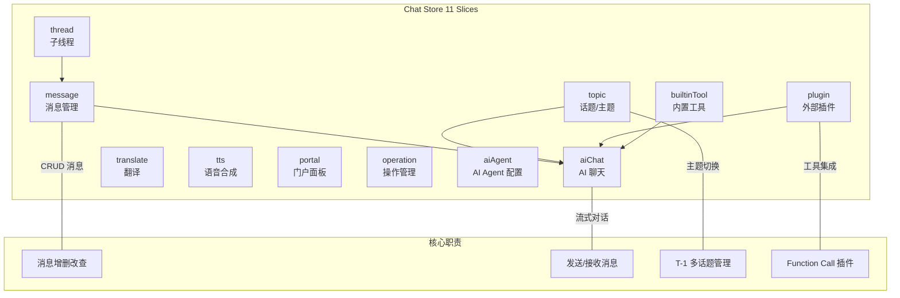
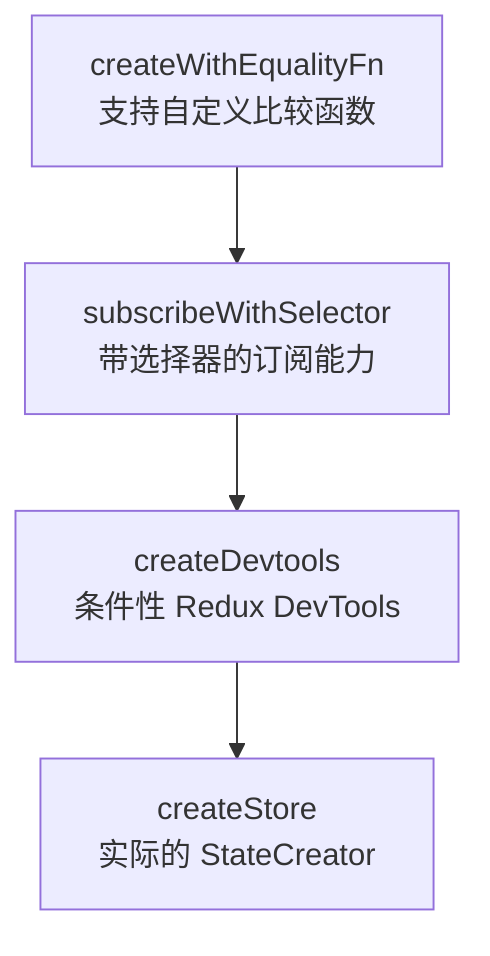
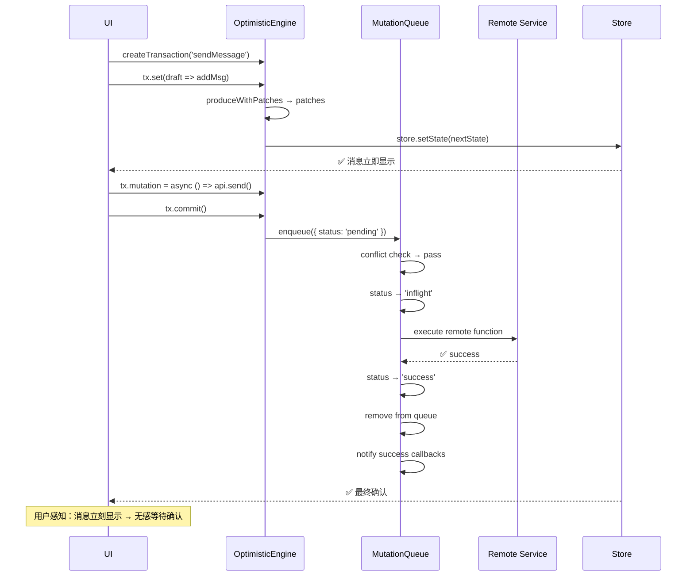

# LobeHub 状态管理层深度分析

> 分析版本：v2.1.56 · zustand@5.0.4 · immer@11.1.3
> 
> 分析日期：2026-05-09

---

## 1. 引言

LobeChat（lobehub/lobehub）是 GitHub 上 76k+ Star 的开源 AI Agent 框架。在阅读其源码时，状态管理层是最让我印象深刻的部分之一——它并非 Zustand 的简单使用，而是在 Zustand 5 之上构建了一套**高度工程化的状态管理方案**，包含领域驱动拆分、Slice 模式、Class-based Actions、自研乐观更新引擎等一系列机制。

本文从源码出发，深入拆解这套状态管理层的设计思路与实现细节。

### 1.1 为什么状态管理值得单独分析

在一个大型 AI 聊天应用中，状态管理面临几个独特挑战：

| 挑战 | 说明 |
|------|------|
| **多领域状态** | 会话、消息、Agent 配置、用户偏好、插件状态等分属不同领域，互相独立又有交叉引用 |
| **即时反馈** | 发送消息后需要立即在 UI 中显示（乐观更新），同时后台异步发送请求 |
| **流式更新** | SSE 流式响应需要高频更新消息内容，对渲染性能要求高 |
| **并发操作** | 用户可能同时发送多条消息、切换会话、修改配置，状态变更需要保证一致性 |
| **跨平台** | 同一套状态逻辑需要支撑 Web SPA、Mobile、Desktop Electron、Popup 四种入口 |

LobeHub 的状态管理层正是为应对这些挑战而设计的。

### 1.2 核心依赖栈

| 依赖 | 版本 | 作用 |
|------|------|------|
| `zustand` | 5.0.4 | 核心状态管理库 |
| `zustand-utils` | ^2.1.1 | DevTools 条件启用、Store Updater |
| `immer` | ^11.1.3 | 不可变数据操作（乐观更新引擎） |
| `fast-deep-equal` | ^3.1.3 | Selector 级浅比较 |

---

## 2. 全景图：20+ 独立 Store

LobeHub 没有采用单一全局 Store，而是**按领域拆分为 20+ 个独立 Store**，每个 Store 有独立的 Zustand 实例、独立的 Slice 结构、独立的初始状态和 Selector。

所有 Store 位于 `src/store/` 目录下：

```
src/store/
├── session/          # 会话管理（列表、激活、搜索）
├── chat/             # 聊天核心（11 个 Slice，最大的 Store）
├── agent/            # Agent 配置（Bot、内置 Agent、定时任务、知识）
├── user/             # 用户设置（偏好、认证、引导）
├── global/           # 全局系统状态（布局、主题、版本检查）
├── aiInfra/          # AI 基础设施（模型提供商、模型列表）
├── tool/             # 插件/工具注册与调用
├── file/             # 文件管理
├── task/             # 任务管理（看板、列表）
├── agentGroup/       # Agent 组管理
├── agentProfile/     # Agent 资料页
├── groupProfile/     # 群组资料
├── userMemory/       # 用户记忆
├── library/          # 知识库
├── image/            # 图像生成
├── video/            # 视频生成
├── document/         # 文档编辑
├── page/             # 页面编辑器
├── discover/         # 发现/市场页
├── home/             # 首页数据
├── eval/             # 评测/评估
├── mention/          # 提及功能
├── notebook/         # 笔记本
├── brief/            # 概要信息
├── followUpAction/   # 跟进动作
├── tree/             # 树形结构
├── electron/         # Electron 桌面端
├── serverConfig/     # 服务端配置
└── middleware/       # Store 中间件（createDevtools、expose）
    └── utils/        # 工具函数（flattenActions、OptimisticEngine）
```



**设计意图**：多 Store 而非单 Store 的决策基于以下考量：

1. **变更隔离**——修改消息状态不会触发会话列表组件的重渲染
2. **领域自治**——每个 Store 可独立开发、测试、重构
3. **按需加载**——某些 Store（如 `discover`、`eval`）只在特定页面用到，可以被延迟初始化

---

## 3. Slice 模式：将复杂 Store 拆解为可管理模块

### 3.1 标准目录结构

以 `session` Store 为例，其目录结构展示了完整的 Slice 约定：

```
src/store/session/
├── index.ts              # 导出入口（useSessionStore、getSessionStoreState）
├── store.ts              # Store 创建与组合
├── initialState.ts       # 总初始状态（合并各 Slice 的 initialState）
├── selectors.ts          # 总选择器入口（组合导出各 Slice 的 selectors）
├── helpers.ts            # 共享辅助函数
│
└── slices/
    ├── session/           # 会话核心 Slice
    │   ├── action.ts      # Action 实现（Class）
    │   ├── initialState.ts
    │   ├── reducers.ts    # Reducer（类似 useReducer 的纯函数）
    │   ├── helpers.ts
    │   └── selectors/
    │       ├── index.ts
    │       ├── list.ts    # 会话列表相关选择器
    │       └── meta.ts    # 元数据相关选择器
    │
    └── sessionGroup/      # 会话组 Slice
        ├── action.ts
        ├── initialState.ts
        └── selectors/
```

### 3.2 Slice 组合流程

`store.ts` 是 Slice 组合的入口。以 `session` Store 为例：

```typescript
// src/store/session/store.ts

// 1. import 各 Slice 的工厂函数和 Class
import { createSessionSlice } from './slices/session/action';
import { createSessionGroupSlice } from './slices/sessionGroup/action';

// 2. 定义接口：Action + State 交叉类型
export interface SessionStore
  extends SessionAction, SessionGroupAction, ResetableStore, SessionStoreState {}

// 3. 用 flattenActions 合并所有 Slice
const createStore: StateCreator<SessionStore, [['zustand/devtools', never]]> = (
  ...parameters
) => ({
  ...initialState,
  ...flattenActions<SessionStoreAction>([
    createSessionSlice(...parameters),      // Class 实例
    createSessionGroupSlice(...parameters), // Class 实例
    new SessionStoreResetAction(...parameters),
  ]),
});

// 4. 经过 Middleware 链创建 Store
export const useSessionStore = createWithEqualityFn<SessionStore>()(
  subscribeWithSelector(
    devtools(createStore, { name: 'LobeChat_Session' }),
  ),
  shallow,
);
```

**执行顺序**：
1. `createSessionSlice(set, get, api)` → 返回 `SessionActionImpl` 实例
2. `new SessionStoreResetAction(set, get, api)` → 返回带有 `reset()` 方法的实例
3. `flattenActions([...])` → 遍历所有实例的原型链，提取方法合并为普通对象
4. `devtools(createStore)` → 包裹 DevTools middleware
5. `subscribeWithSelector(...)` → 添加带选择器的订阅能力
6. `createWithEqualityFn(...)` → 用 `shallow` 比较创建 Store

### 3.3 最大 Store：Chat Store 的 11 个 Slice

Chat Store 是项目中最大的 Store，管理聊天界面的所有状态，由 11 个 Slice 组成：



```typescript
// src/store/chat/store.ts
const createStore = (...params) => ({
  ...initialState,
  ...flattenActions<ChatStoreAction>([
    chatMessage(...params),               // 消息 CRUD、加载、排序
    new ChatThreadActionImpl(...params),   // 子线程管理
    chatAiChat(...params),                // AI 聊天（流式、工具调用）
    new ChatTopicActionImpl(...params),    // 话题/主题管理
    new ChatTranslateActionImpl(...params), // 翻译功能
    new ChatTTSActionImpl(...params),      // 语音合成
    chatToolSlice(...params),             // 内置工具（搜索、计算器等）
    chatPlugin(...params),                // 外部插件
    new ChatPortalActionImpl(...params),   // 门户面板（侧边内容展示）
    new OperationActionsImpl(...params),   // 操作历史（编辑、重试）
    chatAiAgent(...params),               // AI Agent 配置（模型、参数）
    new ChatStoreResetAction(...params),   // 重置能力
  ]),
});
```

---

## 4. Class-based Actions + flattenActions

LobeHub 状态管理中最独特的设计：**用 ES Class 实现 Action 层**，而非传统的纯函数或对象字面量。

### 4.1 为什么选择 Class

```typescript
// 传统 Zustand 模式：纯函数
const useStore = create((set, get) => ({
  count: 0,
  increment: () => set((state) => ({ count: state.count + 1 })),
  decrement: () => set((state) => ({ count: state.count - 1 })),
}));

// LobeHub 模式：Class
export class SessionActionImpl {
  readonly #get: () => SessionStore;
  readonly #set: Setter;

  constructor(set: Setter, get: () => SessionStore, _api?: unknown) {
    this.#set = set;
    this.#get = get;
  }

  switchSession = (sessionId: string): void => {
    this.#set({ activeAgentId: sessionId }, false, n(`activeSession/${sessionId}`));
  };

  removeSession = async (sessionId: string): Promise<void> => {
    await sessionService.removeSession(sessionId);
    await this.#get().refreshSessions();
    if (sessionId === this.#get().activeId) {
      this.#get().switchSession(INBOX_SESSION_ID);
    }
  };
}
```

**Class 的优势**：

| 维度 | 纯函数 | Class |
|------|--------|-------|
| 依赖注入 | 每次调用时传入参数 | constructor 统一注入 set/get |
| 共享上下文 | 外部闭包或重复传参 | 通过 `#set`/`#get` 自然共享 |
| 组织性 | 需按文件名/导出分组 | 同一 Slice 的所有方法天然归组 |
| 私有性 | 无法表达私有方法 | `#` 私有字段提供真正封装 |
| 继承/复用 | 组合函数 | 继承、Mixin 等 OOP 手段 |

### 4.2 flattenActions 的工作原理

Zustand 期望 Store 是一个普通对象，而 Class 实例的原型方法不会被 `...` 展开运算符复制。`flattenActions` 通过**原型链反射**来解决这个问题：

```typescript
export const flattenActions = <T extends object>(actions: object[]): T => {
  const result = {} as T;

  for (const action of actions) {
    let current: object | null = action;
    while (current && current !== Object.prototype) {
      const keys = Object.getOwnPropertyNames(current);

      for (const key of keys) {
        if (key === 'constructor') continue;
        if (key in result) continue; // 第一个方法的优先级最高

        const descriptor = Object.getOwnPropertyDescriptor(current, key);
        if (!descriptor) continue;

        if (typeof descriptor.value === 'function') {
          // 方法：绑定 this 到原始实例
          (result as any)[key] = descriptor.value.bind(action);
        } else {
          // 非函数属性：直接复制描述符
          Object.defineProperty(result, key, {
            ...descriptor,
            configurable: true,
            enumerable: true,
          });
        }
      }

      current = Object.getPrototypeOf(current);
    }
  }

  return result;
};
```

**执行流程**：

```
输入：[SessionActionImpl 实例, SessionGroupImpl 实例]

SessionActionImpl 实例
├── 自身属性: 无（所有方法都在原型上）
├── 原型（SessionActionImpl.prototype）
│   ├── constructor: SessionActionImpl
│   ├── switchSession: ƒ
│   ├── removeSession: ƒ
│   ├── createSession: ƒ
│   └── ...
├── 原型链继续 → Object.prototype → 停止

遍历结果：
- session.switchSession = SessionActionImpl.switchSession.bind(实例1)
- session.removeSession = SessionActionImpl.removeSession.bind(实例1)
- ...

继续处理 SessionGroupImpl 实例...
- sessionGroup.createGroup = SessionGroupImpl.createGroup.bind(实例2)
- ...

最终合并为一个普通对象
```

> **关键设计决策**：`flattenActions` 只在 Store 初始化时执行一次，后续的 dispatch 直接在合并后的对象上调用方法。原型链反射 + `bind` 虽有额外开销，但只在程序启动时发生，运行时零成本。

### 4.3 调试辅助

每个 Action 方法调用时都会传入一个调试标记，便于追踪状态变更的来源：

```typescript
import { setNamespace } from '@/utils/storeDebug';
const n = setNamespace('session');

// 在 set 调用中传入 action 名称
this.#set(
  { activeAgentId: sessionId },
  false,
  n(`activeSession/${sessionId}`)  // → 'session/activeSession/xxx'
);
```

结合 DevTools，可以看到每一个状态变更的来源：

```
action: 'session/activeSession/abc123'
  ↓
prev state: { activeId: 'inbox', ... }
next state: { activeId: 'abc123', ... }
```

---

## 5. Middleware 栈

每个 Store 的创建都经过相同的 middleware 堆叠，从外到内为：

### 5.1 总体链路



### 5.2 createWithEqualityFn + shallow

Zustand 5 的 `tradition` 导出版本，允许传入自定义相等比较函数：

```typescript
export const useSessionStore = createWithEqualityFn<SessionStore>()(
  subscribeWithSelector(devtools(createStore)),
  shallow,  // ← 默认使用 shallow 比较
);
```

这意味着 selector 返回的新对象如果与旧对象 `shallow equal`，组件不会重渲染——这是避免 AI 聊天高频流式更新中性能问题的关键。

### 5.3 subscribeWithSelector

允许在订阅时传入选择器：

```typescript
// 不使用：整个 Store 变化都会回调
useChatStore.subscribe(() => { ... });

// 使用：只在 messages 变化时回调
useChatStore.subscribe(
  (state) => state.messages,
  (messages) => { console.log('messages changed', messages); }
);
```

### 5.4 createDevtools：条件性 Redux DevTools

LobeHub 实现了一套**可通过 URL 参数控制启用的 DevTools**：

```typescript
export const createDevtools = (name: string) => (initializer) => {
  let showDevtools = false;

  if (typeof window !== 'undefined') {
    const url = new URL(window.location.href);
    const debug = url.searchParams.get('debug');
    if (debug?.includes(name)) {
      showDevtools = true; // ?debug=session → 启用 session 的 DevTools
    }
  }

  return optionalDevtools(showDevtools)(initializer, {
    name: `Lobe_${name}` + (isDev ? '_DEV' : ''),
  });
};
```

**使用方式**：
- 在浏览器访问 `https://app.lobehub.com?debug=chat` → 只启用 chat Store 的 DevTools
- 多个 Store：`?debug=session,chat,agent`
- 生产环境默认关闭，零性能损耗

`optionalDevtools` 来自 `zustand-utils` 包，是 Zustand 生态中一个非常实用的工具函数。

### 5.5 expose：开发调试助手

```typescript
export function expose<T>(name: string, store: { getState: () => T }) {
  if (!isDev || typeof window === 'undefined') return;
  window.__LOBE_STORES ??= {};
  window.__LOBE_STORES[name] = () => store.getState();
}

// 调用
expose('session', useSessionStore);
expose('chat', useChatStore);
expose('agent', useAgentStore);
expose('user', useUserStore);
expose('global', useGlobalStore);
```

在开发环境的浏览器控制台中：

```javascript
// 查看当前会话状态
window.__LOBE_STORES.session()

// 检查消息列表
window.__LOBE_STORES.chat().messages

// 查看用户配置
window.__LOBE_STORES.user().settings
```

---

## 6. ResetableStore：统一重置机制

这是一个简单但强有力的设计：**所有 Store 都实现统一的 `reset()` 接口**。

### 6.1 抽象基类

```typescript
export abstract class ResetableStoreAction<TStore extends object> implements ResetableStore {
  readonly #api: StoreApi<TStore>;
  protected abstract readonly resetActionName: string;

  constructor(set: Setter, _get: () => TStore, api: StoreApi<TStore>) {
    this.#set = set;
    this.#api = api;
  }

  reset = () => {
    this.#set(this.#api.getInitialState(), false, this.resetActionName);
  };
}

// 每个 Store 只需继承并定义 resetActionName
class SessionStoreResetAction extends ResetableStoreAction<SessionStore> {
  protected readonly resetActionName = 'resetSessionStore';
}
```

### 6.2 批量重置管理器

`userDataStores.ts` 收集了所有可重置的 Store：

```typescript
const resetableStores = [
  useAgentGroupStore, useAgentStore, useChatStore,
  useDiscoverStore, useDocumentStore, useEvalStore,
  useFileStore, useHomeStore, useImageStore,
  useKnowledgeBaseStore, useMentionStore, useNotebookStore,
  usePageStore, useSessionStore, useTaskStore,
  useToolStore, useUserMemoryStore, useUserStore, useVideoStore,
];

export const stores = createStoreActions(resetableStores);
// stores.reset() → 一次性重置所有 19 个 Store
```

批量重置的场景：
- **用户登出**：清除所有用户数据
- **初始化失败**：回退到初始状态重试
- **测试**：每个测试用例前 reset 确保隔离

---

## 7. Selector 模式

### 7.1 纯函数设计

LobeHub 的选择器是**纯函数**，而非 `zustand` 的 hooks API：

```typescript
// src/store/session/slices/session/selectors/list.ts

// 基础选择器：直接返回 Store 属性
const allSessions = (s: SessionStore): LobeSessions => s.sessions;

// 参数化选择器：柯里化
const getSessionById = (id: string) => (s: SessionStore): LobeSession =>
  sessionHelpers.getSessionById(id, allSessions(s));

// 组合选择器：基于其他选择器
const currentSession = (s: SessionStore): LobeSession | undefined => {
  if (!s.activeId) return;
  return allSessions(s).find((i) => i.id === s.activeId);
};

// 分组导出
export const sessionSelectors = {
  currentSession,
  getSessionById,
  defaultSessions,
  pinnedSessions,
  customSessionGroups,
  isInboxSession,
  isSessionListInit,
  // ...
};
```

### 7.2 在组件中使用

```typescript
// 组件内使用
const currentSession = useSessionStore(s => sessionSelectors.currentSession(s));
const sessionList = useSessionStore(s => sessionSelectors.defaultSessions(s));
const activeId = useSessionStore(s => s.activeId);
```

得益于 `createWithEqualityFn` + `shallow`，当 selector 返回值没有变化时组件不会重渲染。这是 AI 聊天高频更新下的关键性能保障。

### 7.3 设计要点

| 特性 | 实现 | 优势 |
|------|------|------|
| 纯函数 | `(state) => derived` | 可测试、可组合、无副作用 |
| 柯里化 | `(id) => (state) => value` | 灵活传参，每个参数化选择器都是一个闭包 |
| 导出规范 | 分组导出为对象 | `sessionSelectors.xxx` IDE 自动补全友好 |
| TypeScript | 完整类型标注 | 从 Store state 到返回值的完整类型链 |

---

## 8. OptimisticEngine：乐观更新引擎

这是 LobeHub 状态管理中最精密的自研子系统，专门解决 AI 聊天中的**即时反馈**需求——用户发送消息后立即在 UI 中显示，而不是等待 API 响应完成。

### 8.1 为什么需要自研引擎

AI 聊天场景的乐观更新与传统 CRUD 区别很大：

| 维度 | 传统 CRUD | AI 聊天 |
|------|-----------|---------|
| 延迟 | 50-200ms | 1-30s（LLM 生成） |
| 更新频率 | 低 | 极高（流式文字） |
| 并发 | 低 | 高（多轮对话、多 Agent） |
| 回滚复杂度 | 低 | 高（消息可能跨越多个 Store） |

自研引擎比 redux-toolkit 或 SWR mutation 更灵活的核心能力：**支持跨 Store 事务**和**路径级冲突检测**。

### 8.2 核心架构

```mermaid
graph TB
    subgraph "OptimisticEngine"
        direction TB
        Engine["OptimisticEngine<br/>入口 + Transaction 工厂"]
        Queue["MutationQueue<br/>队列管理"]
        Tx["Transaction<br/>批量追踪变更"]
    end

    UI[UI 组件] -->|tx.set()| Tx
    Tx -->|commit()| Queue
    Queue -->|execute| API[Remote API]
    API -->|success| Queue
    API -->|failure| Queue
    Queue -->|rollback| UI
    
    Queue -->|conflict detect| Conflicts[路径冲突检测]
    Queue -->|retry| API
    Queue -->|notify| Callbacks[成功/失败回调]
```

### 8.3 Transaction：乐观更新的基本单元

```typescript
// 典型使用流程
const engine = new OptimisticEngine(useChatStore, {
  maxRetries: 2,
  onMutationError: (snapshot, error) => {
    console.error('Mutation failed:', snapshot.id, error);
    // 可以在这里显示 Toast 通知
  },
});

// 1. 创建 Transaction
const tx = engine.createTransaction('sendMessage');

// 2. 乐观更新本地 state（使用 Immer recipe）
tx.set((draft) => {
  draft.messages.push({
    id: tempId,
    content: userInput,
    role: 'user',
    status: 'pending',
  });
});

// 3. 设置远程 mutation
tx.mutation = async () => {
  return chatService.sendMessage(userInput);
};

// 4. 提交：flush → 发请求 → 成功保留 / 失败回滚
const result = await tx.commit();
```

### 8.4 Immer Patches 追踪机制

当 `tx.set()` 被调用时，引擎内部使用 Immer 的 `produceWithPatches` 记录变更：

```typescript
// Transaction 内部
set(recipe: Recipe<S>) {
  const baseState = this.workingStates.get(store) ?? store.getState();
  const [nextState, patches, inversePatches] = produceWithPatches(baseState, recipe);

  if (patches.length === 0) return;

  // flush: true → 立即更新 UI
  if (shouldFlush) {
    store.setState(nextState);
  }

  // 记录 patches 供回滚使用
  this.records.push({
    patches,
    inversePatches,
    store,
  });
}
```

**patches 示例**：
```json
// patches（变更）
[
  { "op": "add", "path": "/messages/3", "value": { "id": "temp_123", "content": "hi" } }
]

// inversePatches（回滚）
[
  { "op": "remove", "path": "/messages/3" }
]
```

### 8.5 路径冲突检测

多个 mutation 并发时，引擎自动检测它们是否操作了相同的数据路径：

```typescript
export function hasPathConflict(pathsA: string[], pathsB: string[]): boolean {
  for (const pathA of pathsA) {
    for (const pathB of pathsB) {
      if (pathA === pathB ||
          pathA.startsWith(`${pathB}.`) ||
          pathB.startsWith(`${pathA}.`)) {
        return true;  // 冲突：操作了同一路径或其子路径
      }
    }
  }
  return false;  // 无冲突：可并行执行
}

// 场景：
// 路径A: ["chat-store:messages"]  —— 正在发送消息
// 路径B: ["chat-store:messages"]  —— 也在发消息 → 冲突，排队执行
// 路径C: ["session-store:sessions"] —— 切换会话 → 无冲突，可同时进行
```

### 8.6 多 Store 交叉事务

一个 Transaction 可以同时修改多个 Store：

```typescript
const tx = engine.createTransaction('sendAndUpdate');

// 修改 chat Store（添加消息）
tx.set(useChatStore, (draft) => {
  draft.messages.push(newMsg);
});

// 同时修改 session Store（更新最新活动时间）
tx.set(useSessionStore, (draft) => {
  const session = draft.sessions.find(s => s.id === activeId);
  if (session) session.updatedAt = new Date();
});

tx.mutation = async () => chatService.sendAndTouch(activeId, content);
const result = await tx.commit();
// 如果提交失败，两个 Store 的变更都会被回滚
```

### 8.7 队列管理与状态机

MutationQueue 管理所有 mutation 的生命周期：

```typescript
// 状态机
// pending → inflight → success ✅
// pending → inflight → pending (retry) → ... → success ✅
// pending → inflight → pending (retry) → ... → failed → rolled-back 🔄

interface QueuedMutation {
  id: string;
  status: 'pending' | 'inflight' | 'success' | 'failed';
  retryCount: number;
  maxRetries: number;
  timestamp: number;
  storePatches: Map<AnyStore, StorePatchEntry>;
  // ...
}
```

**回滚策略**（`settleFailure`）：

当一个 mutation 最终失败时，引擎执行精确的回滚：

1. 收集所有涉及到的 Store（包括失败的和正在排队的）
2. 对于每个 Store：
   - 撤销所有 pending mutation 的 patches（应用 inversePatches）
   - 撤销失败 mutation 的 patches
   - 重新应用后续 pending mutation 的 patches
3. 从队列中移除失败的 mutation
4. 触发 `onMutationError` 回调
5. 处理下一个 pending mutation

### 8.8 完整的 Optimistic 数据流



### 8.9 与纯 Zustand 的对比

```typescript
// 纯 Zustand 模式：
const sendMessage = async (content: string) => {
  // 没有乐观更新，需要等待响应
  const response = await api.sendMessage(content);
  set((state) => ({
    messages: [...state.messages, response],
  }));
};

// LobeHub OptimisticEngine 模式：
const sendMessage = async (content: string) => {
  const tx = engine.createTransaction('sendMessage');
  tx.set((draft) => {
    // 立即显示
    draft.messages.push(optimisticMsg);
  });
  tx.mutation = async () => api.sendMessage(content);
  await tx.commit();
  // 失败自动回滚，无需手动处理
};
```

---

## 9. 跨 Store 通信

LobeHub 的多 Store 架构中，一个 Store 需要引用另一个 Store 的状态时，通过**显式导入目标 Store 的 `getState()`** 实现：

```typescript
// src/store/session/slices/session/action.ts
import { useUserStore } from '@/store/user';

export class SessionActionImpl {
  createSession = async (agent) => {
    // 跨 Store 读取：获取用户配置中的 defaultAgent
    const defaultAgent = merge(
      DEFAULT_AGENT_LOBE_SESSION,
      settingsSelectors.defaultAgent(useUserStore.getState()),
    );
    // ...
  };
}
```

这种模式的优势：
- **显式依赖**——一眼就能看出 Store A 依赖了 Store B
- **类型安全**——`useUserStore.getState()` 返回的是完整类型
- **无订阅开销**——读取的是那一刻的快照，不会触发订阅
- **测试友好**——可以轻松 mock 被引用的 Store

---

## 10. 状态持久化

系统 UI 状态（布局、面板宽度、侧边栏展开状态等）通过 `AsyncLocalStorage` 持久化到 `localStorage`：

```typescript
// src/store/global/initialState.ts
export const initialState: GlobalState = {
  // ...
  status: INITIAL_STATUS,
  statusStorage: new AsyncLocalStorage('LOBE_SYSTEM_STATUS'),
};
```

**初始化流程**：

```typescript
// src/store/global/actions/general.ts
useInitSystemStatus = () => {
  return useOnlyFetchOnceSWR(
    'initSystemStatus',
    () => this.#get().statusStorage.getFromLocalStorage(),
    {
      onSuccess: (status) => {
        // 1. 标记初始化完成
        this.#set({ isStatusInit: true });

        // 2. 重置瞬态 UI 状态（页面刷新不应保留）
        const statusWithResetTransient = {
          ...status,
          showCommandMenu: false,   // 命令菜单
          showHotkeyHelper: false,  // 快捷键提示
        };

        // 3. 合并持久化状态到 Store
        this.#get().updateSystemStatus(statusWithResetTransient);
      },
    },
  );
};
```

**系统状态包含**（选自 `SystemStatus` 接口）：
- 布局相关：面板宽度、左侧栏/右侧栏/门户面板显示状态
- 偏好：语言/主题、文件管理器视图模式
- 展开状态：侧边栏、会话组、话题组
- 缓存：已读通知、已关闭的 Banner
- 功能开关：Zen Mode、宽屏模式

---

## 11. 测试策略

Store 测试是 LobeHub 工程化中投入最大的部分之一。

### 11.1 测试原则

- **每个 Slice Action 文件独立测试**——不跨 Slice mock
- **只 spy 直接依赖**——不 mock 整个 Service 层
- **纯函数逻辑用单测**——reducer/selector 直接测试输入输出
- **异步 Action 用集成测试**——mock service 层检查状态变更

### 11.2 测试覆盖

```
src/store/
├── session/
│   └── slices/session/
│       ├── action.test.ts       ← 测试 async actions
│       └── reducers.test.ts     ← 测试纯 reducer 函数
├── chat/
│   ├── helpers.test.ts
│   └── slices/message/
│       └── action.test.ts
├── agent/
│   └── slices/bot/
│       └── action.test.ts
├── global/
│   └── action.test.ts
...
```

测试数据：
- **94 个测试文件**
- **1263 个测试用例全部通过**
- **40/40 个 Action 文件 100% 测试覆盖率**
- 总测试覆盖率约 80%

### 11.3 Action 测试示例

```typescript
// session/slices/session/action.test.ts
describe('SessionActionImpl', () => {
  let store: typeof useSessionStore;

  beforeEach(() => {
    // 每次测试前重置 Store
    useSessionStore.getState().reset();
  });

  it('should switch session', () => {
    act(() => {
      useSessionStore.getState().switchSession('session-1');
    });

    expect(useSessionStore.getState().activeId).toBe('session-1');
  });

  it('should remove session and switch to inbox if active', async () => {
    // spy service
    vi.spyOn(sessionService, 'removeSession').mockResolvedValue(undefined);

    act(() => {
      useSessionStore.getState().switchSession('session-1');
    });

    await act(async () => {
      await useSessionStore.getState().removeSession('session-1');
    });

    expect(useSessionStore.getState().activeId).toBe('inbox');
  });
});
```

---

## 12. 总结与评价

### 12.1 架构总览

```mermaid
graph TB
    subgraph "每条 Zustand Store"
        IS["initialState.ts<br/>类型安全初始状态"]
        ACT["action.ts × N<br/>Class-based Slice"]
        SEL["selectors<br/>纯函数派生"]
    end

    subgraph "Middleware 栈"
        CEQF["createWithEqualityFn<br/>+ shallow 比较"]
        SWS["subscribeWithSelector<br/>精确订阅"]
        DT["createDevtools<br/>?debug= 条件启用"]
        EXP["expose<br/>window.__LOBE_STORES"]
    end

    subgraph "工具层"
        FA["flattenActions<br/>原型链合并"]
        RS["ResetableStore<br/>统一 reset"]
        SUP["createStoreUpdater<br/>安全更新"]
        OE["OptimisticEngine<br/>乐观更新引擎"]
    end

    subgraph "跨 Store 基础设施"
        UDS["userDataStores<br/>19 Store 批量重置"]
        XS["显式 getState()<br/>跨 Store 引用"]
    end

    IS --> CEQF
    ACT --> FA --> CEQF
    CEQF --> SWS --> DT
    RS --> CEQF
    EXP --> DT

    OE -.->|事务操作| S
    OE -.->|事务操作| C
    UDS -.->|reset()| All["所有 Store"]
```

### 12.2 亮点

1. **领域驱动拆分 + Slice 模式**——20+ Store 各自独立，11-Slice Chat Store 展示了大 Store 的工程化拆分范式

2. **Class-based Actions 的创新实践**——用 Class 做 Action 的组织单元，`flattenActions` 在初始化时做一次原型链反射转普通对象。这不是 OOP 对 FP 的回归，而是吸收两者优点的务实选择

3. **OptimisticEngine**——精巧的自研乐观更新引擎，最出色的部分不是乐观更新本身，而是**路径冲突检测**和**多 Store 交叉事务**能力

4. **条件性 DevTools**——`?debug=storeName` 按需启用，兼顾开发体验和生产性能

5. **100% Action 测试覆盖**——40 个 Action 文件全部 100% 覆盖，这在 Zustand 项目中非常少见

6. **TypeScript 完整性**——从 initialState 类型到 selector 返回类型，类型链层层传递

### 12.3 可关注的权衡点

| 维度 | 评价 | 说明 |
|------|------|------|
| **原型链反射** | 认知成本 | `flattenActions` 的实现对新手有不小的理解门槛 |
| **Selector memoization** | 可改进 | 每次 selector 调用都重新计算（但 `shallow` 比较缓解了问题） |
| **跨 Store 依赖** | 隐式风险 | `sessionStore → userStore` 等依赖通过 import 实现，没有显式声明 |

### 12.4 与其他方案的对比

| 方案 | 组织方式 | 乐观更新 | DevTools | 多 Store | 学习曲线 |
|------|----------|----------|----------|----------|----------|
| **Redux Toolkit** | Slices（createSlice） | `createAsyncThunk` + `matchRejected` | 内置 | 多个 Slice 共享 Store | 中 |
| **Zustand 常规** | 纯函数 create | 手动实现 | 第三方插件 | 多个独立 Store | 低 |
| **Jotai/Recoil** | 原子化 | 手动实现 | 有 | 天然原子化 | 中 |
| **LobeHub 方案** | Class + Slice + flattenActions | **自研 OptimisticEngine** | 条件性 DevTools | 20+ 独立 Store | **高** |

### 12.5 值得借鉴的设计

1. **条件性 DevTools**——`optionalDevtools` + URL 参数控制，可在任何 Zustand 项目中复用
2. **ResetableStore**——抽象基类定义 `reset()` 接口，简单但极为实用
3. **flattenActions**——如果你也喜欢 Class 的组织能力但不想放弃 Zustand，这是个可复用的工具函数
4. **Slice 目录约定**——`action.ts` / `initialState.ts` / `selectors/` / `helpers.ts` / `reducers.ts` 的约定可以借鉴到任何大型前端项目

---

## 参考

- **项目仓库**：[lobehub/lobehub](https://github.com/lobehub/lobehub) — `canary` 分支，v2.1.56
- **状态管理入口**：`src/store/`
- **乐观更新引擎**：`src/store/utils/optimisticEngine.ts`
- **flattenActions**：`src/store/utils/flattenActions.ts`
- **ResetableStore**：`src/store/utils/resetableStore.ts`
- **createDevtools**：`src/store/middleware/createDevtools.ts`
- **批量重置管理器**：`src/store/utils/userDataStores.ts`
- **store 类型**：`src/store/types.ts`
- **官方文档**：[zustand 5](https://github.com/pmndrs/zustand) | [immer](https://immerjs.github.io/immer/) | [zustand-utils](https://github.com/karaggeorge/zustand-utils)
