# Miniflux 架构分析

> 分析版本：v2.2.19 ｜ 分析日期：2026-05-08

## 1. 项目概览

| 项目 | 信息 |
|------|------|
| 官网 | https://miniflux.app |
| GitHub | https://github.com/miniflux/v2 |
| 编程语言 | Go (1.26) |
| Star 数 | ~9,100 |
| 许可证 | Apache-2.0 |
| 核心维护者 | Frédéric Guillot (fguillot) |

**项目简介**

Miniflux 是一个极简主义、有主见的 RSS 阅读器，以单二进制文件部署。它专注于干净、高效的阅读体验，支持自托管，提供 REST API、Fever API 和 Google Reader API 兼容层，并与 30+ 第三方服务集成。

## 2. 技术栈

| 类别 | 技术选型 |
|------|----------|
| 编程语言 | Go 1.26（使用泛型 `go 1.26.0`） |
| 构建系统 | Makefile + Go 原生构建 |
| 测试框架 | Go 标准 `testing` 包 + `testify` |
| CI/CD | GitHub Actions（tests / linters / build / docker / debian-packages / rpm / codeql） |
| 存储 | PostgreSQL（仅支持 PG，无 SQLite） |
| 通信协议 | HTTP/HTTPS, Web 界面, REST API, Fever API, Google Reader API |
| 前端 | 服务端渲染 HTML + CSS + JavaScript（无前端框架） |
| 日志 | `log/slog`（Go 1.21+ 结构化日志） |
| 指标监控 | Prometheus (`prometheus/client_golang`) |
| 容器化 | Docker（Alpine + Distroless） |
| 包管理 | RPM, Debian 包 |

## 3. 整体架构

### 高层架构图

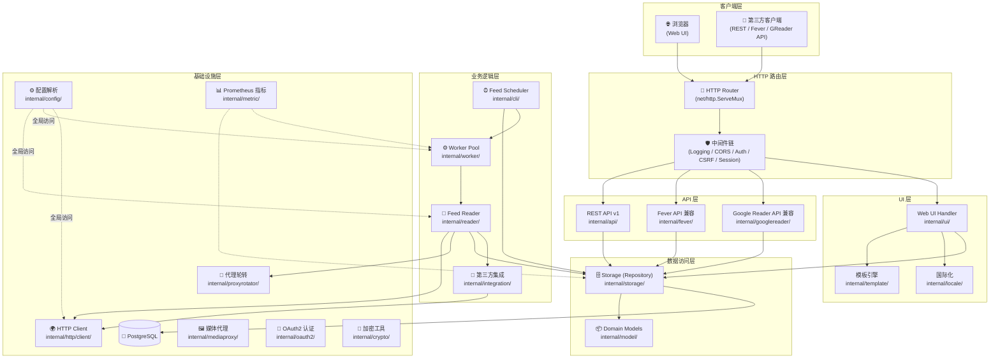

### 架构分层

Miniflux 采用分层架构，代码组织在 `internal/` 下，按职责划分为以下层次：

| 层 | 说明 |
|------|------|
| **路由&中间件层** | Go 1.22+ 的 `http.ServeMux` 路由 + 自定义中间件链 |
| **API 层** | REST API v1、Fever API、Google Reader API 三个平行的 API 接口 |
| **UI 层** | 服务端渲染的 Web 界面，使用自定义模板引擎 |
| **业务逻辑层** | Feed Reader（核心）、第三方集成、Worker Pool、调度器 |
| **数据访问层** | Repository 模式 + Query Builder 模式 |
| **基础设施层** | PostgreSQL 连接池、HTTP 客户端、配置、认证等 |

### 模块职责

| 模块 | 职责 | 关键文件/目录 |
|------|------|---------------|
| `cli` | 入口点、CLI 标志解析、守护进程启动 | `main.go` → `internal/cli/cli.go` → `internal/cli/daemon.go` |
| `config` | 配置解析（环境变量 + 配置文件） | `internal/config/parser.go` |
| `database` | PostgreSQL 连接池管理与 Schema 迁移 | `internal/database/` |
| `storage` | 数据访问层（Repository + Query Builder） | `internal/storage/` |
| `model` | 领域模型定义（Feed, Entry, User, Category 等） | `internal/model/` |
| `reader` | Feed 抓取、解析、处理、重写 | `internal/reader/` |
| `worker` | Feed 刷新工作池 | `internal/worker/` |
| `http/server` | HTTP 服务器启动与路由 | `internal/http/server/` |
| `http/client` | HTTP 客户端、请求构建 | `internal/http/client/` |
| `api` | REST API v1 | `internal/api/` |
| `ui` | Web UI 处理器（约 60+ 个处理函数） | `internal/ui/` |
| `template` | HTML 模板引擎 | `internal/template/` |
| `integration` | 30+ 第三方服务集成 | `internal/integration/` |
| `fever` | Fever API 兼容层 | `internal/fever/` |
| `googlereader` | Google Reader API 兼容层 | `internal/googlereader/` |
| `locale` | 国际化/本地化 | `internal/locale/` |
| `oauth2` | OAuth2/OIDC 认证 | `internal/oauth2/` |
| `proxyrotator` | HTTP 代理轮转 | `internal/proxyrotator/` |
| `metric` | Prometheus 指标收集 | `internal/metric/` |

## 4. 核心模块详解

### 4.1 入口与 CLI 层 (`internal/cli/`)

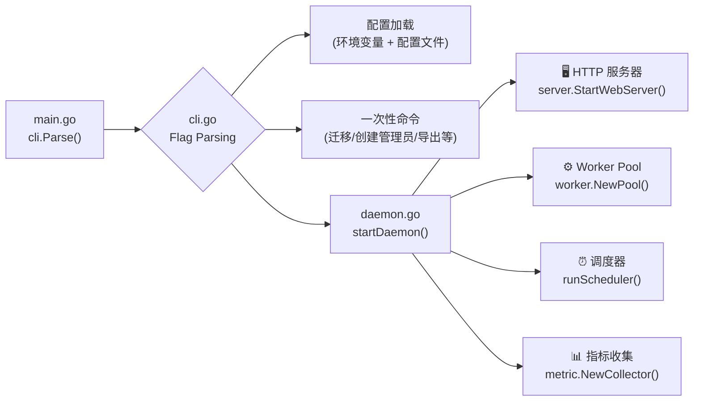

**设计亮点：** Miniflux 使用 CLI 标志模式实现多入口行为。同一二进制既可以作为长期守护进程运行，也可以执行一次性管理任务（迁移数据库、创建管理员、刷新会话等）。通过 `flag` 包解析命令行参数，根据标志决定执行路径。

关键代码路径：
```
main.go → cli.Parse()
  ├── flag 解析 → config 加载
  ├── --migrate → database.Migrate()
  ├── --create-admin → createAdminUserFromInteractiveTerminal()
  ├── --refresh-feeds → refreshFeeds()
  ├── --healthcheck → doHealthCheck()
  └── (默认) → startDaemon()
      ├── database.Migrate()
      ├── proxyrotator.Initialize()
      ├── worker.NewPool()
      ├── runScheduler() (feed + cleanup)
      ├── server.StartWebServer()
      └── metric.NewCollector()
```

### 4.2 Feed Reader 核心 (`internal/reader/`)

这是 miniflux 的核心功能模块，处理 Feed 的抓取、解析、处理和重写。

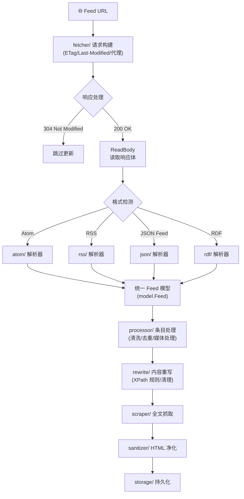

**Feed 刷新流程（核心请求处理）：**

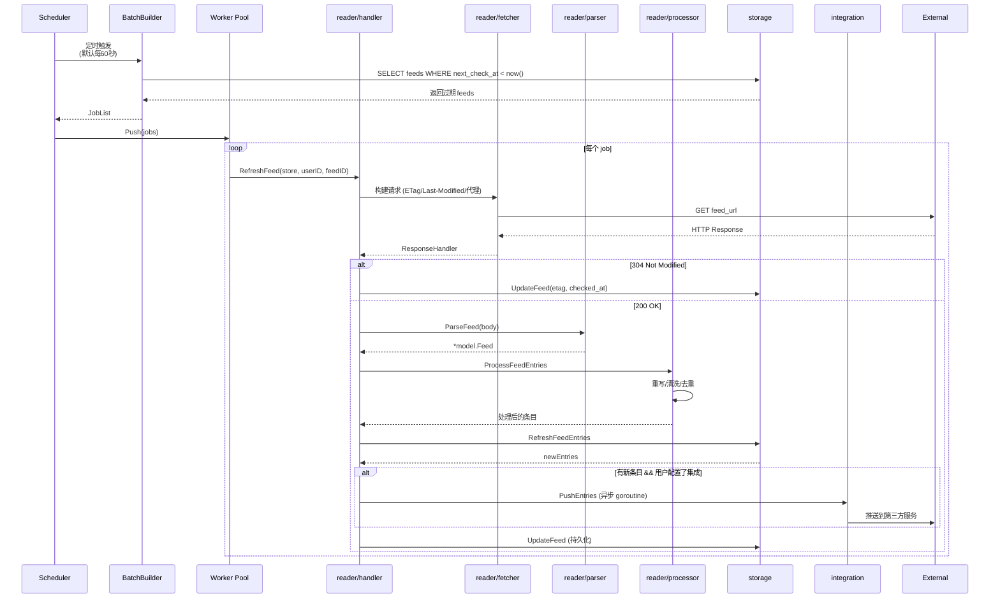

**Feed 格式解析策略：**

`internal/reader/parser/parser.go` 使用 **策略模式** 自动检测并选择合适的 Feed 格式解析器：

```go
func ParseFeed(baseURL string, r io.ReadSeeker) (*model.Feed, error) {
    format, version := DetectFeedFormat(r)
    switch format {
    case FormatAtom: return atom.Parse(baseURL, r, version)
    case FormatRSS:  return rss.Parse(baseURL, r)
    case FormatJSON: return json.Parse(baseURL, r)
    case FormatRDF:  return rdf.Parse(baseURL, r)
    default: return nil, ErrFeedFormatNotDetected
    }
}
```

**配置规则系统：** 每个 Feed 可以独立配置以下规则集：
- **Scraper Rules** (`scraper/`) — XPath/CSS 选择器提取全文
- **Rewrite Rules** (`rewrite/`) — 内容重写规则（删除广告、替换元素等）  
- **URL Rewrite Rules** — URL 重写
- **Blocklist / Keeplist Rules** — 条目过滤
- **Block/Keep Filter Entry Rules** — 基于关键词筛选

### 4.3 调度器与 Worker Pool

Miniflux 有两种调度策略：

| 策略 | 说明 | 配置 |
|------|------|------|
| **Round Robin** | 固定轮询间隔，所有 feed 平等对待 | `POLLING_SCHEDULER=round_robin` |
| **Entry Frequency** | 根据 feed 每周平均条目数动态调整轮询频率 | `POLLING_SCHEDULER=entry_frequency` |

**调度算法** (`internal/model/feed.go` — `ScheduleNextCheck`)：

1. 默认使用 `POLLING_FREQUENCY`（Round Robin 模式）或根据周条目数计算（Entry Frequency 模式）
2. 取 RSS TTL / Cache-Control / Expires / Retry-After 中最大值作为 refresh delay
3. 最终间隔 = max(计算值, refresh_delay)，并限制在 `MIN_INTERVAL` ~ `MAX_INTERVAL` 之间

**Worker Pool** (`internal/worker/`)：
- 使用 Go channel 作为任务队列
- `NewPool()` 创建指定数量的 worker goroutine
- 每个 worker 从 channel 消费 `model.Job` 并调用 `handler.RefreshFeed()`
- 优雅关闭通过 `close(queue)` + `sync.WaitGroup` 实现

**Batch Builder** (`internal/storage/batch.go`)：
- 使用 **建造者模式** 构造 SQL 查询
- 支持按用户、分类、错误计数、禁用状态等条件过滤
- 支持 `limitPerHost` 防止短时间内对同一域名过度请求

### 4.4 HTTP 路由与中间件

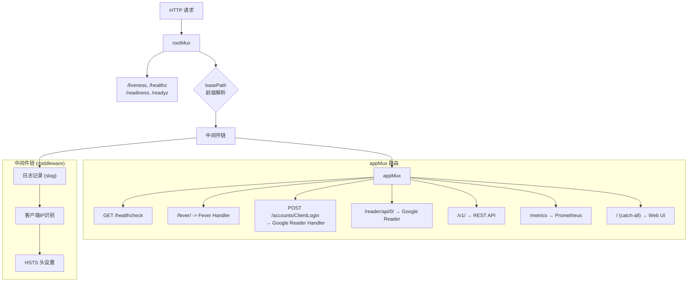

**路由特点** (`internal/http/server/routes.go`)：
- 使用 Go 1.22+ 的 `http.ServeMux` 新模式路由（`"GET /path/{param}"`）
- 支持 `basePath` 前缀剥离
- 健康检查端点在根路径（绕过 basePath）
- 每层路由都可以独立启动/禁用（如 Metrics 可配、API 可配）

**认证中间件链** (REST API)：
```
CORS → API Key 验证 → Basic Auth 验证 → Handler
```

**UI 中间件链**：
```
Web Session 恢复 → CSRF 保护 → Auth Proxy → Handler
```

### 4.5 存储层 (`internal/storage/`)

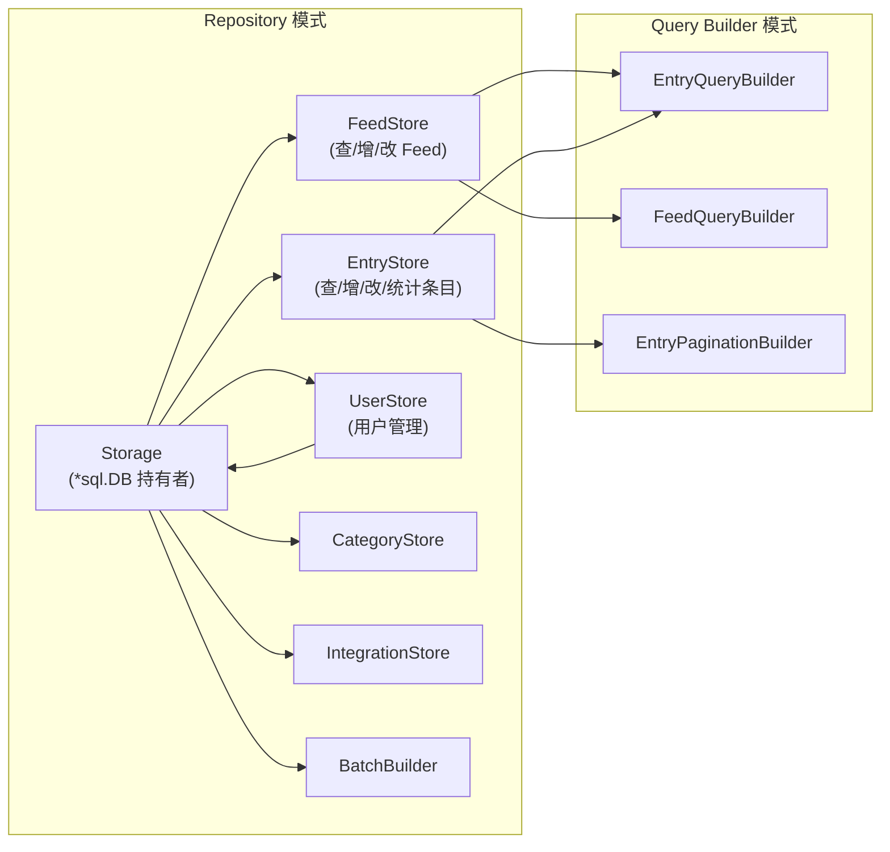

**设计亮点：**
- **不依赖 ORM** — 手写 SQL，完全控制查询性能和优化
- **Query Builder 模式** — 链式调用构造复杂查询（过滤、排序、分页）
- **每存储文件一个实体** — 职责清晰，单个文件通常 200-500 行
- **事务支持** — 关键操作使用数据库事务保证一致性

示例 — EntryQueryBuilder：
```go
queryBuilder := store.NewEntryQueryBuilder(userID)
queryBuilder.WithStatus(model.EntryStatusUnread)
queryBuilder.WithFeedID(feedID)
queryBuilder.WithSorting("published_at", "desc")
queryBuilder.WithLimit(100)
entries, err := queryBuilder.GetEntries()
```

### 4.6 第三方集成层 (`internal/integration/`)

Miniflux 支持 30+ 第三方服务，采用 **策略模式** 统一接口：

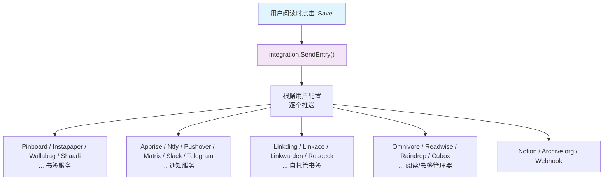

**推送时机：**
1. **自动推送** — Feed 刷新时，新条目自动推送到配置的服务（如 Ntfy、Pushover、Webhook）
2. **手动保存** — 用户点击"保存"按钮时，推送到书签/稍后读服务（如 Pinboard、Instapaper）

**实现模式：** 每个集成是一个独立子包，实现统一的客户端结构体和方法，在 `integration/integration.go` 中组合调度。

### 4.7 API 兼容层

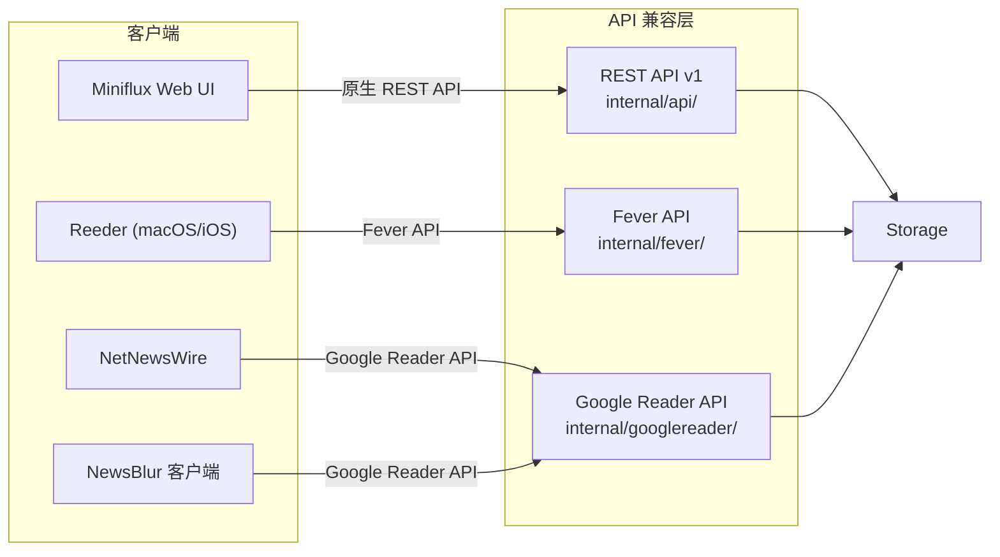

**设计权衡：** 实现 Fever 和 Google Reader API 兼容层使 Miniflux 能直接使用现有生态的 RSS 阅读器客户端，无需开发原生移动应用。这是典型的"兼容性"设计策略。

## 5. 关键设计决策

| 决策 | 选择 | 替代方案 | 理由 |
|------|------|----------|------|
| **数据库选型** | 仅 PostgreSQL | SQLite, MySQL | PostgreSQL 成熟、功能丰富、适合自托管服务器场景；设计决策明确排除嵌入式数据库 |
| **前端渲染** | 服务端渲染（Go 模板） | React/Vue SPA | 极简主义哲学，避免 JS 捆绑。使用 Go `html/template` 生成静态 HTML |
| **HTTP 路由** | Go 1.22+ `http.ServeMux` | gorilla/mux, chi | 减少依赖，利用 Go 标准库新模式路由（路径参数、方法匹配） |
| **Feed 调度** | 两种调度策略 | 仅固定轮询 | 灵活适配不同场景：Round Robin 保证公平，Entry Frequency 自适应活跃度 |
| **认证方式** | 多种并存（本地/OAuth2/代理/WebAuthn） | 单一认证 | 适配不同部署场景（个人/企业/反向代理） |
| **API 兼容** | Fever + Google Reader | 仅 REST API | 零投入获取移动端生态支持 |
| **日志** | `log/slog` 结构化日志 | `logrus`, `zap` | Go 1.21+ 标准库，无需外部依赖 |
| **Worker 并发** | Channel + Goroutine Pool | 第三方队列（Redis/AMQP） | 简单可靠，无外部依赖，适合单进程部署 |
| **HTML 净化** | 自实现 sanitizer | `bluemonday` | 更轻量，仅需支持 RSS 常用标签 |
| **CSS/JS 打包** | 运行时内联嵌入 | 构建时打包 | 单二进制部署，无需外部资源文件 |

### 关键权衡详解

**1. 为什么只有 PostgreSQL？**

> 源码中没有存储抽象层或 ORM，所有 SQL 都是手写的 PostgreSQL 专有语法。这是明确的设计决定：支持多数据库会增加显著的维护成本，而 Miniflux 面向自托管服务器场景，PostgreSQL 是最佳选择。

**2. 为什么不使用前端框架？**

> Miniflux 的极简哲学延伸到了前端。所有页面是服务端渲染的 HTML，通过 Go 的 `html/template` 生成。少量 JavaScript 用于增强交互（标记已读、键盘快捷键等），但整体 JS 代码量极小。这带来了极低的客户端负载和零构建步骤。

**3. 为什么不用 ORM？**

> Go 的 `database/sql` 加上手写 SQL 和 Query Builder 模式提供了完全的控制力。对于 Miniflux 这样数据模型清晰、查询模式固定的应用，ORM 会增加复杂性和性能开销。

## 6. 数据流 / 请求流

### Feed 刷新流程（核心）

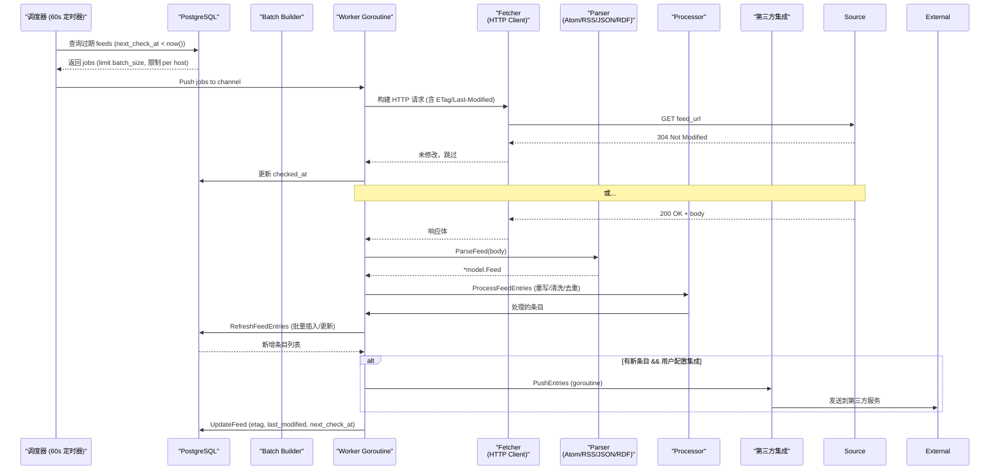

### API 请求流

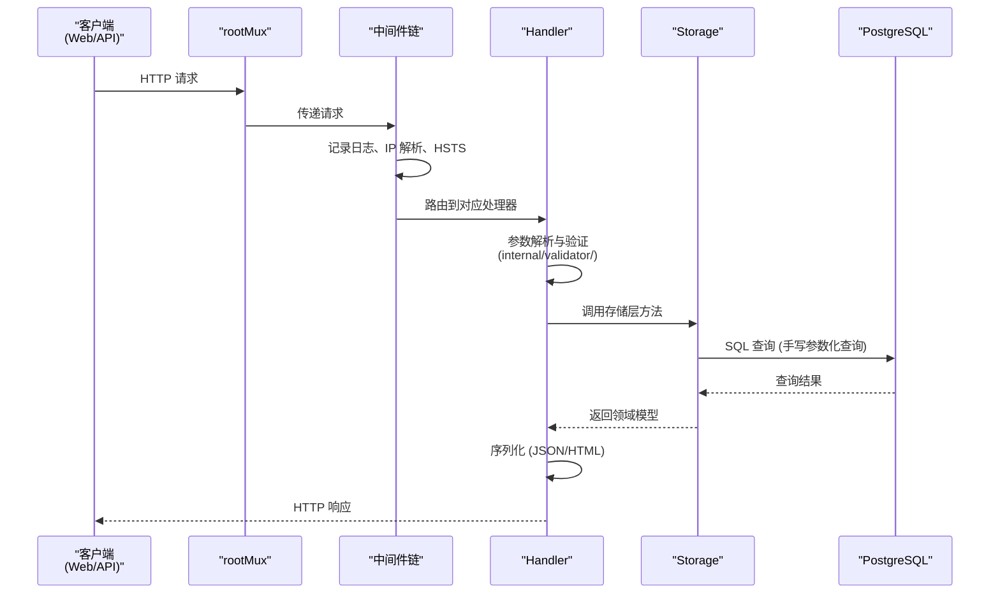

## 7. 设计模式

| 模式名称 | 使用位置 | 目的 |
|----------|----------|------|
| **建造者模式 (Builder)** | `fetcher.NewRequestBuilder()`, `batchBuilder`, `EntryQueryBuilder` | 链式调用构造复杂请求、查询和批处理 |
| **工作池模式 (Worker Pool)** | `worker.Pool` | 管理 Feed 刷新并发 Worker goroutine |
| **策略模式 (Strategy)** | `parser.ParseFeed()` 分发到 atom/rss/json/rdf 解析器 | 统一 Feed 解析接口，支持多种格式 |
| **仓库模式 (Repository)** | `storage.Storage` 及其方法 | 封装数据访问逻辑，统一数据库操作接口 |
| **中间件模式 (Middleware)** | `middleware()`, API 认证中间件链 | 横切关注点（日志、认证、CORS）解耦 |
| **模板方法模式** | `reader/handler.RefreshFeed()` | 定义 Feed 刷新骨架流程，子步骤由不同模块实现 |
| **适配器模式 (Adapter)** | `rss/adapter.go`, `atom/atom_10_adapter.go`, `rdf/adapter.go` | 将不同 Feed 格式标准化为统一 `model.Feed` |
| **外观模式 (Facade)** | `reader/handler` 包 | 对外提供 `CreateFeed()` / `RefreshFeed()` 简化接口 |
| **选项模式 (Functional Options)** | `config.Opts.*` 全局配置访问 | 通过全局 `config.Opts` 统一访问配置项 |
| **空对象模式 (Null Object)** | 各类 `nil` 安全检查与默认值处理 | 减少 nil 判断，使用零值作为安全默认 |

## 8. 工程实践

### 测试策略

测试层级覆盖：

```
📦 单元测试 ─── go test -cover -race -count=1 ./...
├── model 测试（Entry, Feed 等模型逻辑）
├── reader 测试（解析器、fetcher、重写规则）
├── storage 测试（数据库查询逻辑）
├── locale 测试（国际化）
├── http 测试（请求/响应解析）
└── validator 测试

📦 集成测试 ─── make integration-test
├── 启动真实 Miniflux 实例
├── 使用真实 PostgreSQL
└── ./internal/api 的端到端 API 测试

📦 静态分析 ─── make lint
├── go vet
├── gofmt -l（格式检查）
└── golangci-lint
```

**测试特点：**
- **数据驱动测试** — 大量使用表驱动测试（Table-driven tests）
- **无 mock 框架** — 主要使用真实接口测试，少量接口使用 Go 原生 mock 模式
- **竞态检测** — 始终启用 `-race` 标志
- **跨平台** — CI 在 Ubuntu、Windows、macOS 上运行测试

### CI/CD 流程

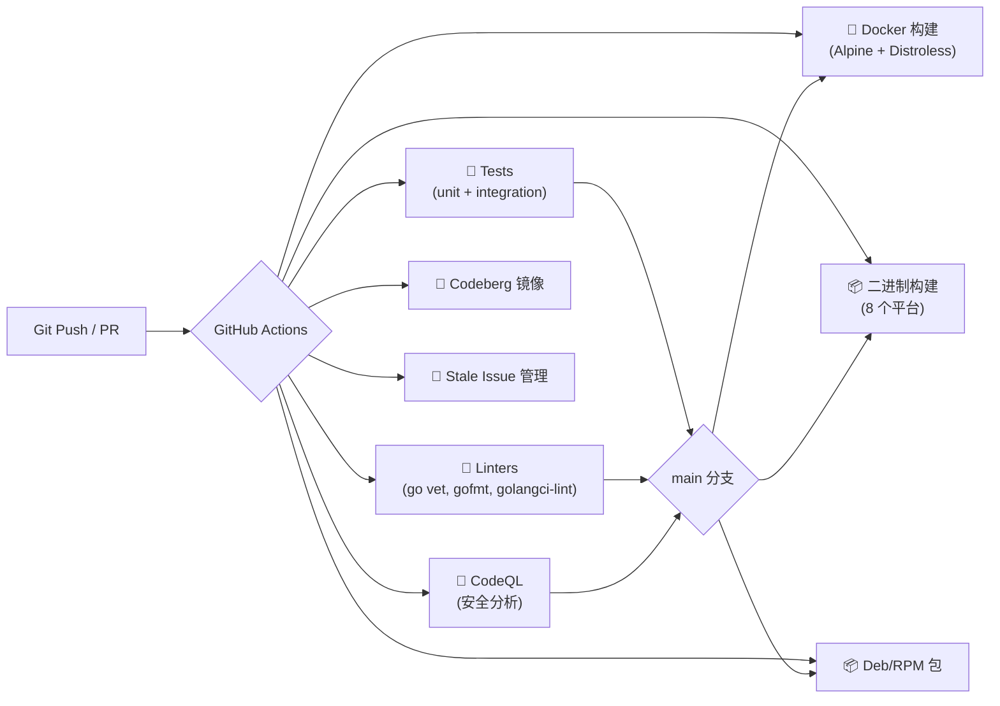

**发布流程：**
1. 打 Git Tag（`v2.x.x`）
2. CI 自动构建多平台二进制（linux amd64/arm64/armv5-7/riscv64, darwin, freebsd, openbsd）
3. CI 自动构建 Docker 镜像并推送（Alpine + Distroless）
4. CI 自动构建 RPM 和 Debian 包

### 依赖管理

- 使用 Go modules（`go.mod` / `go.sum`）
- 依赖数量极少（核心依赖仅 12 个）
- Dependabot 自动更新依赖（`.github/dependabot.yml`）

## 9. 总结与评价

### 亮点

1. **极简但不简陋** — 单二进制部署，依赖极少，但功能完整（RSS 阅读、全文抓取、内容重写、30+ 集成）

2. **清晰的模块化** — `internal/` 下按职责严格分层，包之间依赖关系清晰（从 CLI 到 HTTP 到业务逻辑到存储）

3. **优雅的并发模型** — Go channel + goroutine 的 Worker Pool 模式，简洁高效，无需外部队列

4. **明智的设计权衡** — Fever/Google Reader API 兼容轻松获取移动端生态；仅 PostgreSQL 减小维护负担；服务端渲染消除前端复杂性

5. **完善的内容处理** — 支持 XPath/CSS 的全文抓取、HTML 净化、内容重写规则、URL 重写，为不同来源的 Feed 提供灵活的定制能力

6. **多租户架构** — 原生支持多用户、多分类、权限隔离，可作为小型服务运行

### 可改进之处

1. **无缓存层** — 当前所有请求直接查询 PostgreSQL，高频访问的热门条目可以引入内存缓存（如 `freecache`）

2. **无消息队列抽象** — Worker Pool 直接使用内存 channel，无法在多个实例间共享任务。水平扩展时需引入外部队列

3. **全文搜索有限** — 仅依赖 PostgreSQL `tsvector`，对于大量条目搜索性能可能不足

4. **WebSocket 缺失** — 页面需要轮询获取新条目，可以引入 WebSocket 实现实时推送

5. **富文本编辑器** — 目前内容编辑功能较弱，对于需要修改条目的场景支持不足

6. **配置热加载** — 配置修改需要重启进程，可以增加信号处理或监听文件变更

## 参考

- [Miniflux 官方文档](https://miniflux.app/docs/index.html)
- [GitHub 仓库](https://github.com/miniflux/v2)
- [Go 标准库 net/http.ServeMux](https://pkg.go.dev/net/http#ServeMux) (Go 1.22+ 新模式路由)
- [PostgreSQL 文档](https://www.postgresql.org/docs/)
