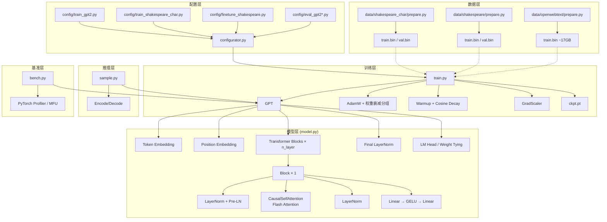
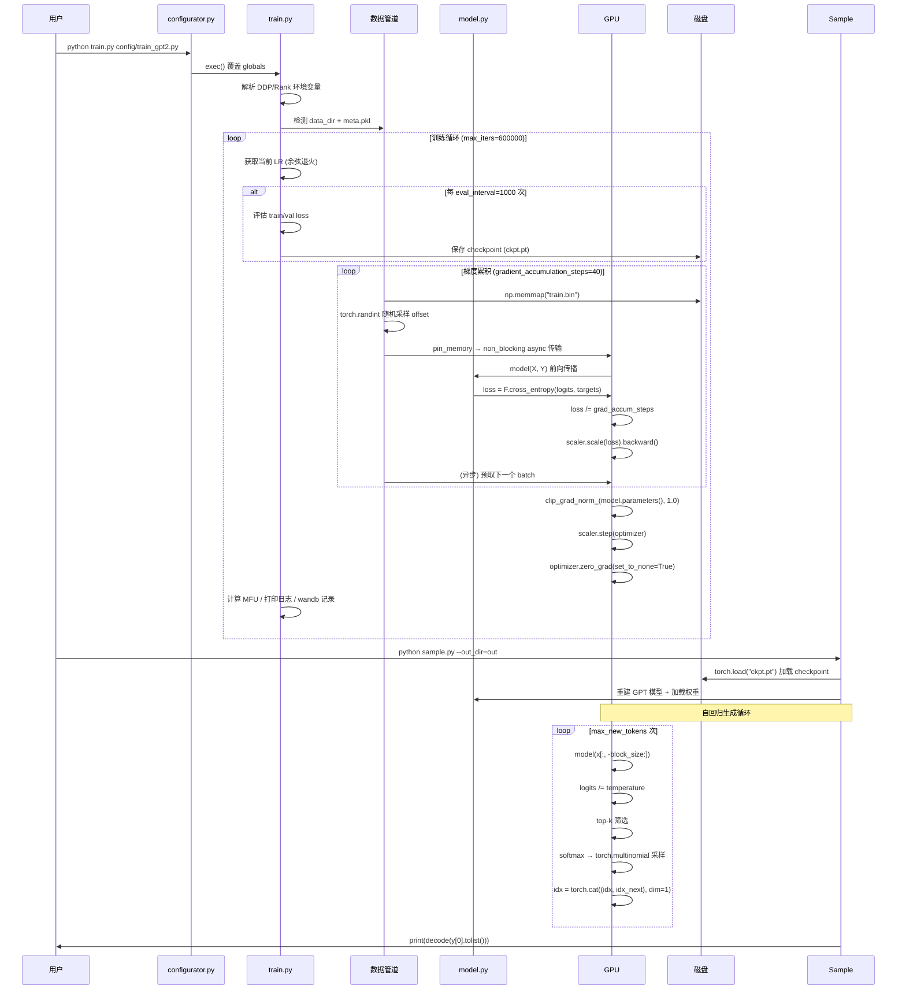

# nanoGPT 架构分析

> 分析版本：最终版 ｜ 分析日期：2026-05-09

## 1. 项目概览

| 项目 | 信息 |
|------|------|
| 官网 | — |
| GitHub | [github.com/karpathy/nanogpt](https://github.com/karpathy/nanogpt) |
| 编程语言 | Python |
| Star 数 | ~32k |
| 许可证 | MIT |
| 核心维护者 | Andrej Karpathy |

**项目简介**

nanoGPT 是 Andrej Karpathy 开发的最简最快的中等规模 GPT 训练/微调框架，是 minGPT 的重写，追求效率胜于教育性。项目采用极简单体架构，核心逻辑集中在 `train.py`（~300行）和 `model.py`（~350行）两个文件中。

## 2. 技术栈

| 类别 | 技术选型 |
|------|----------|
| 编程语言 | Python |
| 深度学习框架 | PyTorch (torch.compile, Flash Attention, AMP) |
| 分布式训练 | PyTorch DDP |
| 分词工具 | tiktoken (GPT-2 BPE) / 字符映射 |
| 数据存储 | numpy memmap (.bin 二进制文件) |
| 混合精度 | bfloat16 / float16 + GradScaler |
| 优化器 | AdamW (fused 变体) |
| 配置系统 | Python exec() 动态加载 |
| 日志 | print + wandb (可选) |
| 测试 | 无 |
| CI/CD | 无 |

## 3. 整体架构



### 架构分层

项目采用极简单体架构，没有任何抽象层或插件系统。所有代码集中在15个Python文件中，核心逻辑由两个主要文件承载：模型定义层 (`model.py`) 和训练/推理层 (`train.py`, `sample.py`, `bench.py`)。配置层通过 `configurator.py` 和 `config/*.py` 实现动态覆盖。数据准备层独立在 `data/` 目录下，生成 `.bin` 二进制文件供训练使用。

### 模块职责

| 模块 | 职责 | 关键文件/目录 |
|------|------|---------------|
| 模型定义 | GPT Transformer 全部实现 (Config → Block → Attention → MLP → GPT) | `model.py` (~350行) |
| 训练管道 | 完整训练循环：数据加载、前向/反向传播、LR调度、DDP、Checkpoint | `train.py` (~300行) |
| 推理采样 | 自回归生成：温度采样、top-k 采样 | `sample.py` (~100行) |
| 性能基准 | 简化版训练循环 + MFU 计算 + PyTorch Profiler | `bench.py` (~120行) |
| 配置系统 | Python 动态配置覆盖机制 | `configurator.py` (~30行) |
| 配置文件 | 各场景的超参数预设 | `config/*.py` (~10-20行 each) |
| 数据准备 | 文本 → 分箱 token 二进制文件的完整处理 | `data/*/prepare.py` (~50-90行 each) |

## 4. 核心模块详解

### 4.1 GPT 模型 (`model.py`)

nanoGPT 实现了标准的 **Decoder-only Transformer** 架构，完全对齐 GPT-2 论文。

**关键实现细节**：
- **GPTConfig**：使用 `@dataclass` 定义配置，包含 block_size、vocab_size、n_layer、n_head、n_embd、dropout、bias。
- **CausalSelfAttention**：运行时自动检测 Flash Attention (`torch.nn.functional.scaled_dot_product_attention`)，若不可用则退回到手动因果掩码实现。
- **MLP**：仅 5 行代码，`Linear → GELU → Linear`，内部维度扩展 4 倍。
- **Pre-LayerNorm 残差连接**：每个 Block 采用 `x = x + Attention(LayerNorm(x))` 和 `x = x + MLP(LayerNorm(x))`。
- **Weight Tying**：Token Embedding 和 LM Head 共享权重矩阵 (`self.transformer.wte.weight = self.lm_head.weight`)。
- **特殊残差初始化**：深层残差投影的初始化标准差除以 `√(2·n_layer)`，防止激活值爆炸。
- **生成优化**：推理时 `logits = self.lm_head(x[:, [-1], :])` 只计算最后一个位置，节省大量计算。
- **模型手术**：`crop_block_size()` 运行时缩小上下文长度，适用于资源受限设备。
- **Pretrained 权重加载**：`from_pretrained()` 从 HuggingFace 加载 OpenAI GPT-2 权重，支持四种尺寸 (gpt2/medium/large/xl)。

### 4.2 训练管道 (`train.py`)

训练循环设计体现了极致的原则性简洁。关键设计特性：
- **梯度累积**：通过 `gradient_accumulation_steps` 模拟大 batch size，每个 micro_step 后异步预取下一 batch，DDP 下仅在最后一个 micro_step 同步梯度。
- **DDP 分布式训练**：自动检测 `RANK` 环境变量，支持 `torchrun` 启动（单节点/多节点）。
- **余弦学习率 + 线性 Warmup**：严格遵循 Chinchilla 缩放法则，`min_lr = learning_rate / 10`，`warmup_iters = 2000`。
- **自动混合精度**：优先 `bfloat16`，回退 `float16` + GradScaler，CPU 下使用 `nullcontext()`。
- **MFU 计算**：基于 PaLM 论文附录 B，实时计算模型 FLOPs 利用率，在 A100 上 GPT-2 (124M) 通常为 40-55%。
- **AdamW 优化器配置**：所有 2D 参数做 weight decay，1D 参数不做；自动检测 fused AdamW 并启用。

### 4.3 配置系统 (`configurator.py`)

只有 30 行代码，使用 `exec()` 动态加载配置脚本并覆盖全局变量。工作流：
```
默认值 → exec(config/*.py) → 逐个处理 --key=value CLI 参数 → 最终 globals 字典 → 训练循环使用
```
**权衡**：零学习曲线 vs. `exec()` 安全风险；无限灵活 vs. 配置与实现耦合；无配置库依赖 vs. 不可追踪。

### 4.4 数据流水线

三种数据集场景：

| 场景 | 分词器 | 数据集规模 | 词表大小 | 典型用途 |
|------|--------|-----------|---------|---------|
| 字符级 | 字符映射 | ~1M 字符 | 65 | 快速原型/CPU训练 |
| 小型微调 | GPT-2 BPE (tiktoken) | ~300K tokens | 50257 | 微调GPT-2 |
| 完整训练 | GPT-2 BPE (tiktoken) | ~9B tokens | 50257 | GPT-2 复现 |

**关键工程决策**：
- 使用 numpy memmap 加载数据，每次调用 `get_batch` 重建 mmap 以避免 PyTorch 内存泄漏。
- 存储使用 `uint16`（GPT-2 最大 token ID 50256 < 65536），比 int32 节省 50% 磁盘空间和 IO 带宽。

## 5. 关键设计决策

| 决策 | 选择 | 替代方案 | 理由 |
|------|------|----------|------|
| 模型定义结构 | 单文件 (~350行) | 模块化分层（如HuggingFace） | 极致可读性，一个文件理解全部Transformer细节 |
| 配置系统 | Python `exec()` 动态覆盖 | YAML/JSON结构化配置 | 零复杂度，无限灵活，无需额外依赖 |
| 分布式训练 | PyTorch DDP | FSDP | 成熟稳定，适合124M-1.5B参数规模，代码开销小（仅3行） |
| 数据加载 | numpy memmap + 手动索引 | PyTorch DataLoader | 极简，零内存膨胀，显式解决内存泄漏 |
| 存储格式 | uint16 .bin 文件 | int32 .bin | 节省50%磁盘和IO带宽，GPT-2词表50257 < 65536 |
| 推理LM Head | 仅计算最后位置 | 计算全部位置 | 减少500x计算量（10样本×500 tokens） |
| 词表大小 | 向上取整到64的倍数 | 精确使用50257 | 对齐Tensor Core，提升矩阵乘法效率 |
| 测试/CI | 无 | pytest/unittest/GitHub Actions | 极简单体哲学，作者假定用户通过实际运行验证 |

## 6. 数据流 / 请求流



## 7. 设计模式

| 模式名称 | 使用位置 | 目的 |
|----------|----------|------|
| 单体模式 (Monolith) | 整个项目 | 没有抽象层，只有纯 Python 函数和模块 |
| 策略模式 | `model.py` | `init_from` 参数切换不同初始化策略（scratch/resume/gpt2*） |
| 享元模式 / Weight Tying | `model.py` | Embedding 层和 LM Head 共享权重矩阵 |
| 空对象模式 | `train.py` | `ctx = nullcontext()` CPU 模式下替代 autocast |
| 工厂方法 | `model.py` | `from_pretrained()` 类方法根据模型类型创建不同尺寸的 GPT |
| 装饰器模式 | `train.py` / `model.py` | `@torch.no_grad()` 评估模式；`@dataclass` 配置类 |
| 数据分片 (Sharding) | `data/openwebtext/prepare.py` | `dataset.shard(1024)` 并行写入 mmap 文件 |
| 模型手术 (Model Surgery) | `model.py` | `crop_block_size()` 运行时裁剪已训练模型 |
| 条件最优路径 | `model.py` / `train.py` | Flash Attention 自动检测；fused AdamW 自动检测；AMP 自动选择 |
| 模板方法 | `train.py` | 共享的训练循环骨架，子步骤由配置参数控制 |

## 8. 工程实践

### 测试策略

无任何自动化测试。仓库中没有 `test/` 目录，没有 pytest/unittest 文件，没有单测/集成测试/端到端测试。验证方式：实际跑训练并观察 loss 曲线。

### 发布流程

无版本标签，无正式发布流程。项目已由 [nanochat](https://github.com/karpathy/nanochat) 取代（截至2025年11月）。

### 版本管理

- Commit 数量：仅约10个
- 分支策略：单一 master 分支
- 版本标签：无
- Git LFS：未使用（.bin 文件通过 .gitignore 排除）
- 依赖管理：README 中手动列出，无 requirements.txt / pyproject.toml

## 9. 总结与评价

### 亮点

- **成功复现 GPT-2 (124M)**：在 8×A100 节点上 4 天训练至 loss ~2.85
- **极致简洁**：开发者只需阅读 ~650 行代码就能理解 GPT 训练全流程
- **零配置学习曲线**：无需理解框架约定，直接修改全局变量
- **行业级性能**：Flash Attention、fused AdamW、torch.compile、bfloat16 全部支持
- **文档充分**：README 详尽，代码注释引用关键论文

### 可改进之处

- **无自动化测试**：修改风险高，依赖作者手动验证
- **无 CI/CD**：多环境兼容性无法保证
- **`exec()` 配置安全性**：存在任意代码执行风险
- **不可扩展**：添加 MoE、ALiBi 等特性需要大幅重构
- **不适用于生产**：缺乏错误处理、日志、配置验证等工程化基础设施

## 参考

- nanoGPT GitHub 仓库: https://github.com/karpathy/nanogpt (commit 3adf61e)
- OpenAI GPT-2 论文: Language Models are Unsupervised Multitask Learners
- Chinchilla 缩放法则: Training Compute-Optimal Large Language Models
- PaLM 论文: Scaling Language Modeling with Pathways (附录 B MFU 计算方法)
- Weight Tying: Press & Wolf (2017), Using the Output Embedding to Improve Language Models
- Flash Attention: Dao et al. (2022), FlashAttention: Fast and Memory-Efficient Exact Attention
