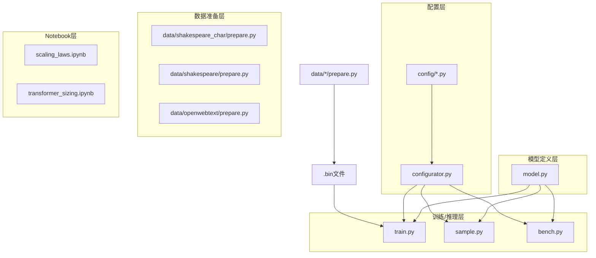
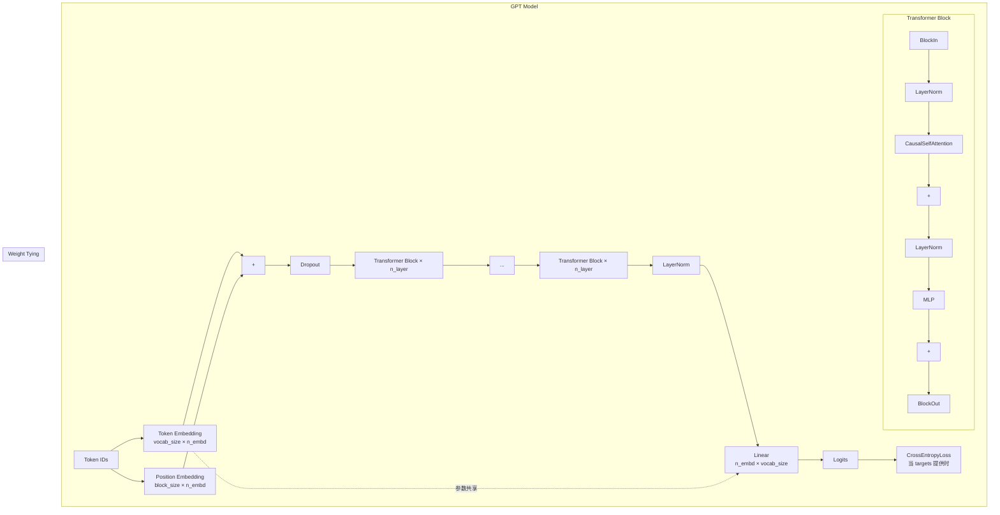
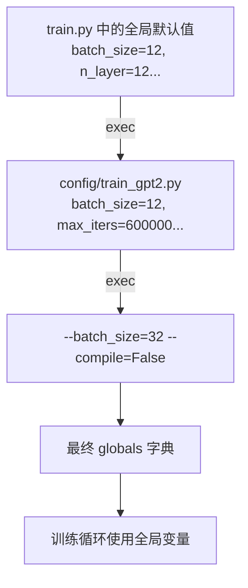
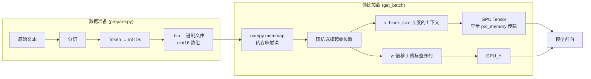
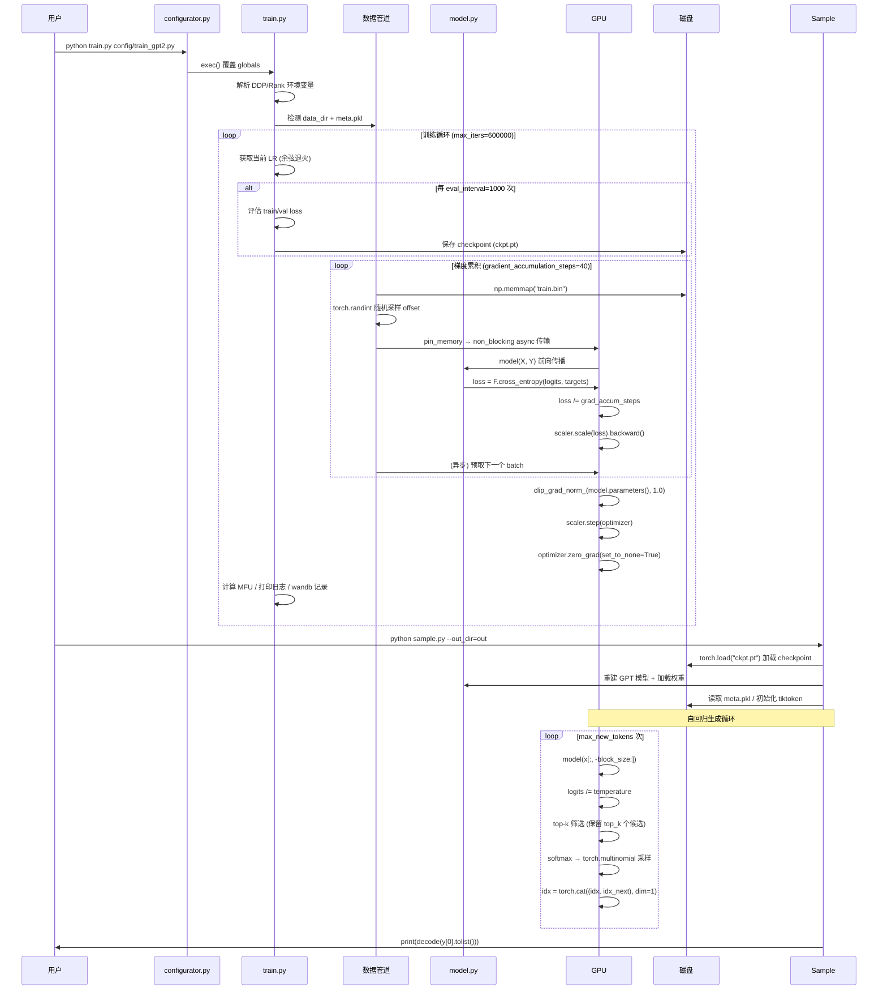
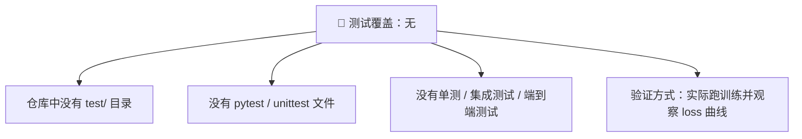
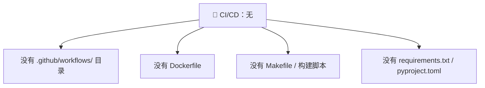
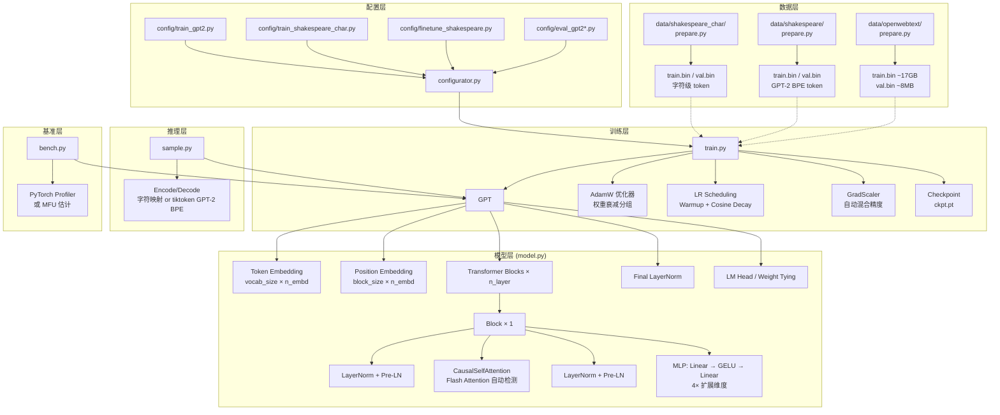

# nanoGPT 深度架构分析报告

> **分析日期**: 2026-05-09
> **项目版本**: 最终版（已由 [nanochat](https://github.com/karpathy/nanochat) 取代）
> **分析来源**: [github.com/karpathy/nanogpt](https://github.com/karpathy/nanogpt)

---

## 一、项目概览

| 元数据 | 信息 |
|--------|------|
| **项目** | nanoGPT — 最简最快的中等规模 GPT 训练/微调框架 |
| **作者** | Andrej Karpathy |
| **定位** | minGPT 的重写，**追求效率胜于教育性** |
| **架构风格** | 极简单体架构 |
| **核心文件** | `train.py` (~300行) + `model.py` (~350行) |
| **License** | MIT |

> ⚠️ **2025年11月更新**: nanoGPT 已被 [nanochat](https://github.com/karpathy/nanochat) 取代，本文分析基于历史版本。

---

## 二、整体架构与模块划分

nanoGPT 采用 **极简单体架构** —— 没有任何抽象层、没有插件系统、没有复杂的包结构。项目只有 15 个 Python 文件，核心逻辑集中在两个文件内：

### 文件清单

```
nanoGPT/
├── model.py              # GPT Transformer 模型定义 (~350行)
├── train.py              # 完整训练管道 (~300行)
├── sample.py             # 推理/采样 (~100行)
├── bench.py              # 性能基准测试 (~120行)
├── configurator.py       # Python 动态配置系统 (~30行)
├── config/
│   ├── train_gpt2.py              # GPT-2 (124M) 训练配置
│   ├── train_shakespeare_char.py  # 字符级 Shakespeare 训练
│   ├── finetune_shakespeare.py    # 微调 Shakespeare 配置
│   ├── eval_gpt2.py               # GPT-2 (124M) 评估
│   ├── eval_gpt2_medium.py        # GPT-2 Medium (350M)
│   ├── eval_gpt2_large.py         # GPT-2 Large (774M)
│   └── eval_gpt2_xl.py            # GPT-2 XL (1558M)
├── data/
│   ├── shakespeare_char/prepare.py  # 字符级分词数据准备
│   ├── shakespeare/prepare.py       # GPT-2 BPE 分词数据准备
│   └── openwebtext/prepare.py       # 完整 WebText 数据集准备
└── *.ipynb                 # 缩放法则 / Transformer 尺寸分析 Notebook
```

### 模块依赖关系



### 各模块职责

| 模块 | 文件 | 行数 | 职责 |
|------|------|------|------|
| **模型定义** | `model.py` | ~350 | GPT Transformer 全部实现（Config → Block → Attention → MLP → GPT） |
| **训练管道** | `train.py` | ~300 | 完整训练循环：数据加载、前向/反向传播、LR调度、DDP、Checkpoint |
| **推理采样** | `sample.py` | ~100 | 自回归生成：温度采样、top-k 采样 |
| **性能基准** | `bench.py` | ~120 | 简化版训练循环 + MFU 计算 + PyTorch Profiler |
| **配置系统** | `configurator.py` | ~30 | Python 动态配置覆盖机制 |
| **配置文件** | `config/*.py` | ~10-20 each | 各场景的超参数预设 |
| **数据准备** | `data/*/prepare.py` | ~50-90 each | 文本 → 分箱 token 二进制文件的完整处理 |

---

## 三、核心模块的设计与实现

### 3.1 模型架构 (`model.py`)

nanoGPT 实现了标准的 **Decoder-only Transformer** 架构，完全对齐 GPT-2 论文：



#### (a) GPTConfig —— 数据类型驱动的配置

```python
@dataclass
class GPTConfig:
    block_size: int = 1024       # 最大上下文长度
    vocab_size: int = 50304      # 词表大小（50257 向上取整到 64 的倍数）
    n_layer: int = 12            # Transformer 层数
    n_head: int = 12             # 注意力头数
    n_embd: int = 768            # 嵌入维度
    dropout: float = 0.0         # Dropout 比率（预训练时通常为 0）
    bias: bool = True            # Linear/LayerNorm 是否使用 bias
```

没有 YAML、没有 JSON、没有配置类的继承层级。一个 `@dataclass` 就够了。

#### (b) CausalSelfAttention —— 运行时自动检测的 Flash Attention

这是性能最关键的部分，体现了 **条件最优路径** 的设计：

```python
self.flash = hasattr(torch.nn.functional, 'scaled_dot_product_attention')
if not self.flash:
    # 回退到手动实现的因果注意力掩码
    self.register_buffer("bias", torch.tril(...))
```

- **Flash Attention 路径**：使用 PyTorch 2.0 的 `scaled_dot_product_attention(is_causal=True)`，利用高效 CUDA kernel
- **回退路径**：手动计算 QK^T → 三角掩码 → softmax → dropout → weighted sum
- QKV 通过一个大的 `nn.Linear(3 × n_embd)` 投影后再 split，这是 GPT-2 的标准做法（一次矩阵乘法比三次更高效）

#### (c) MLP —— 仅 5 行的前馈网络

```python
class MLP(nn.Module):
    def __init__(self, config):
        super().__init__()
        self.c_fc    = nn.Linear(config.n_embd, 4 * config.n_embd, bias=config.bias)
        self.gelu    = nn.GELU()
        self.c_proj  = nn.Linear(4 * config.n_embd, config.n_embd, bias=config.bias)
        self.dropout = nn.Dropout(config.dropout)

    def forward(self, x):
        x = self.c_fc(x)       # 投影到 4x 内部维度
        x = self.gelu(x)       # GELU 激活
        x = self.c_proj(x)     # 投影回模型维度
        x = self.dropout(x)
        return x
```

GPT-2 使用 **approx GELU**（`torch.nn.GELU()` 在 PyTorch 中自动处理），没有使用其他变体（如 SwiGLU 等需要 3 个投影矩阵的架构）。

#### (d) Pre-LayerNorm 残差连接

每个 Block 遵循 **Pre-LN** 模式：

```
x = x + Attention(LayerNorm(x))
x = x + MLP(LayerNorm(x))
```

与原始 Transformer 的 Post-LN 不同，Pre-LN 在大模型中训练更稳定。

#### (e) Weight Tying（权重绑定）

```python
self.transformer.wte.weight = self.lm_head.weight
```

Token Embedding 和 LM Head 共享权重矩阵。这是 GPT 系列中一项关键的参数效率优化，最早由 Press & Wolf (2017) 提出。

#### (f) 特殊的残差初始化

```python
# GPT-2 论文中的特殊初始化
for pn, p in self.named_parameters():
    if pn.endswith('c_proj.weight'):
        torch.nn.init.normal_(p, mean=0.0, std=0.02/math.sqrt(2 * config.n_layer))
```

越深的模型，残差投影的初始化标准差越小（除以 `√(2·n_layer)`），防止深层网络中的激活值爆炸。这正是 GPT-2 成功训练 48 层的关键技巧之一。

#### (g) 生成接口

```python
@torch.no_grad()
def generate(self, idx, max_new_tokens, temperature=1.0, top_k=None):
```

自回归生成的核心循环：
1. 根据 `block_size` 裁剪输入上下文（过长的部分被丢弃）
2. 单步前向，只取最后一个 token 的 logits
3. 温度缩放 → 可选 top-k 筛选 → softmax → 采样 → 拼接

**关键推理优化**：当 `targets=None` 时，只计算最后一个位置的 LM Head 投影：
```python
logits = self.lm_head(x[:, [-1], :])  # 只在最后位置计算
```
这在较长的推理中能节省大量计算（避免对整个序列做 vocab_size × n_embd 的大矩阵乘法）。

#### (h) 模型手术 (Model Surgery)

```python
def crop_block_size(self, block_size):
    # 运行时缩小模型上下文长度
    self.transformer.wpe.weight = nn.Parameter(self.transformer.wpe.weight[:block_size])
    for block in self.transformer.h:
        if hasattr(block.attn, 'bias'):
            block.attn.bias = block.attn.bias[:,:,:block_size,:block_size]
```

从 HuggingFace 加载 GPT-2 预训练权重（block_size=1024）后，可以裁剪到更小的上下文长度，这在资源受限的设备上非常有用。

#### (i) Pretrained 权重加载

```python
@classmethod
def from_pretrained(cls, model_type, override_args=None):
```

这是整个项目中**最复杂的函数**，承担了从 HuggingFace Transformers 加载 OpenAI GPT-2 权重的桥梁作用：
- 定义四种尺寸（gpt2 / medium / large / xl）的架构参数
- 遍历 HuggingFace 的 `state_dict`，将 Conv1D 权重转置为 Linear 权重
- 严格校验参数名称和形状的匹配
- 只允许 override dropout（其他参数不可覆盖）

加载完成后，模型可以通过 `torch.compile()` 进一步优化，并且在微调时可以获得比原始 GPT-2 checkpoint 更好的 loss（约 2.85 vs 3.11，因域差距导致）。

---

### 3.2 训练管道 (`train.py`)

训练循环的设计体现了极致的 **principled simplicity**：

```mermaid
graph LR
    subgraph "训练循环"
        Start[初始化模型] --> TrainLoop{iter_num < max_iters}
        TrainLoop --> LR[余弦退火 LR 调度]
        LR --> EvalCheck{每 eval_interval 次}
        EvalCheck -->|是| EvalLoss[评估 train/val loss]
        EvalLoss --> Checkpoint[保存 checkpoint]
        Checkpoint --> FwdBwd
        EvalCheck -->|否| FwdBwd
        
        subgraph "单步训练"
            FwdBwd[Gradient Accumulation<br/>循环 micro_step 次] 
            FwdBwd --> WithCtx[autocast 上下文]
            WithCtx --> Forward[model(X, Y) → logits, loss]
            Forward --> ScaleLoss[loss /= grad_accum_steps]
            ScaleLoss --> Prefetch[异步预取下个 batch]
            Prefetch --> Backward[scaler.scale(loss).backward]
            Backward --> EndAccum
            EndAccum --> ClipGrad[梯度裁剪 grad_norm=1.0]
            ClipGrad --> Step[scaler.step(optimizer)]
            Step --> ZeroGrad[optimizer.zero_grad]
        end
        
        FwdBwd --> Logging[打印 loss / MFU / wandb]
        Logging --> IterInc[iter_num++]
        IterInc --> TrainLoop
    end
```

#### 关键设计特性

**1. 梯度累积 (Gradient Accumulation)**

```python
for micro_step in range(gradient_accumulation_steps):
    with ctx:
        logits, loss = model(X, Y)
        loss = loss / gradient_accumulation_steps   # 缩放 loss
    X, Y = get_batch('train')                       # 异步预取下个 batch
    scaler.scale(loss).backward()
```

- 模拟大 batch size 训练（例如 12 × 1024 × 5 × 8 = ~500K tokens/iter）
- 每个 micro_step 后立即预取下一 batch，最大化 GPU 利用率
- DDP 下仅在最后一个 micro_step 同步梯度

**2. DDP 分布式训练**

自动检测 `RANK` 环境变量以判断是否分布式训练：

```python
ddp = int(os.environ.get('RANK', -1)) != -1
```

支持 `torchrun` CLI 启动：
```bash
# 单节点 8 GPU
torchrun --standalone --nproc_per_node=8 train.py config/train_gpt2.py

# 双节点 16 GPU
torchrun --nproc_per_node=8 --nnodes=2 --node_rank=0 --master_addr=... train.py
```

梯度累积步数自动按 `world_size` 缩放：
```python
gradient_accumulation_steps //= ddp_world_size
```

**3. 余弦学习率 + 线性 Warmup**

严格遵循 Chinchilla 缩放法则：

```python
def get_lr(it):
    if it < warmup_iters:                          # 线性 Warmup
        return learning_rate * (it + 1) / (warmup_iters + 1)
    if it > lr_decay_iters:                        # 保持 min_lr
        return min_lr
    decay_ratio = (it - warmup_iters) / (lr_decay_iters - warmup_iters)
    coeff = 0.5 * (1.0 + math.cos(math.pi * decay_ratio))  # 余弦衰减
    return min_lr + coeff * (learning_rate - min_lr)
```

- `min_lr = learning_rate / 10`（Chinchilla 建议）
- `warmup_iters = 2000`（GPT-2 复现配置）
- `lr_decay_iters = max_iters`

**4. 自动混合精度 (AMP)**

```python
dtype = 'bfloat16' if torch.cuda.is_available() and torch.cuda.is_bf16_supported() else 'float16'
```

- `bfloat16` 优先（无需 GradScaler，数值稳定）
- `float16` 自动启用 GradScaler（防止梯度下溢）
- CPU 模式下使用 `nullcontext()` 零开销

**5. MFU (Model Flops Utilization) 计算**

```python
flops_per_token = 6*N + 12*L*H*Q*T    # PaLM 论文附录 B
flops_per_fwdbwd = flops_per_token * T
mfu = flops_achieved / flops_promised  # A100 bfloat16 峰值 312 TFLOPS
```

实时监控模型利用率的业界标准指标。GPT-2 (124M) 在 A100 上 MFU 通常为 40-55%。

**6. Optimizer 配置 —— AdamW + weight decay 分组**

```python
# 所有 2D 参数（权重矩阵 + embedding）做 weight decay
# 所有 1D 参数（bias + layernorm）不做 weight decay
decay_params = [p for n, p in param_dict.items() if p.dim() >= 2]
nodecay_params = [p for n, p in param_dict.items() if p.dim() < 2]
opt_groups = [
    {'params': decay_params, 'weight_decay': weight_decay},      # 通常 0.1
    {'params': nodecay_params, 'weight_decay': 0.0}
]
```

detect fused AdamW 并启用（CUDA 上约 5-10% 加速）。

---

### 3.3 配置系统 (`configurator.py`)

只有 **30 行代码**，但这是项目中**最具有争议**的设计决策。

```python
import sys
from ast import literal_eval

for arg in sys.argv[1:]:
    if '=' not in arg:
        # 视为配置文件 → exec() 运行
        exec(open(arg).read())
    else:
        # --key=value → 覆盖 globals()
        key, val = arg.split('=')
        key = key[2:]
        globals()[key] = literal_eval(val)  # 或 str fallback
```

#### 工作流



#### 调用示例

```bash
python train.py config/train_shakespeare_char.py --batch_size=64 --compile=False --device=cpu
```

1. 先运行 `train_shakespeare_char.py`（覆盖 globals 中的超参数）
2. 再逐个处理 `--key=value` 参数

#### 权衡分析

| 优势 | 代价 |
|------|------|
| ✅ 零学习曲线 —— Python 本身就是配置语言 | ❌ `exec()` 的安全风险 |
| ✅ 类型安全 —— `literal_eval` 自动类型推断 | ❌ 全局变量污染 —— 配置与实现耦合 |
| ✅ 无配置库依赖 | ❌ 不可追踪 —— 无法做配置 diff/merge |
| ✅ 无限灵活 —— 配置中可包含任意 Python 逻辑 | ❌ 配置验证缺失 |

---

### 3.4 数据流水线 (Data Pipeline)



#### 三种数据集场景对比

| 场景 | 准备脚本 | 分词器 | 数据集规模 | 词表大小 | 典型用途 |
|------|---------|--------|-----------|---------|---------|
| **字符级** | `data/shakespeare_char/prepare.py` | 字符映射 | ~1M 字符 | 65 | 快速原型/教育/CPU 训练 |
| **小型微调** | `data/shakespeare/prepare.py` | GPT-2 BPE (tiktoken) | ~300K tokens | 50257 | 在莎士比亚上微调 GPT-2 |
| **完整训练** | `data/openwebtext/prepare.py` | GPT-2 BPE (tiktoken) | ~9B tokens | 50257 | 正经的 GPT-2 复现 |

#### 数据准备详解

**字符级 (shakespeare_char)**：
```
文本 → 提取唯一字符集 (65个) → 字符→ID 映射 → 90%/10% 分割 → uint16 .bin
```

**GPT-2 BPE (shakespeare & openwebtext)**：
```
文本 → tiktoken.get_encoding("gpt2") → encode_ordinary → 追加 EOT(50256) → uint16 .bin
```

**OpenWebText 大规模处理**：
```
load_dataset("openwebtext") → 8M 文档
  → train_test_split(0.0005) → 8,009,762 train / 4,007 val
  → .map(process, num_proc=8) → tokenize
  → .shard(1024) → 分块写入 memmap
```

OpenWebText 结果：训练集 ~9,035,582,198 tokens（~17GB），验证集 ~4,434,897 tokens（~8.5MB）。

#### 关键工程决策：numpy memmap 数据加载

```python
def get_batch(split):
    data = np.memmap(os.path.join(data_dir, f'{split}.bin'), dtype=np.uint16, mode='r')
    ix = torch.randint(len(data) - block_size, (batch_size,))
    x = torch.stack([torch.from_numpy((data[i:i+block_size]).astype(np.int64)) for i in ix])
    y = torch.stack([torch.from_numpy((data[i+1:i+1+block_size]).astype(np.int64)) for i in ix])
    x, y = x.pin_memory().to(device, non_blocking=True), y.pin_memory().to(device, non_blocking=True)
    return x, y
```

**每次调用都重新创建 memmap** — 这是有意为之的，用于避免 PyTorch 中的 memmap 内存泄漏（参考链接：StackOverflow #45132940）。

**为什么用 uint16？** GPT-2 最大 token ID 是 50256 < 2^16=65536，所以 uint16 足够。相比 int32 节省 50% 磁盘空间和 IO 带宽。

---

## 四、使用的关键设计模式

| 模式 | 位置 | 描述 |
|------|------|------|
| **单体模式 (Monolith)** | 整个项目 | 没有抽象层，没有插件，只有纯 Python 函数和模块 |
| **策略模式** | 模型初始化 | `init_from` 参数（`scratch` / `resume` / `gpt2*`）切换不同初始化策略 |
| **享元模式 / Weight Tying** | `model.py` | Embedding 层和 LM Head 共享同一个权重矩阵 |
| **空对象模式** | `train.py` | `ctx = nullcontext()` 在 CPU 模式下替代 autocast，零开销 |
| **工厂方法** | `model.py` | `from_pretrained()` 类方法根据模型类型创建不同尺寸的 GPT |
| **装饰器模式** | `train.py` / `model.py` | `@torch.no_grad()` 评估模式；`@dataclass` 配置类 |
| **数据分片 (Sharding)** | `data/openwebtext/prepare.py` | `dataset.shard(1024)` 并行写入 mmap 文件 |
| **模型手术 (Model Surgery)** | `model.py` | `crop_block_size()` 运行时裁剪已训练模型的维度 |
| **条件最优路径** | `model.py` / `train.py` | Flash Attention 自动检测；fused AdamW 自动检测；AMP 自动选择 |
| **模板方法** | `train.py` | 共享的训练循环骨架，子步骤由配置参数控制 |

---

## 五、重要设计决策及权衡

### 决策 1：单文件模型定义 vs. 模块化分层

**选择**：~350 行的单一 `model.py` 文件

| ✅ 优势 | ❌ 代价 |
|---------|---------|
| 通读一个文件即可理解全部 Transformer 实现细节 | 不可复用 —— 其他项目无法单独 import Attention |
| 没有抽象障碍，任何人都可以直接修改 | 难以扩展 —— 添加 MoE、ALiBi 等会膨胀文件 |
| 零额外依赖（除 PyTorch 外） | 运行时没有可插拔的组件机制 |

**对比 HuggingFace Transformers**：HF 的 GPT-2 实现分散在 5+ 文件和层层抽象中（Configuration → PreTrainedModel → GPT2Model → GPT2Block → GPT2Attention → ...）。nanoGPT 的模型代码可读性极高，但缺乏 HF 的灵活性和可配置性。

### 决策 2：`exec()` 配置 vs. 结构化配置

**选择**：使用 Python `exec()` 动态加载配置并覆盖全局变量

| ✅ 优势 | ❌ 代价 |
|---------|---------|
| 零复杂度：不需要 YAML 解析器、JSON schema | 安全风险：`exec()` 可执行任意代码 |
| 无限灵活：配置文件中可包含 import/循环/条件 | 不可追踪：无法做配置 diff、versioning |
| 无需学习配置语言，纯 Python | 全局变量污染，配置与实现耦合 |
| 不需要任何配置库依赖 | 无配置验证：拼写错误不会报错，只是不生效 |

### 决策 3：PyTorch DDP vs. FSDP

**选择**：使用 DDP（Distributed Data Parallel）

| ✅ 优势 | ❌ 代价 |
|---------|---------|
| 成熟稳定，PyTorch 最成熟的分布式策略 | 不节省显存：每 GPU 都要完整模型参数 |
| 代码开销小：仅需 3 行代码 | 模型尺寸受单 GPU 显存限制 |
| 非常适合 124M-1.5B 参数规模 | **FSDP 在 TODO 中但未实现** |

DDP 的选择与 nanoGPT 的目标场景一致——复现 GPT-2 (124M) 只需 8×A100 40GB，DDP 完全胜任。对于更大的模型，设计上推荐转向 FSDP。

### 决策 4：numpy memmap 数据加载 vs. PyTorch DataLoader

**选择**：纯 `np.memmap` + 手动 `torch.randint` 索引，不使用 `DataLoader`

| ✅ 优势 | ❌ 代价 |
|---------|---------|
| 极简：不需要 Dataset 子类、collate_fn、sampler | 无数据增强/打乱逻辑 |
| 零内存膨胀：mmap 只加载访问到的页 | 不支持多 epoch tracking |
| 显式解决内存泄漏：每次重新创建 mmap | CPU 数据准备和 GPU 训练无法最佳重叠 |

### 决策 5：uint16 存储 + 每次重建 mmap

```python
train_ids = np.array(train_ids, dtype=np.uint16)  # 2 字节 per token
train_ids.tofile('train.bin')                      # 直接写入二进制
```

| ✅ 优势 | ❌ 代价 |
|---------|---------|
| 9B tokens 只需 ~17GB（vs int32 的 ~34GB） | 无法支持词表 > 65536（但 GPT-2 的 50257 OK） |
| 文件即数组，零加载开销 | 每次 get_batch 重新建立文件映射（略有开销） |

### 决策 6：推理时只计算最后一个位置的 LM Head

```python
# 训练时：logits (b, t, vocab_size) —— 计算全部位置
# 推理时：logits (b, 1, vocab_size) —— 只计算最后位置
if targets is not None:
    logits = self.lm_head(x)                 # (b, t, v)
else:
    logits = self.lm_head(x[:, [-1], :])     # (b, 1, v)  🚀
```

在一次生成 10 个样本 × 500 tokens 的场景下，这个优化减少了 500x 的 LM Head 计算量。

### 决策 7：Vocab Size 向上取整到 64 的倍数

```python
vocab_size: int = 50304  # GPT-2 vocab_size 50257, 向上取整到 64 的倍数
```

GPU 矩阵乘法在维度为 64 的倍数时最有效率。50257 → 50304 仅增加了 ~47 个"虚拟"token 的 embedding，但对 Tensor Core 利用率有显著提升。

---

## 六、数据流 / 请求处理流程

### 6.1 训练数据流（完整流程）



### 6.2 推理 / 生成流程详解

```mermaid
graph TD
    Input[用户输入的 prompt 文本] --> Encode[encode() → token IDs]
    
    subgraph "自回归循环 (max_new_tokens)"
        Direction LR
        Encode --> Crop{序列长度 > block_size?}
        Crop -->|是| Truncate[保留最后 block_size 个 token]
        Crop -->|否| FullSeq[使用完整序列]
        Truncate --> Forward
        FullSeq --> Forward
        
        Forward --> model.forward(x)[单步前向传播]
        model.forward(x) --> Logits[logits 形状: (b, 1, vocab_size)]
        Logits --> Scale[logits / temperature<br/>temperature=0.8: 略低随机性]
        Scale --> TopK{top_k=200?}
        TopK -->|是| Filter[保留 top-200 logits, 其余设为 -inf]
        TopK -->|否| Softmax
        Filter --> Softmax[F.softmax → 概率分布]
        Softmax --> Sample[torch.multinomial 采样]
        Sample --> Append[采样 token 追加到序列]
        Append --> NextIter[继续循环]
    end
    
    NextIter --> Crop
    NextIter -->|max_new_tokens 完成| Decode[decode → 文本]
    Decode --> Output[生成文本输出]
```

---

## 七、工程化实践分析

### 7.1 测试



nanoGPT 没有任何测试基础设施。这与核心设计哲学一致——**极简、可 hack** —— 作者假定使用者会通过实际运行训练来验证功能的正确性。

### 7.2 CI/CD



没有 CI 意味着：
- 每次 commit 不会自动运行检查
- 不保证代码在多种 Python/PyTorch 版本上的兼容性
- 全凭作者的个人经验和手动测试

### 7.3 代码质量实践

| 方面 | 现状 |
|------|------|
| **类型提示** | ❌ 无 —— 整个项目没有任何类型注解 |
| **Docstring** | ✅ 有 —— 文件级模块注释，复杂函数引用关键论文 |
| **错误处理** | ⚠️ 基本 —— 使用 `assert` 进行不变量检查 |
| **日志** | ⚠️ `print()` —— 所有输出通过 print，wandb 可选 |
| **依赖管理** | ⚠️ README 中手动列出 —— 无正式依赖文件 |

### 7.4 版本控制

| 方面 | 现状 |
|------|------|
| **Commit 数量** | 仅 ~10 个 commit |
| **分支策略** | 单一 master 分支 |
| **版本标签** | 无发布版本标记 |
| **Git LFS** | 未使用（.bin 文件通过 .gitignore 排除） |

### 7.5 工程成熟度评估

```
📐 架构设计: ⭐⭐⭐⭐⭐  — 极致简洁，但牺牲可扩展性
🧪 测试覆盖: ⭐           — 无任何自动化测试
🔧 CI/CD:     ⭐          — 无自动化构建/部署
📖 文档:      ⭐⭐⭐⭐     — README 详尽，代码注释充分
🔌 可扩展性:  ⭐⭐        — 为特定场景极致优化，难以扩展
⚡ 性能:      ⭐⭐⭐⭐⭐   — GPT-2 (124M) 复现表现一流
```

---

## 八、架构总览图

### 完整组件关系图



---

## 九、总结与评价

### 核心设计哲学

nanoGPT 的设计哲学可以概括为：**"Teeth over education"（效率优先于教育性）**。这是对前代项目 minGPT（强调教育性）的重写升华。

### 关键成就

- ✅ **成功复现 GPT-2 (124M)**：在 8×A100 节点上 4 天训练至 loss ~2.85
- ✅ **单文件理解所有组件**：开发者只需要阅读 ~650 行代码就能理解 GPT 训练全流程
- ✅ **配置修改零开销**：无需理解框架约定，直接改全局变量
- ✅ **行业级性能**：Flash Attention、fused AdamW、torch.compile、bfloat16 全部支持

### 核心取舍

| 选择 | 收获 | 代价 |
|------|------|------|
| 单文件模型 | 极致可读性 | 不可复用、不可扩展 |
| 零抽象 | 极致可 hack | 缺乏类型安全 |
| exec() 配置 | 极致灵活 | 安全风险和不可追踪 |
| 无测试 | 极简 | 修改不可靠 |
| 无 CI/CD | 零运维成本 | 多环境兼容性无法保证 |

### 适合的受众

```
✅ 非常适合:
   - 深度学习研究者想快速实验新想法
   - 学生想理解 Transformer 的内部细节
   - 需要快速验证 GPT 训练的工程师

❌ 不适合:
   - 生产环境部署
   - 需要长期维护的团队项目
   - 需要高度定制化的企业应用
   - 多模型/多任务的统一框架
```

### 与同生态项目的对比

| 项目 | 定位 | 代码复杂度 | 可扩展性 | 工程成熟度 |
|------|------|-----------|---------|-----------|
| **nanoGPT** | 极简可 hack 原型 | ★☆☆☆☆ | ★★☆☆☆ | ★★☆☆☆ |
| **minGPT** | 教育性 GPT 实现 | ★★☆☆☆ | ★★★☆☆ | ★★☆☆☆ |
| **HuggingFace Transformers** | 生产级通用框架 | ★★★★★ | ★★★★★ | ★★★★★ |
| **Lit-GPT** | 模块化 GPT 训练 | ★★★☆☆ | ★★★★☆ | ★★★★☆ |

nanoGPT 是一把**手术刀**——精准、锋利、小巧——不是瑞士军刀。它完美地完成了一个任务：**用最少的代码行数实现高性能的 GPT 训练**。作为学习和研究的起点，它几乎无可替代；作为生产系统的基石，它需要做大量的工程化补充。

---

*本分析基于 nanoGPT 项目 commit `3adf61e`（master 分支，2022-2025）*
