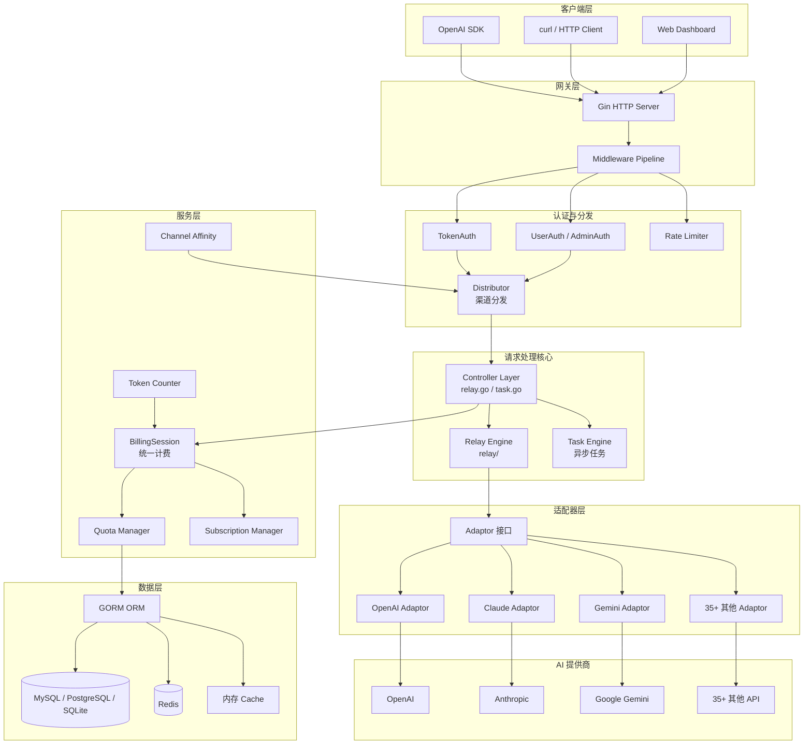
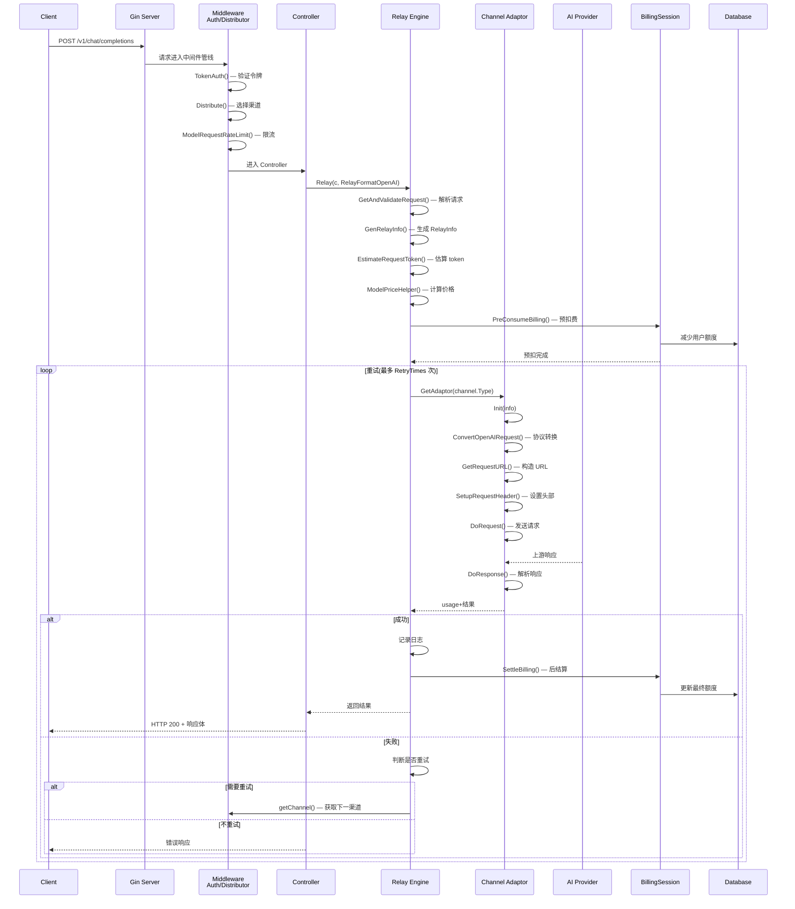
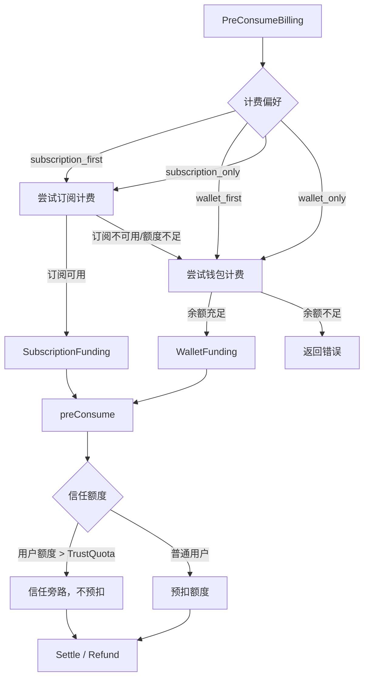
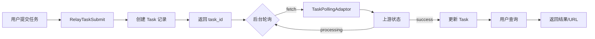
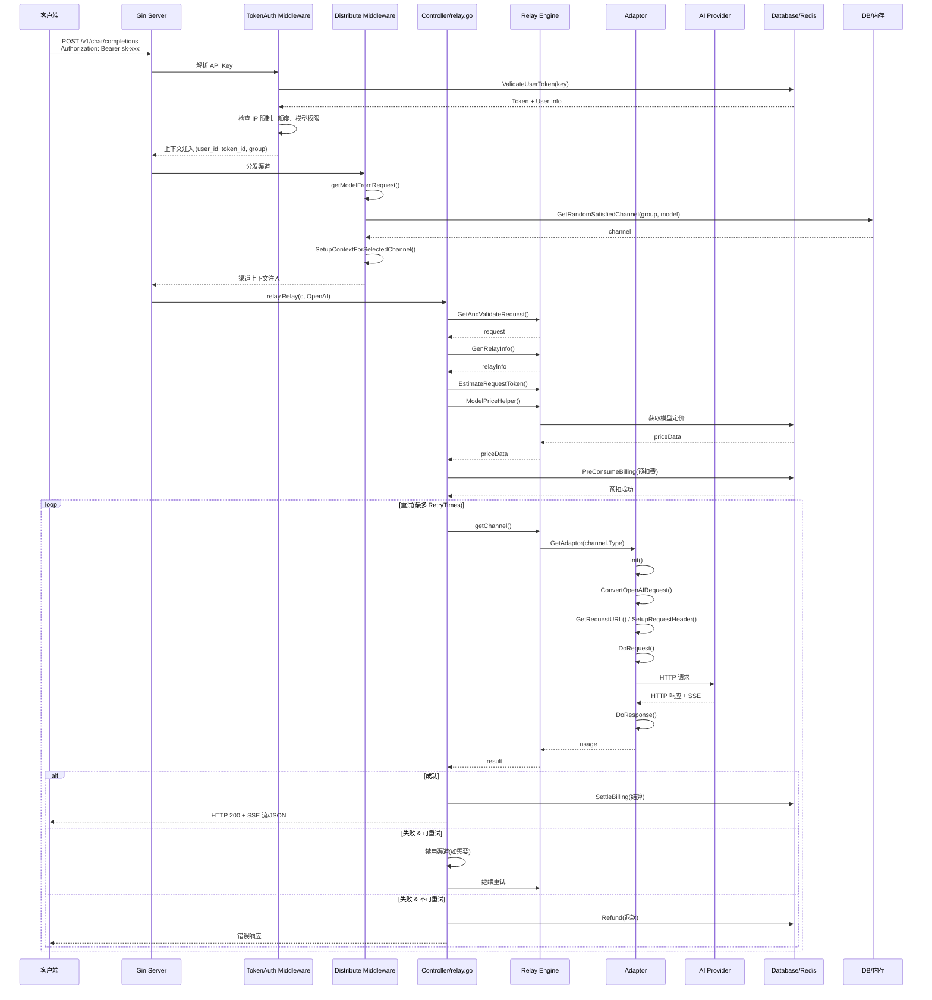
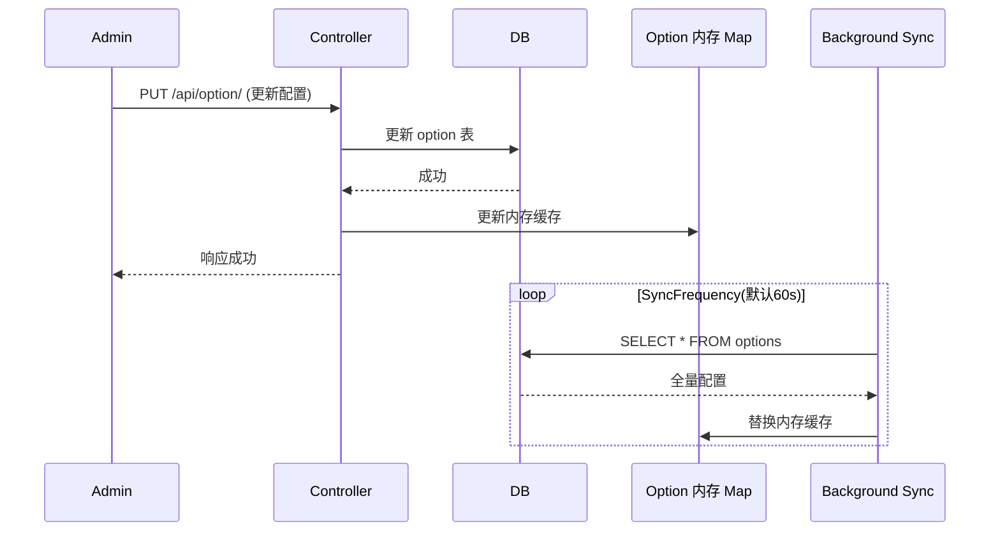
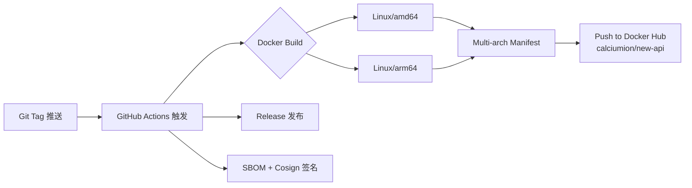

# New-API 架构分析

> 分析版本：v0.10+ ｜ 分析日期：2026-05-08

## 1. 项目概览

| 项目 | 信息 |
|------|------|
| GitHub | https://github.com/QuantumNous/new-api |
| 编程语言 | Go 1.25.1 |
| 许可证 | MIT |
| 衍生自 | songquanpeng/one-api |
| 前端框架 | React 18 + Radix UI + TanStack Router |
| 后端框架 | Gin + GORM |

**项目简介**

New-API 是一个开源的 **AI API 网关/代理**，支持 35+ 大模型 API 的统一接入、负载均衡、计费管理、用户管理和额度控制。它为多种 AI 模型提供商（OpenAI、Anthropic、Gemini、百度、阿里、DeepSeek 等）提供统一的 API 入口，支持 OpenAI 兼容格式、Claude 格式、Gemini 格式的协议转换，并提供 Midjourney、Suno、视频生成等异步任务管理功能。

## 2. 技术栈

| 类别 | 技术选型 |
|------|----------|
| 编程语言 | Go 1.25.1 |
| Web 框架 | Gin v1.9.1 |
| ORM | GORM v1.25.2 |
| 数据库 | MySQL / PostgreSQL / SQLite |
| 缓存 | 内存缓存 + Redis（可选） |
| 前端 | React 18 + Radix UI + TanStack Router + Tailwind CSS |
| CI/CD | GitHub Actions（Docker 多架构构建、Release、PR Check） |
| 测试框架 | Go testing + testify |
| 协议 | HTTP/1.1 + WebSocket（Realtime API） + SSE（流式响应） |
| 配置文件 | .env + YAML + 数据库 Option 表 |
| 认证 | Session（Dashboard）+ API Token（Bearer）+ OAuth（GitHub、Discord等）|

## 3. 整体架构



### 架构分层

| 层级 | 说明 |
|------|------|
| **客户端层** | OpenAI SDK、curl/HTTP 客户端、Web Dashboard |
| **网关层** | Gin HTTP 服务器 + 中间件管线 |
| **认证与分发层** | 令牌认证/会话认证 + 渠道分发器 + 限流器 |
| **请求处理核心** | Controller + Relay Engine（同步）+ Task Engine（异步） |
| **适配器层** | Adaptor 接口 → 35+ 具体适配器 |
| **服务层** | 计费会话、额度管理、令牌估算、渠道亲和性缓存、订阅管理 |
| **数据层** | 数据库（MySQL/PostgreSQL/SQLite）+ Redis + 内存缓存 |

### 模块职责

| 模块 | 职责 | 关键文件/目录 |
|------|------|---------------|
| `main.go` | 启动入口，资源初始化，启动后台任务 | `main.go` |
| `common/` | 公共工具函数、配置、数据库连接、限流器、Redis 客户端 | `common/` |
| `constant/` | 常量定义（API 类型、渠道类型、缓存键、上下文键） | `constant/` |
| `controller/` | HTTP 请求处理器，路由处理函数 | `controller/` |
| `router/` | 路由注册（API、Dashboard、Relay、Video） | `router/` |
| `middleware/` | 认证、分发、限流、日志、CORS 等中间件 | `middleware/` |
| `relay/` | 核心转发引擎 + Adaptor 接口 + 35+ 渠道适配器 | `relay/` |
| `service/` | 计费会话、渠道选择、令牌估算、额度管理、订阅 | `service/` |
| `model/` | GORM 数据模型、数据库迁移、缓存查询 | `model/` |
| `dto/` | 数据传输对象，OpenAI/Claude/Gemini 等请求响应结构体 | `dto/` |
| `oauth/` | OAuth 登录提供者注册表（GitHub、Discord、自定义） | `oauth/` |
| `setting/` | 系统设置、分组比例、模型定价、操作设置 | `setting/` |
| `pkg/` | 可复用包（billingexpr 计费表达式引擎、perf_metrics） | `pkg/` |
| `i18n/` | 国际化（en、zh-CN、zh-TW） | `i18n/` |
| `logger/` | 日志工具 | `logger/` |
| `types/` | 公共类型定义 | `types/` |
| `web/` | 前端 Dashboard（React） | `web/` |

## 4. 核心模块详解

### 4.1 Relay 引擎 — 多协议转发核心

Relay 引擎是 New-API 的核心，负责接受客户端请求、选取适配器、转发到上游 AI 提供商并处理响应。

**核心流程：**

1. **协议识别**：根据请求路径和头信息识别 `RelayFormat`（OpenAI / Claude / Gemini / Image / Audio 等）
2. **请求验证**：`GetAndValidateRequest()` 根据 `RelayFormat` 解析并验证请求
3. **模型定价**：`ModelPriceHelper()` 查表计算模型价格
4. **预扣费**：`PreConsumeBilling()` 创建 `BillingSession` 执行预扣费
5. **渠道选择**：`Distributor` 中间件选择可用渠道
6. **适配器调用**：`GetAdaptor(channel.Type)` 获取具体适配器
7. **协议转换**：适配器将 OpenAI 协议请求转换为上游协议
8. **上游请求**：发送 HTTP 请求到 AI 提供商
9. **响应处理**：`DoResponse()` 处理上游响应，返回标准化结果
10. **后结算**：`SettleBilling()` 根据实际用量结算



### 4.2 渠道适配器模式

New-API 支持 **35+** 不同的 AI 提供商，通过 **Adaptor 接口** 实现统一接入。

```go
// relay/channel/adapter.go
type Adaptor interface {
    Init(info *relaycommon.RelayInfo)
    GetRequestURL(info *relaycommon.RelayInfo) (string, error)
    SetupRequestHeader(c *gin.Context, req *http.Header, info *relaycommon.RelayInfo) error
    ConvertOpenAIRequest(c *gin.Context, info *relaycommon.RelayInfo, request *dto.GeneralOpenAIRequest) (any, error)
    DoRequest(c *gin.Context, info *relaycommon.RelayInfo, requestBody io.Reader) (any, error)
    DoResponse(c *gin.Context, resp *http.Response, info *relaycommon.RelayInfo) (usage any, err *types.NewAPIError)
    GetModelList() []string
    GetChannelName() string
    // ... 以及其他协议转换方法
}
```

每个提供商的适配器（如 `relay/channel/openai/`、`relay/channel/claude/`、`relay/channel/gemini/`）实现该接口，核心逻辑包括：

1. **协议转换**：OpenAI → 上游协议（如 OpenAI → Claude 消息格式）
2. **请求/响应转换**：适配上游 API 的差异
3. **模型列表**：返回该渠道支持的模型

适配器注册采用**工厂模式**：

```mermaid
graph LR
    A[GetAdaptor(apiType)] --> B{Switch APIType}
    B -->|APITypeAnthropic| C[claude.Adaptor]
    B -->|APITypeOpenAI| D[openai.Adaptor]
    B -->|APITypeGemini| E[gemini.Adaptor]
    B -->|APITypeBaidu| F[baidu.Adaptor]
    B -->|...35+| G[...]
```

### 4.3 渠道分发与亲和性

渠道分发是智能路由的关键，支持：

1. **权重优先级**：按渠道优先级排序
2. **多 Key 轮询**：同一渠道多个 Key 支持轮询/随机模式
3. **渠道亲和性**：基于 Cache 的请求亲和性，同一用户请求倾向同一渠道
4. **自动分组**：支持 `auto` 分组跨组重试
5. **自动禁用**：渠道连续失败自动禁用
6. **健康检查**：后台定时测试渠道可用性

### 4.4 统一计费系统

BillingSession 是 New-API 的计费核心，支持两种资金来源自动回退：



### 4.5 异步任务引擎

支持 Midjourney、Suno、Video 等异步任务的完整生命周期：

1. **提交** `submit` — 创建任务记录，预扣费
2. **轮询** `fetch` — 后台定时轮询上游
3. **回调** `notify` — 上游回调通知
4. **查询** `task/:id` — 查询任务状态



### 4.6 计费表达式引擎

`pkg/billingexpr/` 实现了一个基于 `expr-lang/expr` 的表达式引擎，用于灵活定义计费规则：

```go
// 示例表达式
"v1:tier(p, 0.0001) + tier(c, 0.00005)"
```

支持变量：`p`（提示令牌）、`c`（补全令牌）、`img`（图片数）等。
支持函数：`tier()`（阶梯计价）、`header()`（按请求头）、`param()`（按参数）等。

## 5. 关键设计决策

| 决策 | 选择 | 替代方案 | 理由 |
|------|------|----------|------|
| **DB 选型** | MySQL + PostgreSQL + SQLite 三者可选 | 单一数据库 | 兼容不同部署环境；SQLite 适合小规模，MySQL/PostgreSQL 适合生产 |
| **协议标准** | 以 OpenAI 协议为内部标准 | 多协议混用 | OpenAI 是事实标准，内部统一为 OpenAI 格式，适配器负责双向转换 |
| **适配器模式** | 接口驱动 + 工厂模式 | 基于反射/配置 | 编译期类型安全，每个渠道独立编译，易于扩展新提供商 |
| **计费机制** | 预扣费 + 后结算 | 纯后结算 | 防止用户超额使用；信任旁路（TrustQuota）优化高频低耗用户 |
| **缓存策略** | 内存缓存 + 可选 Redis | 仅 Redis/仅 DB | 内存缓存提供亚毫秒级渠道查找；Redis 可选用于分布式部署 |
| **重试机制** | 控制器层循环 + 渠道分发轮换 | Adaptor 内重试 | 跨渠道重试（渠道 A 失败→渠道 B），提高可用性 |
| **前端方案** | React SPA，两套主题（default + classic） | SSR / 单一前端 | 前后端分离便于开发；两套主题兼容老用户，通过 embed.FS 嵌入二进制 |
| **计费来源** | 订阅优先，降级到钱包 | 仅钱包 | 支持 SaaS 商业模式，提供经常性收入 |
| **国际化** | go-i18n 运行时翻译 | 编译时多语言 | 运行时动态切换语言，降低部署复杂度 |

## 6. 数据流 / 请求流

### 6.1 同步请求流（Chat Completions）



### 6.2 配置热更新流程



## 7. 设计模式

| 模式名称 | 使用位置 | 目的 |
|----------|----------|------|
| **适配器模式** | `relay/channel/adapter.go` + 35+ 实现 | 统一不同 AI 提供商的 API 差异，提供一致的转发接口 |
| **工厂模式** | `relay.GetAdaptor()`、`relay.GetTaskAdaptor()` | 根据 API 类型创建对应的适配器实例 |
| **策略模式** | `service/billing_session.go` — WalletFunding / SubscriptionFunding | 不同计费来源的实现可互换，运行时根据用户偏好选择 |
| **中间件模式** | `middleware/*.go` — Gin 中间件管线 | 认证、分发、限流、日志等横切关注点的链式处理 |
| **注册表模式** | `oauth/registry.go` — OAuth Provider 注册 | 动态注册/注销 OAuth 登录提供者，支持自定义提供商 |
| **管道模式** | `controller/relay.go` — 请求处理管线 | 请求经过认证→分发→预扣费→转发→响应→后结算的有序处理 |
| **外观模式** | `service/billing_session.go` | 统一 BillingSession 封装预扣费/结算/退款完整生命周期 |
| **观察者模式** | `model/channel_cache.go` SyncChannelCache | 后台 goroutine 定期同步渠道/能力缓存到内存 |
| **模板方法模式** | `relay/relay_task.go` RelayTaskSubmit | 异步任务提交流程固定（验证→计费→请求→响应），具体步骤由 Adaptor 实现 |
| **单例模式** | `model/main.go` DB / LOG_DB / RDB | 数据库和 Redis 客户端全局唯一实例 |
| **表达式模式/解释器** | `pkg/billingexpr/compile.go` | 计费表达式 DSL 的解析和执行 |

## 8. 工程实践

### 测试策略

| 测试类型 | 覆盖范围 | 文件示例 |
|----------|----------|----------|
| 单元测试 | 计费表达式引擎 | `pkg/billingexpr/billingexpr_test.go` (22 个测试函数) |
| 单元测试 | 渠道适配器 | `relay/channel/*/*_test.go` |
| 单元测试 | 服务层 (计费/结算) | `service/*_test.go` |
| 单元测试 | DTO 序列化 | `dto/*_test.go` |
| 单元测试 | 模型层 | `model/*_test.go` |
| 集成测试 | 渠道上游更新 | `controller/channel_upstream_update_test.go` |

测试框架采用 Go 原生 `testing` + `testify`，主要验证：

- **计费表达式解析**：`billing_expr_request_test.go` 验证不同表达式版本的正确性
- **价格计算**：`price_test.go` 验证阶梯/并发/按次等不同计费模式
- **流式响应扫描**：`stream_scanner_test.go` 验证 SSE 流式响应的正确解析
- **配额扣减**：`text_quota_test.go` 验证 Token 估算和额度扣减逻辑
- **渠道配置**：`channel_upstream_update_test.go` 验证渠道模型更新逻辑

当前共有 **35+** 个测试文件。从测试覆盖来看，核心计费和分发逻辑有较好的覆盖，但整体测试覆盖率仍有提升空间。

### 发布流程



CI/CD 流水线特性：

- **多架构构建**：同时构建 amd64 和 arm64，并创建多架构 manifest
- **镜像签名**：使用 Cosign 进行镜像签名和验证
- **SBOM**：生成软件物料清单
- **版本管理**：基于 Git Tag 自动发布版本
- **Electron 构建**：支持桌面端打包（macOS + Windows）
- **Nightly 构建**：每日构建开发版
- **PR 检查**：提交 PR 时自动运行检查和构建测试

### 版本管理

当前最新版本为 **v0.10+**，遵循语义化版本。项目从 `songquanpeng/one-api` fork 而来，持续在渠道支持、计费灵活性和性能方面进行优化。

## 9. 总结与评价

### 亮点

1. **卓越的多提供商支持**：35+ AI 提供商通过适配器模式统一接入，新增提供商只需实现 Adaptor 接口
2. **灵活的双计费机制**：钱包 + 订阅双轨制，支持阶梯计费、按次计费、并发计费，计费表达式 DSL 提供极高的灵活性
3. **完整的异步任务管理**：Midjourney、Suno、视频生成等异步任务的完整生命周期管理（提交→轮询→回调→查询）
4. **智能渠道路由**：基于优先级/权重/亲和性/健康检查的渠道分发，支持跨分组重试，多 Key 轮询
5. **健壮的错误处理**：自动禁用失败渠道，细粒度的重试策略（按 HTTP 状态码配置），渠道错误日志分析
6. **企业级特性**：订阅计费、2FA 认证、WebAuthn 通行密钥、OAuth 登录、IP 白名单、限流、敏感词检测
7. **热更新**：配置更改无需重启，后台 goroutine 定期同步数据库配置到内存
8. **部署灵活**：单文件二进制 + SQLite 开箱即用，也可配置 MySQL/PostgreSQL + Redis 分布式部署
9. **前端双主题**：default（现代 Radix UI）和 classic（传统 UI），通过 embed.FS 嵌入二进制，部署简单
10. **国际化**：支持中/英/日/法等语言的运行时切换

### 可改进之处

1. **测试覆盖率**：核心计费和分发逻辑有测试覆盖，但整体测试覆盖率偏低（尤其 controller 层），增加集成测试会提升代码健壮性
2. **监控与可观测性**：虽然有 Pyroscope profiling 和基础统计中间件，但缺乏结构化链路追踪（OpenTelemetry）和详细 API 监控面板
3. **缓存一致性**：内存缓存定期全量同步（而非增量），高频变更场景下可能短期不一致；引入 Redis Pub/Sub 或变更事件可改善
4. **模块化拆分**：`common/` 包过重（70+ 文件），可拆分为更细粒度的模块（config、cache、db 等）
5. **API 版本管理**：适配器版本管理未显式化，上游 API 变更时新旧版本兼容处理可更规范化
6. **文档完整性**：虽然代码注释和 README 较为完善，但完整的 API 文档和开发者指南可以进一步提升项目可接入性
7. **分布式部署支持**：Master/Slave 节点机制初步存在，但缺少分布式锁和完整的 leader 选举机制

## 参考

- [GitHub 仓库 - QuantumNous/new-api](https://github.com/QuantumNous/new-api)
- [上游项目 - songquanpeng/one-api](https://github.com/songquanpeng/one-api)
- [Gin Web Framework](https://github.com/gin-gonic/gin)
- [GORM ORM](https://gorm.io/)
- [expr-lang/expr — 表达式引擎](https://github.com/expr-lang/expr)
