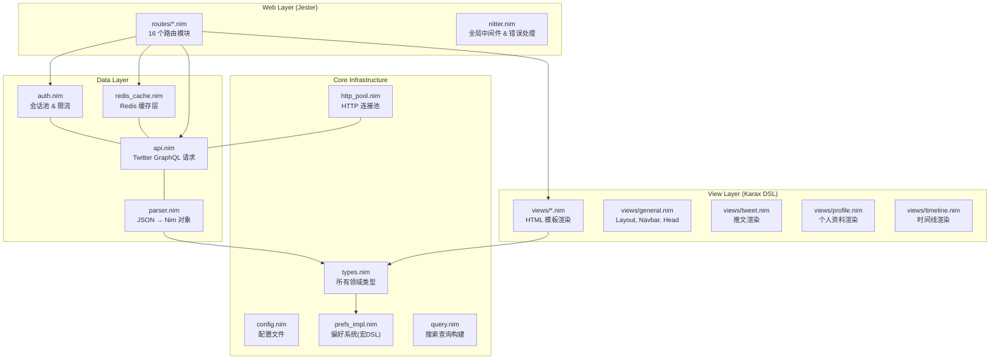
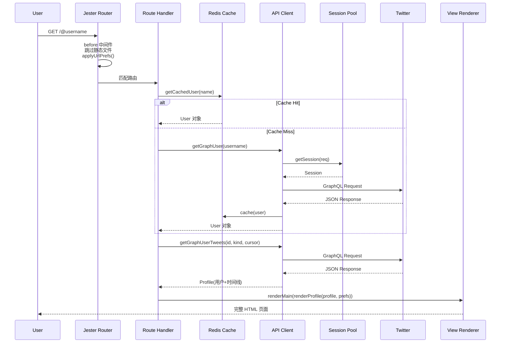

# Nitter 架构分析

> 分析版本：最新版 ｜ 分析日期：2026-05-09

## 1. 项目概览

| 项目 | 官网 | GitHub | 编程语言 | Star 数 | 许可证 | 核心维护者 |
|------|------|--------|----------|---------|--------|------------|
| Nitter | - | https://github.com/zedeus/nitter | Nim | ~10k | AGPL-3.0 | Zedus |

**项目简介**: Nitter 是一个用 Nim 语言编写的 Twitter/X 隐私友好型替代前端。它不依赖任何客户端 JavaScript，完全在服务端渲染 HTML，通过 Twitter 内部 GraphQL API 获取数据并转换为干净、轻量的页面呈现。

## 2. 技术栈

| 类别 | 技术选型 |
|------|----------|
| 编程语言 | Nim 2.0+ |
| 构建系统 | nimble，Docker 多阶段构建 |
| 测试框架 | Python 3.14 + SeleniumBase + pytest + parameterized + pytest-xdist + pytest-rerunfailures |
| CI/CD | GitHub Actions（run-tests.yml、build-docker.yml），Travis CI（遗留） |
| 存储 | Redis（缓存） |
| 通信协议 | HTTP, GraphQL |

## 3. 整体架构

### 架构分层

- **Web 层**: 基于 Jester 框架，包含路由模块和全局中间件。
- **视图层**: 使用 Karax DSL 实现服务端渲染，所有视图为纯函数。
- **数据层**: 封装 Twitter GraphQL 接口、JSON 解析、Redis 缓存与会话池管理。
- **基础设施层**: HTTP 连接池、配置加载、偏好系统宏、查询构建与领域类型定义。

### 模块职责

| 模块 | 职责 | 关键文件/目录 |
|------|------|---------------|
| 路由系统 | 注册并聚合所有路由处理逻辑 | `nitter.nim`, `routes/*.nim` |
| 视图渲染 | 使用 Karax 生成 HTML 页面 | `views/*.nim` |
| API 客户端 | 构造 GraphQL 请求并返回 JSON | `src/api.nim` |
| JSON 解析 | 将 Twitter JSON 转换为 Nim 对象 | `src/parser.nim` |
| Redis 缓存 | Cache-Aside 缓存策略 | `src/redis_cache.nim` |
| 会话池 | OAuth/Cookie 双认证，限流与自动恢复 | `src/auth.nim` |
| 基础设施 | 连接池、配置、偏好宏、查询构建、类型定义 | `src/http_pool.nim`, `config.nim` 等 |
| 实验模块 | 强类型 JSON 解析 | `experimental/types/*.nim` |

## 4. 核心模块详解

### 4.1 Jester 路由系统

所有路由通过 `extend` 机制聚合为完整路由树。每个路由模块为独立的 creator procedure，通过闭包捕获配置，模块间通过 `export` 相互引用。

### 4.2 Twitter API 客户端（`src/api.nim`）

核心引擎，构造 GraphQL 请求并通过会话池发送，返回 JSON。支持双重认证策略（OAuth/Cookie），自动选择可用会话。

### 4.3 JSON 解析引擎（`src/parser.nim`）

项目最复杂的模块（600+ 行），采用双解析路径：Legacy 使用 `packedjson` 安全导航，Experimental 使用 `jsony` 强类型解析，逐步迁移。

### 4.4 视图渲染系统（Karax DSL）

编译期类型安全的 HTML 生成，天然防御 XSS。每个视图函数为纯函数，输入数据输出 `VNode`，无可变状态。

### 4.5 会话池与限流（`src/auth.nim`）

多会话轮询池，支持 OAuth 1.0a 和 Cookie 认证。每个会话跟踪 API 端点剩余请求数，自动检测限流并标记会话不可用（1 小时后自动恢复）。

### 4.6 Redis 缓存（`src/redis_cache.nim`）

Cache-Aside 模式，使用 `flatty` 序列化 + `supersnappy` 压缩，两级缓存时间（用户信息 1 小时，账号信息 24 小时），连接池管理。

## 5. 关键设计决策

| 决策 | 选择 | 替代方案 | 理由 |
|------|------|----------|------|
| 编程语言 | Nim | C++, Go, Rust | 原生编译性能、宏系统表达能力、类型安全、二进制体积小 |
| 渲染架构 | 服务端渲染 + 可选渐进增强 JS | SPA (React/Vue) | 首屏即时、客户端负担极低、无追踪 |
| JSON 解析 | 双轨策略（packedjson + jsony） | 单一解析器 | 逐步迁移实现类型加固 |
| 认证策略 | Cookie + OAuth 双通道 | 仅 OAuth | OAuth 更稳定但需配置，Cookie 方便但脆弱 |
| 视频代理 | 默认代理模式，可配置直连 | 仅代理或仅直连 | 代理保护客户端 IP，直连节省服务器资源 |

## 6. 数据流 / 请求流

## 7. 设计模式

| 模式名称 | 使用位置 | 目的 |
|----------|----------|------|
| Repository 模式 | `redis_cache.nim` | 缓存/API 两层抽象，先查缓存，miss 则查 API |
| 连接池模式 | `http_pool.nim`, `redis_cache.nim`, `auth.nim` | HTTP 连接、Redis 连接、认证会话均使用池化管理 |
| 策略模式 | `auth.nim`, `api.nim` | OAuth vs Cookie 两种认证策略可切换 |
| 模板方法 | `parser.nim` | `parseGraphTweet -> parseTweet` 模板方法 |
| DSL 元编程 | `prefs_impl.nim` | 通过 Nim 宏从声明式 DSL 自动生成代码 |
| 缓存旁路 | `redis_cache.nim` | Cache-Aside：先读缓存，miss 则加载并回填 |

## 8. 工程实践

### 测试策略

采用 Python + Selenium 进行端到端集成测试，覆盖用户资料页、推文展示、时间线交互、搜索结果等核心路径。测试技术栈：Python 3.14、SeleniumBase、pytest、parameterized、pytest-xdist（并行执行）、pytest-rerunfailures（失败重试）。

### 发布流程

GitHub Actions CI/CD：`run-tests.yml`（矩阵测试 Nim 版本，启动 Redis → 编译 Nitter → 加载会话 → 运行 3 并发 Selenium 测试）、`build-docker.yml`（构建并推送 AMD64 + ARM64 多架构 Docker 镜像到 DockerHub）。

### 版本管理

依赖 Nim 2.0+，构建时使用 `-d:danger -d:lto -d:strip --mm:refc` 参数。

## 9. 总结与评价

### 亮点

- 性能出色：Nim 原生编译 + 零分配 JSON 解析 + Redis 缓存 = 极低延迟
- 安全：Karax 编译期防 XSS + 所有输出转义 + 不支持客户端 JS
- 可扩展：模块化的路由/视图分离
- 隐私设计：无追踪、无 Cookie（除偏好外）、支持代理、link replacement
- 容错性强：会话池自动故障转移、限流自动恢复

### 可改进之处

- Parser 碎片化：Legacy 和 Experimental 双解析路径增加维护成本
- 测试深度：缺少单元测试（纯 Nim 测试），集成测试依赖外部 Twitter 账户
- 静态类型深度：部分 JSON 解析仍使用字符串路径
- GraphQL 端点维护：Twitter 频繁变更 GraphQL 端点名称

## 参考

本文档基于项目 README 分析，未引用其他外部资料。
