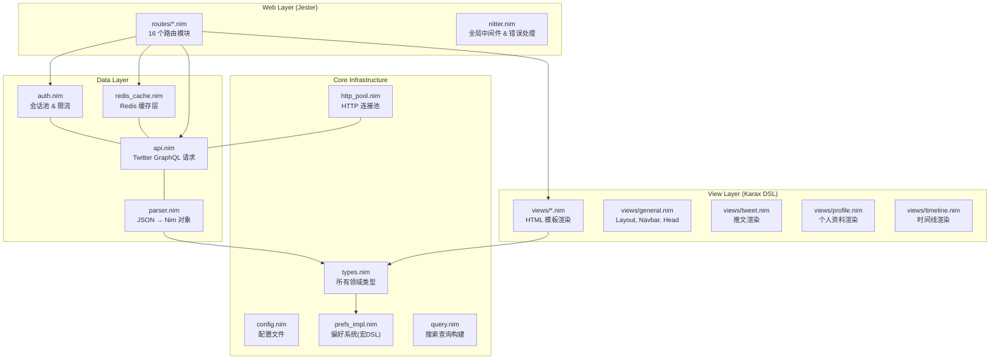
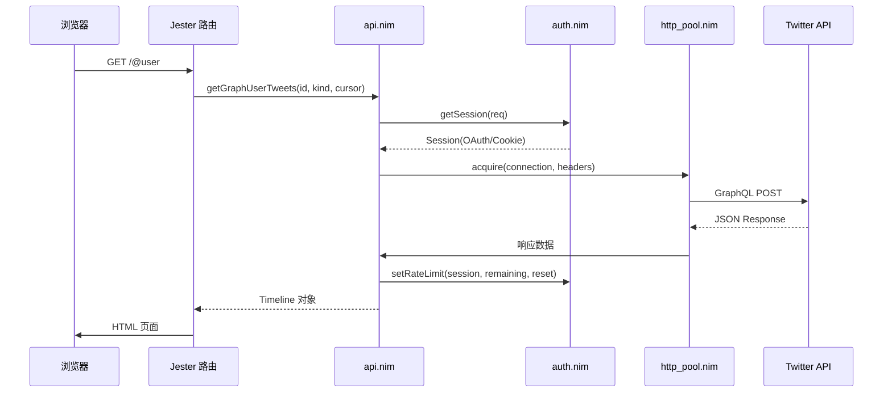
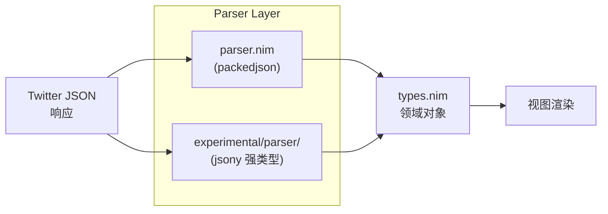
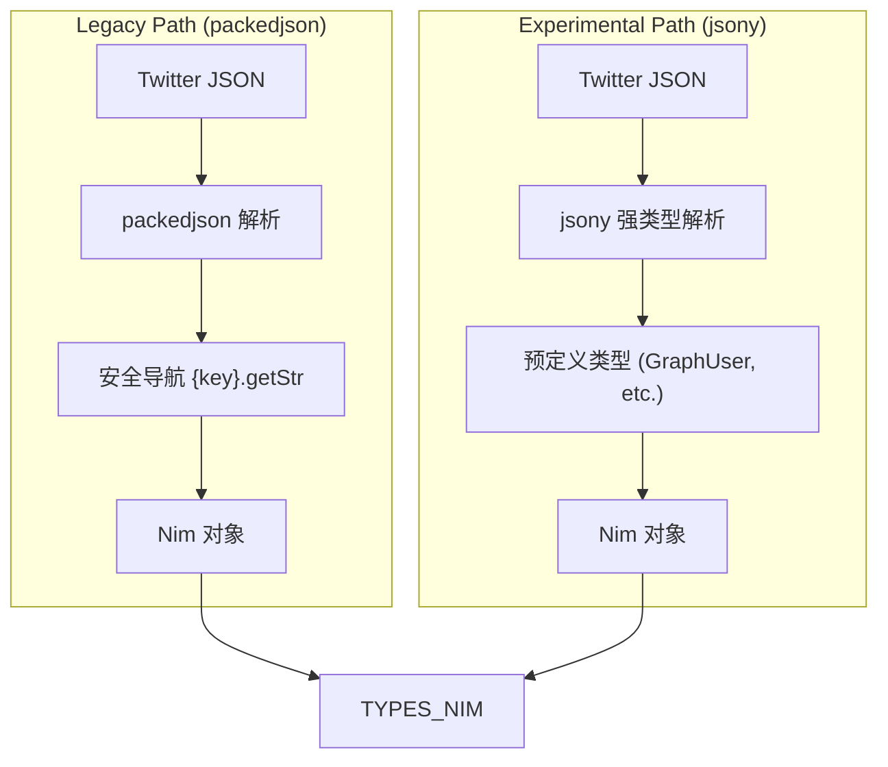
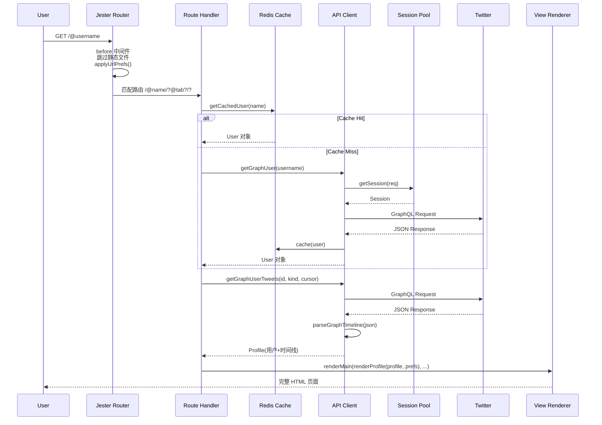
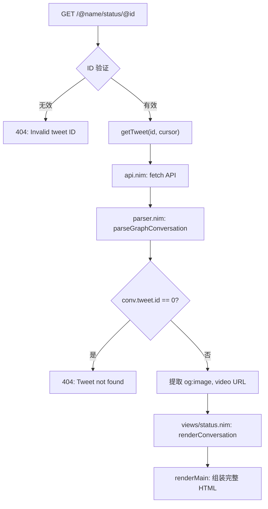
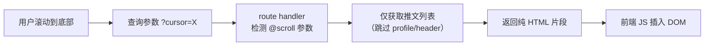
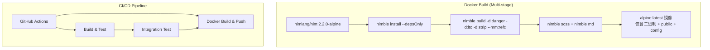
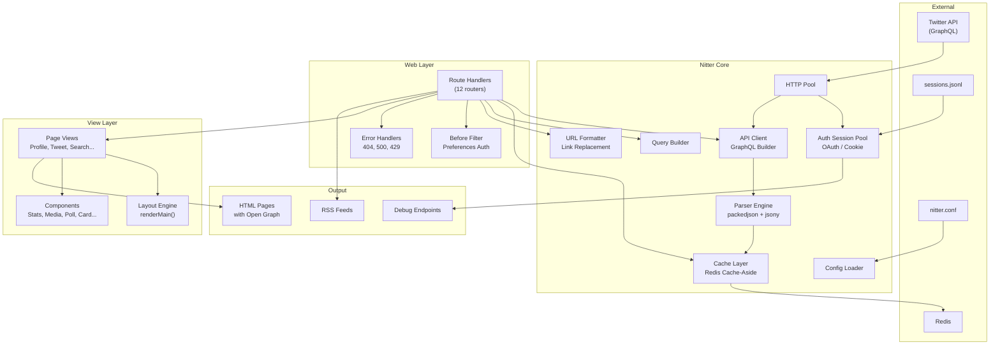

# 🏗️ Nitter 架构深度分析

## 项目概览

**Nitter** 是一个用 **Nim** 语言编写的 Twitter/X 隐私友好型替代前端。它不依赖任何客户端 JavaScript，完全在服务端渲染 HTML，通过 Twitter 内部 GraphQL API 获取数据并转换为干净、轻量的页面呈现。作者为 **Zedus**，采用 **AGPL-3.0** 协议。

---

## 一、整体架构与模块划分

Nitter 采用经典的 **分层架构**（Layered Architecture），分四层设计：



### 模块统计

| 层级 | 模块数 | 核心文件 |
|------|--------|---------|
| **Web 层** | 1 + 16 路由 | `nitter.nim`, `routes/*.nim` |
| **视图层** | 14 | `views/*.nim` |
| **数据层** | 6 | `api.nim`, `parser.nim`, `redis_cache.nim`, `auth.nim`, `experimental/parser/*` |
| **基础设施** | 10 | `types.nim`, `config.nim`, `prefs_impl.nim`, `http_pool.nim`, `query.nim` |
| **实验模块** | 8 | `experimental/types/*.nim`, `experimental/parser/*.nim` |

---

## 二、核心模块设计与实现

### 2.1 Jester 路由系统 — `src/nitter.nim`

所有路由寄存器初始化后通过 **Jester 的 `extend` 机制** 聚合为完整路由树：

```nim
# 关键模式：每个路由模块是独立的 creator procedure
createUnsupportedRouter(cfg)
createResolverRouter(cfg)
createPrefRouter(cfg)
createTimelineRouter(cfg)
createListRouter(cfg)
createStatusRouter(cfg)
createSearchRouter(cfg)
createMediaRouter(cfg)
createEmbedRouter(cfg)
createRssRouter(cfg)
createBroadcastRouter(cfg)
createDebugRouter(cfg)

# 通过 Jester 的 extend 统一挂载
routes:
  extend rss, ""
  extend status, ""
  extend timeline, ""
  # ...
```

**设计特点**：每个路由模块通过闭包捕获 `cfg` 配置，模块间通过 `export` 相互引用视图和数据层函数，形成松耦合的依赖网络。

### 2.2 Twitter API 客户端 — `src/api.nim`

这是 Nitter 的核心引擎。它构造 **GraphQL 请求**，通过会话池发送，并返回 JSON 响应。



**关键设计：双重认证策略** — 每个 API 请求 (`ApiReq`) 包含两个端点 (`oauth` 和 `cookie`)，由 `auth.nim` 的会话池根据当前可用会话类型自动选择：

```nim
proc getSession*(req: ApiReq): Future[Session] {.async.} =
  for i in 0 ..< sessionPool.len:
    if result.isReady(req): break
    result = sessionPool.sample()
```

### 2.3 JSON 解析引擎 — `src/parser.nim`

这是项目中最复杂的模块（600+ 行），负责将 Twitter 的嵌套 JSON 解析为 Nim 的类型安全对象。

**双解析路径**：
1. **Legacy 路径**：使用 `packedjson` 库，通过 `{}` 操作符安全导航
2. **GraphQL 路径** (experimental)：使用 `jsony` 强类型解析，通过静态类型直接从 JSON 映射到 Nim 对象



### 2.4 视图渲染系统 — Karax DSL

Nitter 使用 **Karax** 的 HTML 虚拟 DOM DSL，在编译期类型安全地生成 HTML，天然防御 XSS 攻击：

```nim
proc renderTweet*(tweet: Tweet; prefs: Prefs; path: string; ...): VNode =
  buildHtml(tdiv(class=("timeline-item " & divClass))):
    if not mainTweet:
      a(class="tweet-link", href=getLink(tweet))
    tdiv(class="tweet-body"):
      renderHeader(tweet, retweet, pinned, prefs)
      tdiv(class=tweetClass, dir="auto"):
        verbatim replaceUrls(tweet.text, prefs)
```

**设计亮点**：每个视图模块是纯函数，输入数据 → 输出 `VNode`，无任何可变状态，天然可测试。

### 2.5 会话池与限流 — `src/auth.nim`

Twitter 对未授权请求有严格的速率限制，Nitter 实现了 **多会话轮询池**：

- 支持 **OAuth 1.0a** 和 **Cookie 认证** 两种会话类型
- 每个会话跟踪**每个 API 端点**的 `remaining`/`reset` 数据
- `maxConcurrentReqs = 2` 防止竞态条件
- 自动检测限流并标记会话不可用，1小时后自动重置
- 支持从 `sessions.jsonl` 文件批量加载账户

```nim
proc isLimited(session: Session; req: ApiReq): bool =
  if session.limited and api != graphUserTweetsV2:
    if (epochTime().int - session.limitedAt) > hourInSeconds:
      session.limited = false  # 1小时后自动恢复
      return false
    else:
      return true
  if api in session.apis:
    let limit = session.apis[api]
    return limit.remaining <= 10 and limit.reset > epochTime().int
```

### 2.6 Redis 缓存 — `src/redis_cache.nim`

采用 **Cache-Aside** 模式，支持对象级别的序列化/反序列化：

- 使用 `flatty` 进行高效的 Nim 对象二进制序列化
- 使用 `supersnappy` 进行压缩（Snappy 算法）
- **两级缓存策略**：
  - 用户信息：`baseCacheTime = 1 小时`
  - RSS 查询：`rssCacheTime = 可配置(默认10分钟)`
  - 列表信息：`listCacheTime = 可配置(默认4小时)`
  - 账号信息：`baseCacheTime * 24 = 24 小时`
- 使用 `redpool` 连接池管理 Redis 连接
- 自动迁移旧缓存格式（flatty → snappy）

---

## 三、关键设计模式

| 模式 | 实现位置 | 说明 |
|------|---------|------|
| **Repository 模式** | `redis_cache.nim` | 缓存/API 两层抽象，`getCachedUser` 先查缓存，miss 则查 API 并回填 |
| **连接池模式** | `http_pool.nim`, `redis_cache.nim`, `auth.nim` | HTTP 连接、Redis 连接、认证会话均使用池化管理 |
| **策略模式** | `auth.nim`, `api.nim` | OAuth vs Cookie 两种认证策略可切换 |
| **模板方法** | `parser.nim` | `parseGraphTweet -> parseTweet` 模板方法，子类化变体处理 |
| **DSL 元编程** | `prefs_impl.nim` | 通过 Nim 宏 (`genPrefs`) 从声明式 DSL 生成完整的 Prefs 类型、序列化/反序列化、Cookie 操作代码 |
| **单例模式** | `http_pool.nim`, `redis_cache.nim` | 全局变量持有连接池实例 |
| **外观模式** | `views/general.nim` | `renderMain` 统一组装完整的 HTML 布局 |
| **缓存旁路** | `redis_cache.nim` | Cache-Aside：先读缓存，miss 则加载并回填 |

### 元编程亮点：Prefs DSL

`prefs_impl.nim` 是整个项目中最具 Nim 特色的模块。通过一个声明式的宏 DSL，自动生成：

```nim
genPrefs:
  Display:
    theme(select, "Nitter"): "Theme"
    infiniteScroll(checkbox, false): "Infinite scrolling"
    # ...

# 自动生成：
# 1️⃣ Prefs 类型（含所有字段）
# 2️⃣ defaultPrefs 默认值
# 3️⃣ parsePrefs() Cookie → Prefs 解析
# 4️⃣ updatePrefs() Prefs → Cookie 序列化
# 5️⃣ resetPrefs() 偏好重置
# 6️⃣ encodePrefs() URL 编码
# 7️⃣ applyPrefs() 批量应用
```

**编译时生成的关键函数数量**：7 个，每个支持所有当前和未来的偏好字段，零运行时开销。

---

## 四、重要设计决策及权衡

### 4.1 为何选择 Nim？

| 优势 | 实际体现 |
|------|---------|
| **性能** | 原生编译，无 GC 暂停（`--mm:refc`），适合高并发代理 |
| **表达能力** | 宏系统实现 Prefs DSL，`packedjson` 零拷贝 JSON 解析 |
| **类型安全** | Karax 的 `VNode` 编译期验证 HTML 结构 |
| **互操作** | 通过 C FFI 使用 `libsass`、`pcre` |
| **二进制体积** | 静态编译的单文件二进制，Docker 镜像极小 |

### 4.2 服务端渲染 vs. SPA

**决策**：完全服务端渲染 + 可选渐进增强 JavaScript

| 维度 | Nitter 方案 | SPA 方案 |
|------|------------|----------|
| 首屏加载 | **即时**（纯 HTML） | 需等待 JS 加载执行 |
| 客户端负担 | **极低** | 高（React/Vue 运行时）|
| 搜索引擎优化 | **原生** | 需 SSR 同构 |
| 隐私 | **无追踪** | 通常有分析脚本 |
| 代码复杂度 | 低（无客户端状态管理） | 高 |
| 交互体验 | 每次点击整页加载 | 局部无刷新 |

### 4.3 JSON 解析：双轨策略



**权衡**：
- `packedjson` 灵活但运行时类型检查，`jsony` 编译期安全但需维护大量类型定义
- 实验模块逐渐迁移到 `jsony`，体现了**渐进式类型加固**的策略

### 4.4 认证策略：Cookie + OAuth 双通道

每个 `ApiReq` 同时携带两个端点：
```nim
proc userUrl(username: string): ApiReq =
  ApiReq(
    cookie: apiUrl(graphUser, cookieVars, ...),
    oauth: apiUrl(graphUserV2, ...)
  )
```

**权衡**：
- OAuth 请求更稳定，但需要配置 `sessions.jsonl`
- Cookie 认证更方便（无需配置），但更脆弱，Twitter 频繁变更
- `disableTid` 选项允许在 Cookie 认证失败时回退

### 4.5 视频代理策略

```nim
let source = if prefs.proxyVideos and vidUrl.startsWith("http"):
               getVidUrl(vidUrl) else: vidUrl
```

- **代理模式**（默认）：流量经过 Nitter 服务器，保护客户端 IP，但增加服务器带宽
- **直连模式**：客户端直接拉取 Twitter CDN，节省服务器资源，但不隐藏 IP

---

## 五、数据流 / 请求处理流程

### 5.1 完整请求周期



### 5.2 推文详情页请求流



### 5.3 无限滚动处理



---

## 六、工程化实践

### 6.1 构建系统



### 6.2 测试体系

Nitter 采用 **Python + Selenium** 进行端到端集成测试：

| 测试文件 | 覆盖内容 |
|---------|---------|
| `test_profile.py` | 用户资料页（数据、认证状态、被封禁、横幅图） |
| `test_tweet.py` | 推文展示（时间线、状态页、多行文本、emoji、链接、转推） |
| `test_timeline.py` | 时间线交互 |
| `test_thread.py` | 对话线程 |
| `test_search.py` | 搜索结果 |
| `test_card.py` | Twitter 卡片渲染 |
| `test_quote.py` | 引用推文 |
| `test_tweet_media.py` | 媒体渲染 |

**测试技术栈**：
- **Python 3.14** (使用最新 CPython)
- **SeleniumBase** — 高级 Selenium 封装
- **pytest** — 测试框架
- **parameterized** — 数据驱动测试（每个测试用例可参数化多组数据）
- **pytest-xdist** (`-n8`) — 并行执行
- **pytest-rerunfailures** — 失败自动重试（解决网络不确定性）

**测试模式示例**：
```python
@parameterized.expand(profiles)
def test_data(self, username, fullname, bio, location, website, joinDate, mediaCount):
    self.open_nitter(username)
    self.assert_exact_text(fullname, Profile.fullname)
    self.assert_exact_text(f'@{username}', Profile.username)
```

### 6.3 CI/CD 配置

**GitHub Actions 工作流**（2 个）：

1. **run-tests.yml**（触发条件：非 master 分支的 push）：
   - **Build 阶段**：矩阵测试 Nim 2.0.x / 2.2.x / devel
   - **集成测试阶段**：启动 Redis 服务 → 编译 Nitter → 加载会话 → 运行 3 并发 Selenium 测试
   - `concurrency` 策略防止同一分支多次运行重叠
   
2. **build-docker.yml**（触发条件：master 分支 push）：
   - 先调用 `run-tests.yml` 作为 gate
   - 测试通过后构建并推送 AMD64 + ARM64 Docker 镜像到 DockerHub

**Travis CI 配置**（遗留）：
- 完整的 Chrome/Selenium 测试管道，支持 Docker 化测试

### 6.4 部署配置

```ini
[Server]
hostname = "nitter.net"     # 改为此实例域名
port = 8080
https = false               # 禁用时允许 Cookie

[Cache]
redisHost = "localhost"
redisConnections = 20
redisMaxConnections = 30

[Config]
hmacKey = "secretkey"       # 视频 URL 加密签名
maxConcurrentReqs = 2       # 每会话并发请求数
maxRetries = 1
retryDelayMs = 150

[Preferences]
theme = "Nitter"
replaceTwitter = "nitter.net"
replaceYouTube = "piped.video"
replaceReddit = "teddit.net"
```

### 6.5 项目依赖体系

```
nitter (Nim 2.0+)
├── jester          — Web 框架（路由、请求处理）
├── karax           — HTML 虚拟 DOM DSL
├── sass            — CSS 预处理器
├── nimcrypto       — HMAC 加密
├── markdown        — Markdown 渲染
├── packedjson      — 高性能 JSON
├── supersnappy     — Snappy 压缩
├── redpool         — Redis 连接池
├── redis           — Redis 客户端
├── zippy           — zlib 压缩(gzip)
├── flatty          — 二进制序列化
├── jsony           — 强类型 JSON
├── oauth           — OAuth 1.0a
└── (系统依赖: libsass-dev, pcre, ca-certificates)
```

---

## 七、架构全局视图



---

## 八、总结与评估

### 架构优势

1. **性能出色**：Nim 原生编译 + 零分配 JSON 解析 + Redis 缓存 = 极低延迟
2. **安全**：Karax 编译期防 XSS + 所有输出转义 + 不支持客户端 JS
3. **可扩展**：模块化的路由/视图分离，添加新页面只需新增 `routes/X.nim` + `views/X.nim`
4. **隐私设计**：无追踪、无 Cookie（除偏好外）、支持代理、link replacement
5. **容错性强**：会话池自动故障转移、限流自动恢复、优雅的错误页面

### 可改进的方向

1. **Parser 碎片化**：Legacy 和 Experimental 双解析路径增加维护成本，应加速迁移到 `jsony`
2. **测试深度**：缺少单元测试（纯 Nim 测试），集成测试依赖外部 Twitter 账户
3. **静态类型深度**：部分 JSON 解析仍使用字符串路径，可在类型系统中进一步加固
4. **监控**：除 Redis 外缺少请求追踪和性能度量
5. **GraphQL 端点维护**：Twitter 频繁变更 GraphQL 端点名称，每次需手动更新 `consts.nim`

### 工程成熟度评估

| 维度 | 评分 | 说明 |
|------|------|------|
| 代码组织 | ⭐⭐⭐⭐⭐ | 四层架构清晰，关注点分离 |
| 类型安全 | ⭐⭐⭐⭐ | Nim 强类型 + Karax DSL + Prefs 宏 |
| 测试覆盖 | ⭐⭐⭐ | E2E 覆盖核心路径，缺单元测试 |
| 文档 | ⭐⭐⭐ | README + nitter.example.conf，缺 API 文档 |
| CI/CD | ⭐⭐⭐⭐ | Docker 多阶段构建 + 多平台推送 |
| 可部署性 | ⭐⭐⭐⭐⭐ | 单二进制 + Docker + 简单配置 |
| 可维护性 | ⭐⭐⭐⭐ | 模块化高，但 parser 有碎片化 |
