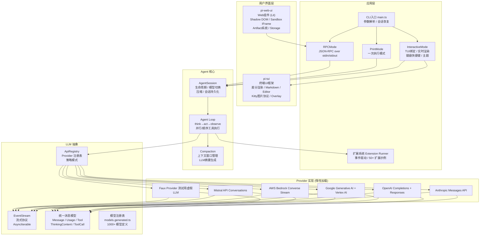

# pi-mono 架构分析

> 分析版本：v0.0.3 ｜ 分析日期：2026-05-09

## 1. 项目概览

| 项目 | 信息 |
|------|------|
| 官网 | — |
| GitHub | [badlogic/pi-mono](https://github.com/badlogic/pi-mono) |
| 编程语言 | TypeScript |
| Star 数 | ~2k |
| 许可证 | MIT |
| 核心维护者 | badlogicgames |

**项目简介**

pi-mono 是一个 AI 编程 Agent 框架的 Monorepo，提供完整的、可扩展的、多模态的 AI Agent 运行时，涵盖多 Provider LLM 统一调用、Agent 循环（Think→Act→Observe）、TUI 交互、Web UI 和前端组件的完整链路。

## 2. 技术栈

| 类别 | 技术选型 |
|------|----------|
| 编程语言 | TypeScript (Node.js + Bun) |
| 构建系统 | npm workspaces, tsc |
| 测试框架 | Vitest |
| CI/CD | GitHub Actions (ci.yml, build-binaries.yml) |
| 存储 | JSONL 文件（会话持久化） |
| 通信协议 | JSON-RPC over stdin/stdout, EventStream, postMessage（Web 沙箱） |
| 前端组件 | Lit (Web Components) |
| TUI 框架 | 自研差分渲染 TUI |
| 代码质量 | Biome (Lint + Format), tsgo (类型检查) |

## 3. 整体架构



### 架构分层

- **LLM 抽象层**（pi-ai）：提供 Provider 无关的 LLM 调用接口，包括统一消息模型、Provider 注册表、事件流协议和模型注册表。
- **Agent 核心层**（pi-agent-core）：通用 Agent 循环引擎，实现 Think→Act→Observe 循环、上下文压缩、会话状态管理。
- **应用层**（pi-coding-agent）：编码 Agent 的具体应用，提供 CLI/TUI/RPC 三种运行模式。
- **UI 层**（pi-tui、pi-web-ui）：终端 UI 框架（差分渲染）和 Web 组件（Lit），分别消费 Agent 事件流并实时渲染。

### 模块职责

| 模块 | 职责 | 关键文件/目录 |
|------|------|----------------|
| **pi-ai** | LLM 统一抽象层：多 Provider 调用、模型注册、流式协议 | `packages/ai/src/` |
| **pi-agent-core** | Agent 运行时核心：循环、工具调用、会话存储、压缩 | `packages/agent/src/` |
| **pi-coding-agent** | 编码 Agent 应用：CLI/TUI/RPC 模式、扩展系统、内置工具 | `packages/coding-agent/src/` |
| **pi-tui** | 终端 UI 框架：差分渲染、Markdown、编辑器组件 | `packages/tui/src/` |
| **pi-web-ui** | Web 前端组件：ChatPanel、Artifact、Sandbox、Storage | `packages/web-ui/src/` |

## 4. 核心模块详解

### 4.1 pi-ai — 多 Provider LLM 统一抽象

核心设计：
- **统一消息模型**：屏蔽各 Provider 之间消息格式的差异
- **Provider 注册模式**：`ApiProviderRegistry` 集中注册，通过策略模式路由
- **惰性加载优化**：Provider 模块按需加载，减少启动时间和内存占用
- **事件流协议**：`start → text_start → text_delta* → text_end → toolcall_start → toolcall_delta* → toolcall_end → done|error`
- **模型注册表**：`models.generated.ts`（约 445KB）包含 1000+ 个已知模型定义

### 4.2 pi-agent-core — Agent 运行时核心

双层循环设计：
- **内层**：处理当前 LLM 响应和工具调用
- **外层**：处理 Follow-up 消息队列

支持 `"parallel"` 和 `"sequential"` 两种工具执行模式。通过 `EventStream<AgentEvent>` 发布事件，UI 层直接订阅。上下文压缩（Compaction）通过 LLM 摘要历史对话来管理上下文窗口。

### 4.3 pi-coding-agent — 编码 Agent 应用

三种运行模式：自动模式（print）、交互模式（interactive）、RPC 模式（JSON-RPC over stdin/stdout）。AgentSession 是核心 Facade 类，封装了会话生命周期、状态管理、事件订阅、上下文压缩等。

**扩展系统**：完整的事件驱动扩展体系，支持 15+ 事件钩子：
`before_agent_start`, `tool_call`, `tool_result`, `context`, `message_end`, `user_bash`, `session_before_*`, `before_provider_request`, `input`, `resources_discover` 等。社区已贡献 50+ 扩展示例。

### 4.4 pi-tui — 终端 UI 框架

从零实现的 TUI 框架，特色在于差分渲染（Differential Rendering）。核心组件：Virtual Terminal、Kitty/Terminology 图片协议、Markdown 渲染、编辑器组件、Overlay 系统、缓冲输入。

### 4.5 pi-web-ui — Web 前端组件

基于 Lit（Web Components），可在任何前端框架中使用。组件结构：ChatPanel → AgentInterface → MessageList, Messages, StreamingMessageContainer, ThinkingBlock。沙箱运行时系统通过 `postMessage` 桥接与主页面通信。

## 5. 关键设计决策

| 决策 | 选择 | 替代方案 | 理由 |
|------|------|----------|------|
| 统一消息模型 vs Provider 原生格式 | 设计统一的跨 Provider 消息类型 | 直接使用各 Provider 原生格式 | 上层代码与 Provider 解耦，新 Provider 只需实现转换逻辑 |
| 事件流 vs Promise 回调 | 使用 EventStream (AsyncIterable) | 传统回调或 Promise | 支持流式输出逐步渲染、统一协议、易于取消 |
| 事件驱动扩展 vs 类继承 | 使用事件订阅（Publish-Subscribe） | 类继承或接口实现 | 松耦合，多个扩展自由组合 |
| Agent 循环双层架构 | 内层处理 LLM→Tool 循环，外层处理 Follow-up | 单层循环 | 支持用户在 Agent 工作时发送 steering 消息 |
| TypeBox 验证 | TypeBox 用于工具参数 Schema | Zod, Joi | 原生支持 JSON Schema 输出（LLM 需要） |

## 6. 数据流 / 请求流

```mermaid
sequenceDiagram
    participant User
    participant UI as UI Layer (TUI/Web)
    participant Session as AgentSession
    participant Loop as Agent Loop
    participant Ext as Extension System
    participant LLM as LLM Abstraction
    participant Provider as LLM Provider
    participant Tool as Tool Executor

    User->>UI: 输入消息
    UI->>Session: prompt(message)
    Session->>Ext: before_agent_start 钩子
    Ext-->>Session: 修改后的上下文
    Session->>Loop: runLoop(context)
    Loop->>LLM: streamSimple(model, context)
    LLM->>Provider: resolveApiProvider(api)
    Provider-->>LLM: EventStream (流式响应)
    LLM-->>Loop: AssistantMessageEventStream
    Loop->>Ext: tool_call 钩子 (门控)
    Ext-->>Loop: 允许或修改
    Loop->>Tool: executeToolCall(toolCall)
    Tool-->>Loop: ToolResult
    Loop->>Ext: tool_result 钩子 (后处理)
    Ext-->>Loop: 处理后的结果
    Loop->>Loop: 分析是否需要继续循环
    alt 需要继续
        Loop->>LLM: 下一轮 (含工具结果)
    else 停止
        Loop-->>Session: AgentMessage[]
    end
    Session-->>UI: 事件流
    UI-->>User: 渲染最终结果
```

## 7. 设计模式

| 模式名称 | 使用位置 | 目的 |
|----------|----------|------|
| 策略模式（Strategy） | ApiProviderRegistry | 不同 LLM Provider 通过统一的 StreamFunction 接口实现 |
| 观察者模式（Observer） | Agent 事件流、扩展系统 | Agent 产生事件流，UI 层和扩展系统订阅 |
| 门面模式（Facade） | AgentSession | 封装 Agent 循环、会话管理器等子系统的复杂性 |
| 工厂模式（Factory） | Agent Harness | 工厂方法组装配置、资源加载器、模型注册表等服务 |
| 模板方法模式（Template Method） | Agent Loop (runLoop) | 定义 Agent 执行的骨架，各步骤由钩子定制 |
| 惰性加载（Lazy Loading） | Provider 模块 | 按需动态导入 Provider 模块 |
| 差量渲染（Differential Rendering） | pi-tui | 只向终端输出变化的部分 |
| 注册表模式（Registry） | apiProviderRegistry, 工具/模型/扩展注册表 | 集中管理和查找已注册的组件 |

## 8. 工程实践

### 测试策略

| 层级 | 方式 | 关键点 |
|------|------|--------|
| 单元测试 | Vitest，Mock 外部依赖 | `packages/*/test/*.test.ts` |
| 集成测试 | `FauxProvider` + 真实 Agent 循环 | `packages/coding-agent/test/suite/` |
| 回归测试 | 问题编号命名 | `packages/coding-agent/test/suite/regressions/` |
| E2E 测试 | 需要真实 API Key | `packages/ai/test/*-e2e.test.ts` |

核心模式：使用 **Faux Provider** 可以在不消耗真实 API tokens 的情况下测试完整的 Agent 循环。

### 发布流程

```bash
npm run version:patch  # 版本更新 + 清理重装
npm run release:patch  # 构建 + 检查 + 发布
```

构建顺序必须按依赖关系：tui → ai → agent → coding-agent → web-ui。

### 版本管理

npm workspaces 的 Monorepo 结构，统一 `package-lock.json`（约 180KB）。版本管理通过自定义脚本实现。

## 9. 总结与评价

### 亮点

1. **分层清晰的架构**：AI 抽象层 → Agent 循环 → 应用层 → UI 层，每层职责单一
2. **强大的扩展系统**：事件驱动的 Hook 机制，社区已贡献 50+ 扩展示例
3. **流式优先**：从 LLM 调用到 Agent 事件，全程使用 EventStream 协议
4. **多 Provider 支持**：一套 API 兼容 9 种不同的 LLM 协议/Provider
5. **双前端支持**：TUI（终端差分渲染）和 Web UI 共享同一核心
6. **工程化完善**：TypeScript 全覆盖、Vitest 测试、Biome 格式化、CI/CD

### 可改进之处

1. **统一消息模型的转换开销**：相比原生 API，统一消息模型需要额外的格式转换
2. **事件流背压问题**：如果消费者速度跟不上，事件可能堆积在队列中
3. **扩展事件执行顺序**：多个扩展订阅同一事件时，处理顺序可能产生隐式依赖
4. **模型注册表体积**：`models.generated.ts` 约 445KB，增加了包体积

## 参考

- GitHub 仓库：https://github.com/earendil-works/pi-mono
- 分析版本：v0.0.3（分析日期：2026-05-09）
