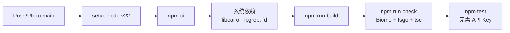
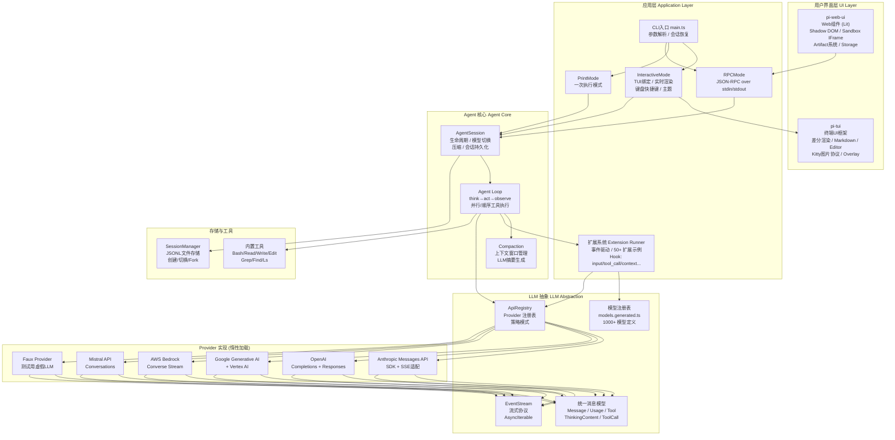

# pi-mono 开源项目架构深度分析

> 分析日期：2026-05-09
> 项目版本：v0.0.3
> 仓库：[earendil-works/pi-mono](https://github.com/earendil-works/pi-mono)

---

## 1. 项目概览

**pi-mono** 是一个 **AI 编程 Agent 框架**的 Monorepo，由 `@earendil-works` 团队（作者 badlogicgames）开发。它提供了一个完整的、可扩展的、多模态的 AI Agent 运行时，涵盖了从多 Provider LLM 统一调用、Agent 循环（Think→Act→Observe）、TUI 交互、到 Web UI 和前端组件的完整链路。

```
┌─────────────────────────────────────────────────────────────────┐
│                    pi-mono Monorepo                              │
│                                                                  │
│  ┌─────────┐  ┌─────────┐  ┌────────────────┐  ┌────────┐     │
│  │  pi-ai   │  │ pi-     │  │ pi-coding-agent │  │ pi-tui │     │
│  │          │  │agent-core│  │                │  │        │     │
│  │ LLM 抽象 │  │ Agent   │  │ CLI/TUI/RPC     │  │ 终端UI │     │
│  │ 多Provider│  │ 循环    │  │ 扩展系统        │  │ 差分渲染│     │
│  └────┬─────┘  └────┬────┘  └───────┬────────┘  └────┬───┘     │
│       │               │              │                  │       │
│       └───────────────┴──────────────┴──────────────────┘       │
│                              │                                   │
│                       ┌──────┴──────┐                           │
│                       │  pi-web-ui  │                           │
│                       │  Web 组件   │                           │
│                       └─────────────┘                           │
└─────────────────────────────────────────────────────────────────┘
```

| 包名 | 功能定位 | 核心职责 |
|------|---------|---------|
| **`@earendil-works/pi-ai`** | LLM 统一抽象层 | 多 Provider/API 统一调用、模型注册、流式协议 |
| **`@earendil-works/pi-agent-core`** | Agent 运行时核心 | Agent 循环、工具调用、会话存储、压缩 |
| **`@earendil-works/pi-coding-agent`** | 编码 Agent 应用 | CLI/TUI/RPC 模式、扩展系统、内置工具 |
| **`@earendil-works/pi-tui`** | 终端 UI 框架 | 差分渲染、Markdown、编辑器组件 |
| **`@earendil-works/pi-web-ui`** | Web 前端组件 | ChatPanel、Artifact、Sandbox、Storage |

---

## 2. 核心模块设计与实现

### 2.1 `pi-ai` — 多 Provider LLM 统一抽象

这是整个系统的基石，提供了 **Provider 无关的 LLM 调用接口**。

#### 统一消息模型

系统设计了一套跨 Provider 的语义消息类型：

```typescript
type Message = UserMessage | AssistantMessage | ToolResultMessage;

interface AssistantMessage {
  role: "assistant";
  content: (TextContent | ThinkingContent | ToolCall)[];
  api: Api;            // 使用的 API 协议
  provider: Provider;  // 具体的 Provider
  model: string;       // 模型 ID
  usage: Usage;        // token 使用和成本
  stopReason: StopReason;
}
```

这一抽象层屏蔽了各 Provider（Anthropic、OpenAI、Google、AWS Bedrock 等）之间消息格式的差异。

#### Provider 注册模式（Plugin Pattern）

系统的核心是 `api-registry.ts` 实现的 **注册表模式**：

```
┌──────────────────────────────────────────────┐
│              ApiProviderRegistry              │
│  ┌────────────────────────────────────────┐  │
│  │ Map<Api, RegisteredApiProvider>        │  │
│  │                                        │  │
│  │ "anthropic-messages"  → { stream, ... }│  │
│  │ "openai-completions"  → { stream, ... }│  │
│  │ "google-generative-ai"→ { stream, ... }│  │
│  │ "bedrock-converse"    → { stream, ... }│  │
│  │ ...                                     │  │
│  └────────────────────────────────────────┘  │
└──────────────────────────────────────────────┘
```

每个 Provider 模块暴露 `stream()` 和 `streamSimple()` 函数，通过 `registerApiProvider()` 注册。

#### 惰性加载优化

Provider 模块通过 **Lazy Loading**（`register-builtins.ts`）实现按需加载——只有真正使用时才 `import()` 对应模块，减少启动时间和内存占用：

```typescript
function loadAnthropicProviderModule(): Promise<LazyProviderModule<...>> {
  anthropicProviderModulePromise ||= import("./anthropic.js").then(module => {
    return { stream: module.streamAnthropic, streamSimple: module.streamSimpleAnthropic };
  });
  return anthropicProviderModulePromise;
}
```

#### 事件流协议

LLM 响应用 **事件驱动流式协议**（`AssistantMessageEventStream`）输出：

```
start → text_start → text_delta* → text_end → toolcall_start → toolcall_delta* → toolcall_end → done|error
```

每个事件携带部分消息状态，接收方可以逐步渲染。这一协议成为了整个 Agent 系统流的统一协议。

#### 模型注册表

通过脚本 `scripts/generate-models.ts` 自动生成 `models.generated.ts`（文件约 445KB），包含 1000+ 个已知模型定义（名称、API、Provider、成本、上下文窗口、思维层级等）。运行时通过 `getModels()` / `getModel()` 查找。

---

### 2.2 `pi-agent-core` — Agent 运行时核心

这是一个**通用的 Agent 循环引擎**，不依赖具体 I/O，可以作为库嵌入任何应用。

#### Agent 循环（Think → Act → Observe）

核心循环位于 `agent-loop.ts`：

```
┌─────────────────────────────────────────────────────────────┐
│                     Agent Loop                               │
│                                                              │
│  ┌──────────┐   ┌──────────┐   ┌──────────┐   ┌─────────┐ │
│  │  用户输入 │ → │ LLM 推理  │ → │  工具调用  │ → │ 工具结果 │ │
│  │          │   │ (Think)  │   │ (Act)    │   │(Observe)│ │
│  └──────────┘   └──────────┘   └──────────┘   └────┬────┘ │
│       ↑                                              │     │
│       └──────────────────────────────────────────────┘     │
│                   循环直到 stopReason=stop                   │
└─────────────────────────────────────────────────────────────┘
```

关键设计：
- **双层循环**：内层处理当前 LLM 响应和工具调用；外层处理 Follow-up 消息队列
- **流式和批式执行**：`executeToolCalls` 支持 `"parallel"` 和 `"sequential"` 两种模式
- **前后钩子**：`beforeToolCall` 和 `afterToolCall` 允许拦截和修改工具执行结果

#### 事件驱动架构

Agent 循环通过 `EventStream<AgentEvent>` 发布事件，UI 层直接订阅：

```
AgentEvent:
  agent_start | agent_end
  → turn_start | turn_end
    → message_start | message_update* | message_end
      → tool_execution_start | tool_execution_update* | tool_execution_end
```

这是 **Observer 模式**和 **事件流模式**的典型组合。

#### Agent 接口

```typescript
interface Agent {
  state: AgentState;       // 状态（model、tools、messages）
  prompt(msg): Promise<AgentMessage[]>;  // 发送提示并执行循环
  subscribe(listener): void;             // 订阅事件
  setModel(model): void;
  setThinkingLevel(level): void;
}
```

#### 会话管理

```typescript
interface AgentState {
  systemPrompt: string;
  model: Model<any>;
  thinkingLevel: ThinkingLevel;
  tools: AgentTool<any>[];
  messages: AgentMessage[];
  isStreaming: boolean;
  streamingMessage?: AgentMessage;
  pendingToolCalls: ReadonlySet<string>;
  errorMessage?: string;
}
```

#### 上下文压缩（Compaction）

Agent 通过 LLM 摘要历史对话来管理上下文窗口，实现在 `harness/compaction/`：

- `shouldCompact()` → 检查 token 水位
- `prepareCompaction()` → 准备压缩上下文
- `compact()` → 调用 LLM 生成摘要，替换历史消息
- 支持自动压缩（Auto Compaction）和手动触发

---

### 2.3 `pi-coding-agent` — 编码 Agent 应用

这是最上层的应用层，提供了三种运行模式：

```
┌────────────────────────────────────────────────────┐
│               pi-coding-agent                       │
│                                                     │
│  ┌──────────┐  ┌──────────┐  ┌──────────────────┐  │
│  │  自动模式 │  │ 交互模式  │  │     RPC 模式     │  │
│  │ (print)  │  │(interactive)│   │                 │  │
│  │ 一次执   │  │ TUI 集成  │  │ JSON-RPC over    │  │
│  │ 行+退    │  │ 实时渲染  │  │ stdin/stdout     │  │
│  └──────────┘  └──────────┘  └──────────────────┘  │
│                                                     │
│  ┌──────────────────────────────────────────────┐   │
│  │           AgentSession 核心封装              │   │
│  │  - 会话状态管理                              │   │
│  │  - 自动/手动压缩 (Compaction)                │   │
│  │  - 扩展系统                                  │   │
│  │  - 模型切换/思维层级切换                     │   │
│  │  - Bash 执行封装                             │   │
│  └──────────────────────────────────────────────┘   │
└────────────────────────────────────────────────────┘
```

#### AgentSession 核心门面类

`AgentSession` 是编码 Agent 的核心门面（Facade），封装了：
- **会话生命周期**：创建、切换、分支（Fork）、恢复
- **状态管理**：`AgentState` 暴露 tools、messages、model、thinkingLevel
- **事件订阅**：外部注册事件监听器，持久化自动序列化
- **上下文压缩**：`compact()` 使用 LLM 摘要旧对话以节约 tokens

#### 扩展系统（Extension System）

这是整个项目的**最大亮点**——一个完整的事件驱动的扩展体系：

```typescript
interface Extension {
  name: string;
  path: string;
  shortcuts: Map<KeyId, ExtensionShortcut>;
  handlers: Map<string, ExtensionHandler[]>;
  tools: Map<string, RegisteredTool>;
  commands: Map<string, RegisteredCommand>;
  flags: Map<string, ExtensionFlag>;
}
```

扩展通过 **事件钩子**（Hook）与系统集成：

| 事件钩子 | 触发时机 | 典型用途 |
|---------|---------|---------|
| `before_agent_start` | LLM 调用前 | 注入自定义系统提示/消息 |
| `tool_call` | 工具调用前 | 权限门控、参数修改 |
| `tool_result` | 工具返回后 | 结果后处理、屏蔽敏感信息 |
| `context` | 上下文提交前 | 消息过滤、压缩 |
| `message_end` | 消息完成 | 自定义渲染 |
| `user_bash` | 用户输入 bash | 沙箱/安全门控 |
| `session_before_*` | 会话操作前 | 确认对话框、备份 |
| `before_provider_request` | HTTP 请求发送前 | 请求篡改/调试 |
| `input` | 用户输入 | 输入转换/拦截 |
| `resources_discover` | 资源发现 | 提供自定义 skills/prompts |

社区已经贡献了 50+ 扩展示例，涵盖交互式 Shell、DOOM 游戏、SSH 连接、权限门控等。

---

### 2.4 `pi-tui` — 终端 UI 框架

一个**从零实现的 TUI 框架**，特色在于**差分渲染**（Differential Rendering）：

```typescript
interface Component {
  render(width: number): string[];
  handleInput?(data: string): void;
  invalidate(): void;
}
```

核心特性：
- **Virtual Terminal**：内存中维护一个终端状态矩阵，每次渲染只向实际终端输出变化的字符
- **Kitty/Terminology 图片协议**：支持在终端中渲染图片
- **Markdown 渲染**：内置 Markdown 组件
- **编辑器组件**：语法高亮、撤销栈、多行编辑
- **Overlay 系统**：模态对话框、下拉选择器
- **缓冲输入**：`StdinBuffer` 将批量事件分成可消化的块

---

### 2.5 `pi-web-ui` — Web 前端组件

基于 **Lit**（Web Components），可在任何前端框架中使用：

```
ChatPanel
├── AgentInterface       — 主聊天界面
├── MessageList          — 消息列表（含虚拟滚动）
├── Messages             — 消息渲染（User/Assistant/Tool/Aborted）
├── StreamingMessageContainer — 流式消息容器
├── ThinkingBlock        — 思维过程展示
├── SandboxedIframe      — 安全沙箱 IFrame
├── ConsoleBlock         — 终端输出
├── Artifact 系统        — HTML/Image/Markdown/PDF/SVG/Text
└── 各种 Dialog          — 模型选择、API Key、Settings
```

沙箱运行时系统通过 `postMessage` 桥接与主页面通信：

```
SandboxIframe
├── ArtifactsRuntimeProvider   — Artifact 管理
├── AttachmentsRuntimeProvider  — 附件
├── ConsoleRuntimeProvider      — 控制台日志
└── FileDownloadRuntimeProvider — 文件下载
```

---

## 3. 关键设计模式

### 3.1 策略模式（Strategy）— Provider 管理

不同 LLM Provider 通过统一的 `StreamFunction` 接口实现，在 ApiProviderRegistry 中按 `api` 键注册。调用时根据 `model.api` 字段路由到对应策略。

### 3.2 观察者模式（Observer）— 事件驱动

```typescript
// Agent 产生事件流
const stream = agentLoop(prompts, context, config);
for await (const event of stream) {
  // UI 层自由订阅
}
```

- Agent 循环：通过 `EventStream<AgentEvent>` 发布
- 扩展系统：扩展通过事件钩子订阅 Agent 生命周期
- TUI/Web UI：各自按需消费 Agent 事件

### 3.3 门面模式（Facade）— AgentSession

`AgentSession` 封装了下级子系统（Agent 循环、会话管理器、模型注册表、Settings、扩展系统）的全部复杂性，向上暴露简洁的 API。

### 3.4 工厂模式（Factory）— Agent Harness

```typescript
createAgentSessionRuntime({
  cwd,
  sessionManager,
  extensionFlagValues,
  // ...
}) // 返回 { session, services, diagnostics, ... }
```

`createAgentSessionServices` 和 `createAgentSessionRuntime` 采用工厂方法模式，组装配置、资源加载器、模型注册表等服务。

### 3.5 模板方法模式 — Agent Loop

`runLoop` 定义了 Agent 执行的骨架，而 `convertToLlm`、`transformContext`、`beforeToolCall`、`afterToolCall`、`getSteeringMessages`、`getFollowUpMessages` 是可定制的钩子方法。

### 3.6 惰性加载（Lazy Loading）— Provider 模块

Provider 模块（Anthropic、OpenAI SDK 等）体积较大，通过 `import()` 动态导入实现按需加载，大幅减少启动时间。

### 3.7 差量渲染（Differential Rendering）— TUI

TUI 只向终端输出**变化的部分**，而不是全部重绘，这在大输出量的聊天场景中性能至关重要。

### 3.8 注册表模式（Registry）— 工具/模型/扩展

```typescript
const apiProviderRegistry = new Map<string, RegisteredApiProvider>();
// 工具、模型、扩展均使用类似的 Map 注册表模式
```

---

## 4. 重要设计决策及权衡

### 决策 1：统一消息模型 vs Provider 原生格式

**选择**：设计统一的跨 Provider 消息类型（`Message`、`AssistantMessage` 等），在 Provider 实现内部转换。

**权衡**：
- ✅ 上层代码与 Provider 解耦，Agent 循环不需要理解各 Provider 细节
- ✅ 新 Provider 只需实现转换逻辑，不影响现有代码
- ❌ 在每个 Provider 实现中都需要做消息格式转换（`transform-messages.ts`）
- ❌ 部分 Provider 特有功能（如 Anthropic 的 `cache_control`、Google 的 `thinking_signature`）需要降级到 `Compat` 配置字段

### 决策 2：事件流 vs Promise 回调

**选择**：使用 `EventStream<T>`（可迭代 AsyncIterable）作为 LLM 输出和 Agent 事件的基本抽象。

**权衡**：
- ✅ 流式输出：逐步渲染 thinking/text/toolCall 的开头和增量
- ✅ 统一协议：LLM 流和 Agent 事件流使用相同的模式
- ✅ 易于取消：通过 `AbortSignal` 实现
- ❌ 额外的抽象层需要维护
- ❌ 如果消费者速度跟不上，事件在队列中堆积

### 决策 3：事件驱动扩展 vs 类继承

**选择**：扩展系统使用事件订阅（Publish-Subscribe），不是类继承或接口实现。

**权衡**：
- ✅ 松耦合：扩展和核心系统之间不直接依赖
- ✅ 多个扩展可以订阅同一事件，自由组合
- ✅ 扩展可以注册工具、命令、快捷键、CLI 标志
- ❌ 事件执行顺序：多个扩展的处理顺序可能产生隐式依赖
- ❌ 错误隔离：一个扩展的异常需要被捕获和隔离

### 决策 4：Agent 循环双层架构 vs 单层循环

**选择**：内层处理 LLM→Tool 循环，外层处理 Follow-up 消息队列。

**权衡**：
- ✅ 支持用户在 Agent 工作时发送"steering"消息
- ✅ Follow-up 模式允许工具执行完成后异步注入新消息
- ✅ 行为更接近真实交互场景
- ❌ `getSteeringMessages` / `getFollowUpMessages` 需要外部提供有状态的队列
- ❌ 增加复杂度

### 决策 5：Monorepo 结构 vs 多仓库

**选择**：单一 Monorepo，npm workspaces。

**权衡**：
- ✅ 原子性提交：跨包变更一次 PR 完成
- ✅ 统一的 CI/CD 管道
- ✅ 本地开发时版本同步
- ❌ `npm run build` 需要按顺序构建（tui → ai → agent → coding-agent → web-ui）
- ❌ `package-lock.json` 体积 180KB

### 决策 6：TypeBox 验证 vs Zod 等

**选择**：TypeBox 用于工具参数 Schema 定义和验证。

**权衡**：
- ✅ 原生支持 JSON Schema 输出（LLM 需要 JSON Schema）
- ✅ 类型推断：`Static<typeof schema>` 自动推导 TypeScript 类型
- ❌ 社区小于 Zod/Joi
- ❌ API 相对底层

---

## 5. 数据流 / 请求处理流程

### 5.1 完整请求处理链路

```
用户输入
    │
    ▼
┌──────────────────────────────────────────────────────────┐
│ InteractiveMode / PrintMode                              │
│  - CLI 参数解析 (/cli/args.ts)                          │
│  - 会话创建/恢复 (SessionManager)                        │
│  - 资源加载 (extensions, skills, prompts)               │
│  - 系统提示构建 (system-prompt.ts)                       │
└──────────────────────┬───────────────────────────────────┘
                       │
                       ▼
┌──────────────────────────────────────────────────────────┐
│ AgentSession.prompt()                                    │
│  - 扩展 before_agent_start 钩子                         │
│  - 扩展 input 钩子                                      │
│  - 消息预处理 (parseSkillBlock 等)                      │
└──────────────────────┬───────────────────────────────────┘
                       │
                       ▼
┌──────────────────────────────────────────────────────────┐
│ Agent Loop (agent-loop.ts)                               │
│                                                          │
│  1. transformContext() → 上下文预处理                    │
│  2. convertToLlm() → 转换为 LLM 消息格式                │
│  3. streamSimple(model, ctx, opts) → 调用 LLM           │
│     └─ ApiRegistry.lookup(api) → Provider 实现           │
│  4. 解析 LLM 响应，提取 toolCall                         │
│  5. prepareToolCall() → 参数验证 + beforeToolCall 钩子   │
│  6. executeToolCall() → 并行/顺序执行                    │
│  7. afterToolCall() → 结果后处理                         │
│  8. 分析是否需要继续 → 回到 1 或退出                     │
└──────────────────────┬───────────────────────────────────┘
                       │
                       ▼
┌──────────────────────────────────────────────────────────┐
│ 会话持久化 / UI 更新                                     │
│  - 事件通过 EventStream 发布                             │
│  - InteractiveMode 更新 TUI 渲染                         │
│  - 消息自动序列化为 JSONL                                │
│  - 上下文压缩 (当接近 token 上限时)                      │
└──────────────────────────────────────────────────────────┘
```

### 5.2 LLM 调用链路示例（Anthropic）

```
streamSimple(model, context)
    │
    ▼
resolveApiProvider("anthropic-messages")
    │
    ▼
anthropic-provider.ts:
    1. transformMessages() → 泛 Message[] → Anthropic MessageParam[]
    2. 构建 SDK 参数 (cache_control, thinking, tool 等)
    3. anthropic.messages.stream() (SSE)
    4. 逐事件解析: message_start → content_block_start → content_block_delta → message_delta
    5. 产生统一 AssistantMessageEvent: start → text_start → text_delta → toolcall_start → done
    6. 通过 AssistantMessageEventStream 推送
```

### 5.3 扩展事件流

```
用户输入 → [input 转换链] → [before_agent_start 钩子]
  → LLM 调用 → [context 转换链] → [before_provider_request 钩子]
  → LLM 响应 → [tool_call 门控链] → 工具执行 → [tool_result 后处理链]
  → [message_end 后处理链] → 下一轮
```

---

## 6. 工程化实践

### 6.1 测试体系

项目使用 **Vitest** 作为测试框架，每个包都有自己的 `vitest.config.ts`：

```
packages/
├── ai/              — 38+ 测试文件
├── agent/           — 11+ 测试文件（含 Harness 集成测试）
├── coding-agent/    — 60+ 测试文件（含 Suite 集成测试）
├── tui/             — 25+ 测试文件
```

**测试分层**：

| 层级 | 文件位置 | 方式 |
|------|---------|------|
| 单元测试 | `packages/*/test/*.test.ts` | Vitest，Mock 外部依赖 |
| 集成测试 | `packages/coding-agent/test/suite/` | `FauxProvider`（虚假 LLM）+ 真实 Agent 循环 |
| 回归测试 | `packages/coding-agent/test/suite/regressions/` | 问题编号命名 |
| E2E 测试 | `packages/ai/test/*-e2e.test.ts` | 需要真实 API Key，通过 `test.sh` 跳过 |

**核心模式**：使用 **Faux Provider**（`providers/faux.ts`）可以在不消耗真实 API tokens 的情况下测试完整的 Agent 循环，这是 CI 中测试的关键。

```typescript
// FauxProvider 模式示例
const fauxModel = getModel("faux", "faux");
const stream = agentLoop([userMessage], context, {
  model: fauxModel,  // 虚假 LLM，不消耗真实 API
  // ...
});
```

### 6.2 CI/CD 管道



CI 工作流（`.github/workflows/ci.yml`）：
- **Build**：`npm ci` + `npm run build`（按顺序构建各包）
- **Check**：`biome check`（Lint + Format）+ `tsgo --noEmit`（TypeScript 类型检查）+ `web-ui tsc`
- **Test**：`npm test`（Vitest，跳过需要 API Key 的测试）

额外管道：
| 工作流 | 功能 |
|--------|------|
| `build-binaries.yml` | 构建 Bun 编译二进制 |
| `issue-gate.yml` | 新贡献者 Issue 自动关闭 + 审核 |
| `pr-gate.yml` | 新贡献者 PR 自动关闭 |
| `approve-contributor.yml` | 维护者批准后开放权限 |

### 6.3 代码质量

- **Biome**：统一的 Linter 和 Formatter（`biome.json`），`error-on-warnings` 严格模式
- **TypeScript**：`tsgo` 进行跨包类型检查，各包独立 `tsconfig.build.json`
- **Husky**：Git 钩子管理
- **AGENTS.md**：严格的代码规范（禁止 `any`、禁止内联 import、禁止硬编码快捷键等）

### 6.4 发布流程

```bash
npm run version:patch  # 版本更新 + 清理重装
npm run release:patch  # 构建 + 检查 + 发布
```

发布前自动执行 `prepublishOnly`：`clean → build → check`，确保质量。

---

## 7. 架构总图



---

## 8. 总结

pi-mono 是一个**设计精良、工程化成熟**的开源 AI Agent 框架。其核心优势在于：

1. **分层清晰的架构**：AI 抽象层 → Agent 循环 → 应用层 → UI 层，每层职责单一
2. **强大的扩展系统**：事件驱动的 Hook 机制，让扩展可以深入到 Agent 的每个生命周期环节
3. **流式优先**：从 LLM 调用到 Agent 事件，全程使用 EventStream 协议，支持实时渲染
4. **多 Provider 支持**：一套 API 兼容 9 种不同的 LLM 协议/Provider
5. **双前端支持**：TUI（终端）和 Web UI 共享同一核心
6. **工程化完善**：TypeScript 全覆盖、Vitest 测试（含 Faux Provider 模式）、Biome 格式化、CI/CD 自动

**主要权衡**集中在抽象成本上——统一消息模型相比原生 API 会有一定转换开销，但换来了 Provider 无关性这一核心价值。扩展系统的事件模型虽灵活，但多扩展间的事件顺序和错误隔离是需要关注的复杂度来源。
