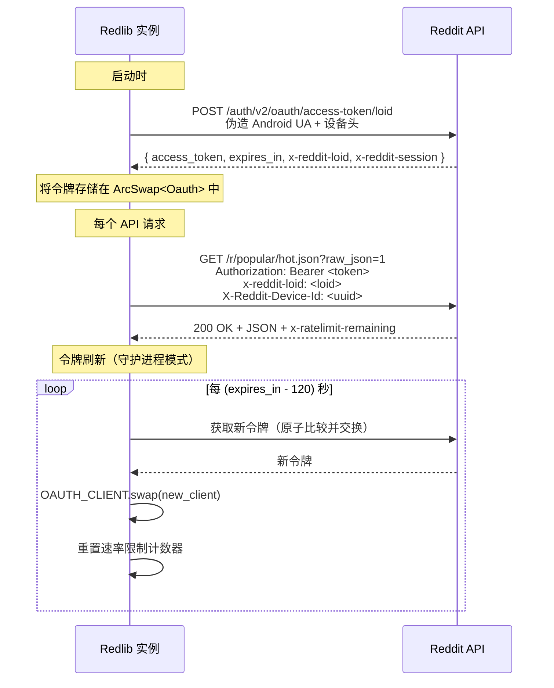
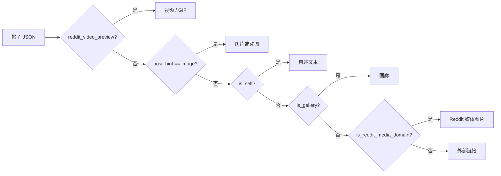
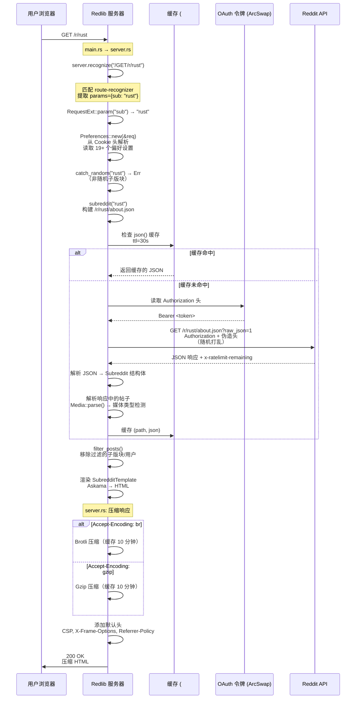

# Redlib 架构深度分析

> 分析日期：2026-05-09 | 项目版本：v0.36.0 | 许可证：AGPL-3.0-only

---

## 1. 项目概览

| 元数据 | 值 |
|--------|-------|
| **描述** | Reddit 的替代性私有前端（源自 [Libreddit](https://github.com/libreddit/libreddit)） |
| **语言** | Rust (EDITION 2021)，要求 Rust ≥ 1.81 |
| **版本** | v0.36.0 |
| **许可证** | AGPL-3.0-only |
| **仓库** | [github.com/redlib-org/redlib](https://github.com/redlib-org/redlib) |
| **代码规模** | ~6,741 行 Rust，~1,528 行 Askama 模板，~2,403 行 CSS，~197 行 JS |
| **安全** | `#![forbid(unsafe_code)]` — 零 unsafe 代码 |

### 核心技术栈

| 组件 | 技术选型 |
|-----------|---------------|
| HTTP 服务端 | **Hyper** (v0.14) — 轻量异步 HTTP 库 |
| 路由 | **route-recognizer** — 带参数提取的路径匹配 |
| 模板引擎 | **Askama** (v0.14) — 编译时类型安全模板（类似 Jinja） |
| HTTP 客户端 | **wreq** (v6.0) — 基于 wry 的 HTTP 库，支持请求伪造 / 浏览器模拟 |
| JSON 处理 | **serde_json** |
| 缓存 | **cached** (v0.59) — 基于 proc-macro 的惰性缓存 |
| 压缩 | **libflate** (gzip) + **brotli** |
| OAuth | 自定义实现（设备 ID 模拟 + 令牌轮换） |
| 反序列化 | **bincode** + **base2048** （用于编码/解码用户偏好设置） |
| Markdown | **pulldown-cmark** （用于渲染自述文本） |
| RSS | **rss** crate |

---

## 2. 整体架构与模块划分

Redlib 采用**扁平模块架构**，核心 HTTP 框架优雅地置于 Hyper 之上，遵循**中介者模式**，由中央 `Server` 结构体协调所有请求的生命周期。

```mermaid
graph TB
    subgraph "启动层"
        main[main.rs]
        buildrs[build.rs<br/>注入 GIT_HASH]
    end

    subgraph "核心框架"
        server[server.rs<br/>自定义 HTTP 框架]
        server --> route[route-recognizer<br/>URL 路由]
        server --> compress[内容协商压缩<br/>Brotli / Gzip]
    end

    subgraph "配置层"
        config[config.rs<br/>Env → TOML → 默认值 优先级链]
        instance_info[instance_info.rs<br/>运行时实例信息]
    end

    subgraph "Reddit API 层"
        client[client.rs<br/>API 客户端 + 缓存]
        oauth[oauth.rs<br/>OAuth 令牌管理]
        oauth_res[oauth_resources.rs<br/>设备指纹]
    end

    subgraph "页面处理层"
        subreddit[subreddit.rs<br/>子版块 / 首页]
        post[post.rs<br/>帖子详情 + 评论树]
        user[user.rs<br/>用户资料]
        search[search.rs<br/>搜索]
        duplicates[duplicates.rs<br/>重复帖子]
        settings[settings.rs<br/>Cookie 偏好设置]
    end

    subgraph "数据模型层"
        utils[utils.rs<br/>Post, Comment, 偏好设置,<br/>URL 重写, 媒体解析]
    end

    subgraph "表现层"
        templates[templates/<br/>15 个 Askama .html 模板]
        static_assets[static/<br/>CSS (19 主题), JS, 图标]
    end

    main --> server
    main --> client
    server --> subreddit
    server --> post
    server --> user
    server --> search
    server --> settings
    server --> duplicates
    server --> instance_info
    subreddit --> client
    post --> client
    user --> client
    search --> client
    client --> oauth
    utils --> config
    subreddit --> utils
    post --> utils
    user --> utils
```

### 模块职责

| 模块 | 职责 | 关键类型 |
|--------|----------|------------|
| **`main.rs`** | 入口点、CLI 参数解析、路由注册、启动前健康检查 | - |
| **`server.rs`** | 自定义 HTTP 框架：路由、压缩、请求/响应扩展 | `Server`, `Route`, `RequestExt`, `ResponseExt` |
| **`client.rs`** | Reddit API 抽象层：带令牌的请求、速率限制追踪、重定向处理、JSON 缓存 | `CLIENT`, `OAUTH_CLIENT`, `json()`, `canonical_path()` |
| **`oauth.rs`** | OAuth 令牌生命周期：获取、刷新、后备策略 | `Oauth`, `MobileSpoofAuth`, `GenericWebAuth` |
| **`config.rs`** | 分层配置：环境变量 → TOML 文件 → 默认值 | `Config`, `CONFIG` (LazyLock) |
| **`utils.rs`** | 数据模型：帖子、评论、用户、子版块、偏好设置、URL 重写、辅助函数 | `Post`, `Comment`, `Preferences`, `Subreddit`, `User` |
| **`subreddit.rs`** | 子版块 / 首页 / Wiki / 侧边栏渲染 + 订阅管理 | `SubredditTemplate` |
| **`post.rs`** | 帖子详情 + 递归评论树解析 | `PostTemplate` |
| **`user.rs`** | 用户资料页面渲染 | `UserTemplate` |
| **`search.rs`** | 全站 + 子版块内搜索 | `SearchTemplate` |
| **`settings.rs`** | 基于 Cookie 的偏好设置 CRUD + 导入/导出 | `SettingsTemplate` |
| **`duplicates.rs`** | 重复帖子交叉引用 | - |
| **`instance_info.rs`** | 元信息端点（JSON/YAML/HTML/TXT） | `InstanceInfo` |

---

## 3. 核心模块的设计与实现

### 3.1 自定义 HTTP 框架 (`server.rs`)

Redlib 没有使用 Actix-Web 或 Axum，而是构建了自己的**轻量级框架**，直接基于 Hyper 和 `route-recognizer` 构建。

**路由注册 API**（流畅风格的构建器模式）：

```rust
app.at("/r/:sub")
   .get(|r| subreddit::community(r).boxed())
   .post(|r| subreddit::add_quarantine_exception(r).boxed());
```

**路由匹配**：框架将 `GET`、`POST` 等方法编码到路径字符串中（例如 `/GET/r/{sub}`、`/POST/r/{sub}`），利用 `route_recognizer` 的参数提取功能。每个路由会产生一个 `Box<dyn Future<Output = Result<Response, String>>` —— 以闭包注入的方式，在编译时生成高效的响应处理链路。

**内容协商压缩**：
- 解析 `Accept-Encoding` 头，支持 q 值权重
- 智能选择 Brotli 或 Gzip，默认优先 Gzip（更广泛的浏览器兼容性）
- 响应体压缩结果带有 10 分钟 TTL 缓存
- 对小于 IP 帧大小（1452 字节）的响应体跳过压缩

**请求/响应扩展**：通过 `RequestExt` 和 `ResponseExt` trait，框架为 `hyper::Request` 和 `hyper::Response` 增加了参数提取、Cookie 解析和 `Set-Cookie` 管理等能力，采用**扩展模式**（Rust 中的 `trait extension pattern`）。

### 3.2 OAuth 令牌管理 (`oauth.rs`)

这是最重要的设计决策 —— Redlib **不对用户进行 OAuth 认证**，而是**模拟官方的 Reddit Android 客户端**来获取自己的 API 令牌。



**双后端策略（策略模式）**：

| 后端 | 方法 | 回退触发条件 |
|--------|----------|----------------|
| **`MobileSpoofAuth`** | 模拟 Android Reddit 应用（特定 UA、设备 ID、媒体编解码器头） | 默认选择 |
| **`GenericWebAuth`** | 通过标准 Web 授权端点获取 `device_id` 令牌 | 连续 5 次失败后激活 |

`ArcSwap<Oauth>` 提供了**无锁读取**，同时允许原子式实时替换令牌 —— 对于高流量实例至关重要。

**速率限制追踪**：每个 API 响应都会解析 `x-ratelimit-remaining` 头，通过 `AtomicU16` 进行原子递减。当计数低于 10 时，会触发令牌轮换以重置速率限制。

### 3.3 HTTP 客户端层 (`client.rs`)

**Wreq 客户端**配置了**浏览器模拟**，在 Chrome 145 和 Firefox 147 之间随机选择，并在 Android 和 Windows 之间随机切换操作系统。这不仅仅是为了获取内容 —— 而是为了在指纹识别分析中看起来像一个真实用户。

**JSON API 调用流程**：

```mermaid
flowchart TD
    A[请求到达] --> B{路径在缓存中？}
    B -->|是| C[返回缓存结果<br/>#cached proc-macro<br/>TTL=30s, size=100]
    B -->|否| D[检查速率限制<br/>AtomicU16 < 10?]
    D -->|是| E[触发 force_refresh_token]
    D -->|否| F[构建请求头<br/>随机打乱顺序]
    E --> F
    F --> G[向 oauth.reddit.com 发送请求]
    G --> H{3xx 重定向？}
    H -->|是| I[递归跟随<br/>最多 3 次]
    H -->|否| J{429 / 401？}
    J -->|是| K[触发令牌刷新<br/>返回错误]
    J -->|否| L[解析 JSON]
    L --> M[错误代码？]
    M -->|隔离区| N[返回 "quarantined"]
    M -->|封禁| O[返回 "banned"]
    M -->|私有| P[返回 "private"]
    M -->|其他错误| Q[返回错误信息]
    M -->|成功| R[缓存并返回 JSON]
```

**关键设计决策**：
- **禁用跟随重定向**（`Policy::none()`），因为重定向处理需要手动解析 `Location` 头 —— 这样可以更好地处理请求回退
- **请求头随机打乱**以减少基于模式的指纹识别
- `canonical_path()` 使用 HEAD 请求和递归重定向解析将短链接（`redd.it`）解析为完整路径
- `proxy()` 端点（`/img/*`、`/vid/*`、`/hls/*`）通过 Redlib 透明地代理所有 Reddit 媒体，确保**没有直接浏览器到 Reddit 的请求**

### 3.4 数据模型与解析层 (`utils.rs`)

`Post` 结构体是核心领域模型，包含约 25 个字段 —— 帖子内容、媒体、榜单、投票、作者信息、标记等。

**媒体类型检测**（`Media::parse()` 方法中的策略模式）：



**URL 重写系统**：`format_url()` 函数系统性地将所有 Reddit CDN URL 重写为 Redlib 的代理端点：

| 原始 Reddit URL | Redlib 代理 |
|-----------------|----------------|
| `https://i.redd.it/{path}` | `/img/{path}` |
| `https://v.redd.it/{id}/DASH_{size}` | `/vid/{id}/{size}` |
| `https://preview.redd.it/{id}` | `/preview/pre/{id}` |
| `https://emoji.redditmedia.com/{a}/{b}` | `/emoji/{a}/{b}` |
| `http(s)://www.reddit.com/{path}` | `/{path}` |

同样，`rewrite_urls()` 函数处理帖子/评论正文，将 Reddit 超链接重写为 Redlib 相对路径，去除反斜杠转义，并处理表情引用。

### 3.5 用户偏好设置系统 (`settings.rs` + `utils.rs`)

架构中一个突出的部分是**完全无服务器的用户状态** —— 所有偏好设置都存储在浏览器 Cookie 中：

```mermaid
flowchart TD
    A[请求到达] --> B{URL 包含 /settings?}
    B -->|是| C[设置端点<br/>解析表单 → 设置 Set-Cookie]
    B -->|否| D[页面端点<br/>从 Cookie 头读取偏好设置]

    D --> E[Preferences::new(&req)]
    E --> F[遍历 19 个偏好设置名称]
    F --> G[读取每个 Cookie<br/>如无则回退到默认配置]

    C --> H[设置 / 恢复 / 更新]
    H --> I[Set-Cookie 头<br/>expires=52 周<br/>path=/]

    subgraph "订阅 Cookie 编码"
        J[列表 → 以 + 连接的字符串]
        K[如果 >4000 字节边界则分片]
        J --> K
    end
```

**分片 Cookie**：订阅和过滤列表可能会超过单域名 Cookie 的 4KB 限制。`join_until_size_limit()` 函数将长列表切分为多个 Cookie（`subscriptions`、`subscriptions1`、`subscriptions2`…），并在读取时无缝重组。

**偏好设置导入/导出**：偏好设置可以通过 `bincode` 序列化 + `deflate` 压缩 + `base2048` 编码导出为紧凑字符串 —— 一种极具创意的"分享您的 Redlib 设置"方式。

### 3.6 速率限制与启动健康检查

启动时，Redlib 执行**双重速率限制检查**：

1. 获取 `r/reddit` 的帖子 → 检查 `OAUTH_RATELIMIT_REMAINING == 99`
2. 强制令牌轮换 → 获取 `r/rust` 的帖子 → 再次检查 `== 99`

这样能验证：（1）令牌有效；（2）速率限制按预期工作；（3）令牌轮换不会丢失速率限制配额。如果检查失败，仅记录警告而非阻塞启动 —— 这是典型的**韧性优先设计**。

---

## 4. 关键设计模式

| 模式 | 位置 | 实现方式 |
|---------|----------|-------------|
| **策略模式** | `oauth.rs` | `OauthBackend` trait + `MobileSpoofAuth` / `GenericWebAuth` 实现 |
| **构建器模式** | `server.rs` | 流畅的 `app.at(path).get(fn).post(fn)` 路由 API |
| **代理模式** | `client.rs` | 所有 Reddit 媒体 + API 请求都通过 Redlib 服务器代理 |
| **模板方法模式** | `templates/` | Askama 的 `` 继承体系（`base.html` → 各页面模板） |
| **中介者模式** | `server.rs` | `Server` 结构体作为所有路由处理器之间的中央中介者 |
| **惰性初始化** | 多处 | `std::sync::LazyLock` 用于配置、OAuth 客户端、实例信息、正则表达式 |
| **装饰器模式** | `client.rs` | `RequestExt` / `ResponseExt` trait 扩展 Http 类型的能力 |
| **缓存代理** | `client.rs` + `server.rs` | `#[cached]` proc-macro 实现 30s（JSON）至 10min（压缩）的 TTL |
| **观察者模式** | `utils.rs` | URL 重写 regex 的 `LazyLock<Regex>` 模式 |
| **适配器模式** | `client.rs` | `IntoHyperResponse` trait 将 wreq 响应转换为 hyper 响应 |
| **函数式管道** | 请求处理链 | 路由匹配 → 压缩 → 头添加 → 响应返回 |

---

## 5. 重要设计决策及权衡

### 5.1 零 JavaScript 的服务器端渲染（vs SPA 方法）

**决策**：所有页面通过 Askama 模板在服务器端渲染为 HTML。前端不需要 React/Vue/Svelte。

**权衡**：
- ✅ 极佳隐私性 —— 无客户端跟踪、无 JavaScript 有效负载、无第三方请求
- ✅ 极致速度 —— 初始页面加载在几十毫秒内完成
- ✅ 强安全 —— CSP 阻止 `default-src 'none'` 等
- ❌ 交互受限 —— 没有无限滚动、没有实时更新（不带完整页面刷新的情况）
- ❌ 部分站点功能缺失 —— 投票、发帖、编辑都需要直接访问 Reddit

### 5.2 客户端模拟（vs 官方 OAuth / 爬取）

**决策**：模拟官方 Reddit Android 应用的 OAuth 流程，而不是要求用户进行 OAuth 认证，或作为未认证客户端直接爬取。

**权衡**：
- ✅ 显著更高的速率限制（每次令牌轮换 600 次请求/分钟 → 默认 99 次）
- ✅ 用户无需登录 Reddit —— 保持完全匿名
- ❌ 在 Reddit 端存在被指纹识别和封禁的风险
- ❌ 持续维护 —— 需更新应用版本、设备 ID 格式等
- ❌ 无法访问需要真实认证的功能（发帖、私信、多站点浏览）

### 5.3 基于 Cookie 的持久化（vs 服务端数据库）

**决策**：所有用户偏好设置和订阅信息存储在浏览器 Cookie 中，而非数据库中。

**权衡**：
- ✅ 无状态服务器 —— 简化水平扩展
- ✅ 部署简单 —— 无需数据库、无需迁移
- ✅ 天然基于用户的 —— 每个浏览器保持自己的设置
- ❌ Cookie 大小限制 —— 需要分片模式
- ❌ Cookie 在设备间不共享
- ❌ 无持久订阅 —— 清除 Cookie 会丢失所有偏好设置

### 5.4 自建 HTTP 框架（vs Axum / Actix-Web）

**决策**：在 Hyper + route-recognizer 之上构建最小框架。

**权衡**：
- ✅ 编译时间更短（依赖更少）
- ✅ 无宏魔法 —— 更易于调试
- ✅ 极简 API —— 只需 4 个方法（`new`、`at`、`get`、`post`）
- ❌ 无内置中间件体系
- ❌ 无自动错误传播
- ❌ 无请求体提取（需手动 `body::to_bytes` 和 `form_urlencoded::parse`）

### 5.5 双后端 OAuth（vs 单一策略）

**决策**：`MobileSpoofAuth` 失败 5 次后回退至 `GenericWebAuth`。

**权衡**：
- ✅ 韧性高 —— 一个后端被封锁不影响实例运行
- ✅ 渐进式降级 —— 移动端 UA 在反爬虫检测面前更脆弱
- ❌ 代码重复 —— 两个后端实现大量重叠逻辑
- ❌ 启动延迟增加 —— 最多 25 秒（5×5s 超时）才回退

---

## 6. 数据流 / 请求处理流程

### 6.1 典型页面加载流程（例如子版块页面）



### 6.2 帖子详情 + 评论树

**评论解析**（`post.rs`）是递归的、基于流的：

1. Reddit API 在 `response[1]["data"]["children"]` 中以嵌套 JSON 形式返回评论
2. `parse_comments()` 递归遍历每个子节点
3. 遇到 `kind == "more"` 的评论节点，表示有更多嵌套评论需延迟加载
4. `build_comment()` 为每条评论解析：正文（HTML 经过表情重写）、作者、分数、奖项、父级引用
5. 构建完整的 `Comment` 嵌套结构体树

**评论折叠的启发式策略**：同时是版主（`distinguished == "moderator"`）且被置顶的评论默认折叠。这能过滤掉常见的子版块规则公告机器人帖子，同时保留真正的版主互动可见性。

### 6.3 媒体代理流程

```
用户浏览器                           Redlib 服务器                      Reddit CDN
     │                                  │                                │
     │  GET /img/abc123.jpg             │                                │
     │─────────────────────────────────>│                                │
     │                                  │                                │
     │                                  │  GET https://i.redd.it/abc123  │
     │                                  │  Range / If-Modified-Since     │
     │                                  │───────────────────────────────>│
     │                                  │                                │
     │                                  │  图片二进制数据 + 过滤后的头   │
     │                                  │<───────────────────────────────│
     │                                  │                                │
     │  200 OK (透明代理)               │                                │
     │  Content-Type: image/jpeg        │                                │
     │<─────────────────────────────────│                                │
```

所有媒体端点（`/img`、`/vid`、`/hls`、`/preview`、`/thumb`、`/emoji`、`/emote`、`/style`、`/static`）遵循相同的模式：从请求中提取参数，填充 URL 模板，将请求转发到 Reddit 的 CDN，过滤掉 Reddit 特定的响应头（`x-reddit-*`、`server`、`etag` 等），然后将媒体以透明代理形式返回。

---

## 7. 工程化实践

### 7.1 测试策略

| 层级 | 框架 | 覆盖范围 | 示例 |
|-------|---------|----------|---------|
| **单元测试** | 内置 `#[test]` | 辅助函数 | `format_num`、`rewrite_urls`、`format_url`、`render_bullet_lists` |
| **环境测试** | `sealed_test` | 配置优先级 | env vars vs TOML vs 回退到默认值 |
| **集成测试** | `#[tokio::test]` | Reddit API | `test_fetching_subreddit`、`test_fetching_user`、`test_private_sub` |
| **OAuth 测试** | `#[tokio::test]` | 令牌生命周期 | `test_mobile_spoof_backend`、`test_oauth_client_refresh` |
| **压缩测试** | 手动 | 往返 | Brotli/Gzip 编解码校验 |
| **编译时** | `#![forbid(unsafe_code)]` | 整个代码库 | 零 unsafe 代码保证 |

OAuth 集成测试很有意思 —— 它们会针对真实的 Reddit API 端点执行，验证 token 获取和刷新是否真正有效。这是一种务实的测试策略：与其模拟 Reddit API（这会持续过时），不如针对真实端点进行测试（并有适当的超时保护）。

### 7.2 CI/CD 流水线

**GitHub Actions 工作流**：

| 工作流 | 触发条件 | 操作 |
|---------|---------|---------|
| **`main-rust.yml`** | 推送到 `main` + 发布 | 构建 `x86_64-unknown-linux-musl`（静态链接），生成校验和，上传构建产物，`cargo publish` |
| **`main-docker.yml`** | 推送到 `main` | 构建多平台 Docker 镜像，推送到 Quay.io |
| **`pull-request.yml`** | PR | 运行 `cargo test` 和 `cargo clippy` |
| **`build-artifacts.yml`** | 标签/发布 | 跨平台构建（`x86_64`、`aarch64`、`armv7`） |

**Docker 部署**：多阶段构建使用 Alpine 作为基础镜像，安装来自 GitHub Release 的预构建静态链接二进制文件。另提供 `Dockerfile.alpine`、`Dockerfile.ubuntu` 和 `compose.yaml`。

**发布流程**：
1. 推送到 `main` → 使用 `x86_64-unknown-linux-musl` 目标构建暂存版本（RUSTFLAGS 中启用 `+crt-static`，生成纯静态二进制文件）
2. GitHub 发布 → 标签并推送到 crates.io，创建 draft Release 及其产物
3. Docker 构建 → 推送到 Quay.io

### 7.3 构建时基础设施

`build.rs` 通过 `git rev-parse HEAD` 将当前的 `GIT_HASH` 注入 `INSTANCE_INFO`，确保每个构建版本都可通过 `/info` 端点追溯。

### 7.4 主题系统

19 个 CSS 主题通过 `rust_embed` 编译到二进制文件中，在 `Preferences::new()` 初始化时动态检测并注入 `/style.css`：

```rust
// src/utils.rs
#[derive(RustEmbed)]
#[folder = "static/themes/"]
#[include = "*.css"]
pub struct ThemeAssets;
```

这让用户在无需额外网络请求的情况下选择主题 —— 所有主题都在第一个字节被发送前编译进二进制文件。

### 7.5 安全考量

- **`#![forbid(unsafe_code)]`** —— 整个代码库零 unsafe
- **内容安全策略**：`default-src 'none'; font-src 'self'; script-src 'self' blob:; img-src 'self' data:; media-src 'self' data: blob: about:; form-action 'self'; frame-ancestors 'none'`
- **无用户认证** —— 没有密码、会话、CSRF 令牌需要管理
- **抗机器人机制**：在 `robots_disable_indexing` 启用时，基于已知 AI 抓取工具（GPTBot、Claude-Web、CCBot 等 80+ 个字符串）的 User-Agent 字符串进行 403 拦截
- **seccomp 配置文件**：`seccomp-redlib.json` 用于容器的系统调用过滤

---

## 8. 总结

Redlib 代表了 Rust 网络应用中"少即是多"哲学的大师级实践。通过构建自己的 HTTP 框架、实现复杂的 OAuth 令牌模拟系统、以及在无状态架构中巧妙使用 Cookie，该项目在 6,700 行 Rust 代码中实现了显著的简洁性。

**主要优势**：
- 隐私至上 —— 用户与 Reddit 之间零直接接触
- 极致性能 —— 服务器端渲染、响应压缩、多层缓存
- 部署简单 —— 单二进制 + 零外部依赖（无数据库、无运行时）

**架构权衡**：
- 自定义框架意味着无生态支持（无中间件、无即用型集成）
- Cookie 分片处理复杂度高（虽然处理得很优雅）
- Reddit 端持续存在被反爬机制封禁的风险（因此采用双后端设计）
