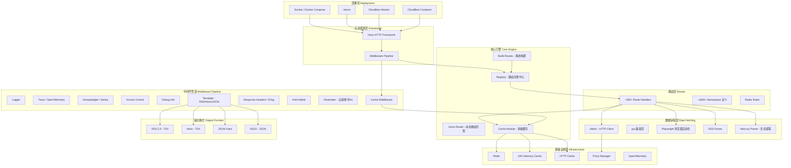
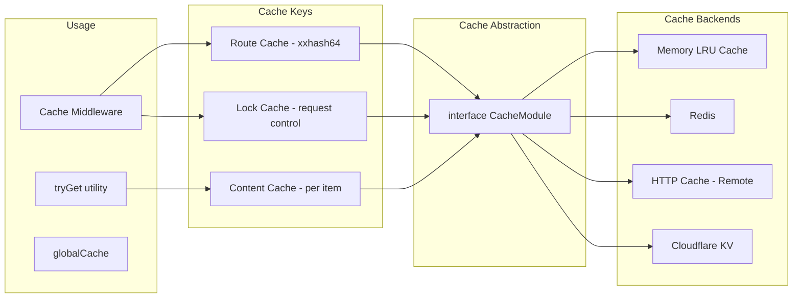
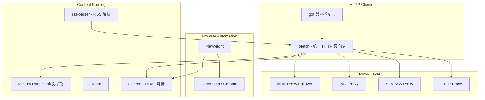
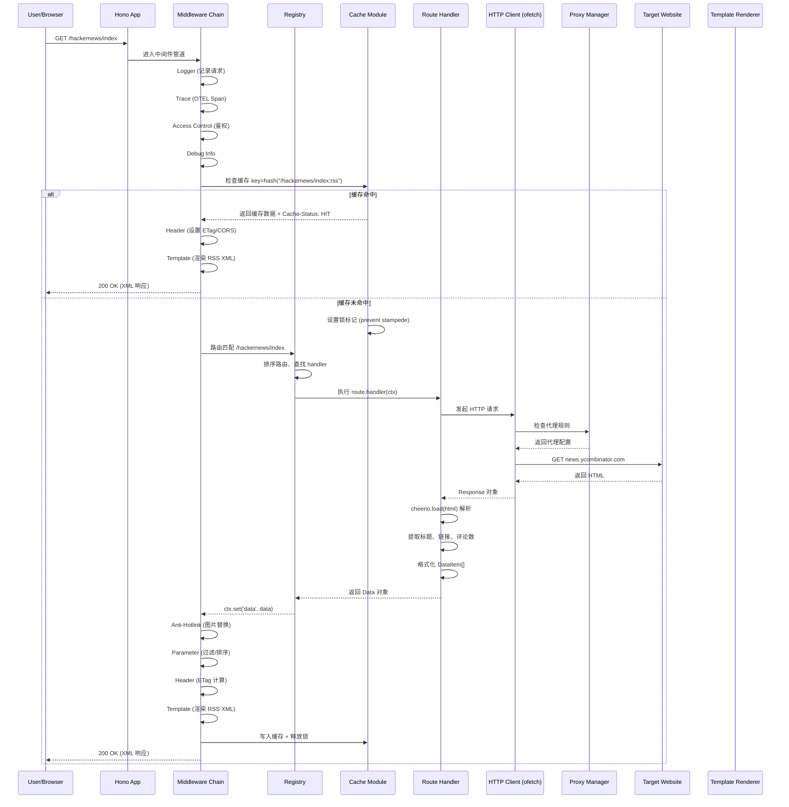
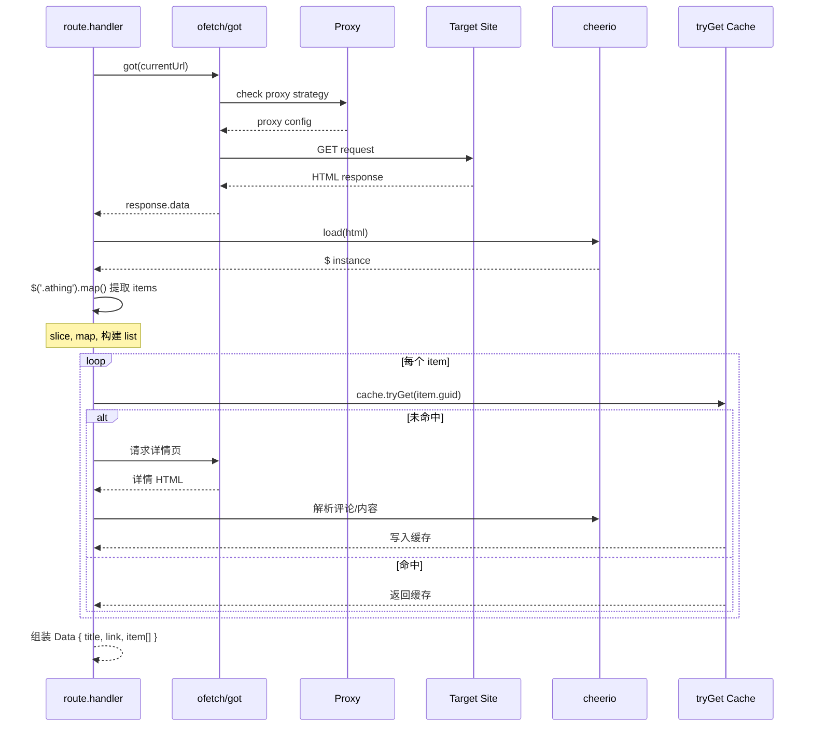
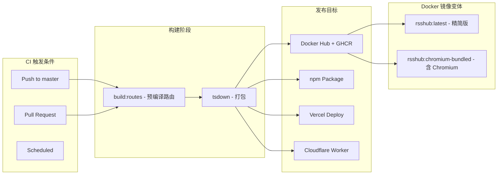

# RSSHub 架构分析

> 分析版本：v1.0.0（master 分支） ｜ 分析日期：2026-05-08

## 1. 项目概览

| 项目 | 信息 |
|------|------|
| 官网 | https://rsshub.app |
| GitHub | https://github.com/DIYgod/RSSHub |
| 编程语言 | TypeScript / TSX |
| 许可证 | AGPL-3.0 |
| 核心维护者 | DIYgod |
| 路由数量 | ~1600+ 个命名空间，~500+ 条独立路由 |

**项目简介**

RSSHub 是一个开源、可扩展的 RSS 内容聚合器，能够为各种网站生成 RSS 订阅源。它支持从社交媒体、新闻媒体、博客、大学通知、政府公告等数千个来源抓取内容，并输出为 RSS、Atom、JSON Feed、RSS3 等多种格式。项目采用插件化的路由架构，任何人都可以轻松为其贡献新的数据源路由。

## 2. 技术栈

| 类别 | 技术选型 |
|------|----------|
| 编程语言 | TypeScript 5.9 |
| Web 框架 | Hono (v4.12) |
| 构建系统 | tsdown (基于 Rolldown)、tsx |
| 测试框架 | Vitest v4、Playwright |
| CI/CD | GitHub Actions (+ Docker Buildx, Vercel, Cloudflare Workers) |
| 存储 | LRU Cache (内存) / Redis / HTTP Cache / Cloudflare KV |
| 代理支持 | HTTP/SOCKS5/PAC 代理 + 多代理故障转移 |
| 影响因子 | @hono/zod-openapi (API 文档) |
| 代码质量 | oxlint、oxfmt、eslint |

## 3. 整体架构



### 架构分层

| 层 | 说明 |
|----|------|
| **部署层** | 支持 Docker（amd64/arm64 多架构）、Vercel Serverless、Cloudflare Worker、Cloudflare Container（Durable Object）四种部署方式 |
| **应用框架层** | 基于 Hono 框架构建，通过中间件管道（Middleware Pipeline）串联请求生命周期处理逻辑 |
| **核心引擎层** | 包含路由注册中心（Route Registry）、动态路由匹配、构建时路由预编译、多级缓存系统 |
| **路由层** | 1600+ 命名空间 + 500+ 路由处理器，每个路由独立文件，通过约定式文件结构组织 |
| **数据获取层** | 统一的 HTTP 客户端（ofetch），支持重试、代理、User-Agent 随机化；Playwright 浏览器自动化用于反爬场景 |
| **输出格式层** | 支持 RSS 2.0、Atom、JSON Feed、RSS3 四种输出格式，通过 TSX 模板渲染 |

### 模块职责

| 模块 | 职责 | 关键文件/目录 |
|------|------|---------------|
| **应用入口** | 启动服务、Cluster 模式管理、服务器配置 | `lib/index.ts`, `lib/server.ts` |
| **应用配置** | 组装中间件管道、路由挂载、错误处理 | `lib/app-bootstrap.tsx`, `lib/app.ts` |
| **路由注册中心** | 动态/静态路由注册、命名空间管理、路由排序 | `lib/registry.ts`, `lib/router.js` |
| **路由实现** | 具体数据源的内容抓取与 RSS 数据生成 | `lib/routes/*/`，每个目录一个数据源命名空间 |
| **中间件** | 请求/响应处理管道（缓存、鉴权、过滤、模板等） | `lib/middleware/*.ts` |
| **配置管理** | 环境变量读取、远程配置拉取、类型化配置对象 | `lib/config.ts` |
| **缓存系统** | 多后端缓存抽象（Memory/Redis/HTTP/Worker KV） | `lib/utils/cache/*.ts` |
| **HTTP 客户端** | 带重试/代理/UA 的 fetch 包装器 | `lib/utils/ofetch.ts`, `lib/utils/got.ts` |
| **代理管理** | PAC/HTTP/SOCKS5 代理支持 + 多代理故障转移 | `lib/utils/proxy/index.ts` |
| **API 模块** | OpenAPI 文档、命名空间/路由/雷达规则查询 | `lib/api/*.ts` |
| **错误处理** | 统一错误响应、Sentry/Honeybadger 集成 | `lib/errors/index.tsx` |
| **构建工具** | 路由预编译、Radar 规则提取、生成 types | `scripts/workflow/build-routes.ts` |

## 4. 核心模块详解

### 4.1 路由系统（Route System）

RSSHub 的路由系统是其最核心的架构设计，采用**约定大于配置**的文件组织方式：

```
lib/routes/
├── hackernews/       # 一个命名空间 = 一个目录
│   ├── namespace.ts  # 命名空间元数据（名称、语言、分类等）
│   └── index.ts      # 路由处理器导出 route 对象
├── github/
│   ├── namespace.ts
│   ├── issue.ts      # 可多个文件，一个文件一个路由
│   ├── pull.ts
│   └── ...
```

每个路由文件导出一个 `Route` 类型对象，包含 `path`（Hono 路由路径语法）、`handler`（请求处理器）、`name`、`categories`、`maintainers`、`radar`（浏览器扩展规则）、`features`（特性标记）等信息。这种设计使得：

1. **高内聚** — 每个路由的自描述信息（路径、参数、示例、维护者）与处理逻辑在同一文件中
2. **低耦合** — 路由之间完全独立，无需共享状态
3. **低门槛贡献** — 新手只需了解一个文件的导出格式即可贡献新数据源

路由注册有两种模式：
- **生产模式** — 通过 `build-routes.ts` 预编译所有路由到 `assets/build/routes.js`，运行时直接导入，零启动开销
- **开发模式** — 使用 `directory-import` 动态导入（热重载友好）

### 4.2 中间件管道（Middleware Pipeline）

RSSHub 的中间件管道按以下顺序执行，每个中间件处理请求的一个横切关注点：

```
请求到达
  ↓
trimTrailingSlash / compress (Hono 内置)
  ↓
jsxRenderer (设置 JSX 渲染器，用于 RSS/Atom 模板)
  ↓
Logger (请求日志)
  ↓
Trace (OpenTelemetry 分布式追踪)
  ↓
Honeybadger / Sentry (错误跟踪，仅 Node.js)
  ↓
Access Control (基于 accessKey 的鉴权)
  ↓
Debug Info (调试信息收集)
  ↓
Template (路由处理器执行后的响应渲染)
  ↓
Header (响应头：CORS/ETag/Cache-Control)
  ↓
Anti-Hotlink (图片/多媒体链接替换)
  ↓
Parameter (过滤/排序/全文提取/AI 摘要等)
  ↓
Cache (缓存检查/写入)
  ↓
Route Handler (实际的路由处理逻辑)
  ↓
响应返回
```

其中 `Cache` 中间件在路由处理前后都有逻辑：在处理前检查缓存命中（HIT 直接返回），未命中则设置锁防止缓存风暴，在路由处理完成后写入缓存。`Parameter` 中间件在路由处理后处理数据，支持 `filter`、`filterout`、`limit`、`sorted`、`fulltext`（全文提取）、`chatgpt`（AI 摘要）、`opencc`（繁简转换）等丰富的查询参数。

### 4.3 多级缓存系统



缓存系统通过 `CacheModule` 接口抽象统一了四种后端实现：
- **Memory** — 基于 `lru-cache`，内存级缓存，适合单机部署
- **Redis** — 支持分布式缓存，适合多实例集群
- **HTTP** — 远程 HTTP 缓存服务
- **KV** — Cloudflare Workers KV（Worker 部署场景）

缓存中间件实现了一个关键机制：**缓存锁（request-in-progress lock）**。当第一个请求未命中缓存时，设置一个锁标记；在此期间相同路径的其他请求会等待（最多重试 10 次/60 秒），避免缓存风暴（Cache Stampede 问题）。使用 `xxhash-wasm`（XXH64）对缓存键做哈希，缩短键长度。

### 4.4 数据获取层



数据获取层使用 `ofetch`（基于 `undici`）作为统一的 HTTP 客户端，并提供了一个 `got` 兼容适配层（`utils/got.ts`）以保持对旧路由的向后兼容。关键特性：
- **自动重试** — 对 4xx/5xx 状态码请求自动重试（可配置次数和延迟）
- **代理支持** — 支持 HTTP/SOCKS5/PAC 代理，以及多代理故障转移策略
- **User-Agent 随机化** — `header-generator` 库生成真实浏览器 UA
- **浏览器自动化** — Playwright 驱动 Chromium，用于需要 JS 渲染或反爬的页面

### 4.5 部署架构

RSSHub 支持四种部署模式，这是其架构的一大亮点：

| 部署模式 | 入口文件 | 特点 |
|----------|----------|------|
| **Node.js (Docker)** | `lib/index.ts` | 完整功能，支持 Cluster 模式和所有中间件 |
| **Vercel Serverless** | `lib/server.ts` | 无服务器模式，按需计费 |
| **Cloudflare Worker** | `lib/worker.ts` | 轻量级，排除重中间件（Sentry/Playwright 等） |
| **Cloudflare Container** | `lib/container.ts` | 基于 Durable Object 的容器化部署 |

每种部署模式共享相同的路由注册和核心逻辑，但通过构建配置（`tsdown-worker.config.ts`、`tsdown-vercel.config.ts` 等）进行差异化打包，平台特定代码通过 `isWorker` 等环境检测进行条件编译。

## 5. 关键设计决策

| 决策 | 选择 | 替代方案 | 理由 |
|------|------|----------|------|
| **Web 框架** | Hono | Express / Koa / Fastify | Hono 支持多种运行时（Node/Worker/Vercel），超轻量，TypeScript 原生支持，路由语法简洁 |
| **构建工具** | tsdown (Rolldown) | tsc / esbuild / Rollup | tsdown 基于 Rolldown（Rust 版 Rollup），构建速度快，天然支持 Worker/Vercel/Container 多目标输出 |
| **路由组织** | 文件系统约定 + 构建时预编译 | 运行时动态注册 | 开发时约定优于配置、易于贡献；生产时预编译为 JS 对象避免启动时文件扫描开销 |
| **缓存策略** | 多后端抽象 + 缓存锁 | 单一缓存 | 支持从单机 LRU 到分布式 Redis 的可扩展部署；缓存锁防止缓存风暴 |
| **输出格式** | Hono JSX 模板渲染 | 模板引擎 (EJS/Handlebars) | 利用 JSX 直接生成 XML，类型安全，无需额外模板引擎，与框架深度集成 |
| **数据获取** | ofetch + got 兼容层 | 统一 got | ofetch 基于标准 fetch API，跨运行时兼容；got 兼容层保持旧路由可运行 |
| **代理架构** | 统一代理管理器 + 故障转移 | 单代理配置 | 支持多代理列表、健康检查、自动故障转移，提高可用性 |
| **部署平台** | Docker + Vercel + Workers + Containers | 单一平台 | 满足不同用户需求：自托管高级用户、Serverless 轻量用户、边缘计算用户 |

## 6. 数据流 / 请求流



### 路由处理器内部数据流



## 7. 设计模式

| 模式名称 | 使用位置 | 目的 |
|----------|----------|------|
| **中间件（Middleware）** | `lib/middleware/*.ts`, `lib/app-bootstrap.tsx` | 将请求处理的横切关注点（鉴权、缓存、日志、过滤）组织为可组合的管道 |
| **策略（Strategy）** | `lib/utils/cache/index.ts` | 根据配置动态选择缓存策略（Memory / Redis / HTTP / KV），运行时透明切换 |
| **工厂（Factory）** | `lib/utils/got.ts` — `getFakeGot()` | 创建预配置的 HTTP 客户端实例，支持 `.extend()` 派生新实例 |
| **适配器（Adapter）** | `lib/utils/got.ts` → `lib/utils/ofetch.ts` | 将 `ofetch` 适配为 `got` 接口，保持与旧路由的向后兼容 |
| **模板方法（Template Method）** | `lib/middleware/template.tsx` | 定义输出格式的骨架，子类（RSS/Atom/JSON/RSS3）实现具体渲染逻辑 |
| **约定优于配置（Convention Over Configuration）** | `lib/routes/*/` 文件结构 | 通过目录和文件命名约定自动发现和注册路由，零配置 |
| **惰性加载（Lazy Loading）** | `lib/registry.ts` — `routeData.module` | 生产环境使用动态 `import()` 惰性加载路由处理函数，减少启动时间 |
| **缓存锁（Cache Lock / Memoizer）** | `lib/middleware/cache.ts` | 防止缓存风暴（Stampede），未命中时第一个请求设置锁，后续请求等待 |
| **包装器（Wrapper）** | `lib/utils/cache/index.ts` — `tryGet()` | 装饰函数调用，添加缓存逻辑：命中返回、未命中调用函数并写入缓存 |
| **模块化（Module Pattern）** | `lib/routes/*/index.ts` | 每个路由作为独立模块导出 `Route` 类型对象，自包含元数据和处理器 |
| **多代理故障转移（Multi-Proxy Failover）** | `lib/utils/proxy/index.ts` | 管理多个代理，健康检查，自动切换到可用代理 |
| **条件编译（Conditional Compilation）** | `lib/app.worker.tsx` vs `lib/app-bootstrap.tsx` | 通过不同构建配置和入口文件，为不同部署平台生成优化版本 |

## 8. 工程实践

### 测试策略

```
测试金字塔：
┌──────────────────────────────────────┐
│           E2E / Full Route Test       │  ← vitest:fullroutes（手动触发）
│         ┌────────────────────┐        │
│         │    Playwright 测试   │        │  ← vitest playwright（浏览器自动化）
│         ├────────────────────┤        │
│         │    单元 + 集成测试   │        │  ← vitest（~110+ 测试文件）
│         │  middleware / utils │        │
│         ├────────────────────┤        │
│         │   App Bootstrap 测试 │        │  ← entrypoints.test.ts
│         └────────────────────┘        │
└──────────────────────────────────────┘
```

**测试类别：**
- **单元测试** — 覆盖中间件（cache、header、parameter、debug、filter-engine）、工具函数（parse-date、common-utils、md5、ofetch、got、proxy）
- **集成测试** — `app.test.ts` 测试应用启动和请求重写、`registry.test.ts` 测试路由注册
- **Playwright 测试** — 测试浏览器自动化路由
- **全路由测试** — 可选运行所有路由的冒烟测试（`vitest:fullroutes`）
- **覆盖率** — 收集除 `lib/routes/` 外的核心代码覆盖率，上传至 Codecov

**CI 矩阵：**
- 3 个 Node.js 版本（latest, lts/*, lts/-1）
- 3 种 Chromium 来源（bundled Playwright / Ubuntu APT / Google Chrome）
- 每次 push 和 PR 都运行完整流水线

### 发布流程



发布流程通过 GitHub Actions 自动化：
1. **Docker 构建** — 多架构（amd64 + arm64）并行构建，使用 ZRAM 减少内存压力，支持精简版和 Chromium 捆绑版两种镜像
2. **npm 包** — `build:lib` 打包 TypeScript 类型声明和 JS 输出，发布到 npm
3. **Vercel** — `vercel-build` 使用 tsdown-vercel 配置构建
4. **Worker** — `worker-build` 使用 tsdown-worker 配置构建，自动部署到 Cloudflare

### 代码质量

- **oxlint** — 快速 Rust 驱动的 linter
- **oxfmt** — 代码格式化（替代 Prettier）
- **eslint** — 补充规则检查（import 排序、unicorn 规则）
- **lint-staged** — 提交前自动格式化
- **Husky** — Git Hooks 管理
- **oxlint-plugin-eslint + oxlint-tsgolint** — 增强规则集

## 9. 总结与评价

### 亮点

1. **极致的可扩展性** — 路由即插即用，社区贡献者只需创建一个文件即可添加新数据源。1600+ 路由证明了这种架构的成功
2. **多平台部署能力** — 一套代码同时支持 Docker、Vercel、Cloudflare Workers、Cloudflare Containers，通过条件编译和构建时差异化实现，设计优雅
3. **完善的缓存系统** — 缓存抽象层支持 4 种后端，缓存锁机制防止缓存风暴，tryGet 模式简化了路由中的缓存使用
4. **丰富的输出格式** — 利用 Hono JSX 输出 RSS 2.0、Atom、JSON Feed、RSS3 四种格式，无需模板引擎
5. **强大的请求处理管道** — 中间件管道提供了过滤、排序、全文提取、AI 摘要、繁简转换、反盗链等丰富功能，用户通过 URL 查询参数即可控制
6. **高质量工程实践** — 完整的 CI/CD 矩阵、自动化 Docker 多架构构建、lint-staged 格式化、覆盖率追踪
7. **代理管理** — 支持 PAC/HTTP/SOCKS5 代理以及多代理故障转移，适应复杂网络环境

### 可改进之处

1. **路由测试覆盖率** — 500+ 路由缺少自动化测试，依赖手动或全路由冒烟测试。可引入快照测试或基于录制回放的测试
2. **动态路由注册的冷启动** — 生产环境使用预编译解决了此问题，但在开发模式下 1600+ 路由的 directory-import 可能较慢
3. **Worker 功能受限** — Cloudflare Worker 部署缺少 Sentry、Honeybadger、Playwright、API 路由等功能，与 Docker 部署能力差距大
4. **错误处理的一致性** — 部分路由直接抛出异常，部分返回空数据，缺乏统一的错误类型定义
5. **依赖管理** — 大量 route-specific 的凭据（cookie/token）在 config.ts 中集中声明，管理复杂度随路由数量线性增长
6. **TypeScript 严格性** — 部分代码使用了 `@ts-expect-error` 和 `any` 类型，可进一步严格化

## 参考

- [RSSHub 官方文档](https://docs.rsshub.app)
- [RSSHub GitHub 仓库](https://github.com/DIYgod/RSSHub)
- [Hono 框架](https://hono.dev)
- [ofetch](https://github.com/unjs/ofetch)
- [RSSHub-Radar 浏览器扩展](https://github.com/DIYgod/RSSHub-Radar)
- [Follow (RSSNext)](https://github.com/RSSNext/Follow)
