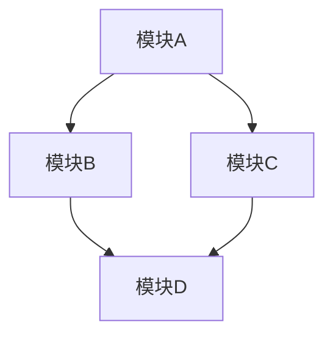
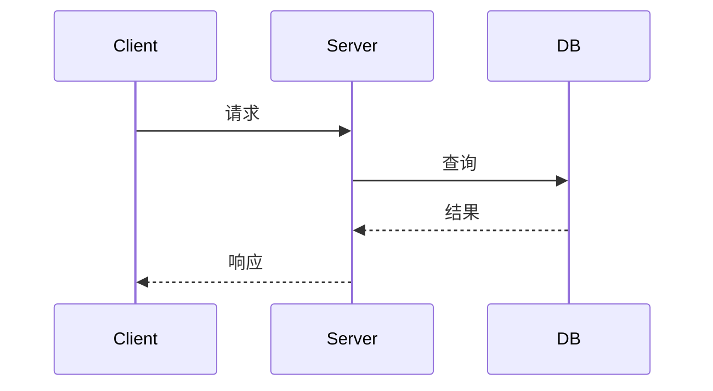

# [项目名称] 架构分析

> 分析版本：v[版本号] ｜ 分析日期：[日期]

## 1. 项目概览

| 项目 | 信息 |
|------|------|
| 官网 | [链接] |
| GitHub | [链接] |
| 编程语言 | [语言] |
| Star 数 | [⭐] |
| 许可证 | [许可证] |
| 核心维护者 | [维护者] |

**项目简介**

[2-3 句话介绍项目定位]

## 2. 技术栈

| 类别 | 技术选型 |
|------|----------|
| 编程语言 | [语言及版本] |
| 构建系统 | [工具] |
| 测试框架 | [框架] |
| CI/CD | [系统] |
| 存储 | [数据库/存储] |
| 通信协议 | [协议] |

## 3. 整体架构

### 架构分层

[逐层描述]

### 模块职责

| 模块 | 职责 | 关键文件/目录 |
|------|------|---------------|
| [模块1] | [职责描述] | `src/xxx` |
| [模块2] | [职责描述] | `src/xxx` |
| [模块3] | [职责描述] | `src/xxx` |

## 4. 核心模块详解

### 4.1 [模块名称]

[详细分析]

## 5. 关键设计决策

| 决策 | 选择 | 替代方案 | 理由 |
|------|------|----------|------|
| [决策1] | [选择] | [替代] | [理由] |

## 6. 数据流 / 请求流

## 7. 设计模式

| 模式名称 | 使用位置 | 目的 |
|----------|----------|------|
| [模式] | [文件/模块] | [目的] |

## 8. 工程实践

### 测试策略

### 发布流程

### 版本管理

## 9. 总结与评价

### 亮点

### 可改进之处

## 参考

- [官方文档](链接)
- [源码位置](链接)
- [相关论文/文章](链接)
